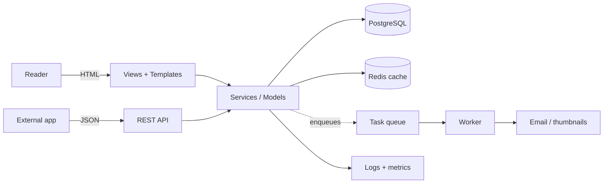

# End-to-end real project

You've read every piece of the guide in isolation: models, views, forms, API,
tests, deploy. This chapter is the **thread that stitches it all together**: we
take the example blog and describe the full path, from `git init` to a production
service with observability. We won't repeat the code from each page — we'll link
to them in the order you'd actually use them.

!!! quote "Think like a child 🧒"
    You already learned to hold the spoon, stir the batter, and light the oven.
    Now it's the **recipe for the whole cake**: which step comes before which,
    and why. No new ingredients — just the right order to bring it all together.

## Use case

We want to publish the **blog** we built throughout the guide: people read
posts, authenticated authors write them, comments go through moderation, and a
REST API feeds an external app. It has to run in production, be testable, and not
fall over when traffic grows.

The final product has these capabilities:



Every arrow in that diagram already has a page in the guide. The capstone's job
is to **walk through them in order**.

## Possibilities

Think of this chapter as a **10-stage checklist**. You don't need to do them all
at once — but a "production" project touches every one of them.

| # | Stage | What to decide | Guide page |
| --- | --- | --- | --- |
| 1 | Foundation | structure, per-environment settings | [Setup](../tutorial/project-setup.md) · [Environment config](../referencia/config-ambientes.md) |
| 2 | Domain | models, relationships, migrations | [Models](../tutorial/models.md) · [Relationships](../tutorial/relationships.md) |
| 3 | User | `AbstractUser` from day 1 | [Custom user](../referencia/custom-user.md) |
| 4 | Web | CBVs, forms, templates | [CBVs](../tutorial/class-based-views.md) · [Forms](../tutorial/forms.md) |
| 5 | Auth | login, permissions, ownership | [Authentication](../tutorial/authentication.md) · [Permissions](../referencia/permissions.md) |
| 6 | API | DRF or Django Ninja | [DRF](drf.md) · [Ninja](../libs/django-ninja.md) |
| 7 | Async | background tasks, cache | [Tasks](../referencia/tasks.md) · [Celery](../libs/celery.md) · [Cache](../referencia/cache.md) |
| 8 | Quality | tests + CI | [Testing](testing.md) |
| 9 | Deploy | Docker / PaaS | [Deploy](../referencia/deploy.md) · [Docker](../referencia/deploy-docker.md) |
| 10 | Operation | logs, metrics, errors | [Logging](../referencia/logging.md) · [Observability](../referencia/observability.md) |

### Stage 1 — Solid foundation

Before writing any model, settle the base. It pays dividends throughout the rest
of the project.

- **One project, per-environment settings.** A `settings.py` that reads
  everything from environment variables (never secrets in the code). See
  [Environment config](../referencia/config-ambientes.md).
- **Local `.env`, real variables in production.** No hard-coded `SECRET_KEY`.

```python
import os
from pathlib import Path

BASE_DIR = Path(__file__).resolve().parent.parent

SECRET_KEY = os.environ["DJANGO_SECRET_KEY"]
DEBUG = os.environ.get("DJANGO_DEBUG", "0") == "1"
ALLOWED_HOSTS = os.environ.get("DJANGO_ALLOWED_HOSTS", "").split(",")

INSTALLED_APPS = [
    "django.contrib.admin",
    "django.contrib.auth",
    "django.contrib.contenttypes",
    "django.contrib.sessions",
    "django.contrib.messages",
    "django.contrib.staticfiles",
    "blog",
    "accounts",
]
```

!!! danger "The decision you can't defer"
    Two choices are **very expensive** to change once you have data:
    **the custom user model** (stage 3) and **the production database**. Do both
    on day one. Swapping `AUTH_USER_MODEL` with migrations already applied is one
    of Django's worst pains.

### Stage 2 — The domain

The blog has `Post`, `Author`, `Tag`, and `Comment`. Model the relationships with
intent: `ForeignKey` for "a post has one author", `ManyToManyField` for "posts
and tags", a comment's `ForeignKey` to a post.

```python
from django.conf import settings
from django.db import models


class Post(models.Model):
    """A blog post authored by a user."""

    title: models.CharField = models.CharField(max_length=200)
    slug: models.SlugField = models.SlugField(unique=True)
    body: models.TextField = models.TextField()
    author: models.ForeignKey = models.ForeignKey(
        settings.AUTH_USER_MODEL,
        on_delete=models.PROTECT,
        related_name="posts",
    )
    tags: models.ManyToManyField = models.ManyToManyField("Tag", related_name="posts", blank=True)
    published_at: models.DateTimeField = models.DateTimeField(null=True, blank=True)

    class Meta:
        ordering = ["-published_at"]
        indexes = [
            models.Index(fields=["slug"]),
            models.Index(fields=["-published_at"]),
        ]
        constraints = [
            models.CheckConstraint(
                condition=models.Q(title__length__gt=0),
                name="post_title_not_empty",
            ),
        ]
```

!!! warning "APIs that changed — use the current ones"
    - `CheckConstraint` uses **`condition=`** (the old `check=` was removed).
    - Multi-field indexes go in **`Meta.indexes`** — `index_together` **no
      longer exists** in Django 6.0.

Details in [Models](../tutorial/models.md), [Relationships](../tutorial/relationships.md)
and [Model Meta](../referencia/models-meta.md).

### Stage 3 — Custom user from the start

Even if you don't need extra fields today, **create a custom user**. It's free
now and brutally expensive later.

```python
from django.contrib.auth.models import AbstractUser
from django.db import models


class User(AbstractUser):
    """Application user with a short public bio."""

    bio: models.TextField = models.TextField(blank=True)
```

```python
AUTH_USER_MODEL = "accounts.User"
```

The full walkthrough (including a `UserManager` and email login) is in
[Custom user](../referencia/custom-user.md).

### Stage 4 — The web layer (CBV + forms)

We prefer **class-based views**: `ListView` for the post list, `DetailView` for
a single post, `CreateView`/`UpdateView` with a `ModelForm`.

```python
from django.contrib.auth.mixins import LoginRequiredMixin
from django.urls import reverse_lazy
from django.views.generic import CreateView, DetailView, ListView

from blog.forms import PostForm
from blog.models import Post


class PostListView(ListView):
    """Paginated list of published posts."""

    model = Post
    paginate_by = 10
    context_object_name = "posts"


class PostDetailView(DetailView):
    """Single post page."""

    model = Post


class PostCreateView(LoginRequiredMixin, CreateView):
    """Create a post; only authenticated users may reach it."""

    model = Post
    form_class = PostForm
    success_url = reverse_lazy("blog:post-list")

    def form_valid(self, form: PostForm) -> "HttpResponse":
        """Attach the logged-in user as the post author before saving."""
        form.instance.author = self.request.user
        return super().form_valid(form)
```

See [CBVs](../tutorial/class-based-views.md), [Forms](../tutorial/forms.md)
and [Generic views](../referencia/generic-views.md).

### Stage 5 — Authentication and permissions

Wire up Django's auth views and protect what needs an owner.

```python
from django.contrib.auth import views as auth_views
from django.urls import path

urlpatterns = [
    path("login/", auth_views.LoginView.as_view(), name="login"),
    path("logout/", auth_views.LogoutView.as_view(), name="logout"),
]
```

!!! warning "`LogoutView` is POST-only"
    In modern Django, logout happens via **POST** — a `GET` link won't log you
    out. Use a small form:
    ```django
    <form method="post" action="">
      
      <button type="submit">Log out</button>
    </form>
    ```

For "only the author edits their own post", combine `LoginRequiredMixin` with an
ownership check (or `UserPassesTestMixin`). All in
[Authentication](../tutorial/authentication.md) and [Permissions](../referencia/permissions.md).

### Stage 6 — The REST API

The same database, exposed as JSON. Pick a layer:

| Option | When to choose it |
| --- | --- |
| **Django REST Framework** | mature ecosystem, rich serializers, granular permissions, the industry standard |
| **Django Ninja** | you like the FastAPI style (type hints + Pydantic), want automatic OpenAPI and native async |

```python
from rest_framework import serializers, viewsets
from rest_framework.permissions import IsAuthenticatedOrReadOnly

from blog.models import Post


class PostSerializer(serializers.ModelSerializer):
    """Serialize posts for the public API."""

    class Meta:
        model = Post
        fields = ["id", "title", "slug", "body", "author", "published_at"]
        read_only_fields = ["author"]


class PostViewSet(viewsets.ModelViewSet):
    """CRUD endpoints for posts."""

    queryset = Post.objects.all()
    serializer_class = PostSerializer
    permission_classes = [IsAuthenticatedOrReadOnly]

    def perform_create(self, serializer: PostSerializer) -> None:
        """Set the request user as the author on create."""
        serializer.save(author=self.request.user)
```

Go deeper in [DRF](drf.md), [Advanced DRF](drf-advanced.md) and
[Django Ninja](../libs/django-ninja.md).

### Stage 7 — Async work and cache

Slow things (sending a "new comment" email, generating a thumbnail) do **not**
belong in the request/response cycle. Enqueue them.

```python
from django.core.mail import send_mail


def notify_author(post_id: int) -> None:
    """Send the post author an email when a new comment arrives.

    Args:
        post_id: Primary key of the commented post.
    """
    from blog.models import Post

    post = Post.objects.select_related("author").get(pk=post_id)
    send_mail(
        subject="New comment on your post",
        message=f"The post '{post.title}' received a comment.",
        from_email=None,
        recipient_list=[post.author.email],
    )
```

| Tool | Use when |
| --- | --- |
| **Native tasks** (`django.tasks`) | simple built-in queue, no extra broker |
| **Celery** | scheduling, retries, fan-out, multiple workers |

On the read side, **cache** what's expensive and rarely changes (the home page,
counts).

```python
from django.views.decorators.cache import cache_page
from django.utils.decorators import method_decorator


@method_decorator(cache_page(60 * 5), name="dispatch")
class PostListView(ListView):
    """Post list, cached for five minutes at the view level."""

    model = Post
    paginate_by = 10
```

Details in [Tasks](../referencia/tasks.md), [Celery](../libs/celery.md) and
[Cache](../referencia/cache.md).

!!! tip "Invalidate the cache with signals"
    When saving/deleting a `Post`, trigger cache clearing via
    [signals](../referencia/signals.md) (`post_save`/`post_delete`). Stale cache
    is worse than no cache.

### Stage 8 — Tests and CI

Without tests, every deploy is a gamble. Cover all three levels: **model**
(business rule), **view** (the page responds/protects) and **API** (the endpoint
returns what's expected).

```python
import pytest
from django.urls import reverse


@pytest.mark.django_db
def test_post_list_is_public(client) -> None:
    """The public post list returns 200 without authentication."""
    response = client.get(reverse("blog:post-list"))
    assert response.status_code == 200


@pytest.mark.django_db
def test_create_post_requires_login(client) -> None:
    """Anonymous users are redirected away from the create view."""
    response = client.get(reverse("blog:post-create"))
    assert response.status_code == 302
```

And a minimal CI on GitHub Actions:

```yaml
name: ci

on: [push, pull_request]

jobs:
  test:
    runs-on: ubuntu-latest
    steps:
      - uses: actions/checkout@v4
      - uses: astral-sh/setup-uv@v5
      - run: uv sync --group dev
      - run: uv run python manage.py migrate --check
      - run: uv run pytest
```

Full walkthrough in [Testing](testing.md).

### Stage 9 — Deploy

Package and ship it. First, run Django's own production checklist:

```bash
python manage.py check --deploy
```

```dockerfile
FROM python:3.13-slim

ENV PYTHONUNBUFFERED=1
WORKDIR /app

COPY --from=ghcr.io/astral-sh/uv:latest /uv /bin/uv
COPY pyproject.toml uv.lock ./
RUN uv sync --frozen --no-dev

COPY . .
RUN uv run python manage.py collectstatic --noinput

CMD ["uv", "run", "gunicorn", "config.wsgi:application", "--bind", "0.0.0.0:8000"]
```

!!! danger "Mandatory production settings"
    - `DEBUG = False`
    - `ALLOWED_HOSTS` filled in
    - `SECRET_KEY` coming from the environment
    - HTTPS: `SECURE_SSL_REDIRECT`, `Secure` cookies, `SECURE_HSTS_SECONDS`
    - static files via WhiteNoise or a CDN; media in external storage

Step by step in [Deploy](../referencia/deploy.md), [Docker](../referencia/deploy-docker.md),
[Security](../referencia/security.md) and [Storages](../referencia/storages.md).

### Stage 10 — Observability

In production you don't see the user's screen — you see **logs, metrics, and
errors**.

- **Structured logging** to stdout (the platform's collector picks it up).
- **Metrics** for requests, latency, and errors.
- **Exception tracking** (e.g. Sentry) with request context.
- A simple **`/health`** so the load balancer knows the app is alive.

```python
LOGGING = {
    "version": 1,
    "disable_existing_loggers": False,
    "handlers": {
        "console": {"class": "logging.StreamHandler"},
    },
    "root": {"handlers": ["console"], "level": "INFO"},
}
```

Details in [Logging](../referencia/logging.md) and
[Observability](../referencia/observability.md).

!!! info "Order matters, but it isn't rigid"
    You can ship the blog with just stages 1–5 and 8–9 (web + tests + deploy) and
    add API, queues, and cache when the need shows up. The value of the checklist
    is not to **forget** a stage, not to do them all at once.

!!! quote "📖 In the official docs"
    - [Django 6.0 documentation](https://docs.djangoproject.com/en/6.0/)

## Recap

- This chapter is the **thread that stitches the guide together**: the same
  concepts, in the order you'd use them to take the blog to production.
- There are **10 stages**: foundation → domain → user → web → auth → API →
  async/cache → tests/CI → deploy → observability.
- Decide **early** what's expensive to change: **custom user** and **production
  database** on day one.
- Use Django 6.0 APIs: `CheckConstraint(condition=...)`, `Meta.indexes` (no
  `index_together`), `LogoutView` via **POST**.
- Each stage links to the page that details it — go back to them when you
  actually implement.
- The checklist exists so you don't **forget** a stage, not to force them all at
  once.

Made it this far? You have the whole map. Pick a stage and start building. 🚀
