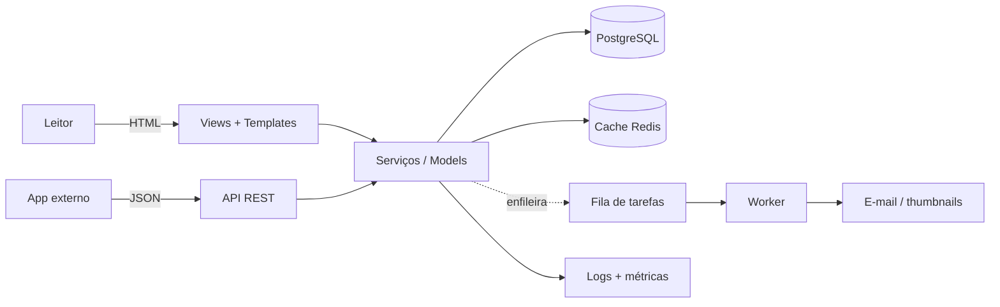

# Projeto real fim-a-fim

Você já leu cada peça do guia isoladamente: models, views, formulários, API,
testes, deploy. Este capítulo é o **fio que costura tudo**: pegamos o blog de
exemplo e descrevemos o caminho completo, do `git init` ao serviço em produção
com observabilidade. Não vamos repetir o código de cada página — vamos linkar
para elas na ordem em que você as usaria de verdade.

!!! quote "Pensa como criança 🧒"
    Você já aprendeu a segurar a colher, a mexer a massa e a acender o forno.
    Agora é a **receita do bolo inteiro**: qual passo vem antes de qual, e por
    quê. Nenhum ingrediente novo — só a ordem certa de juntar tudo.

## Caso de uso

Queremos publicar o **blog** que construímos ao longo do guia: pessoas leem
posts, autores autenticados escrevem, comentários passam por moderação, e uma
API REST alimenta um app externo. Precisa rodar em produção, ser testável e não
cair quando o tráfego crescer.

O produto final tem estas capacidades:



Cada seta desse diagrama já tem uma página no guia. O trabalho do capstone é
**percorrê-las na ordem**.

## Possibilidades

Pense neste capítulo como uma **checklist de 10 estágios**. Você não precisa
fazer todos de uma vez — mas um projeto "de produção" toca em todos eles.

| # | Estágio | O que decidir | Página do guia |
| --- | --- | --- | --- |
| 1 | Fundação | estrutura, settings por ambiente | [Setup](../tutorial/project-setup.md) · [Config de ambientes](../referencia/config-ambientes.md) |
| 2 | Domínio | models, relações, migrations | [Models](../tutorial/models.md) · [Relações](../tutorial/relationships.md) |
| 3 | Usuário | `AbstractUser` desde o dia 1 | [Custom user](../referencia/custom-user.md) |
| 4 | Web | CBVs, formulários, templates | [CBVs](../tutorial/class-based-views.md) · [Formulários](../tutorial/forms.md) |
| 5 | Auth | login, permissões, ownership | [Autenticação](../tutorial/authentication.md) · [Permissões](../referencia/permissions.md) |
| 6 | API | DRF ou Django Ninja | [DRF](drf.md) · [Ninja](../libs/django-ninja.md) |
| 7 | Assíncrono | tarefas em background, cache | [Tarefas](../referencia/tasks.md) · [Celery](../libs/celery.md) · [Cache](../referencia/cache.md) |
| 8 | Qualidade | testes + CI | [Testes](testing.md) |
| 9 | Deploy | Docker / PaaS | [Deploy](../referencia/deploy.md) · [Docker](../referencia/deploy-docker.md) |
| 10 | Operação | logs, métricas, erros | [Logging](../referencia/logging.md) · [Observabilidade](../referencia/observability.md) |

### Estágio 1 — Fundação sólida

Antes de escrever qualquer model, resolva a base. Isso paga dividendos por todo
o resto do projeto.

- **Um projeto, settings por ambiente.** Um `settings.py` que lê tudo de
  variáveis de ambiente (nunca segredos no código). Veja
  [Config de ambientes](../referencia/config-ambientes.md).
- **`.env` local, variáveis reais em produção.** Nenhum `SECRET_KEY`
  hard-coded.

```python
import os
from pathlib import Path

BASE_DIR = Path(__file__).resolve().parent.parent

SECRET_KEY = os.environ["DJANGO_SECRET_KEY"]
DEBUG = os.environ.get("DJANGO_DEBUG", "0") == "1"
ALLOWED_HOSTS = os.environ.get("DJANGO_ALLOWED_HOSTS", "").split(",")

INSTALLED_APPS = [
    "django.contrib.admin",
    "django.contrib.auth",
    "django.contrib.contenttypes",
    "django.contrib.sessions",
    "django.contrib.messages",
    "django.contrib.staticfiles",
    "blog",
    "accounts",
]
```

!!! danger "A decisão que você não pode adiar"
    Duas escolhas são **caríssimas** de mudar depois que há dados:
    **o modelo de usuário customizado** (estágio 3) e **o banco de produção**.
    Faça as duas no primeiro dia. Trocar o `AUTH_USER_MODEL` com migrations já
    aplicadas é uma das piores dores do Django.

### Estágio 2 — O domínio

O blog tem `Post`, `Author`, `Tag` e `Comment`. Modele as relações com
intenção: `ForeignKey` para "um post tem um autor", `ManyToManyField` para
"posts e tags", `ForeignKey` de comentário para post.

```python
from django.conf import settings
from django.db import models


class Post(models.Model):
    """A blog post authored by a user."""

    title: models.CharField = models.CharField(max_length=200)
    slug: models.SlugField = models.SlugField(unique=True)
    body: models.TextField = models.TextField()
    author: models.ForeignKey = models.ForeignKey(
        settings.AUTH_USER_MODEL,
        on_delete=models.PROTECT,
        related_name="posts",
    )
    tags: models.ManyToManyField = models.ManyToManyField("Tag", related_name="posts", blank=True)
    published_at: models.DateTimeField = models.DateTimeField(null=True, blank=True)

    class Meta:
        ordering = ["-published_at"]
        indexes = [
            models.Index(fields=["slug"]),
            models.Index(fields=["-published_at"]),
        ]
        constraints = [
            models.CheckConstraint(
                condition=models.Q(title__length__gt=0),
                name="post_title_not_empty",
            ),
        ]
```

!!! warning "APIs que mudaram — use as atuais"
    - `CheckConstraint` usa **`condition=`** (o antigo `check=` foi removido).
    - Índices multi-campo vão em **`Meta.indexes`** — `index_together` **não
      existe mais** no Django 6.0.

Detalhes em [Models](../tutorial/models.md), [Relações](../tutorial/relationships.md)
e [Meta de models](../referencia/models-meta.md).

### Estágio 3 — Usuário customizado desde o começo

Mesmo que hoje você não precise de campos extras, **crie um usuário
customizado**. É grátis agora e brutalmente caro depois.

```python
from django.contrib.auth.models import AbstractUser
from django.db import models


class User(AbstractUser):
    """Application user with a short public bio."""

    bio: models.TextField = models.TextField(blank=True)
```

```python
AUTH_USER_MODEL = "accounts.User"
```

O passo a passo completo (incluindo `UserManager` e login por e-mail) está em
[Custom user](../referencia/custom-user.md).

### Estágio 4 — A camada web (CBV + formulários)

Preferimos **views baseadas em classe**: `ListView` para a lista de posts,
`DetailView` para um post, `CreateView`/`UpdateView` com um `ModelForm`.

```python
from django.contrib.auth.mixins import LoginRequiredMixin
from django.urls import reverse_lazy
from django.views.generic import CreateView, DetailView, ListView

from blog.forms import PostForm
from blog.models import Post


class PostListView(ListView):
    """Paginated list of published posts."""

    model = Post
    paginate_by = 10
    context_object_name = "posts"


class PostDetailView(DetailView):
    """Single post page."""

    model = Post


class PostCreateView(LoginRequiredMixin, CreateView):
    """Create a post; only authenticated users may reach it."""

    model = Post
    form_class = PostForm
    success_url = reverse_lazy("blog:post-list")

    def form_valid(self, form: PostForm) -> "HttpResponse":
        """Attach the logged-in user as the post author before saving."""
        form.instance.author = self.request.user
        return super().form_valid(form)
```

Veja [CBVs](../tutorial/class-based-views.md), [Formulários](../tutorial/forms.md)
e [Views genéricas](../referencia/generic-views.md).

### Estágio 5 — Autenticação e permissões

Ligue as views de auth do Django e proteja o que precisa de dono.

```python
from django.contrib.auth import views as auth_views
from django.urls import path

urlpatterns = [
    path("login/", auth_views.LoginView.as_view(), name="login"),
    path("logout/", auth_views.LogoutView.as_view(), name="logout"),
]
```

!!! warning "`LogoutView` é POST-only"
    No Django moderno o logout acontece por **POST** — um link `GET` não
    desloga. Use um pequeno formulário:
    ```django
    <form method="post" action="">
      
      <button type="submit">Sair</button>
    </form>
    ```

Para "só o autor edita o próprio post", combine `LoginRequiredMixin` com uma
checagem de ownership (ou `UserPassesTestMixin`). Tudo em
[Autenticação](../tutorial/authentication.md) e [Permissões](../referencia/permissions.md).

### Estágio 6 — A API REST

A mesma base de dados, exposta como JSON. Escolha uma camada:

| Opção | Quando escolher |
| --- | --- |
| **Django REST Framework** | ecossistema maduro, serializers ricos, permissões granulares, o padrão da indústria |
| **Django Ninja** | você gosta do estilo FastAPI (type hints + Pydantic), quer OpenAPI automático e async nativo |

```python
from rest_framework import serializers, viewsets
from rest_framework.permissions import IsAuthenticatedOrReadOnly

from blog.models import Post


class PostSerializer(serializers.ModelSerializer):
    """Serialize posts for the public API."""

    class Meta:
        model = Post
        fields = ["id", "title", "slug", "body", "author", "published_at"]
        read_only_fields = ["author"]


class PostViewSet(viewsets.ModelViewSet):
    """CRUD endpoints for posts."""

    queryset = Post.objects.all()
    serializer_class = PostSerializer
    permission_classes = [IsAuthenticatedOrReadOnly]

    def perform_create(self, serializer: PostSerializer) -> None:
        """Set the request user as the author on create."""
        serializer.save(author=self.request.user)
```

Aprofunde em [DRF](drf.md), [DRF avançado](drf-advanced.md) e
[Django Ninja](../libs/django-ninja.md).

### Estágio 7 — Trabalho assíncrono e cache

Coisas lentas (enviar e-mail de "novo comentário", gerar thumbnail) **não** ficam
no ciclo request/response. Enfileire.

```python
from django.core.mail import send_mail


def notify_author(post_id: int) -> None:
    """Send the post author an email when a new comment arrives.

    Args:
        post_id: Primary key of the commented post.
    """
    from blog.models import Post

    post = Post.objects.select_related("author").get(pk=post_id)
    send_mail(
        subject="Novo comentário no seu post",
        message=f"O post '{post.title}' recebeu um comentário.",
        from_email=None,
        recipient_list=[post.author.email],
    )
```

| Ferramenta | Use quando |
| --- | --- |
| **Tarefas nativas** (`django.tasks`) | fila simples embutida, sem broker extra |
| **Celery** | agendamento, retries, fan-out, múltiplos workers |

Do lado da leitura, **cache** o que é caro e muda pouco (a home, contagens).

```python
from django.views.decorators.cache import cache_page
from django.utils.decorators import method_decorator


@method_decorator(cache_page(60 * 5), name="dispatch")
class PostListView(ListView):
    """Post list, cached for five minutes at the view level."""

    model = Post
    paginate_by = 10
```

Detalhes em [Tarefas](../referencia/tasks.md), [Celery](../libs/celery.md) e
[Cache](../referencia/cache.md).

!!! tip "Invalide o cache com sinais"
    Ao salvar/apagar um `Post`, dispare a limpeza do cache via
    [sinais](../referencia/signals.md) (`post_save`/`post_delete`). Cache velho é
    pior que ausência de cache.

### Estágio 8 — Testes e CI

Sem testes, cada deploy é uma aposta. Cubra os três níveis: **model** (regra de
negócio), **view** (a página responde/protege) e **API** (o endpoint retorna o
esperado).

```python
import pytest
from django.urls import reverse


@pytest.mark.django_db
def test_post_list_is_public(client) -> None:
    """The public post list returns 200 without authentication."""
    response = client.get(reverse("blog:post-list"))
    assert response.status_code == 200


@pytest.mark.django_db
def test_create_post_requires_login(client) -> None:
    """Anonymous users are redirected away from the create view."""
    response = client.get(reverse("blog:post-create"))
    assert response.status_code == 302
```

E um CI mínimo no GitHub Actions:

```yaml
name: ci

on: [push, pull_request]

jobs:
  test:
    runs-on: ubuntu-latest
    steps:
      - uses: actions/checkout@v4
      - uses: astral-sh/setup-uv@v5
      - run: uv sync --group dev
      - run: uv run python manage.py migrate --check
      - run: uv run pytest
```

Roteiro completo em [Testes](testing.md).

### Estágio 9 — Deploy

Empacote e publique. Antes de tudo, passe pelo checklist de produção do próprio
Django:

```bash
python manage.py check --deploy
```

```dockerfile
FROM python:3.13-slim

ENV PYTHONUNBUFFERED=1
WORKDIR /app

COPY --from=ghcr.io/astral-sh/uv:latest /uv /bin/uv
COPY pyproject.toml uv.lock ./
RUN uv sync --frozen --no-dev

COPY . .
RUN uv run python manage.py collectstatic --noinput

CMD ["uv", "run", "gunicorn", "config.wsgi:application", "--bind", "0.0.0.0:8000"]
```

!!! danger "Configurações obrigatórias em produção"
    - `DEBUG = False`
    - `ALLOWED_HOSTS` preenchido
    - `SECRET_KEY` vindo do ambiente
    - HTTPS: `SECURE_SSL_REDIRECT`, cookies `Secure`, `SECURE_HSTS_SECONDS`
    - arquivos estáticos via WhiteNoise ou CDN; mídia em storage externo

Passo a passo em [Deploy](../referencia/deploy.md), [Docker](../referencia/deploy-docker.md),
[Segurança](../referencia/security.md) e [Storages](../referencia/storages.md).

### Estágio 10 — Observabilidade

Em produção você não vê a tela do usuário — você vê **logs, métricas e erros**.

- **Logging estruturado** para stdout (o coletor da plataforma captura).
- **Métricas** de requisições, latência e erros.
- **Rastreio de exceções** (ex.: Sentry) com contexto de request.
- **`/health`** simples para o balanceador saber se o app está vivo.

```python
LOGGING = {
    "version": 1,
    "disable_existing_loggers": False,
    "handlers": {
        "console": {"class": "logging.StreamHandler"},
    },
    "root": {"handlers": ["console"], "level": "INFO"},
}
```

Detalhes em [Logging](../referencia/logging.md) e
[Observabilidade](../referencia/observability.md).

!!! info "A ordem importa, mas não é rígida"
    Você pode entregar o blog só com os estágios 1–5 e 8–9 (web + testes +
    deploy) e adicionar API, filas e cache quando a necessidade aparecer. O valor
    da checklist é não **esquecer** um estágio, não fazer todos de uma vez.

!!! quote "📖 Na documentação oficial"
    - [Documentação do Django 6.0](https://docs.djangoproject.com/en/6.0/)

## Recap

- Este capítulo é o **fio que costura o guia**: os mesmos conceitos, na ordem em
  que você os usaria para levar o blog à produção.
- São **10 estágios**: fundação → domínio → usuário → web → auth → API →
  assíncrono/cache → testes/CI → deploy → observabilidade.
- Decida **cedo** o que é caro mudar: **usuário customizado** e **banco de
  produção** no primeiro dia.
- Use as APIs do Django 6.0: `CheckConstraint(condition=...)`, `Meta.indexes`
  (sem `index_together`), `LogoutView` por **POST**.
- Cada estágio linka para a página que o detalha — volte a elas quando for
  implementar de verdade.
- A checklist existe para você não **esquecer** um estágio, não para forçar
  todos de uma vez.

Chegou até aqui? Você tem o mapa inteiro. Escolha um estágio e comece a
construir. 🚀
