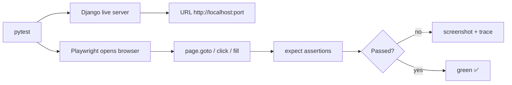

# End-to-end tests with Playwright

The tests you saw in [Tests](testing.md) check the parts from the inside:
a model, a view, an endpoint. But none of them guarantees that a **real user**,
clicking in an actual browser, can make it to the end of a flow. That is what
**E2E** (end-to-end) tests are for: we open a real browser, navigate, click,
type, and check what shows up on the screen.

!!! quote "Think like a child 🧒"
    Testing from the inside is like opening the toy and checking that each gear
    spins. An E2E test is you **handing the toy to the child** and watching if
    they can play with it on their own from start to finish. If the child can,
    it works.

## Use case

You have a page that lists blog posts and a comment form. You want to make sure
a person can **open the page, read the title, fill in the comment, and see the
confirmation** — all in a real browser, the way a user would.

We will need two things:

- **Playwright** to drive the browser (Chromium, Firefox, or WebKit).
- A **live Django server** answering at `http://localhost:<port>` during the
  test, serving static files too.

### Installation

```bash
uv add --group dev pytest-playwright pytest-django
uv run playwright install --with-deps chromium
```

`pytest-playwright` ships the `page`, `browser`, and `context` *fixtures* ready
to use. `playwright install` downloads the browser binaries (`--with-deps` also
installs the system libraries on Linux/CI).

!!! info "E2E does not replace unit tests"
    E2E tests are **slow** (they launch a real browser) and **brittle** (they
    break when a selector changes). They cover a few critical end-to-end flows.
    The fast model/view/API tests remain the foundation. Picture a pyramid:
    many unit tests at the bottom, a few E2E tests at the top.

### The live server

A normal Django test uses a fake client (`self.client`) that starts no server at
all. For Playwright to work, we need a **real** HTTP server listening on a port.
Django has the `StaticLiveServerTestCase` class exactly for this: it starts a
server in a thread and also serves static files (`STATIC_URL`), which the plain
`LiveServerTestCase` does not.

```python
from django.contrib.staticfiles.testing import StaticLiveServerTestCase
from playwright.sync_api import sync_playwright


class BlogE2ETest(StaticLiveServerTestCase):
    """End-to-end tests that drive a real browser against a live server."""

    @classmethod
    def setUpClass(cls) -> None:
        """Start Playwright and launch a headless Chromium once per class."""
        super().setUpClass()
        cls.playwright = sync_playwright().start()
        cls.browser = cls.playwright.chromium.launch(headless=True)

    @classmethod
    def tearDownClass(cls) -> None:
        """Close the browser and stop Playwright."""
        cls.browser.close()
        cls.playwright.stop()
        super().tearDownClass()

    def test_homepage_shows_title(self) -> None:
        """The homepage should render the blog heading."""
        page = self.browser.new_page()
        page.goto(f"{self.live_server_url}/")
        assert page.title() != ""
        page.close()
```

`self.live_server_url` is the live URL (something like `http://localhost:41xxx`)
that the class builds for you. Always navigate from it — never hard-code a port.

!!! warning "Live server + database"
    `StaticLiveServerTestCase` runs the server in a **separate thread** that
    shares the test connection. Create the data your test needs inside the test
    itself (or in `setUp`), because the browser will see the same temporary
    database.

## Possibilities

Playwright has two equivalent APIs: the **sync** one (`sync_api`) and the
**async** one (`async_api`). For tests with `StaticLiveServerTestCase` the sync
API is the simplest. Here is the big picture:



### The most common actions

| Action | Method | What it does |
| --- | --- | --- |
| Navigate | `page.goto(url)` | Opens a URL |
| Click | `page.click(selector)` | Clicks an element |
| Type | `page.fill(selector, text)` | Fills a field |
| Read text | `page.text_content(selector)` | Gets an element's text |
| Wait | `page.wait_for_selector(sel)` | Waits for something to appear |
| Locate | `page.get_by_role(...)` | Locates by accessible role/label |

### Selectors: prefer roles and labels

Playwright recommends locating elements the way a **user** sees them (text,
label, accessible role), not by internal CSS that changes easily.

```python
from django.contrib.staticfiles.testing import StaticLiveServerTestCase
from playwright.sync_api import expect, sync_playwright

from apps.blog.models import Author, Post
from django.contrib.auth import get_user_model


class CommentE2ETest(StaticLiveServerTestCase):
    """Drive the comment flow end to end in a real browser."""

    @classmethod
    def setUpClass(cls) -> None:
        """Launch a headless browser for the whole test class."""
        super().setUpClass()
        cls.playwright = sync_playwright().start()
        cls.browser = cls.playwright.chromium.launch(headless=True)

    @classmethod
    def tearDownClass(cls) -> None:
        """Tear down the browser and Playwright."""
        cls.browser.close()
        cls.playwright.stop()
        super().tearDownClass()

    def setUp(self) -> None:
        """Create one published post for the test to visit."""
        user = get_user_model().objects.create_user("ana", password="x")
        author = Author.objects.create(user=user, display_name="Ana")
        self.post = Post.objects.create(
            title="Hello world",
            slug="hello-world",
            body="First post.",
            author=author,
            status="published",
        )

    def test_user_can_post_a_comment(self) -> None:
        """A visitor fills the comment form and sees it confirmed."""
        page = self.browser.new_page()
        page.goto(f"{self.live_server_url}/blog/{self.post.slug}/")

        expect(page.get_by_role("heading", name="Hello world")).to_be_visible()

        page.get_by_label("Name").fill("Bruno")
        page.get_by_label("Comment").fill("Very nice!")
        page.get_by_role("button", name="Send").click()

        expect(page.get_by_text("Very nice!")).to_be_visible()
        page.close()
```

### Assertions with `expect`

Playwright's `expect` does **auto-wait**: it retries for a few seconds until the
condition passes. This kills the biggest source of flaky tests (the famous
"sometimes it passes, sometimes it doesn't").

| Assertion | Checks |
| --- | --- |
| `expect(loc).to_be_visible()` | The element is visible |
| `expect(loc).to_have_text("x")` | The text is exactly `x` |
| `expect(loc).to_contain_text("x")` | The text contains `x` |
| `expect(page).to_have_url(url)` | The current URL matches |
| `expect(loc).to_have_count(3)` | There are 3 elements |

!!! tip "Never use `time.sleep()`"
    The temptation is to sleep 2 seconds "to give it time to load". Do not do
    this: you either wait too much (slow test) or too little (broken test). Use
    `expect(...)` and `page.wait_for_selector(...)`, which wait **as long as
    needed** and no longer.

### Headless in CI

On your machine you can watch the browser open (`headless=False`) to debug. In
continuous integration there is no screen, so run **headless**. A clean way is
to decide from an environment variable:

```python
import os

from playwright.sync_api import sync_playwright


def launch_browser(playwright: "sync_playwright") -> object:
    """Launch Chromium, headless unless HEADED is set.

    Args:
        playwright: The started Playwright instance.

    Returns:
        A launched browser instance.
    """
    headed = os.environ.get("HEADED") == "1"
    return playwright.chromium.launch(headless=not headed)
```

And a minimal GitHub Actions workflow:

```yaml
name: e2e

on: [push, pull_request]

jobs:
  test:
    runs-on: ubuntu-latest
    steps:
      - uses: actions/checkout@v4
      - uses: astral-sh/setup-uv@v5
      - run: uv sync --group dev
      - run: uv run playwright install --with-deps chromium
      - run: uv run pytest -m e2e
```

!!! note "Mark the E2E tests"
    Since they are slow, it is common to mark them (`@pytest.mark.e2e`) and run
    them only in CI or on demand (`pytest -m e2e`), keeping `pytest -m "not e2e"`
    fast for daily work. Register the marker in `pyproject.toml` under
    `[tool.pytest.ini_options] markers`.

### Screenshot on failure

When an E2E test breaks in CI, you were not there to see the screen. Saving a
**screenshot** (and optionally a *trace*) at the moment of failure saves hours of
guessing.

```python
from pathlib import Path

from django.contrib.staticfiles.testing import StaticLiveServerTestCase
from playwright.sync_api import sync_playwright


class ScreenshotOnFailTest(StaticLiveServerTestCase):
    """Base class that captures a screenshot when a test fails."""

    @classmethod
    def setUpClass(cls) -> None:
        """Launch a headless browser and one shared page."""
        super().setUpClass()
        cls.playwright = sync_playwright().start()
        cls.browser = cls.playwright.chromium.launch(headless=True)
        cls.page = cls.browser.new_page()

    @classmethod
    def tearDownClass(cls) -> None:
        """Close the browser and Playwright."""
        cls.browser.close()
        cls.playwright.stop()
        super().tearDownClass()

    def _capture_on_failure(self) -> None:
        """Save a PNG named after the test when the outcome is a failure."""
        outcome = self._outcome
        failed = any(err for _, err in getattr(outcome, "errors", []))
        if failed:
            out = Path("test-artifacts")
            out.mkdir(exist_ok=True)
            self.page.screenshot(path=str(out / f"{self._testMethodName}.png"))

    def tearDown(self) -> None:
        """Run failure capture after each test method."""
        self._capture_on_failure()
        super().tearDown()
```

!!! tip "Trace viewer: the test replay"
    Beyond the screenshot, Playwright records a **trace** — a step-by-step replay
    with DOM, network, and console. Turn it on with
    `context.tracing.start(screenshots=True, snapshots=True)` before the flow and
    `context.tracing.stop(path="trace.zip")` at the end; open it with
    `uv run playwright show-trace trace.zip`. It is the most powerful tool for
    understanding why an E2E test failed in CI.

### E2E with the pytest-playwright fixtures

If you do not want to inherit from `StaticLiveServerTestCase`, `pytest-playwright`
gives you the `page` fixture ready, and `pytest-django` gives you `live_server`.
Together they are quite lean:

```python
import pytest
from playwright.sync_api import Page, expect

from apps.blog.models import Author, Post
from django.contrib.auth import get_user_model


@pytest.fixture
def post(db) -> Post:
    """Create one published post backed by an author."""
    user = get_user_model().objects.create_user("ana", password="x")
    author = Author.objects.create(user=user, display_name="Ana")
    return Post.objects.create(
        title="Hello world",
        slug="hello-world",
        body="First post.",
        author=author,
        status="published",
    )


@pytest.mark.e2e
def test_homepage_lists_post(live_server, page: Page, post: Post) -> None:
    """The homepage should list the published post title."""
    page.goto(f"{live_server.url}/")
    expect(page.get_by_text("Hello world")).to_be_visible()
```

!!! warning "`live_server` needs the database"
    The `live_server` fixture only works with database access. Either request the
    `db` fixture (as above, through the `post` fixture) or mark the test with
    `@pytest.mark.django_db`. Without it, the server starts with no tables.

!!! danger "Async: watch out for `arender`"
    In async projects you can use Playwright's `async_api`, but note that in
    Django 6.0 there is **no** `arender` shortcut — template rendering is
    synchronous. What does exist is `aget_object_or_404` to fetch objects inside
    async views. That is a concern of your view, not of the E2E test: Playwright
    speaks HTTP and does not care whether the view behind it is sync or async.

!!! quote "📖 In the official docs"
    - [Playwright for Python](https://playwright.dev/python/)
    - [`LiveServerTestCase` and the live server](https://docs.djangoproject.com/en/6.0/topics/testing/tools/#liveservertestcase)
    - [`StaticLiveServerTestCase`](https://docs.djangoproject.com/en/6.0/ref/contrib/staticfiles/#django.contrib.staticfiles.testing.StaticLiveServerTestCase)

## Recap

- **E2E** tests the whole flow in a real browser; it complements (does not
  replace) model/view/API tests — few E2E tests at the top of the pyramid.
- **Playwright** drives the browser; install it with `pytest-playwright` and
  `playwright install --with-deps chromium`.
- Use `StaticLiveServerTestCase` (serves static files) or the `live_server` +
  `page` fixtures; always navigate from `self.live_server_url` /
  `live_server.url`.
- Locate by **role/label** (`get_by_role`, `get_by_label`), not by brittle CSS;
  assert with `expect(...)`, which does **auto-wait** — never `time.sleep()`.
- In **CI** run **headless**, mark the tests (`-m e2e`), and save a
  **screenshot/trace** on failure so you can debug without sitting in front of
  the screen.
