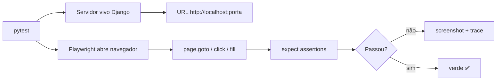

# Testes E2E com Playwright

Os testes que você viu em [Testes](testing.md) checam as peças por dentro:
um modelo, uma view, um endpoint. Mas nada garante que o **usuário de verdade**,
clicando num navegador real, consegue chegar até o fim de um fluxo. É aí que
entram os testes **E2E** (end-to-end): a gente abre um navegador de verdade,
navega, clica, digita e confere o que aparece na tela.

!!! quote "Pensa como criança 🧒"
    Testar por dentro é como abrir o brinquedo e ver se cada engrenagem gira.
    O teste E2E é você **entregar o brinquedo pra criança** e ver se ela
    consegue brincar sozinha do começo ao fim. Se a criança consegue, tá bom.

## Caso de uso

Você tem uma página que lista posts do blog e um formulário de comentário.
Você quer garantir que uma pessoa consegue **abrir a página, ler o título,
preencher o comentário e ver a confirmação** — tudo num navegador real, como
um usuário faria.

Vamos precisar de duas coisas:

- **Playwright** para dirigir o navegador (Chromium, Firefox ou WebKit).
- Um **servidor Django vivo** que responda em `http://localhost:<porta>` durante
  o teste, servindo inclusive os arquivos estáticos.

### Instalação

```bash
uv add --group dev pytest-playwright pytest-django
uv run playwright install --with-deps chromium
```

O `pytest-playwright` traz as *fixtures* `page`, `browser` e `context` prontas.
O `playwright install` baixa os binários dos navegadores (o `--with-deps`
instala também as bibliotecas de sistema em Linux/CI).

!!! info "E2E não substitui teste unitário"
    O teste E2E é **lento** (abre um navegador de verdade) e **frágil** (quebra
    se um seletor muda). Ele cobre poucos fluxos críticos de ponta a ponta.
    Os testes rápidos de modelo/view/API continuam sendo a base. Pense numa
    pirâmide: muitos testes unitários embaixo, poucos E2E no topo.

### O servidor vivo

Um teste normal do Django usa um cliente falso (`self.client`) que não sobe
servidor nenhum. Para o Playwright funcionar, precisamos de um servidor HTTP
**de verdade** escutando numa porta. O Django tem a classe
`StaticLiveServerTestCase` exatamente para isso: ela sobe um servidor em uma
thread e ainda serve os arquivos estáticos (`STATIC_URL`), o que o
`LiveServerTestCase` puro não faz.

```python
from django.contrib.staticfiles.testing import StaticLiveServerTestCase
from playwright.sync_api import sync_playwright


class BlogE2ETest(StaticLiveServerTestCase):
    """End-to-end tests that drive a real browser against a live server."""

    @classmethod
    def setUpClass(cls) -> None:
        """Start Playwright and launch a headless Chromium once per class."""
        super().setUpClass()
        cls.playwright = sync_playwright().start()
        cls.browser = cls.playwright.chromium.launch(headless=True)

    @classmethod
    def tearDownClass(cls) -> None:
        """Close the browser and stop Playwright."""
        cls.browser.close()
        cls.playwright.stop()
        super().tearDownClass()

    def test_homepage_shows_title(self) -> None:
        """The homepage should render the blog heading."""
        page = self.browser.new_page()
        page.goto(f"{self.live_server_url}/")
        assert page.title() != ""
        page.close()
```

O `self.live_server_url` é a URL viva (algo como `http://localhost:41xxx`) que a
classe monta para você. Sempre navegue a partir dele — nunca chumbe uma porta.

!!! warning "Servidor vivo + banco de dados"
    O `StaticLiveServerTestCase` roda o servidor numa **thread separada** que
    compartilha a conexão de teste. Crie os dados de que o teste precisa dentro
    do próprio teste (ou no `setUp`), porque o navegador vai enxergar o mesmo
    banco temporário.

## Possibilidades

O Playwright tem duas APIs equivalentes: a **síncrona** (`sync_api`) e a
**assíncrona** (`async_api`). Para testes com `StaticLiveServerTestCase` a
síncrona é a mais simples. Veja o mapa geral:



### As ações mais usadas

| Ação | Método | O que faz |
| --- | --- | --- |
| Navegar | `page.goto(url)` | Abre uma URL |
| Clicar | `page.click(selector)` | Clica num elemento |
| Digitar | `page.fill(selector, text)` | Preenche um campo |
| Ler texto | `page.text_content(selector)` | Pega o texto de um elemento |
| Esperar | `page.wait_for_selector(sel)` | Espera algo aparecer |
| Localizar | `page.get_by_role(...)` | Localiza por papel/rótulo acessível |

### Seletores: prefira papéis e rótulos

O Playwright recomenda localizar elementos pela forma como o **usuário** os vê
(texto, rótulo, papel acessível), não por CSS interno que muda fácil.

```python
from django.contrib.staticfiles.testing import StaticLiveServerTestCase
from playwright.sync_api import expect, sync_playwright

from apps.blog.models import Author, Post
from django.contrib.auth import get_user_model


class CommentE2ETest(StaticLiveServerTestCase):
    """Drive the comment flow end to end in a real browser."""

    @classmethod
    def setUpClass(cls) -> None:
        """Launch a headless browser for the whole test class."""
        super().setUpClass()
        cls.playwright = sync_playwright().start()
        cls.browser = cls.playwright.chromium.launch(headless=True)

    @classmethod
    def tearDownClass(cls) -> None:
        """Tear down the browser and Playwright."""
        cls.browser.close()
        cls.playwright.stop()
        super().tearDownClass()

    def setUp(self) -> None:
        """Create one published post for the test to visit."""
        user = get_user_model().objects.create_user("ana", password="x")
        author = Author.objects.create(user=user, display_name="Ana")
        self.post = Post.objects.create(
            title="Olá mundo",
            slug="ola-mundo",
            body="Primeiro post.",
            author=author,
            status="published",
        )

    def test_user_can_post_a_comment(self) -> None:
        """A visitor fills the comment form and sees it confirmed."""
        page = self.browser.new_page()
        page.goto(f"{self.live_server_url}/blog/{self.post.slug}/")

        expect(page.get_by_role("heading", name="Olá mundo")).to_be_visible()

        page.get_by_label("Nome").fill("Bruno")
        page.get_by_label("Comentário").fill("Muito bom!")
        page.get_by_role("button", name="Enviar").click()

        expect(page.get_by_text("Muito bom!")).to_be_visible()
        page.close()
```

### Asserções com `expect`

O `expect` do Playwright faz **auto-wait**: ele tenta de novo por alguns
segundos até a condição passar. Isso mata a maior fonte de testes intermitentes
(o famoso "às vezes passa, às vezes não").

| Asserção | Verifica |
| --- | --- |
| `expect(loc).to_be_visible()` | O elemento está visível |
| `expect(loc).to_have_text("x")` | O texto é exatamente `x` |
| `expect(loc).to_contain_text("x")` | O texto contém `x` |
| `expect(page).to_have_url(url)` | A URL atual bate |
| `expect(loc).to_have_count(3)` | Existem 3 elementos |

!!! tip "Nunca use `time.sleep()`"
    A tentação é dormir 2 segundos "para dar tempo de carregar". Não faça isso:
    ou você espera demais (teste lento) ou de menos (teste quebra). Use
    `expect(...)` e `page.wait_for_selector(...)`, que esperam **o quanto for
    preciso** e nada além.

### Headless em CI

No seu computador você pode ver o navegador abrindo (`headless=False`) para
depurar. Na integração contínua não há tela, então rode **headless**. Um jeito
limpo é decidir pela variável de ambiente:

```python
import os

from playwright.sync_api import sync_playwright


def launch_browser(playwright: "sync_playwright") -> object:
    """Launch Chromium, headless unless HEADED is set.

    Args:
        playwright: The started Playwright instance.

    Returns:
        A launched browser instance.
    """
    headed = os.environ.get("HEADED") == "1"
    return playwright.chromium.launch(headless=not headed)
```

E um workflow mínimo no GitHub Actions:

```yaml
name: e2e

on: [push, pull_request]

jobs:
  test:
    runs-on: ubuntu-latest
    steps:
      - uses: actions/checkout@v4
      - uses: astral-sh/setup-uv@v5
      - run: uv sync --group dev
      - run: uv run playwright install --with-deps chromium
      - run: uv run pytest -m e2e
```

!!! note "Marque os testes E2E"
    Como são lentos, é comum marcá-los (`@pytest.mark.e2e`) e rodá-los só no CI
    ou sob demanda (`pytest -m e2e`), deixando `pytest -m "not e2e"` rápido para
    o dia a dia. Registre o marcador no `pyproject.toml` em
    `[tool.pytest.ini_options] markers`.

### Screenshot quando falha

Quando um E2E quebra no CI, você não estava lá para ver a tela. Guardar um
**screenshot** (e opcionalmente um *trace*) no momento da falha salva horas de
adivinhação.

```python
from pathlib import Path

from django.contrib.staticfiles.testing import StaticLiveServerTestCase
from playwright.sync_api import sync_playwright


class ScreenshotOnFailTest(StaticLiveServerTestCase):
    """Base class that captures a screenshot when a test fails."""

    @classmethod
    def setUpClass(cls) -> None:
        """Launch a headless browser and one shared page."""
        super().setUpClass()
        cls.playwright = sync_playwright().start()
        cls.browser = cls.playwright.chromium.launch(headless=True)
        cls.page = cls.browser.new_page()

    @classmethod
    def tearDownClass(cls) -> None:
        """Close the browser and Playwright."""
        cls.browser.close()
        cls.playwright.stop()
        super().tearDownClass()

    def _capture_on_failure(self) -> None:
        """Save a PNG named after the test when the outcome is a failure."""
        outcome = self._outcome
        failed = any(err for _, err in getattr(outcome, "errors", []))
        if failed:
            out = Path("test-artifacts")
            out.mkdir(exist_ok=True)
            self.page.screenshot(path=str(out / f"{self._testMethodName}.png"))

    def tearDown(self) -> None:
        """Run failure capture after each test method."""
        self._capture_on_failure()
        super().tearDown()
```

!!! tip "Trace viewer: o replay do teste"
    Além do screenshot, o Playwright grava um **trace** — um replay passo a passo
    com DOM, rede e console. Ligue com
    `context.tracing.start(screenshots=True, snapshots=True)` antes do fluxo e
    `context.tracing.stop(path="trace.zip")` no fim; abra com
    `uv run playwright show-trace trace.zip`. É a ferramenta mais poderosa para
    entender por que um E2E falhou no CI.

### E2E com as fixtures do pytest-playwright

Se você não quer herdar de `StaticLiveServerTestCase`, o `pytest-playwright` dá
a fixture `page` pronta, e o `pytest-django` dá `live_server`. Juntos ficam bem
enxutos:

```python
import pytest
from playwright.sync_api import Page, expect

from apps.blog.models import Author, Post
from django.contrib.auth import get_user_model


@pytest.fixture
def post(db) -> Post:
    """Create one published post backed by an author."""
    user = get_user_model().objects.create_user("ana", password="x")
    author = Author.objects.create(user=user, display_name="Ana")
    return Post.objects.create(
        title="Olá mundo",
        slug="ola-mundo",
        body="Primeiro post.",
        author=author,
        status="published",
    )


@pytest.mark.e2e
def test_homepage_lists_post(live_server, page: Page, post: Post) -> None:
    """The homepage should list the published post title."""
    page.goto(f"{live_server.url}/")
    expect(page.get_by_text("Olá mundo")).to_be_visible()
```

!!! warning "`live_server` precisa do banco"
    A fixture `live_server` só funciona com acesso ao banco. Ou peça a fixture
    `db` (como acima, via a fixture `post`), ou marque o teste com
    `@pytest.mark.django_db`. Sem isso, o servidor sobe sem tabelas.

!!! danger "Async: cuidado com `arender`"
    Em projetos async você pode usar a API `async_api` do Playwright, mas note
    que no Django 6.0 **não existe** um atalho `arender` — a renderização de
    template é síncrona. O que existe é `aget_object_or_404` para buscar objetos
    dentro de views async. Isso é problema da sua view, não do teste E2E: o
    Playwright fala HTTP e não liga se a view por trás é sync ou async.

!!! quote "📖 Na documentação oficial"
    - [Playwright para Python](https://playwright.dev/python/)
    - [`LiveServerTestCase` e servidor vivo](https://docs.djangoproject.com/en/6.0/topics/testing/tools/#liveservertestcase)
    - [`StaticLiveServerTestCase`](https://docs.djangoproject.com/en/6.0/ref/contrib/staticfiles/#django.contrib.staticfiles.testing.StaticLiveServerTestCase)

## Recap

- **E2E** testa o fluxo inteiro num navegador real; complementa (não substitui)
  os testes de modelo/view/API — poucos E2E no topo da pirâmide.
- **Playwright** dirige o navegador; instale com `pytest-playwright` e
  `playwright install --with-deps chromium`.
- Use `StaticLiveServerTestCase` (serve estáticos) ou as fixtures `live_server`
  + `page`; navegue sempre a partir de `self.live_server_url` / `live_server.url`.
- Localize por **papel/rótulo** (`get_by_role`, `get_by_label`), não por CSS
  frágil; asserte com `expect(...)`, que faz **auto-wait** — nunca `time.sleep()`.
- No **CI** rode **headless**, marque os testes (`-m e2e`) e salve
  **screenshot/trace** na falha para depurar sem estar na frente da tela.
