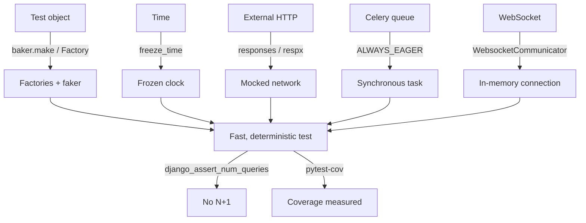

# Testing in depth

!!! quote "Think like a child 🧒"
    A test is like poking a toy before giving it away: you press every button to
    make sure it won't break in the hands of whoever gets it. Here we learn to
    **press many buttons at once**, to **freeze the clock**, to **pretend the
    internet answered**, and to **count how many trips to the database** each test
    makes — all without leaving your machine.

If you've already read the [Tests](testing.md) page, you know how to build a test
with pytest, a fixture and `@pytest.mark.django_db`. Now let's get to the arsenal
that separates a fragile suite from one you trust: **factories**, **time
control**, **HTTP mocking**, **N+1 detection**, and how to test **DRF**,
**Celery** and **Channels**.

## Use case

Your blog grew. Every test needs an `Author`, which needs a `User`, and some need
20 posts to test pagination. Writing that by hand in every fixture becomes a hell
of repeated `create_user(...)`, `Author.objects.create(...)`,
`Post.objects.create(...)`. Worse: a test that depends on `datetime.now()` breaks
on its own when you run it at midnight.

The solution is to have **factories** that build valid objects in one line, a
**frozen clock** so time is always the same, and **mocks** for everything that
leaves your machine (external APIs, queues, WebSockets). Let's take it step by
step.

```python
import pytest

from model_bakery import baker

from apps.blog.models import Post


@pytest.mark.django_db
def test_baker_builds_a_valid_post() -> None:
    """``baker.make`` fills every required field with sane random data."""
    post: Post = baker.make(Post)
    assert post.pk is not None
    assert post.author is not None
```

One line (`baker.make(Post)`) and you have a saved `Post`, with author, title and
everything the model requires — without writing anything.

## Possibilities

### Factories: `model_bakery` vs `factory_boy`

Both libraries create test objects, but with different philosophies.

| Aspect | `model_bakery` | `factory_boy` |
| --- | --- | --- |
| Style | Zero config: reads the model and fills it in | You declare one `Factory` per model |
| Verbosity | Minimal (`baker.make(Post)`) | Explicit (`PostFactory()`) |
| Random data | Automatic from the fields | Via `Faker` declared on the attribute |
| Fine control | `baker.make(Post, title="X")` | Inheritance, `SubFactory`, `traits`, `sequences` |
| Best for | Speed, plumbing tests | Large suites with semantic data |

Think like a child: `model_bakery` is the Lego that comes pre-assembled;
`factory_boy` is the kit where you pick every piece.

#### `model_bakery` — the shortcut

```python
import pytest

from model_bakery import baker

from apps.blog.models import Post


@pytest.mark.django_db
def test_make_vs_prepare() -> None:
    """``make`` persists to the DB; ``prepare`` builds in memory only."""
    saved: Post = baker.make(Post, title="Saved")
    unsaved: Post = baker.prepare(Post, title="In memory")

    assert saved.pk is not None
    assert unsaved.pk is None


@pytest.mark.django_db
def test_make_many_and_relations() -> None:
    """The ``_quantity`` kwarg builds a list; relations are auto-created."""
    posts: list[Post] = baker.make(Post, _quantity=20)
    assert len(posts) == 20
    assert all(p.author_id is not None for p in posts)
```

!!! tip "Reusable recipes"
    If an object always needs the same values, register a _recipe_ in
    `apps/blog/baker_recipes.py` and call `baker.make_recipe("blog.published_post")`.
    That turns the "default published post" into a named, reusable piece across
    the whole suite.

#### `factory_boy` + `faker` — the detailed kit

```python
import factory
from django.contrib.auth import get_user_model

from apps.blog.models import Author, Post


class UserFactory(factory.django.DjangoModelFactory):
    """Build a Django user with a unique, realistic username."""

    class Meta:
        model = get_user_model()

    username = factory.Sequence(lambda n: f"user{n}")
    email = factory.Faker("email")


class AuthorFactory(factory.django.DjangoModelFactory):
    """Build an author backed by a freshly created user."""

    class Meta:
        model = Author

    user = factory.SubFactory(UserFactory)
    display_name = factory.Faker("name")


class PostFactory(factory.django.DjangoModelFactory):
    """Build a post with a fake title and body, linked to a new author."""

    class Meta:
        model = Post

    title = factory.Faker("sentence", nb_words=4)
    body = factory.Faker("paragraph")
    author = factory.SubFactory(AuthorFactory)
```

And in the test:

```python
import pytest

from apps.blog.tests.factories import PostFactory


@pytest.mark.django_db
def test_factory_boy_overrides_and_batches() -> None:
    """You can override any attribute and build batches with the class."""
    one = PostFactory(title="Fixed title")
    many = PostFactory.create_batch(5)

    assert one.title == "Fixed title"
    assert len(many) == 5
    assert len({p.author_id for p in many}) == 5
```

!!! note "`faker` comes bundled"
    Both `factory.Faker(...)` and `model_bakery` use the
    [`faker`](https://faker.readthedocs.io/) package underneath. Need a Brazilian
    CPF, an address or a phone number? `Faker("cpf")`, `Faker("address")` with
    `Faker("pt_BR")` as the locale.

### Freezing time with `freezegun`

Any test that compares against "now" is a time bomb. `freezegun` stops the clock
at the instant you choose.

```python
import pytest
from datetime import datetime, timezone

from freezegun import freeze_time

from apps.blog.models import Post


@pytest.mark.django_db
@freeze_time("2026-01-01 12:00:00")
def test_published_at_is_frozen() -> None:
    """With time frozen, ``published_at`` is fully deterministic."""
    post = Post.objects.create(
        title="New year", body="x", status=Post.Status.PUBLISHED,
        author=__import__("model_bakery").baker.make("blog.Author"),
    )
    assert post.published_at == datetime(2026, 1, 1, 12, 0, tzinfo=timezone.utc)


def test_time_can_advance() -> None:
    """The frozen clock can be moved forward with ``tick``."""
    with freeze_time("2026-01-01") as frozen:
        start = datetime(2026, 1, 1, tzinfo=timezone.utc)
        assert datetime.now(timezone.utc) == start
        frozen.tick(delta=3600)
        assert datetime.now(timezone.utc).hour == 1
```

!!! warning "Always use timezone-aware"
    With `USE_TZ = True` (the default in Django 6.0), Django stores dates in UTC.
    Freeze with an ISO string and compare against `datetime(..., tzinfo=timezone.utc)`
    or use `django.utils.timezone.now()` — never a bare `datetime.now()`.

### Mocking HTTP with `responses` and `respx`

Does your code call an external API? The test **must not** hit the real network:
it's slow, flaky and disappears when you're offline. Pick the library based on
the HTTP client.

| HTTP client | Mocking library |
| --- | --- |
| `requests` (synchronous) | [`responses`](https://github.com/getsentry/responses) |
| `httpx` (sync or async) | [`respx`](https://lundberg.github.io/respx/) |

```python
import pytest
import responses
import requests


@responses.activate
def test_mock_requests() -> None:
    """Intercept a ``requests`` GET and return a canned JSON body."""
    responses.add(
        responses.GET,
        "https://api.example.com/status",
        json={"ok": True},
        status=200,
    )
    resp = requests.get("https://api.example.com/status")
    assert resp.json() == {"ok": True}
    assert len(responses.calls) == 1
```

```python
import httpx
import pytest
import respx


@pytest.mark.asyncio
@respx.mock
async def test_mock_httpx_async() -> None:
    """Intercept an async ``httpx`` GET without touching the network."""
    route = respx.get("https://api.example.com/ping").mock(
        return_value=httpx.Response(200, json={"pong": True}),
    )
    async with httpx.AsyncClient() as client:
        resp = await client.get("https://api.example.com/ping")

    assert route.called
    assert resp.json() == {"pong": True}
```

!!! danger "Block unmocked calls"
    Configure `responses` and `respx` in strict mode
    (`assert_all_requests_are_fired` / `respx.mock(assert_all_mocked=True)`) so
    that **any** unexpected call fails the test. A real call slipping through is
    the number-one cause of a slow, "sometimes red" suite.

### `conftest.py`, fixtures and scopes

`conftest.py` is where fixtures live. Fixtures declared there are available to
**all** tests in the folder and subfolders, with no `import`. You can have one at
the root (global) and one per app (specific).

```text
tests/
├── conftest.py            # global fixtures (client, settings)
└── blog/
    ├── conftest.py        # blog-only fixtures (author, published_post)
    └── test_posts.py
```

```python
import pytest

from model_bakery import baker

from apps.blog.models import Author, Post


@pytest.fixture
def author(db) -> Author:
    """Provide a saved author for any blog test that asks for it."""
    return baker.make(Author)


@pytest.fixture
def published_post(author: Author) -> Post:
    """Provide a published post owned by the ``author`` fixture."""
    return baker.make(
        Post, author=author, status=Post.Status.PUBLISHED,
    )
```

The **scope** controls how many times the fixture runs:

| Scope | Runs once per... | When to use |
| --- | --- | --- |
| `function` (default) | each test | data that each test mutates |
| `class` | test class | shared setup within a class |
| `module` | `.py` file | expensive, read-only resource |
| `session` | the whole suite | external connection, test server |

```python
import pytest


@pytest.fixture(scope="session")
def api_base_url() -> str:
    """Return a constant base URL built once for the whole test session."""
    return "https://api.example.com"
```

!!! warning "Wide scope + database = careful"
    Fixtures that write to the database are almost always `function`.
    `pytest-django` wraps each test in a transaction that is _rolled back_ at the
    end; a `session` fixture that creates rows punches a hole in that isolation.

### `parametrize`: one test, many cases

Instead of copying the same test with different values, list the cases:

```python
import pytest

from django.utils.text import slugify


@pytest.mark.parametrize(
    "title,expected",
    [
        ("Hello World", "hello-world"),
        ("Django 6.0!", "django-60"),
        ("  spaces  ", "spaces"),
    ],
)
def test_slugify_cases(title: str, expected: str) -> None:
    """Slugify normalizes accents, symbols and whitespace consistently."""
    assert slugify(title) == expected
```

!!! tip "Readable IDs"
    Pass `ids=[...]` to name each case in the pytest output, or use
    `pytest.param(..., id="accents")`. A report with clear names is worth gold
    when a single case fails.

### Counting queries: killing N+1 with `django_assert_num_queries`

`pytest-django` gives you a fixture that **counts** how many queries a block
makes. It's the most direct way to lock down an N+1 regression.

```python
import pytest

from apps.blog.models import Post


@pytest.mark.django_db
def test_no_n_plus_one_on_author(
    django_assert_num_queries, published_post,
) -> None:
    """Listing posts with ``select_related`` must cost exactly one query."""
    with django_assert_num_queries(1):
        titles = [
            (p.title, p.author.display_name)
            for p in Post.objects.select_related("author")
        ]
    assert titles
```

If someone removes `select_related("author")`, each access to `p.author` becomes
a new query, the total goes above 1 and the test turns red — exactly what we
want.

!!! info "Prefer a range?"
    There's also `django_assert_max_num_queries(n)` when you want a ceiling
    without pinning the exact number — handy while the query is still evolving.

### Testing DRF with `APIClient`

For Django REST Framework APIs, use `APIClient` instead of the Django client: it
understands token authentication, the JSON format and the REST methods.

```python
import pytest

from rest_framework.test import APIClient
from rest_framework import status

from apps.blog.models import Post


@pytest.fixture
def api() -> APIClient:
    """Provide a fresh DRF test client."""
    return APIClient()


@pytest.mark.django_db
def test_list_posts_endpoint(api: APIClient, published_post: Post) -> None:
    """The posts list endpoint returns published posts as JSON."""
    resp = api.get("/api/posts/")
    assert resp.status_code == status.HTTP_200_OK
    assert resp.data["count"] >= 1


@pytest.mark.django_db
def test_create_requires_auth(api: APIClient) -> None:
    """Anonymous users cannot create a post."""
    resp = api.post("/api/posts/", {"title": "X", "body": "y"}, format="json")
    assert resp.status_code in {
        status.HTTP_401_UNAUTHORIZED,
        status.HTTP_403_FORBIDDEN,
    }
```

```python
import pytest

from django.contrib.auth import get_user_model
from rest_framework.test import APIClient


@pytest.mark.django_db
def test_authenticated_create(api: APIClient) -> None:
    """``force_authenticate`` bypasses the auth flow for the test."""
    user = get_user_model().objects.create_user("ana", password="x")
    api.force_authenticate(user=user)
    resp = api.post(
        "/api/posts/",
        {"title": "New", "body": "body"},
        format="json",
    )
    assert resp.status_code == 201
```

!!! tip "`force_authenticate` is your friend"
    It injects the user straight into the request, skipping login/token. Perfect
    for testing the endpoint **logic** without re-enacting the whole auth flow in
    every test.

### Testing Celery tasks with `ALWAYS_EAGER`

A Celery task normally goes to a queue and runs in another process — which is
impossible to test synchronously. The solution is _eager_ mode: the task runs
**right away**, in the same process, as if it were a plain function.

```python
import pytest


@pytest.fixture
def eager_celery(settings) -> None:
    """Run every Celery task synchronously, in-process, for the test."""
    settings.CELERY_TASK_ALWAYS_EAGER = True
    settings.CELERY_TASK_EAGER_PROPAGATES = True


@pytest.mark.django_db
def test_send_digest_task(eager_celery) -> None:
    """Calling ``.delay`` runs the task immediately and returns its result."""
    from apps.blog.tasks import count_published

    result = count_published.delay()
    assert result.successful()
    assert isinstance(result.result, int)
```

- **`CELERY_TASK_ALWAYS_EAGER = True`** — `.delay()` executes right away.
- **`CELERY_TASK_EAGER_PROPAGATES = True`** — if the task raises, the test raises
  too (without it, the error hides inside `result`).

!!! note "The `settings` fixture rolls back on its own"
    `pytest-django`'s `settings` fixture changes the setting only during the test
    and **restores** the original value at the end — other tests are unaffected.

### Testing Channels consumers with `WebsocketCommunicator`

For WebSockets (Django Channels) there's no request/response; there's a
connection that exchanges messages. `WebsocketCommunicator` simulates a WS client
entirely in memory.

```python
import pytest

from channels.testing import WebsocketCommunicator

from config.asgi import application


@pytest.mark.asyncio
async def test_comment_consumer_echoes() -> None:
    """The consumer accepts a connection and echoes messages back."""
    communicator = WebsocketCommunicator(application, "/ws/comments/1/")
    connected, _ = await communicator.connect()
    assert connected is True

    await communicator.send_json_to({"message": "hi"})
    response = await communicator.receive_json_from()
    assert response["message"] == "hi"

    await communicator.disconnect()
```

!!! info "Needs `asyncio`"
    Channels tests are `async def` and require `pytest-asyncio` (mark with
    `@pytest.mark.asyncio` or set `asyncio_mode = "auto"`). If the consumer
    touches the database, add `@pytest.mark.django_db` and the
    `database_sync_to_async` wrappers.

### Coverage (`coverage`) without fooling yourself

Coverage measures which lines the tests executed. Install
[`pytest-cov`](https://pytest-cov.readthedocs.io/) and configure it in
`pyproject.toml`:

```toml
[tool.coverage.run]
source = ["apps"]
branch = true
omit = [
    "*/migrations/*",
    "*/tests/*",
    "*/asgi.py",
    "*/wsgi.py",
]

[tool.coverage.report]
show_missing = true
skip_covered = true
fail_under = 90
```

Run it with:

```bash
uv run pytest --cov --cov-report=term-missing
```

- **`branch = true`** — counts `if`/`else` branches, not just lines. Far more
  honest.
- **`omit`** — removes from the denominator code that makes no sense to cover
  (migrations, the tests themselves).
- **`fail_under = 90`** — the command **fails** if coverage drops below 90%.
  Great for CI.

!!! danger "100% coverage isn't 100% correctness"
    Coverage says the line _ran_, not that you _checked the right result_. A test
    with no `assert` covers and proves nothing. Use coverage to find gaps, never
    as proof of quality.



!!! quote "📖 In the official docs"
    - [Django — Testing](https://docs.djangoproject.com/en/6.0/topics/testing/)
    - [pytest-django](https://pytest-django.readthedocs.io/)
    - [model_bakery](https://model-bakery.readthedocs.io/)

## Recap

- **Factories** kill boilerplate: `model_bakery` (`baker.make`) for the fast
  path, `factory_boy` for semantic, reusable data; `faker` generates the
  realistic values underneath both.
- **`freezegun`** freezes time — dates become deterministic and tests don't break
  at midnight. Always timezone-aware with `USE_TZ = True`.
- **`responses`** mocks `requests`; **`respx`** mocks `httpx` (sync or async).
  Never let a real call slip through.
- **`conftest.py`** holds shared fixtures (global at the root, specific per app);
  the **scope** defines how many times each fixture runs.
- **`parametrize`** runs one test against many cases, with readable IDs.
- **`django_assert_num_queries`** locks down N+1 regressions by counting queries.
- **DRF** is tested with `APIClient` + `force_authenticate`.
- **Celery** runs synchronously with `CELERY_TASK_ALWAYS_EAGER` +
  `CELERY_TASK_EAGER_PROPAGATES`.
- **Channels** is tested with `WebsocketCommunicator` in `async` tests.
- **Coverage** with `branch = true` and `fail_under` in CI — but high coverage
  doesn't replace asserts that verify the result.

Going back to basics? Revisit [Tests](testing.md). Need the command and marker
cheat sheet? See the [testing reference](../referencia/testing.md).
