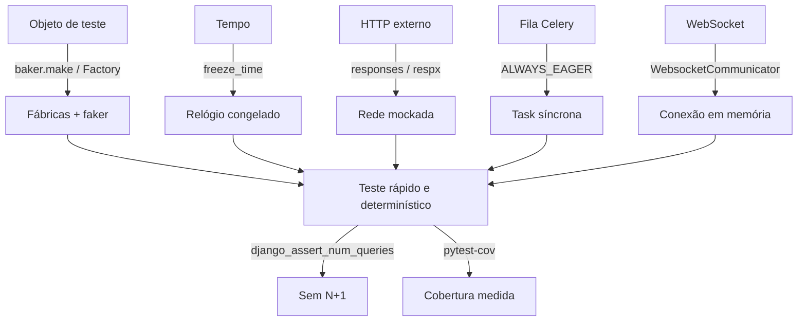

# Testes a fundo

!!! quote "Pensa como criança 🧒"
    Um teste é como cutucar um brinquedo antes de dar de presente: você aperta
    todos os botões pra ter certeza de que não vai quebrar na mão de quem ganhar.
    Aqui a gente aprende a apertar **muitos botões de uma vez**, a **congelar o
    relógio**, a **fingir que a internet respondeu** e a **contar quantas idas ao
    banco** cada teste faz — sem sair da sua máquina.

Se você já leu a página de [Testes](testing.md), sabe montar um teste com pytest,
uma fixture e `@pytest.mark.django_db`. Agora vamos para o arsenal que separa uma
suíte frágil de uma suíte que você confia: **factories**, **controle de tempo**,
**mock de HTTP**, **detecção de N+1**, e como testar **DRF**, **Celery** e
**Channels**.

## Caso de uso

Seu blog cresceu. Cada teste precisa de um `Author`, que precisa de um `User`, e
alguns precisam de 20 posts pra testar paginação. Escrever isso na mão em toda
fixture vira um inferno de `create_user(...)`, `Author.objects.create(...)`,
`Post.objects.create(...)` repetido. Pior: um teste que depende de
`datetime.now()` quebra sozinho quando você roda ele à meia-noite.

A solução é ter **fábricas** que constroem objetos válidos com uma linha, um
**relógio congelado** para o tempo ser sempre o mesmo, e **mocks** para tudo que
sai da sua máquina (APIs externas, filas, WebSockets). Vamos por partes.

```python
import pytest

from model_bakery import baker

from apps.blog.models import Post


@pytest.mark.django_db
def test_baker_builds_a_valid_post() -> None:
    """``baker.make`` fills every required field with sane random data."""
    post: Post = baker.make(Post)
    assert post.pk is not None
    assert post.author is not None
```

Uma linha (`baker.make(Post)`) e você tem um `Post` salvo, com autor, título e
tudo que o modelo exige — sem escrever nada.

## Possibilidades

### Factories: `model_bakery` vs `factory_boy`

As duas bibliotecas criam objetos de teste, mas com filosofias diferentes.

| Aspecto | `model_bakery` | `factory_boy` |
| --- | --- | --- |
| Estilo | Zero config: lê o modelo e preenche sozinho | Você declara uma `Factory` por modelo |
| Verbosidade | Mínima (`baker.make(Post)`) | Explícita (`PostFactory()`) |
| Dados aleatórios | Automático a partir dos campos | Via `Faker` declarado no atributo |
| Controle fino | `baker.make(Post, title="X")` | Herança, `SubFactory`, `traits`, `sequences` |
| Melhor para | Rapidez, testes de plumbing | Suítes grandes com dados semânticos |

Pensa como criança: `model_bakery` é o Lego que já vem montado; `factory_boy` é o
kit em que você escolhe cada peça.

#### `model_bakery` — o atalho

```python
import pytest

from model_bakery import baker

from apps.blog.models import Post


@pytest.mark.django_db
def test_make_vs_prepare() -> None:
    """``make`` persists to the DB; ``prepare`` builds in memory only."""
    saved: Post = baker.make(Post, title="Salvo")
    unsaved: Post = baker.prepare(Post, title="Na memoria")

    assert saved.pk is not None
    assert unsaved.pk is None


@pytest.mark.django_db
def test_make_many_and_relations() -> None:
    """The ``_quantity`` kwarg builds a list; relations are auto-created."""
    posts: list[Post] = baker.make(Post, _quantity=20)
    assert len(posts) == 20
    assert all(p.author_id is not None for p in posts)
```

!!! tip "Recipes reaproveitáveis"
    Se um objeto precisa sempre dos mesmos valores, registre uma _recipe_ em
    `apps/blog/baker_recipes.py` e chame `baker.make_recipe("blog.published_post")`.
    Assim o "post publicado padrão" vira uma peça nomeada, reutilizável em toda a
    suíte.

#### `factory_boy` + `faker` — o kit detalhado

```python
import factory
from django.contrib.auth import get_user_model

from apps.blog.models import Author, Post


class UserFactory(factory.django.DjangoModelFactory):
    """Build a Django user with a unique, realistic username."""

    class Meta:
        model = get_user_model()

    username = factory.Sequence(lambda n: f"user{n}")
    email = factory.Faker("email")


class AuthorFactory(factory.django.DjangoModelFactory):
    """Build an author backed by a freshly created user."""

    class Meta:
        model = Author

    user = factory.SubFactory(UserFactory)
    display_name = factory.Faker("name")


class PostFactory(factory.django.DjangoModelFactory):
    """Build a post with a fake title and body, linked to a new author."""

    class Meta:
        model = Post

    title = factory.Faker("sentence", nb_words=4)
    body = factory.Faker("paragraph")
    author = factory.SubFactory(AuthorFactory)
```

E no teste:

```python
import pytest

from apps.blog.tests.factories import PostFactory


@pytest.mark.django_db
def test_factory_boy_overrides_and_batches() -> None:
    """You can override any attribute and build batches with the class."""
    one = PostFactory(title="Titulo fixo")
    many = PostFactory.create_batch(5)

    assert one.title == "Titulo fixo"
    assert len(many) == 5
    assert len({p.author_id for p in many}) == 5
```

!!! note "O `faker` já vem junto"
    Tanto `factory.Faker(...)` quanto o `model_bakery` usam o pacote
    [`faker`](https://faker.readthedocs.io/) por baixo. Precisa de um CPF, um
    endereço ou um telefone brasileiro? `Faker("cpf")`, `Faker("address")` com
    `Faker("pt_BR")` no locale.

### Congelando o tempo com `freezegun`

Qualquer teste que compara com "agora" é uma bomba-relógio. `freezegun` para o
relógio no instante que você escolher.

```python
import pytest
from datetime import datetime, timezone

from freezegun import freeze_time

from apps.blog.models import Post


@pytest.mark.django_db
@freeze_time("2026-01-01 12:00:00")
def test_published_at_is_frozen() -> None:
    """With time frozen, ``published_at`` is fully deterministic."""
    post = Post.objects.create(
        title="Ano novo", body="x", status=Post.Status.PUBLISHED,
        author=__import__("model_bakery").baker.make("blog.Author"),
    )
    assert post.published_at == datetime(2026, 1, 1, 12, 0, tzinfo=timezone.utc)


def test_time_can_advance() -> None:
    """The frozen clock can be moved forward with ``tick``."""
    with freeze_time("2026-01-01") as frozen:
        start = datetime(2026, 1, 1, tzinfo=timezone.utc)
        assert datetime.now(timezone.utc) == start
        frozen.tick(delta=3600)
        assert datetime.now(timezone.utc).hour == 1
```

!!! warning "Use timezone-aware sempre"
    Com `USE_TZ = True` (padrão no Django 6.0), o Django grava datas em UTC.
    Congele com uma string ISO e compare com `datetime(..., tzinfo=timezone.utc)`
    ou use `django.utils.timezone.now()` — nunca `datetime.now()` sem tz.

### Mockando HTTP com `responses` e `respx`

Seu código chama uma API externa? O teste **não** pode bater na rede de verdade:
é lento, instável e some quando você está offline. Escolha a lib conforme o
cliente HTTP.

| Cliente HTTP | Biblioteca de mock |
| --- | --- |
| `requests` (síncrono) | [`responses`](https://github.com/getsentry/responses) |
| `httpx` (sync ou async) | [`respx`](https://lundberg.github.io/respx/) |

```python
import pytest
import responses
import requests


@responses.activate
def test_mock_requests() -> None:
    """Intercept a ``requests`` GET and return a canned JSON body."""
    responses.add(
        responses.GET,
        "https://api.exemplo.com/status",
        json={"ok": True},
        status=200,
    )
    resp = requests.get("https://api.exemplo.com/status")
    assert resp.json() == {"ok": True}
    assert len(responses.calls) == 1
```

```python
import httpx
import pytest
import respx


@pytest.mark.asyncio
@respx.mock
async def test_mock_httpx_async() -> None:
    """Intercept an async ``httpx`` GET without touching the network."""
    route = respx.get("https://api.exemplo.com/ping").mock(
        return_value=httpx.Response(200, json={"pong": True}),
    )
    async with httpx.AsyncClient() as client:
        resp = await client.get("https://api.exemplo.com/ping")

    assert route.called
    assert resp.json() == {"pong": True}
```

!!! danger "Bloqueie chamadas não mockadas"
    Configure `responses` e `respx` no modo estrito (`assert_all_requests_are_fired`
    / `respx.mock(assert_all_mocked=True)`) para que **qualquer** chamada não
    prevista falhe o teste. Uma chamada real que escapa é a causa nº 1 de suíte
    lenta e "às vezes vermelha".

### `conftest.py`, fixtures e escopos

O `conftest.py` é onde as fixtures moram. Fixtures declaradas nele ficam
disponíveis para **todos** os testes da pasta e subpastas, sem `import`. Você
pode ter um na raiz (global) e um por app (específico).

```text
tests/
├── conftest.py            # fixtures globais (client, settings)
└── blog/
    ├── conftest.py        # fixtures só do blog (author, published_post)
    └── test_posts.py
```

```python
import pytest

from model_bakery import baker

from apps.blog.models import Author, Post


@pytest.fixture
def author(db) -> Author:
    """Provide a saved author for any blog test that asks for it."""
    return baker.make(Author)


@pytest.fixture
def published_post(author: Author) -> Post:
    """Provide a published post owned by the ``author`` fixture."""
    return baker.make(
        Post, author=author, status=Post.Status.PUBLISHED,
    )
```

O **escopo** controla quantas vezes a fixture roda:

| Escopo | Roda uma vez por... | Quando usar |
| --- | --- | --- |
| `function` (padrão) | cada teste | dados que cada teste altera |
| `class` | classe de teste | setup compartilhado numa classe |
| `module` | arquivo `.py` | recurso caro, só leitura |
| `session` | toda a suíte | conexão externa, servidor de teste |

```python
import pytest


@pytest.fixture(scope="session")
def api_base_url() -> str:
    """Return a constant base URL built once for the whole test session."""
    return "https://api.exemplo.com"
```

!!! warning "Escopo largo + banco = cuidado"
    Fixtures que gravam no banco quase sempre são `function`. O `pytest-django`
    envolve cada teste numa transação que sofre _rollback_ ao final; uma fixture
    `session` que cria linhas fura esse isolamento.

### `parametrize`: um teste, muitos casos

Em vez de copiar o mesmo teste com valores diferentes, liste os casos:

```python
import pytest

from django.utils.text import slugify


@pytest.mark.parametrize(
    "title,expected",
    [
        ("Olá Mundo", "ola-mundo"),
        ("Django 6.0!", "django-60"),
        ("  espaços  ", "espacos"),
    ],
)
def test_slugify_cases(title: str, expected: str) -> None:
    """Slugify normalizes accents, symbols and whitespace consistently."""
    assert slugify(title) == expected
```

!!! tip "IDs legíveis"
    Passe `ids=[...]` para nomear cada caso na saída do pytest, ou use
    `pytest.param(..., id="acentos")`. Um relatório com nomes claros vale ouro
    quando um único caso falha.

### Contando queries: matando o N+1 com `django_assert_num_queries`

O `pytest-django` te dá uma fixture que **conta** quantas queries um bloco faz.
É a forma mais direta de travar uma regressão de N+1.

```python
import pytest

from apps.blog.models import Post


@pytest.mark.django_db
def test_no_n_plus_one_on_author(
    django_assert_num_queries, published_post,
) -> None:
    """Listing posts with ``select_related`` must cost exactly one query."""
    with django_assert_num_queries(1):
        titles = [
            (p.title, p.author.display_name)
            for p in Post.objects.select_related("author")
        ]
    assert titles
```

Se alguém remover o `select_related("author")`, cada acesso a `p.author` vira uma
query nova, o total passa de 1 e o teste fica vermelho — exatamente o que
queremos.

!!! info "Prefere um intervalo?"
    Existe também `django_assert_max_num_queries(n)` quando você quer um teto sem
    fixar o número exato — útil enquanto a query ainda está evoluindo.

### Testando DRF com `APIClient`

Para APIs Django REST Framework, use o `APIClient` em vez do client do Django: ele
entende autenticação por token, formato JSON e os métodos REST.

```python
import pytest

from rest_framework.test import APIClient
from rest_framework import status

from apps.blog.models import Post


@pytest.fixture
def api() -> APIClient:
    """Provide a fresh DRF test client."""
    return APIClient()


@pytest.mark.django_db
def test_list_posts_endpoint(api: APIClient, published_post: Post) -> None:
    """The posts list endpoint returns published posts as JSON."""
    resp = api.get("/api/posts/")
    assert resp.status_code == status.HTTP_200_OK
    assert resp.data["count"] >= 1


@pytest.mark.django_db
def test_create_requires_auth(api: APIClient) -> None:
    """Anonymous users cannot create a post."""
    resp = api.post("/api/posts/", {"title": "X", "body": "y"}, format="json")
    assert resp.status_code in {
        status.HTTP_401_UNAUTHORIZED,
        status.HTTP_403_FORBIDDEN,
    }
```

```python
import pytest

from django.contrib.auth import get_user_model
from rest_framework.test import APIClient


@pytest.mark.django_db
def test_authenticated_create(api: APIClient) -> None:
    """``force_authenticate`` bypasses the auth flow for the test."""
    user = get_user_model().objects.create_user("ana", password="x")
    api.force_authenticate(user=user)
    resp = api.post(
        "/api/posts/",
        {"title": "Novo", "body": "corpo"},
        format="json",
    )
    assert resp.status_code == 201
```

!!! tip "`force_authenticate` é seu amigo"
    Ele injeta o usuário direto no request, pulando login/token. Perfeito para
    testar a **lógica** do endpoint sem reencenar o fluxo de autenticação em todo
    teste.

### Testando tasks do Celery com `ALWAYS_EAGER`

Uma task Celery normalmente vai para uma fila e roda em outro processo — o que é
impossível de testar de forma síncrona. A solução é o modo _eager_: a task roda
**na hora**, no mesmo processo, como se fosse uma função comum.

```python
import pytest


@pytest.fixture
def eager_celery(settings) -> None:
    """Run every Celery task synchronously, in-process, for the test."""
    settings.CELERY_TASK_ALWAYS_EAGER = True
    settings.CELERY_TASK_EAGER_PROPAGATES = True


@pytest.mark.django_db
def test_send_digest_task(eager_celery) -> None:
    """Calling ``.delay`` runs the task immediately and returns its result."""
    from apps.blog.tasks import count_published

    result = count_published.delay()
    assert result.successful()
    assert isinstance(result.result, int)
```

- **`CELERY_TASK_ALWAYS_EAGER = True`** — `.delay()` executa na hora.
- **`CELERY_TASK_EAGER_PROPAGATES = True`** — se a task levanta exceção, o teste
  também levanta (sem isso, o erro fica escondido no `result`).

!!! note "A fixture `settings` faz rollback sozinha"
    A fixture `settings` do `pytest-django` altera o setting só durante o teste e
    **restaura** o valor original ao final — outros testes não são afetados.

### Testando consumidores Channels com `WebsocketCommunicator`

Para WebSockets (Django Channels), não existe request/response; existe uma
conexão que troca mensagens. O `WebsocketCommunicator` simula um cliente WS
inteiramente em memória.

```python
import pytest

from channels.testing import WebsocketCommunicator

from config.asgi import application


@pytest.mark.asyncio
async def test_comment_consumer_echoes() -> None:
    """The consumer accepts a connection and echoes messages back."""
    communicator = WebsocketCommunicator(application, "/ws/comments/1/")
    connected, _ = await communicator.connect()
    assert connected is True

    await communicator.send_json_to({"message": "ola"})
    response = await communicator.receive_json_from()
    assert response["message"] == "ola"

    await communicator.disconnect()
```

!!! info "Precisa de `asyncio`"
    Testes de Channels são `async def` e exigem `pytest-asyncio` (marque com
    `@pytest.mark.asyncio` ou configure `asyncio_mode = "auto"`). Se o consumer
    acessa o banco, use `@pytest.mark.django_db` junto e as versões `database_sync_to_async`.

### Cobertura (`coverage`) sem enganação

Cobertura mede quais linhas os testes executaram. Instale o
[`pytest-cov`](https://pytest-cov.readthedocs.io/) e configure no
`pyproject.toml`:

```toml
[tool.coverage.run]
source = ["apps"]
branch = true
omit = [
    "*/migrations/*",
    "*/tests/*",
    "*/asgi.py",
    "*/wsgi.py",
]

[tool.coverage.report]
show_missing = true
skip_covered = true
fail_under = 90
```

Rode com:

```bash
uv run pytest --cov --cov-report=term-missing
```

- **`branch = true`** — conta ramos de `if`/`else`, não só linhas. Muito mais
  honesto.
- **`omit`** — tira do denominador código que não faz sentido cobrir (migrations,
  os próprios testes).
- **`fail_under = 90`** — o comando **falha** se a cobertura cair de 90%. Ótimo
  para o CI.

!!! danger "100% de cobertura não é 100% de correção"
    Cobertura diz que a linha _rodou_, não que você _verificou o resultado_ certo.
    Um teste sem `assert` cobre e não prova nada. Use cobertura para achar buracos,
    nunca como prova de qualidade.



!!! quote "📖 Na documentação oficial"
    - [Django — Testing](https://docs.djangoproject.com/en/6.0/topics/testing/)
    - [pytest-django](https://pytest-django.readthedocs.io/)
    - [model_bakery](https://model-bakery.readthedocs.io/)

## Recap

- **Factories** eliminam boilerplate: `model_bakery` (`baker.make`) para o
  caminho rápido, `factory_boy` para dados semânticos e reutilizáveis; `faker`
  gera os valores realistas por baixo dos dois.
- **`freezegun`** congela o tempo — datas viram determinísticas e testes não
  quebram à meia-noite. Sempre timezone-aware com `USE_TZ = True`.
- **`responses`** mocka `requests`; **`respx`** mocka `httpx` (sync ou async).
  Nunca deixe uma chamada real escapar.
- **`conftest.py`** guarda fixtures compartilhadas (global na raiz, específico
  por app); o **escopo** define quantas vezes cada fixture roda.
- **`parametrize`** roda um teste contra muitos casos, com IDs legíveis.
- **`django_assert_num_queries`** trava regressões de N+1 contando queries.
- **DRF** se testa com `APIClient` + `force_authenticate`.
- **Celery** roda síncrono com `CELERY_TASK_ALWAYS_EAGER` +
  `CELERY_TASK_EAGER_PROPAGATES`.
- **Channels** se testa com `WebsocketCommunicator` em testes `async`.
- **Cobertura** com `branch = true` e `fail_under` no CI — mas cobertura alta não
  substitui asserts que verificam o resultado.

Voltando ao básico? Reveja [Testes](testing.md). Precisa do resumo de comandos e
marcadores? Veja a [referência de testes](../referencia/testing.md).
