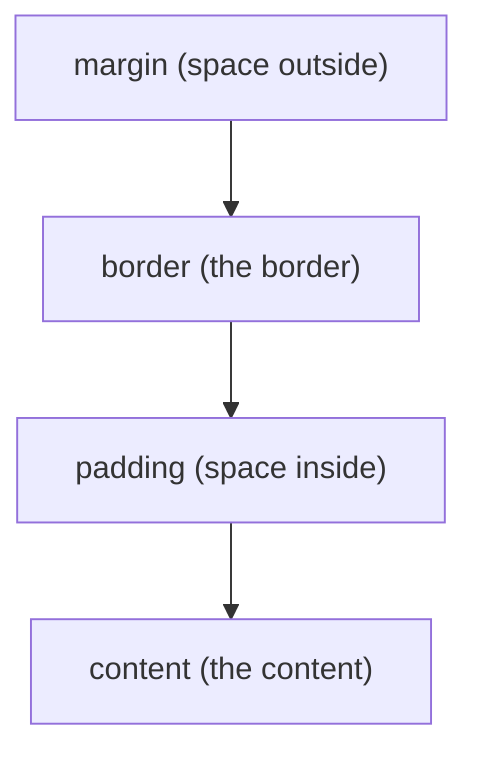

# CSS from scratch

**CSS** (Cascading Style Sheets) is the **look**: color, size, spacing, position,
font. HTML says *what* each thing is; CSS says *how it looks*.

!!! quote "Think like a child 🧒"
    If HTML is the labeled boxes, CSS is the painter and the decorator: "that wall
    blue", "that heading bigger", "those cards side by side". The same house (HTML)
    can get a thousand different decorations (CSS).

## Three ways to apply CSS

```html
<!-- 1. inline (on the element itself) — avoid -->
<p style="color: red;">red</p>

<!-- 2. in the page's <head> -->
<style>
  p { color: red; }
</style>

<!-- 3. separate file (the right way) -->
<link rel="stylesheet" href="style.css">
```

!!! tip "Prefer a separate file"
    An external `.css` is reusable, cacheable and keeps the HTML clean. In Django,
    that file is a [static](../referencia/organizando-assets.md) served with
    ``. Use `inline` only for a one-off tweak.

## The CSS rule: selector + declarations

Think like a child: "who" gets the decoration (selector) and "what" (the rules).

```css
p {                    /* selector: every <p> */
  color: #333;         /* property: value; */
  font-size: 16px;
}
```

## Selectors: choosing who to style

| Selector | Grabs | Example |
| --- | --- | --- |
| `p` | Every `<p>` tag | `p { }` |
| `.class` | Elements with `class="class"` | `.card { }` |
| `#id` | The element with `id="x"` (unique) | `#top { }` |
| `a, p` | Several at once | `a, p { }` |
| `nav a` | `<a>` inside `<nav>` | `nav a { }` |
| `a:hover` | `<a>` when you hover the mouse | `a:hover { }` |

!!! tip "Use classes most of the time"
    `class` is reusable (many elements, same class) and it's what CSS/JS use the
    most. `id` is unique per page — good for anchors and one-off JS, not for
    styling in bulk.

## Colors, text and units

```css
body {
  color: #1a1a1a;               /* text color (hexadecimal) */
  background: rgb(245, 245, 245);
  font-family: system-ui, sans-serif;
  font-size: 16px;
  line-height: 1.6;             /* line height (readability) */
}
h1 { font-size: 2rem; }          /* 2× the base font */
```

| Unit | What it is | When to use it |
| --- | --- | --- |
| `px` | Pixels (fixed) | Borders, fine details |
| `rem` | Relative to the base font | Fonts and spacing (scales along) |
| `%` | Relative to the parent | Fluid widths |
| `vw`/`vh` | % of the screen width/height | Full-screen sections |

## The box model: everything is a box

Think like a child: each element is a **gift box** with layers — the content, the
stuffing (padding), the box itself (border) and the space around it (margin).



```css
.card {
  padding: 16px;                /* inner space */
  border: 1px solid #ddd;       /* border */
  margin: 12px;                 /* outer space */
  border-radius: 8px;           /* rounded corners */
}
```

!!! danger "Turn on `box-sizing: border-box`"
    By default, `width` doesn't include padding/border — the box ends up bigger
    than you asked for and the layout "overflows". Put this at the top of your CSS
    and forget about the problem:
    ```css
    *, *::before, *::after { box-sizing: border-box; }
    ```

## Layout with Flexbox (one dimension)

Think like a child: putting toys on a **shelf**, in a row, deciding the spacing.

```css
.bar {
  display: flex;
  justify-content: space-between;  /* space out at the ends */
  align-items: center;             /* center vertically */
  gap: 1rem;                       /* space between items */
}
```

| Property | Controls |
| --- | --- |
| `display: flex` | Turns flex on for the container |
| `justify-content` | Alignment on the main axis (horizontal) |
| `align-items` | Alignment on the cross axis (vertical) |
| `flex-direction` | `row` or `column` |
| `gap` | Space between the items |

## Layout with Grid (two dimensions)

Think like a child: a **board** of rows and columns.

```css
.gallery {
  display: grid;
  grid-template-columns: repeat(3, 1fr);   /* 3 equal columns */
  gap: 1rem;
}
```

`1fr` = "one fraction" of the available space. `repeat(3, 1fr)` = three equal columns.

## Responsive: adapting to the screen size

Think like a child: the same outfit that adjusts to different bodies. On the
phone, one column; on the computer, several.

```css
.gallery {
  display: grid;
  grid-template-columns: 1fr;              /* phone: 1 column */
  gap: 1rem;
}

@media (min-width: 768px) {                /* screens ≥ 768px */
  .gallery {
    grid-template-columns: repeat(3, 1fr); /* desktop: 3 columns */
  }
}
```

- **`@media`** applies rules only when the condition matches (width, dark theme...).
- Start with the phone (mobile-first) and keep **adding** for larger screens.

!!! tip "The viewport tag in the HTML is mandatory"
    Responsive design only works with that tag in the `<head>`:
    `<meta name="viewport" content="width=device-width, initial-scale=1">`.
    Without it, the phone pretends to be a large screen and shrinks everything.

## The cascade and specificity

Think like a child: if two labels fight over the same box, the **more specific**
one wins; if it's a tie, the **last** one wins.

```css
p { color: black; }          /* general */
.highlight { color: blue; }  /* class: more specific, wins */
```

Order of strength (strongest to weakest): `#id` > `.class` > `tag`.

!!! danger "Steer clear of `!important`"
    `color: red !important;` overrides everything — and snowballs (you need
    another `!important` to beat it). Use it only as a last resort. Prefer
    adjusting the specificity of your selectors.

## Recap

- CSS = look; a rule = **selector** + **declarations** (`property: value;`).
- Selectors: `tag`, `.class` (the most used), `#id`, combinations, `:hover`.
- **Box model**: content → padding → border → margin; turn on `box-sizing:
  border-box`.
- Layout: **Flexbox** (row/column) and **Grid** (board); `gap` for spacing.
- **Responsive** with `@media`, mobile-first, and the viewport tag in the HTML.
- The **cascade** resolves conflicts by specificity; avoid `!important`.

!!! quote "📖 In the official docs"
    - [CSS (MDN)](https://developer.mozilla.org/en-US/docs/Web/CSS)
    - [Flexbox (MDN)](https://developer.mozilla.org/en-US/docs/Web/CSS/CSS_flexible_box_layout/Basic_concepts_of_flexbox)

Pretty and structured. Now it needs to come alive: **[JavaScript from scratch](javascript.md)**.
