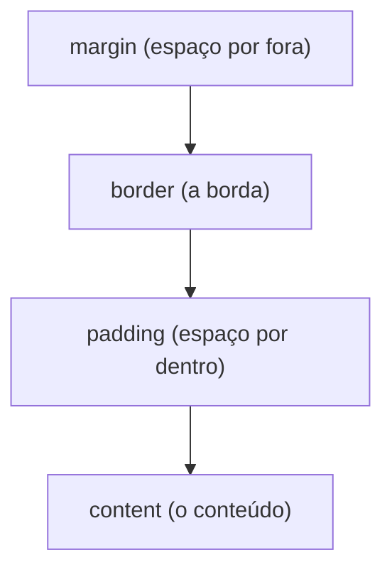

# CSS do zero

**CSS** (Cascading Style Sheets) é a **aparência**: cor, tamanho, espaço, posição,
fonte. O HTML diz *o que* é cada coisa; o CSS diz *como ela se parece*.

!!! quote "Pensa como criança 🧒"
    Se o HTML são as caixas etiquetadas, o CSS é o pintor e o decorador: "essa
    parede de azul", "esse título maior", "esses cards lado a lado". A mesma casa
    (HTML) pode ganhar mil decorações (CSS) diferentes.

## Três formas de aplicar CSS

```html
<!-- 1. inline (no próprio elemento) — evite -->
<p style="color: red;">vermelho</p>

<!-- 2. no <head> da página -->
<style>
  p { color: red; }
</style>

<!-- 3. arquivo separado (o jeito certo) -->
<link rel="stylesheet" href="style.css">
```

!!! tip "Prefira arquivo separado"
    Um `.css` externo é reutilizável, cacheável e mantém o HTML limpo. No Django,
    esse arquivo é um [estático](../referencia/organizando-assets.md) servido com
    ``. Use `inline` só para um ajuste pontual.

## A regra de CSS: seletor + declarações

Pensa como criança: "quem" recebe a decoração (seletor) e "o quê" (as regras).

```css
p {                    /* seletor: todos os <p> */
  color: #333;         /* propriedade: valor; */
  font-size: 16px;
}
```

## Seletores: escolhendo quem estilizar

| Seletor | Pega | Exemplo |
| --- | --- | --- |
| `p` | Todas as tags `<p>` | `p { }` |
| `.classe` | Elementos com `class="classe"` | `.card { }` |
| `#id` | O elemento com `id="x"` (único) | `#topo { }` |
| `a, p` | Vários de uma vez | `a, p { }` |
| `nav a` | `<a>` dentro de `<nav>` | `nav a { }` |
| `a:hover` | `<a>` ao passar o mouse | `a:hover { }` |

!!! tip "Use classes na maioria das vezes"
    `class` é reutilizável (vários elementos, mesma classe) e é o que o CSS/JS mais
    usam. `id` é único por página — bom para âncoras e JS pontual, não para
    estilizar em massa.

## Cores, texto e unidades

```css
body {
  color: #1a1a1a;               /* cor do texto (hexadecimal) */
  background: rgb(245, 245, 245);
  font-family: system-ui, sans-serif;
  font-size: 16px;
  line-height: 1.6;             /* altura da linha (legibilidade) */
}
h1 { font-size: 2rem; }          /* 2× a fonte base */
```

| Unidade | O que é | Quando usar |
| --- | --- | --- |
| `px` | Pixels (fixo) | Bordas, detalhes finos |
| `rem` | Relativo à fonte base | Fontes e espaços (escala junto) |
| `%` | Relativo ao pai | Larguras fluidas |
| `vw`/`vh` | % da largura/altura da tela | Seções de tela cheia |

## O box model: tudo é uma caixa

Pensa como criança: cada elemento é uma **caixa de presente** com camadas — o
conteúdo, o enchimento (padding), a caixa (border) e o espaço ao redor (margin).



```css
.card {
  padding: 16px;                /* espaço interno */
  border: 1px solid #ddd;       /* borda */
  margin: 12px;                 /* espaço externo */
  border-radius: 8px;           /* cantos arredondados */
}
```

!!! danger "Ligue o `box-sizing: border-box`"
    Por padrão, `width` não inclui padding/border — a caixa fica maior que você
    pediu e o layout "estoura". Coloque isto no topo do CSS e esqueça o problema:
    ```css
    *, *::before, *::after { box-sizing: border-box; }
    ```

## Layout com Flexbox (uma dimensão)

Pensa como criança: pôr brinquedos numa **prateleira**, em linha, decidindo o
espaçamento.

```css
.barra {
  display: flex;
  justify-content: space-between;  /* espaça nas pontas */
  align-items: center;             /* centraliza na vertical */
  gap: 1rem;                       /* espaço entre itens */
}
```

| Propriedade | Controla |
| --- | --- |
| `display: flex` | Liga o flex no contêiner |
| `justify-content` | Alinhamento no eixo principal (horizontal) |
| `align-items` | Alinhamento no eixo cruzado (vertical) |
| `flex-direction` | `row` (linha) ou `column` (coluna) |
| `gap` | Espaço entre os itens |

## Layout com Grid (duas dimensões)

Pensa como criança: um **tabuleiro** de linhas e colunas.

```css
.galeria {
  display: grid;
  grid-template-columns: repeat(3, 1fr);   /* 3 colunas iguais */
  gap: 1rem;
}
```

`1fr` = "uma fração" do espaço disponível. `repeat(3, 1fr)` = três colunas iguais.

## Responsivo: adaptar ao tamanho da tela

Pensa como criança: a mesma roupa que se ajusta a corpos diferentes. No celular,
uma coluna; no computador, várias.

```css
.galeria {
  display: grid;
  grid-template-columns: 1fr;              /* celular: 1 coluna */
  gap: 1rem;
}

@media (min-width: 768px) {                /* telas ≥ 768px */
  .galeria {
    grid-template-columns: repeat(3, 1fr); /* desktop: 3 colunas */
  }
}
```

- **`@media`** aplica regras só quando a condição bate (largura, tema escuro...).
- Comece pelo celular (mobile-first) e vá **adicionando** para telas maiores.

!!! tip "O viewport no HTML é obrigatório"
    O responsivo só funciona com aquela tag no `<head>`:
    `<meta name="viewport" content="width=device-width, initial-scale=1">`.
    Sem ela, o celular finge ser uma tela grande e encolhe tudo.

## A cascata e a especificidade

Pensa como criança: se dois adesivos brigam pela mesma caixa, vence o **mais
específico**; empatou, vence o **último**.

```css
p { color: black; }          /* geral */
.destaque { color: blue; }   /* classe: mais específico, vence */
```

Ordem de força (do mais forte ao mais fraco): `#id` > `.classe` > `tag`.

!!! danger "Fuja do `!important`"
    `color: red !important;` atropela tudo — e vira bola de neve (você precisa de
    outro `!important` para vencer). Use só em último caso. Prefira ajustar a
    especificidade dos seletores.

## Recapitulando

- CSS = aparência; regra = **seletor** + **declarações** (`propriedade: valor;`).
- Seletores: `tag`, `.classe` (o mais usado), `#id`, combinações, `:hover`.
- **Box model**: content → padding → border → margin; ligue `box-sizing:
  border-box`.
- Layout: **Flexbox** (linha/coluna) e **Grid** (tabuleiro); `gap` para espaçar.
- **Responsivo** com `@media`, mobile-first, e a tag viewport no HTML.
- A **cascata** resolve conflitos por especificidade; evite `!important`.

!!! quote "📖 Na documentação oficial"
    - [CSS (MDN)](https://developer.mozilla.org/pt-BR/docs/Web/CSS)
    - [Flexbox (MDN)](https://developer.mozilla.org/pt-BR/docs/Web/CSS/CSS_flexible_box_layout/Basic_concepts_of_flexbox)

Bonito e estruturado. Falta dar vida: **[JavaScript do zero](javascript.md)**.
