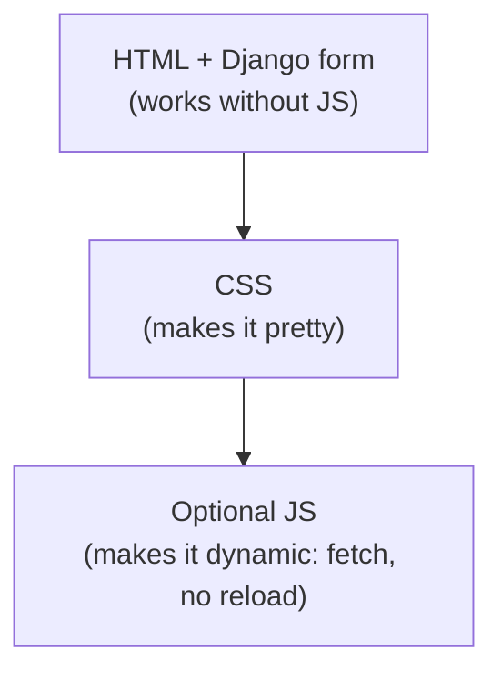

# Joining up with Django

You learned HTML, CSS and JS on their own. Now the fit: **where each one lives in
a Django project** and how they talk to the back-end.

!!! quote "Think like a child 🧒"
    So far you've built the house (HTML), decorated it (CSS) and wired the lights
    (JS) on an empty lot (loose files). Django is the **city** with an address,
    a post office and a kitchen: it delivers the right HTML for each URL, keeps the
    CSS/JS in an organized warehouse and receives what the resident sends.

## The map: where each piece lives

| Front-end piece | In Django it's | Where it goes |
| --- | --- | --- |
| HTML | A **template** | `app/templates/app/*.html` |
| CSS / JS / images | **Statics** | `app/static/app/...` |
| What the user sends | **Form** / request | `request.POST`, forms |
| Data for the JS (JSON) | An **API** (DRF) | `/api/...` |

Folder details in
[Organizing HTML, CSS and JS](../referencia/organizando-assets.md).

## 1. HTML becomes a template

The HTML you wrote becomes a **template**: normal HTML + ``/`{{ }}` markup
that Django fills in with data.

```django title="blog/post_list.html"




  <h1>Posts</h1>
            {# Django repeats the HTML per post #}
    <article>
      <h2>{{ post.title }}</h2>     {# inserts the data #}
      <p>{{ post.body }}</p>
    </article>
  

```

The view sends the data; the template decides the HTML. This is
[templates](../tutorial/templates.md) and the
[language/engine](../referencia/template-engines.md).

## 2. CSS and JS come in as statics

Never write a fixed path — use ``, which resolves the right address
in both dev and production:

```django

<link rel="stylesheet" href="">
<script src="" defer></script>
```

!!! danger "A fixed `/static/...` breaks in production"
    In production the file name can pick up a hash (`style.a1b2c3.css`, cached
    forever). `` always gets it right; a fixed path serves a stale
    version or gives a 404. See [Static and media files](../referencia/static-media.md).

## 3. HTML form ↔ Django form

The `<form>` you learned is the same one Django generates and validates. Comparing:

=== "Plain HTML (what comes out in the browser)"

    ```html
    <form action="/posts/new/" method="post">
      <input type="text" name="title" required>
      <textarea name="body"></textarea>
      <button type="submit">Save</button>
    </form>
    ```

=== "With Django (what you write)"

    ```django
    <form action="" method="post">
                {# required! see below #}
      {{ form.as_p }}           {# Django generates the <input>s from the form #}
      <button type="submit">Save</button>
    </form>
    ```

The `{{ form.as_p }}` **generates the HTML** for the fields (with `name`,
`required`, errors) from the [Django form](../tutorial/forms.md). You understand
the raw HTML; Django produces and validates it.

!!! danger "CSRF: the `` is mandatory on every POST"
    Django blocks any POST without a security token (protection against forgery).
    Forgot the `` inside the `<form>`? You get a **403 Forbidden**.
    It's the #1 cause of "my form won't submit".

## 4. JavaScript talks to the API (DRF)

When you want to update the page **without reloading** (like, search, load more),
the JS uses `fetch` to talk to the [DRF API](../advanced/drf.md).

### GET: fetch data

```javascript
async function loadPosts() {
  const r = await fetch("/api/posts/");
  const data = await r.json();
  const list = document.querySelector("#posts");
  list.innerHTML = data.results
    .map((p) => `<li>${p.title}</li>`)
    .join("");
}
```

### POST: send data (with the CSRF token)

Here's the trick that trips a lot of people up: a POST via `fetch` to Django
**also** needs the CSRF token, now in a **header**.

```javascript
function getCookie(name) {
  // reads a cookie by name (Django stores the token in 'csrftoken')
  const item = document.cookie
    .split("; ")
    .find((line) => line.startsWith(name + "="));
  return item ? decodeURIComponent(item.split("=")[1]) : null;
}

async function like(slug) {
  const r = await fetch(`/api/posts/${slug}/like/`, {
    method: "POST",
    headers: {
      "Content-Type": "application/json",
      "X-CSRFToken": getCookie("csrftoken"),   // (1)!
    },
    body: JSON.stringify({}),
  });
  return r.json();
}
```

1. Django expects the token in the **`X-CSRFToken`** header on session-authenticated
    write requests. Without it → **403**.

!!! tip "Why does the token show up again here?"
    In the HTML form, `` puts the token in a hidden field. In
    `fetch` there's no form — so you read the token from the `csrftoken` cookie and
    send it in the `X-CSRFToken` header. Same security mechanism, different form.

## 5. Progressive enhancement: start working without JS

Think like a child: the electric doorbell is great, but the house also needs a
**door you can open by hand**. Make the page work with HTML+Django first; use the
JS to **enhance** the experience.



!!! warning "Don't rely on JS alone for the essentials"
    If submitting a comment **only** works via `fetch`, anyone with JS blocked (or
    a network glitch mid-way) can't submit. Make the normal Django `<form>` work;
    the `fetch` is the cherry on top. It's also more accessible and more robust.

!!! danger "Security lives in the back-end — always"
    HTML validation (`required`) and JS checks are **convenience**, not security:
    the user opens F12 and bypasses them. What really decides (permissions, rules,
    validation that matters) is Django. The front-end improves the experience; the
    back-end protects the data.

## Recap

- In Django: HTML → **template**; CSS/JS/images → **statics** (``);
  user submission → **form**; data for the JS → **DRF API** (JSON).
- `{{ form.as_p }}` generates the form's HTML; **``** is
  mandatory on every POST (otherwise 403).
- `fetch` connects the JS to the API; on a POST via `fetch`, send the token in the
  **`X-CSRFToken`** header (read from the cookie).
- **Progressive enhancement**: work without JS first, enhance with JS later.
- **Security is always in the back-end** — the front-end is convenience, not defense.

!!! quote "📖 In the official docs"
    - [Working with forms (Django)](https://docs.djangoproject.com/en/stable/topics/forms/)
    - [CSRF protection (Django)](https://docs.djangoproject.com/en/stable/ref/csrf/)
    - [How to manage static files (Django)](https://docs.djangoproject.com/en/stable/howto/static-files/)

🎉 You've closed the loop: from raw HTML to a dynamic front-end talking to Django.
To go deeper into each side, head to the [Tutorial](../tutorial/project-setup.md)
or the [Reference](../referencia/index.md).
