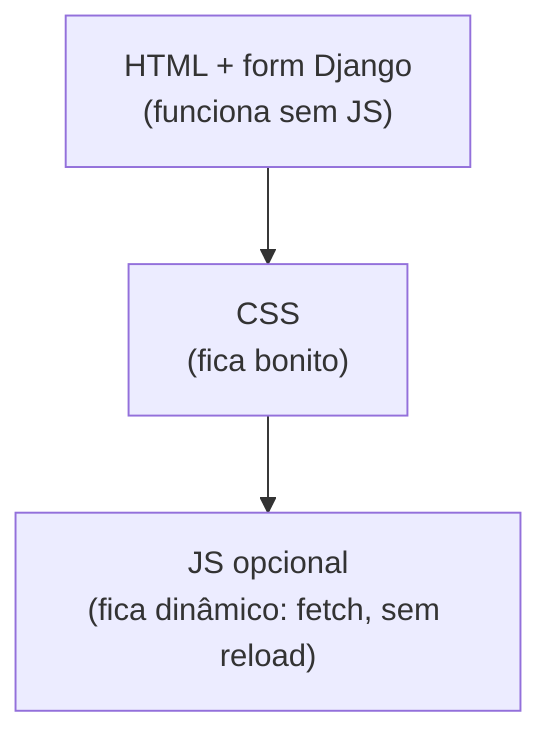

# Juntando com Django

Você aprendeu HTML, CSS e JS soltos. Agora o encaixe: **onde cada um vive num
projeto Django** e como eles conversam com o back-end.

!!! quote "Pensa como criança 🧒"
    Até agora você montou a casa (HTML), decorou (CSS) e ligou a luz (JS) num
    terreno vazio (arquivos soltos). O Django é a **cidade** com endereço, correio
    e cozinha: ele entrega o HTML certo para cada URL, guarda o CSS/JS num
    depósito organizado e recebe o que o morador envia.

## O mapa: onde cada peça mora

| Peça do front | No Django é | Onde fica |
| --- | --- | --- |
| HTML | Um **template** | `app/templates/app/*.html` |
| CSS / JS / imagens | **Estáticos** | `app/static/app/...` |
| O que o usuário envia | **Formulário** / request | `request.POST`, forms |
| Dados para o JS (JSON) | Uma **API** (DRF) | `/api/...` |

Detalhes de pastas em
[Organizando HTML, CSS e JS](../referencia/organizando-assets.md).

## 1. HTML vira template

O HTML que você escreveu vira um **template**: HTML normal + marcações
``/`{{ }}` que o Django preenche com dados.

```django title="blog/post_list.html"




  <h1>Posts</h1>
            {# o Django repete o HTML por post #}
    <article>
      <h2>{{ post.title }}</h2>     {# insere o dado #}
      <p>{{ post.body }}</p>
    </article>
  

```

A view manda os dados; o template decide o HTML. Isso é
[templates](../tutorial/templates.md) e a
[linguagem/motor](../referencia/template-engines.md).

## 2. CSS e JS entram como estáticos

Nunca escreva o caminho fixo — use ``, que resolve o endereço certo
em dev e produção:

```django

<link rel="stylesheet" href="">
<script src="" defer></script>
```

!!! danger "`/static/...` fixo quebra em produção"
    Em produção o nome do arquivo pode ganhar um hash (`style.a1b2c3.css`, cache
    eterno). `` acerta sempre; caminho fixo serve versão velha ou dá
    404. Veja [Arquivos estáticos e media](../referencia/static-media.md).

## 3. Formulário HTML ↔ Formulário Django

O `<form>` que você aprendeu é o mesmo que o Django gera e valida. Comparando:

=== "HTML puro (o que sai no navegador)"

    ```html
    <form action="/posts/novo/" method="post">
      <input type="text" name="title" required>
      <textarea name="body"></textarea>
      <button type="submit">Salvar</button>
    </form>
    ```

=== "Com Django (o que você escreve)"

    ```django
    <form action="" method="post">
                {# obrigatório! veja abaixo #}
      {{ form.as_p }}           {# o Django gera os <input> a partir do form #}
      <button type="submit">Salvar</button>
    </form>
    ```

O `{{ form.as_p }}` **gera o HTML** dos campos (com `name`, `required`, erros) a
partir do [formulário Django](../tutorial/forms.md). Você entende o HTML cru; o
Django o produz e valida.

!!! danger "CSRF: o `` é obrigatório em todo POST"
    O Django bloqueia POST sem um token de segurança (proteção contra
    falsificação). Esqueceu o `` dentro do `<form>`? Você leva um
    **403 Forbidden**. É a causa nº 1 de "meu formulário não envia".

## 4. JavaScript conversa com a API (DRF)

Quando você quer atualizar a página **sem recarregar** (curtir, buscar, carregar
mais), o JS usa `fetch` para falar com a [API DRF](../advanced/drf.md).

### GET: buscar dados

```javascript
async function carregarPosts() {
  const r = await fetch("/api/posts/");
  const dados = await r.json();
  const lista = document.querySelector("#posts");
  lista.innerHTML = dados.results
    .map((p) => `<li>${p.title}</li>`)
    .join("");
}
```

### POST: enviar dados (com o token CSRF)

Aqui está o pulo do gato que trava muita gente: um POST via `fetch` para o Django
**também** precisa do token CSRF, agora num **cabeçalho**.

```javascript
function getCookie(nome) {
  // lê um cookie pelo nome (o Django guarda o token em 'csrftoken')
  const item = document.cookie
    .split("; ")
    .find((linha) => linha.startsWith(nome + "="));
  return item ? decodeURIComponent(item.split("=")[1]) : null;
}

async function curtir(slug) {
  const r = await fetch(`/api/posts/${slug}/like/`, {
    method: "POST",
    headers: {
      "Content-Type": "application/json",
      "X-CSRFToken": getCookie("csrftoken"),   // (1)!
    },
    body: JSON.stringify({}),
  });
  return r.json();
}
```

1. O Django espera o token no cabeçalho **`X-CSRFToken`** em requisições de
    escrita autenticadas por sessão. Sem ele → **403**.

!!! tip "Por que o token aparece de novo aqui?"
    No formulário HTML, o `` põe o token num campo escondido. No
    `fetch`, não há formulário — então você lê o token do cookie `csrftoken` e o
    manda no cabeçalho `X-CSRFToken`. Mesmo mecanismo de segurança, forma
    diferente.

## 5. Progressive enhancement: comece funcionando sem JS

Pensa como criança: a campainha elétrica é ótima, mas a casa precisa ter uma
**porta que abre na mão** também. Faça a página funcionar com HTML+Django
primeiro; use o JS para **melhorar** a experiência.



!!! warning "Não dependa só do JS para o essencial"
    Se enviar um comentário **só** funciona por `fetch`, quem tem JS bloqueado (ou
    uma falha de rede no meio) fica sem enviar. Faça o `<form>` normal do Django
    funcionar; o `fetch` é a cereja. Isso também é mais acessível e mais robusto.

!!! danger "Segurança mora no back-end — sempre"
    Validação de HTML (`required`) e checagem em JS são **conforto**, não
    segurança: o usuário abre o F12 e burla. Quem decide de verdade (permissão,
    regra, validação que importa) é o Django. O front melhora a experiência; o
    back protege os dados.

## Recapitulando

- No Django: HTML → **template**; CSS/JS/imagens → **estáticos** (``);
  envio do usuário → **formulário**; dados para o JS → **API DRF** (JSON).
- `{{ form.as_p }}` gera o HTML do formulário; **``** é
  obrigatório em todo POST (senão 403).
- `fetch` liga o JS à API; num POST via `fetch`, mande o token no cabeçalho
  **`X-CSRFToken`** (lido do cookie).
- **Progressive enhancement**: funcione sem JS primeiro, melhore com JS depois.
- **Segurança é sempre no back-end** — o front-end é conforto, não defesa.

!!! quote "📖 Na documentação oficial"
    - [Trabalhando com formulários (Django)](https://docs.djangoproject.com/en/stable/topics/forms/)
    - [Proteção CSRF (Django)](https://docs.djangoproject.com/en/stable/ref/csrf/)
    - [How to manage static files (Django)](https://docs.djangoproject.com/en/stable/howto/static-files/)

🎉 Você fechou o ciclo: do HTML cru ao front-end dinâmico conversando com o
Django. Para aprofundar cada lado, siga para o [Tutorial](../tutorial/project-setup.md)
ou a [Referência](../referencia/index.md).
