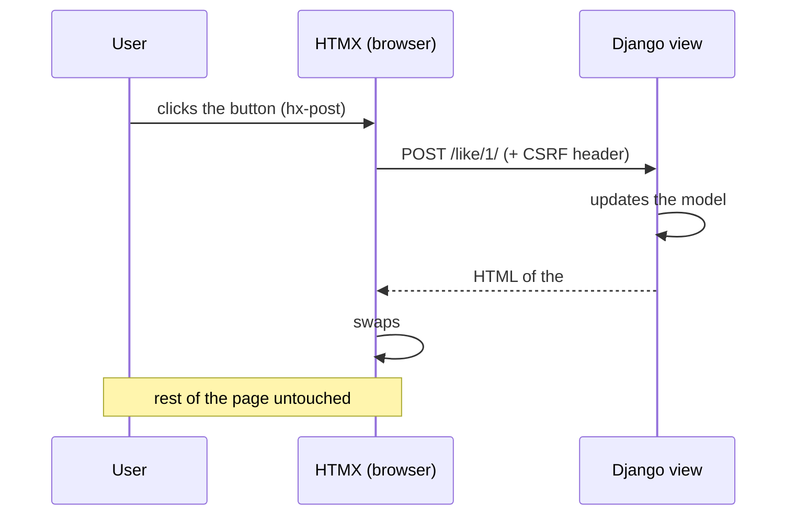

# Dynamic UI with HTMX, Alpine and partials

You want a page that **reacts** — like a post, load more comments, submit a form —
without reloading everything and without building a whole **SPA** in React. The
modern Django answer is: the server returns **pieces of HTML** and the browser
swaps just that piece on screen.

!!! quote "Think like a child 🧒"
    Picture a sticker album. You don't throw the album away when you get a new
    sticker — you open to the right page and **stick just the sticker** in that
    little square. **HTMX** is the glue: it asks the server for the sticker and
    fits it exactly into place, leaving the rest of the album untouched.

## Use case

A "Like" button on a post. Clicking should change the like count — **without
reloading the page** and **without writing JavaScript**.

With HTMX, you add three attributes to the button. `hx-post` says *where* to send,
`hx-target` says *which piece of the screen* to update, and `hx-swap` says *how*
to fit the response in:

```html

<!doctype html>
<html lang="en">
<head>
  <meta charset="utf-8">
  <title>Blog</title>
  <script src="https://unpkg.com/htmx.org@2.0.4"></script>
</head>
<body>
  

  <article>
    <h1>{{ post.title }}</h1>

    <div id="likes">
      <button
        hx-post=""
        hx-target="#likes"
        hx-swap="outerHTML">
        ❤️ {{ post.likes }}
      </button>
    </div>
  </article>

  
</body>
</html>
```

The view returns **only the piece** `#likes`, already updated — not the whole page:

```python
from django.http import HttpRequest, HttpResponse
from django.shortcuts import get_object_or_404, render
from django.views.decorators.http import require_POST

from blog.models import Post


@require_POST
def like(request: HttpRequest, pk: int) -> HttpResponse:
    """Increment a post's like count and return only the likes fragment.

    Args:
        request: The incoming HTTP request.
        pk: Primary key of the post being liked.

    Returns:
        An HTML response containing just the updated ``#likes`` block.
    """
    post = get_object_or_404(Post, pk=pk)
    post.likes += 1
    post.save(update_fields=["likes"])
    return render(request, "blog/_likes.html", {"post": post})
```

And the fragment (`blog/_likes.html`) is literally the same `<div id="likes">`
from the main template:

```html
<div id="likes">
  <button
    hx-post=""
    hx-target="#likes"
    hx-swap="outerHTML">
    ❤️ {{ post.likes }}
  </button>
</div>
```

Clicked → HTMX makes the `POST`, Django returns the `<div>` with the new number,
and HTMX **swaps the old div for the new one**. Zero reloads, zero hand-written JS.

!!! tip "The server stays in charge"
    Notice that **all the logic stayed in Django**. HTMX is not a JavaScript
    framework with its own state — it's a bridge that turns HTML attributes into
    requests and fits the response in. You keep thinking in views, templates and
    URLs, exactly as you already do.

## Possibilities

### The essential HTMX attributes

| Attribute | What it does |
| --- | --- |
| `hx-get="/url/"` | Makes a `GET` on click (or on the defined trigger) |
| `hx-post="/url/"` | Makes a `POST` |
| `hx-put` / `hx-patch` / `hx-delete` | The other HTTP verbs |
| `hx-target="#id"` | Which element receives the response (default: itself) |
| `hx-swap="innerHTML"` | How to fit the response in (see table below) |
| `hx-trigger="click"` | Which event fires it (default depends on the element) |
| `hx-vals='{"x": 1}'` | Extra data sent along |
| `hx-indicator="#spin"` | Element shown while the request runs |
| `hx-confirm="Are you sure?"` | Asks for confirmation before firing |

### The `hx-swap` modes

| Value | How it fits |
| --- | --- |
| `innerHTML` (default) | Replaces the target's **content** |
| `outerHTML` | Replaces the **whole element** (target included) |
| `beforeend` | Appends **inside, at the end** (great for lists) |
| `afterbegin` | Appends **inside, at the start** |
| `beforebegin` / `afterend` | Inserts **outside**, before/after the target |
| `delete` | Removes the target (ignores the response) |
| `none` | Fits nothing in (useful with events) |

### The flow, from click to swap



### CSRF: the step everyone forgets

Django rejects any `POST`/`PUT`/`PATCH`/`DELETE` without a CSRF token. Since HTMX
doesn't go through the traditional `<form>`, you need to **inject the**
`X-CSRFToken` **header** into the requests. The cleanest way is a single snippet
in the `<head>`:

```html

<script>
  document.body.addEventListener("htmx:configRequest", (event) => {
    event.detail.headers["X-CSRFToken"] = document.querySelector(
      "[name=csrfmiddlewaretoken]"
    ).value;
  });
</script>
```

!!! warning "No header means 403"
    If your `hx-post` calls come back **403 Forbidden**, it's almost always CSRF.
    Either you inject the header (above), or you use `django-htmx` (next), which
    handles it for you in one line.

### `django-htmx`: the community's official helper

The [`django-htmx`](https://django-htmx.readthedocs.io/) package adds a
middleware that enriches `request` and handles CSRF automatically.

```bash
python -m pip install django-htmx
```

```python
INSTALLED_APPS = [
    "django_htmx",
]

MIDDLEWARE = [
    "django_htmx.middleware.HtmxMiddleware",
]
```

With the middleware active, you get `request.htmx` — a truthy/falsy object that
also exposes the HTMX headers. This lets the **same view** serve the full page on
a normal visit and only the fragment when the request comes from HTMX:

```python
from django.http import HttpRequest, HttpResponse
from django.shortcuts import render

from blog.models import Post


def post_list(request: HttpRequest) -> HttpResponse:
    """Render the post list, full page or fragment depending on the caller.

    When the request comes from HTMX, only the list partial is returned so the
    surrounding layout is not re-sent. A normal browser navigation receives the
    full page.

    Args:
        request: The incoming HTTP request.

    Returns:
        The full page or the ``_post_list.html`` fragment.
    """
    posts = Post.objects.all().order_by("-created_at")
    if request.htmx:
        return render(request, "blog/_post_list.html", {"posts": posts})
    return render(request, "blog/post_list.html", {"posts": posts})
```

| `request.htmx` exposes | Meaning |
| --- | --- |
| `bool(request.htmx)` | Did the request come from HTMX? |
| `request.htmx.trigger` | `id` of the element that fired it |
| `request.htmx.target` | `id` of the `hx-target` |
| `request.htmx.current_url` | URL the user is on |

!!! tip "Load the script via the template tag"
    `django-htmx` ships `` and ``, which
    injects the HTMX `<script>` (and a debug extension under `DEBUG=True`). That
    way you don't pin the CDN version in every template.

### A perfect match with Django 6 partials

The fragments HTMX swaps don't need to live in separate files. **Django 6**
introduced [template partials](../referencia/template-partials.md): you define a
named piece **inside the template itself** and render just that.

```html


<ul id="comments">
  
    
      <li>{{ comment.body }}</li>
    
  
  
</ul>
```

In the view, you point the render at the partial using the `template#partial`
syntax:

```python
from django.http import HttpRequest, HttpResponse
from django.shortcuts import render

from blog.models import Comment


def comment_list(request: HttpRequest, post_id: int) -> HttpResponse:
    """Return only the comment-list partial for HTMX to swap in.

    Args:
        request: The incoming HTTP request.
        post_id: Primary key of the post whose comments are listed.

    Returns:
        The rendered ``comment-list`` partial.
    """
    comments = Comment.objects.filter(post_id=post_id).order_by("created_at")
    return render(
        request,
        "blog/post_detail.html#comment-list",
        {"comments": comments},
    )
```

!!! info "One template, one source of truth"
    Before Django 6, keeping the fragment and the page in sync was work — two
    files that had to agree. With partials, the piece lives **next to** the
    template that already uses it, and HTMX renders exactly that block.

### Alpine.js: light client-side state

HTMX is great for whatever depends on the **server**. But purely visual things —
opening a menu, showing/hiding a panel, a dropdown — don't need the network. For
that there's [Alpine.js](https://alpinejs.dev/): a little bit of state that lives
**only in the browser**, also written in HTML attributes.

```html
<script src="https://unpkg.com/alpinejs@3.14.1" defer></script>

<div x-data="{ open: false }">
  <button @click="open = !open">Filters</button>

  <div x-show="open">
    <label><input type="checkbox"> Published only</label>
  </div>
</div>
```

| Directive | What it does |
| --- | --- |
| `x-data="{...}"` | Declares the local state of that piece |
| `x-show="expr"` | Shows/hides based on the boolean |
| `x-model="field"` | Binds an input to the state (two-way) |
| `@click="..."` | Reacts to events (shorthand for `x-on:click`) |
| `x-text="expr"` | Writes the value into the element's text |

!!! tip "HTMX + Alpine is the classic pair"
    The rule of thumb: **need the server? HTMX. Purely visual? Alpine.** One
    fetches HTML and swaps pieces; the other holds an `open: true/false` with no
    network traffic. Together they cover almost all interactivity without a SPA —
    and they're just two `<script>` tags.

### Progressive enhancement: work even without JS

The biggest strength of this approach is that it **degrades gracefully**. Write a
real `<form>`, with `action` and `method`, that works on its own — then enhance it
with HTMX. If JS fails or doesn't load, the form still submits.

```html
<form
  method="post"
  action=""
  hx-post=""
  hx-target="#comments"
  hx-swap="beforeend">
  
  <textarea name="body" required></textarea>
  <button type="submit">Comment</button>
</form>
```

!!! note "The best of both worlds"
    Without JS, the browser follows the `action`/`method` and reloads the page
    with the saved comment. With JS, HTMX intercepts, makes the `POST` and
    **appends** the new comment at the end of the list (`beforeend`) without
    reloading. The view returns just the comment's `<li>` when `request.htmx` is
    truthy.

!!! danger "Never trust the client for security"
    HTMX and Alpine run in the browser — the user can tamper with any attribute.
    **All** validation, permissions and business rules remain mandatory on the
    server. `hx-confirm` improves the experience, but protects nothing.

!!! quote "📖 In the official docs"
    - [HTMX](https://htmx.org/)
    - [django-htmx](https://django-htmx.readthedocs.io/)
    - [Alpine.js](https://alpinejs.dev/)
    - [Django 6 template partials](../referencia/template-partials.md)

## Recap

- **HTMX** swaps pieces of HTML without a SPA: `hx-get`/`hx-post` say where,
  `hx-target` says where to fit it, `hx-swap` says how.
- Views return **HTML fragments** (not JSON), reusing the views, templates and
  URLs you already know.
- **CSRF** is mandatory on state-changing verbs — inject the `X-CSRFToken` header
  or use `django-htmx`.
- **`django-htmx`** gives you `request.htmx`, so the **same view** serves a full
  page or a fragment depending on the caller.
- Django 6 [template partials](../referencia/template-partials.md) let the
  fragment live inside the template itself (`template#partial`).
- **Alpine.js** handles purely visual client-side state; the rule is *server →
  HTMX, visual → Alpine*.
- Write for **progressive enhancement**: a `<form>` that works without JS,
  enhanced with HTMX on top.
- Security **always** on the server — nothing running in the browser is trusted.

Want the JS basics first? See **[JavaScript from scratch](javascript.md)**.
Want to tie front and back together? **[Joining with Django](django-integracao.md)**.
