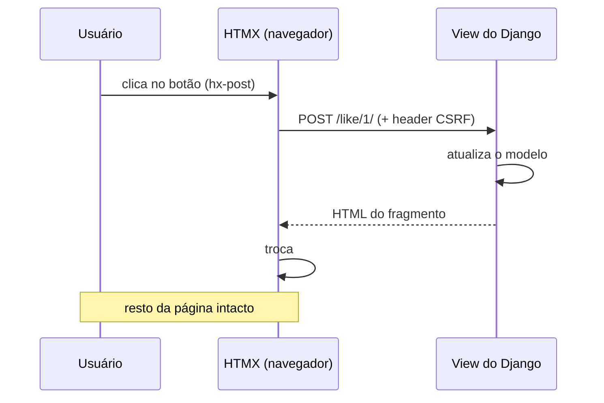

# Dinamismo com HTMX, Alpine e partials

Você quer uma página que **reage** — curtir um post, carregar mais comentários,
enviar um formulário — sem recarregar tudo e sem construir uma **SPA** inteira em
React. A resposta moderna do Django é: o servidor devolve **pedaços de HTML** e o
navegador troca só aquele pedaço na tela.

!!! quote "Pensa como criança 🧒"
    Imagine um álbum de figurinhas. Você não joga o álbum fora quando ganha uma
    figurinha nova — você abre na página certa e **cola só a figurinha** naquele
    quadradinho. O **HTMX** é a cola: ele pede a figurinha ao servidor e a encaixa
    exatamente no lugar, deixando o resto do álbum intacto.

## Caso de uso

Um botão "Curtir" no post. Clicar deve mudar o número de curtidas — **sem
recarregar a página** e **sem escrever JavaScript**.

Com HTMX, você adiciona três atributos no botão. O `hx-post` diz *para onde*
mandar, o `hx-target` diz *qual pedaço da tela* atualizar, e o `hx-swap` diz
*como* encaixar a resposta:

```html

<!doctype html>
<html lang="pt-br">
<head>
  <meta charset="utf-8">
  <title>Blog</title>
  <script src="https://unpkg.com/htmx.org@2.0.4"></script>
</head>
<body>
  

  <article>
    <h1>{{ post.title }}</h1>

    <div id="likes">
      <button
        hx-post=""
        hx-target="#likes"
        hx-swap="outerHTML">
        ❤️ {{ post.likes }}
      </button>
    </div>
  </article>

  
</body>
</html>
```

A view devolve **só o pedaço** `#likes` já atualizado — não a página inteira:

```python
from django.http import HttpRequest, HttpResponse
from django.shortcuts import get_object_or_404, render
from django.views.decorators.http import require_POST

from blog.models import Post


@require_POST
def like(request: HttpRequest, pk: int) -> HttpResponse:
    """Increment a post's like count and return only the likes fragment.

    Args:
        request: The incoming HTTP request.
        pk: Primary key of the post being liked.

    Returns:
        An HTML response containing just the updated ``#likes`` block.
    """
    post = get_object_or_404(Post, pk=pk)
    post.likes += 1
    post.save(update_fields=["likes"])
    return render(request, "blog/_likes.html", {"post": post})
```

E o fragmento (`blog/_likes.html`) é literalmente o mesmo `<div id="likes">` do
template principal:

```html
<div id="likes">
  <button
    hx-post=""
    hx-target="#likes"
    hx-swap="outerHTML">
    ❤️ {{ post.likes }}
  </button>
</div>
```

Clicou → HTMX faz o `POST`, o Django devolve o `<div>` com o número novo, e o
HTMX **troca o div antigo pelo novo**. Zero recarregamento, zero JS escrito à mão.

!!! tip "O servidor continua no comando"
    Repare que **toda a lógica ficou no Django**. O HTMX não é um framework de
    JavaScript com estado próprio — ele é uma ponte que transforma atributos HTML
    em requisições e encaixa a resposta. Você continua pensando em views,
    templates e URLs, exatamente como já sabe.

## Possibilidades

### Os atributos essenciais do HTMX

| Atributo | O que faz |
| --- | --- |
| `hx-get="/url/"` | Faz um `GET` ao clicar (ou no gatilho definido) |
| `hx-post="/url/"` | Faz um `POST` |
| `hx-put` / `hx-patch` / `hx-delete` | Os outros verbos HTTP |
| `hx-target="#id"` | Qual elemento recebe a resposta (padrão: o próprio) |
| `hx-swap="innerHTML"` | Como encaixar a resposta (veja tabela abaixo) |
| `hx-trigger="click"` | Qual evento dispara (padrão depende do elemento) |
| `hx-vals='{"x": 1}'` | Dados extras enviados junto |
| `hx-indicator="#spin"` | Elemento mostrado enquanto a requisição corre |
| `hx-confirm="Tem certeza?"` | Pede confirmação antes de disparar |

### Os modos de `hx-swap`

| Valor | Encaixe |
| --- | --- |
| `innerHTML` (padrão) | Substitui o **conteúdo** do alvo |
| `outerHTML` | Substitui o **elemento inteiro** (alvo incluído) |
| `beforeend` | Acrescenta **dentro, no fim** (ótimo para listas) |
| `afterbegin` | Acrescenta **dentro, no começo** |
| `beforebegin` / `afterend` | Insere **fora**, antes/depois do alvo |
| `delete` | Remove o alvo (ignora a resposta) |
| `none` | Não encaixa nada (útil com eventos) |

### O fluxo, do clique ao encaixe



### CSRF: o passo que todo mundo esquece

O Django recusa qualquer `POST`/`PUT`/`PATCH`/`DELETE` sem token CSRF. Como o
HTMX não passa pelo `<form>` tradicional, você precisa **injetar o header**
`X-CSRFToken` nas requisições. O jeito mais limpo é um único trecho no `<head>`:

```html

<script>
  document.body.addEventListener("htmx:configRequest", (event) => {
    event.detail.headers["X-CSRFToken"] = document.querySelector(
      "[name=csrfmiddlewaretoken]"
    ).value;
  });
</script>
```

!!! warning "Sem o header, é 403"
    Se seus `hx-post` voltam com **403 Forbidden**, é quase sempre o CSRF. Ou você
    injeta o header (acima), ou usa o `django-htmx` (a seguir), que resolve isso
    pra você com uma linha.

### `django-htmx`: o ajudante oficial da comunidade

O pacote [`django-htmx`](https://django-htmx.readthedocs.io/) adiciona um
middleware que enriquece `request` e cuida do CSRF automaticamente.

```bash
python -m pip install django-htmx
```

```python
INSTALLED_APPS = [
    "django_htmx",
]

MIDDLEWARE = [
    "django_htmx.middleware.HtmxMiddleware",
]
```

Com o middleware ativo, você ganha `request.htmx` — um objeto verdadeiro/falso
que também expõe os headers do HTMX. Isso deixa a **mesma view** servir a página
inteira num acesso normal e só o fragmento quando o pedido vem do HTMX:

```python
from django.http import HttpRequest, HttpResponse
from django.shortcuts import render

from blog.models import Post


def post_list(request: HttpRequest) -> HttpResponse:
    """Render the post list, full page or fragment depending on the caller.

    When the request comes from HTMX, only the list partial is returned so the
    surrounding layout is not re-sent. A normal browser navigation receives the
    full page.

    Args:
        request: The incoming HTTP request.

    Returns:
        The full page or the ``_post_list.html`` fragment.
    """
    posts = Post.objects.all().order_by("-created_at")
    if request.htmx:
        return render(request, "blog/_post_list.html", {"posts": posts})
    return render(request, "blog/post_list.html", {"posts": posts})
```

| `request.htmx` expõe | Significado |
| --- | --- |
| `bool(request.htmx)` | A requisição veio do HTMX? |
| `request.htmx.trigger` | `id` do elemento que disparou |
| `request.htmx.target` | `id` do `hx-target` |
| `request.htmx.current_url` | URL onde o usuário está |

!!! tip "Carregue o script pelo template tag"
    O `django-htmx` traz `` e ``, que
    injeta o `<script>` do HTMX (e uma extensão de depuração em `DEBUG=True`).
    Assim você não fixa a versão do CDN em cada template.

### Casa perfeita com os partials do Django 6

Os fragmentos que o HTMX troca não precisam morar em arquivos separados. O
**Django 6** trouxe os [template partials](../referencia/template-partials.md):
você define um pedaço nomeado **dentro do próprio template** e renderiza só ele.

```html


<ul id="comments">
  
    
      <li>{{ comment.body }}</li>
    
  
  
</ul>
```

Na view, você aponta o render para o partial usando a sintaxe `template#partial`:

```python
from django.http import HttpRequest, HttpResponse
from django.shortcuts import render

from blog.models import Comment


def comment_list(request: HttpRequest, post_id: int) -> HttpResponse:
    """Return only the comment-list partial for HTMX to swap in.

    Args:
        request: The incoming HTTP request.
        post_id: Primary key of the post whose comments are listed.

    Returns:
        The rendered ``comment-list`` partial.
    """
    comments = Comment.objects.filter(post_id=post_id).order_by("created_at")
    return render(
        request,
        "blog/post_detail.html#comment-list",
        {"comments": comments},
    )
```

!!! info "Um template, uma fonte de verdade"
    Antes do Django 6, manter o fragmento e a página em sincronia dava trabalho —
    dois arquivos que precisavam concordar. Com partials, o pedaço vive **junto**
    do template que já o usa, e o HTMX renderiza exatamente aquele bloco.

### Alpine.js: estado leve no cliente

O HTMX é ótimo para o que depende do **servidor**. Mas coisas puramente visuais —
abrir um menu, mostrar/esconder um painel, um dropdown — não precisam de rede.
Para isso existe o [Alpine.js](https://alpinejs.dev/): um pouquinho de estado que
mora **só no navegador**, escrito também em atributos HTML.

```html
<script src="https://unpkg.com/alpinejs@3.14.1" defer></script>

<div x-data="{ aberto: false }">
  <button @click="aberto = !aberto">Filtros</button>

  <div x-show="aberto">
    <label><input type="checkbox"> Só publicados</label>
  </div>
</div>
```

| Diretiva | Faz |
| --- | --- |
| `x-data="{...}"` | Declara o estado local daquele trecho |
| `x-show="expr"` | Mostra/esconde conforme o booleano |
| `x-model="campo"` | Liga um input ao estado (mão dupla) |
| `@click="..."` | Reage a eventos (atalho de `x-on:click`) |
| `x-text="expr"` | Escreve o valor no texto do elemento |

!!! tip "HTMX + Alpine é a dupla clássica"
    A regra prática: **precisa do servidor? HTMX. É só visual? Alpine.** Um busca
    HTML e troca pedaços; o outro guarda um `aberto: true/false` sem tráfego de
    rede. Juntos cobrem quase toda interatividade sem uma SPA — e são só dois
    `<script>`.

### Progressive enhancement: funcione mesmo sem JS

O maior trunfo dessa abordagem é que ela **degrada com elegância**. Escreva um
`<form>` de verdade, com `action` e `method`, que funcione sozinho — e então
enfeite com HTMX. Se o JS falhar ou não carregar, o formulário ainda envia.

```html
<form
  method="post"
  action=""
  hx-post=""
  hx-target="#comments"
  hx-swap="beforeend">
  
  <textarea name="body" required></textarea>
  <button type="submit">Comentar</button>
</form>
```

!!! note "O melhor dos dois mundos"
    Sem JS, o navegador segue o `action`/`method` e recarrega a página com o
    comentário salvo. Com JS, o HTMX intercepta, faz o `POST` e **acrescenta** o
    novo comentário no fim da lista (`beforeend`) sem recarregar. A view devolve
    só o `<li>` do comentário quando `request.htmx` for verdadeiro.

!!! danger "Não confie no cliente para segurança"
    HTMX e Alpine rodam no navegador — o usuário pode adulterar qualquer atributo.
    **Toda** validação, permissão e regra de negócio continua obrigatória no
    servidor. `hx-confirm` melhora a experiência, mas não protege nada.

!!! quote "📖 Na documentação oficial"
    - [HTMX](https://htmx.org/)
    - [django-htmx](https://django-htmx.readthedocs.io/)
    - [Alpine.js](https://alpinejs.dev/)
    - [Template partials do Django 6](../referencia/template-partials.md)

## Recap

- **HTMX** troca pedaços de HTML sem SPA: `hx-get`/`hx-post` dizem para onde,
  `hx-target` diz onde encaixar, `hx-swap` diz como.
- As views devolvem **fragmentos de HTML** (não JSON), reaproveitando views,
  templates e URLs que você já conhece.
- **CSRF** é obrigatório nos verbos que mudam estado — injete o header
  `X-CSRFToken` ou use o `django-htmx`.
- **`django-htmx`** dá `request.htmx`, então a **mesma view** serve página inteira
  ou fragmento conforme quem pede.
- Os [template partials](../referencia/template-partials.md) do Django 6 deixam o
  fragmento morar dentro do próprio template (`template#partial`).
- **Alpine.js** cuida do estado puramente visual no cliente; a regra é *servidor →
  HTMX, visual → Alpine*.
- Escreva **progressive enhancement**: um `<form>` que funciona sem JS, enfeitado
  com HTMX por cima.
- Segurança **sempre** no servidor — nada que roda no navegador é confiável.

Quer as bases de JS antes disso? Veja **[JavaScript do zero](javascript.md)**.
Quer amarrar front e back? **[Juntando com Django](django-integracao.md)**.
