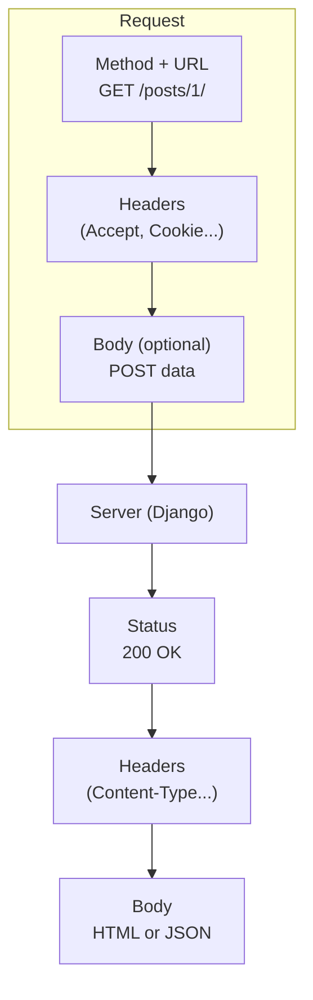

# HTTP: GET, POST and friends

Every conversation between browser and server uses **HTTP** — the protocol of the web.
Understanding its verbs (GET, POST...), status codes and headers is what makes
forms, APIs and the whole of Django make sense.

!!! quote "Think like a child 🧒"
    HTTP is the **way you ask for things** at a restaurant. The **verb** is the intent:
    "I want to see the menu" (GET), "I want to place an order" (POST), "swap my
    order" (PUT), "cancel it" (DELETE). The waiter replies with a **code**: "here
    you go" (200), "couldn't find it" (404), "the kitchen caught fire" (500).

## Anatomy of a request and response



Every exchange has: a **method**, a **URL**, **headers** (metadata) and, sometimes,
a **body** (the data).

## The verbs (methods)

| Verb | Intent | Has a body? | In Django/DRF |
| --- | --- | --- | --- |
| **GET** | Read/fetch | No | List, detail |
| **POST** | Create / submit | Yes | Create, submit a form |
| **PUT** | Replace entirely | Yes | Update (full) |
| **PATCH** | Update partially | Yes | Update (partial) |
| **DELETE** | Remove | No | Delete |
| **HEAD** | Like GET, headers only | No | Check existence |
| **OPTIONS** | Which methods the URL accepts | No | CORS, discovery |

!!! info "GET vs POST: the pair you'll use the most"
    - **GET** — the data goes in the **URL** (`/search/?q=django`). Great for searching and
      filtering: you can share the link, the browser caches it, it shows up in
      history.
    - **POST** — the data goes in the **body** (hidden from the URL). For **creating/changing**
      and submitting forms with sensitive data.

    Think like a child: GET is reading the menu out loud (you can shout it); POST is
    whispering your order into the waiter's ear.

## Safe and idempotent (why it matters)

Think like a child: **safe** = changes nothing (just looking). **Idempotent** =
pressing the button 10 times has the same effect as pressing it once.

| Verb | Safe (changes nothing) | Idempotent (repeat = same) |
| --- | --- | --- |
| GET | ✅ | ✅ |
| PUT | ❌ | ✅ |
| DELETE | ❌ | ✅ |
| POST | ❌ | ❌ |

!!! danger "Why POST isn't idempotent — and the F5 problem"
    Resending a POST creates the resource **again** (two identical orders). That's why,
    after a successful POST, the pattern is to **redirect** (the
    *POST/Redirect/GET* pattern): that way F5 reloads the destination page (a GET), it
    doesn't resend the order. Django does this in CBVs via `success_url`.

## Status codes

Think like a child: the number's **family** tells you the mood. 2xx = it worked, 3xx =
go somewhere else, 4xx = you messed up, 5xx = the server messed up.

| Code | Means | When |
| --- | --- | --- |
| **200** OK | It worked | GET/PUT/PATCH succeeded |
| **201** Created | Created | POST created a resource |
| **204** No Content | Ok, no body | DELETE succeeded |
| **302** Found (redirect) | Go to another URL (temporary) | After a successful POST, login |
| **301** Moved Permanently | Resource moved URL (permanent) | Old URL → new (the browser caches it) |
| **400** Bad Request | Invalid data | Validation failed |
| **401** Unauthorized | Not authenticated | Missing login/token |
| **403** Forbidden | No permission / CSRF | Logged in but no access; CSRF token missing |
| **404** Not Found | Doesn't exist | Nonexistent URL/object |
| **405** Method Not Allowed | Wrong verb | POST on a GET-only route |
| **500** Internal Server Error | Server error | Unhandled exception |

!!! tip "The form's 403 is almost always CSRF"
    Sent a POST and got a **403**? In the overwhelming majority of cases, you're missing the
    `` in the `<form>` (or the `X-CSRFToken` header on `fetch`). See
    [Bringing it together with Django](django-integracao.md).

## Headers

Metadata about the exchange. The ones you'll meet most often:

| Header | Says |
| --- | --- |
| `Content-Type` | The format of the body (`text/html`, `application/json`) |
| `Accept` | The format the client **wants** to receive |
| `Authorization` | Credential (`Bearer <token>` with JWT) |
| `Cookie` / `Set-Cookie` | Session, CSRF, preferences |
| `Location` | Where the 3xx redirects to |
| `Cache-Control` | Whether and for how long it can be cached |

## Where Django exposes all of this

In Django, the request arrives as the `request` object:

```python
request.method            # "GET", "POST"...
request.GET["q"]          # query params (?q=...)
request.POST["title"]     # body data from a form
request.headers["Accept"] # headers
request.COOKIES           # cookies
```

And the view returns a response with a status:

```python
from django.http import HttpResponse, JsonResponse

HttpResponse("ok", status=200)
JsonResponse({"error": "invalid"}, status=400)
```

!!! info "CBVs and DRF already map verbs → methods"
    You rarely write `if request.method == "POST"`. The
    [class-based views](../referencia/views-cbv.md) call `get()`/`post()`
    automatically, and [DRF's viewsets](../advanced/drf.md) map
    GET/POST/PUT/PATCH/DELETE to list/create/update/destroy. Raw HTTP is what
    happens **underneath** — understanding it makes everything else stop being magic.

## Recap

- HTTP is the protocol of the web: every exchange has a **method**, a **URL**, **headers** and
  a **body**.
- Verbs: **GET** (read, data in the URL), **POST** (create/submit, data in the body),
  PUT/PATCH (update), DELETE (remove).
- **Safe** (changes nothing) and **idempotent** (repeat = same); POST is neither
  → use POST/Redirect/GET.
- Status by family: 2xx ok, 3xx redirects, 4xx the client's fault (403 ≈ CSRF),
  5xx the server's fault.
- Django exposes everything in `request` and responds with a status; CBVs/DRF map the
  verbs for you.

!!! quote "📖 In the official docs"
    - [HTTP (MDN)](https://developer.mozilla.org/en-US/docs/Web/HTTP)
    - [HTTP methods (MDN)](https://developer.mozilla.org/en-US/docs/Web/HTTP/Methods)
    - [Status codes (MDN)](https://developer.mozilla.org/en-US/docs/Web/HTTP/Status)

With the protocol clear, let's move on to the structure of pages: **[HTML from scratch](html.md)**.
