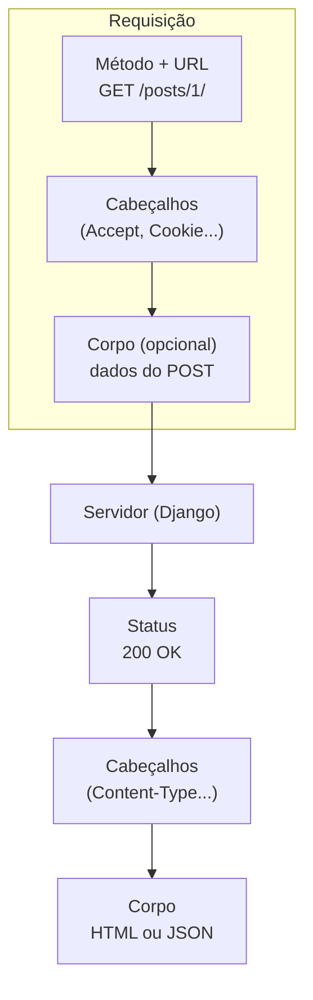

# HTTP: GET, POST e afins

Toda conversa entre navegador e servidor usa o **HTTP** — o protocolo da web.
Entender seus verbos (GET, POST...), códigos de status e cabeçalhos é o que faz
formulários, APIs e o Django inteiro fazerem sentido.

!!! quote "Pensa como criança 🧒"
    HTTP é o **jeito de pedir as coisas** no restaurante. O **verbo** é a intenção:
    "quero ver o cardápio" (GET), "quero fazer um pedido" (POST), "troca meu
    pedido" (PUT), "cancela" (DELETE). O garçom responde com um **código**: "aqui
    está" (200), "não achei" (404), "a cozinha pegou fogo" (500).

## Anatomia de uma requisição e resposta



Cada troca tem: um **método**, uma **URL**, **cabeçalhos** (metadados) e, às
vezes, um **corpo** (os dados).

## Os verbos (métodos)

| Verbo | Intenção | Tem corpo? | No Django/DRF |
| --- | --- | --- | --- |
| **GET** | Ler/buscar | Não | Listar, detalhar |
| **POST** | Criar / enviar | Sim | Criar, submeter formulário |
| **PUT** | Substituir por inteiro | Sim | Atualizar (completo) |
| **PATCH** | Atualizar em parte | Sim | Atualizar (parcial) |
| **DELETE** | Remover | Não | Apagar |
| **HEAD** | Como GET, só cabeçalhos | Não | Checar existência |
| **OPTIONS** | Quais métodos a URL aceita | Não | CORS, descoberta |

!!! info "GET × POST: a dupla que você mais usa"
    - **GET** — os dados vão na **URL** (`/busca/?q=django`). Bom para buscar e
      filtrar: dá para compartilhar o link, o navegador cacheia, aparece no
      histórico.
    - **POST** — os dados vão no **corpo** (escondidos da URL). Para **criar/alterar**
      e enviar formulários com dados sensíveis.

    Pensa como criança: GET é ler o cardápio (pode gritar em voz alta); POST é
    sussurrar seu pedido no ouvido do garçom.

## Seguro e idempotente (por que isso importa)

Pensa como criança: **seguro** = não muda nada (só olhar). **Idempotente** =
apertar o botão 10 vezes tem o mesmo efeito de apertar 1 vez.

| Verbo | Seguro (não muda) | Idempotente (repetir = igual) |
| --- | --- | --- |
| GET | ✅ | ✅ |
| PUT | ❌ | ✅ |
| DELETE | ❌ | ✅ |
| POST | ❌ | ❌ |

!!! danger "Por que POST não é idempotente — e o problema do F5"
    Reenviar um POST cria o recurso **de novo** (dois pedidos iguais). Por isso,
    depois de um POST bem-sucedido, o padrão é **redirecionar** (o
    *POST/Redirect/GET*): assim o F5 recarrega a página de destino (um GET), não
    reenvia o pedido. O Django faz isso nas CBVs via `success_url`.

## Códigos de status

Pensa como criança: a **família** do número diz o clima. 2xx = deu certo, 3xx =
vá para outro lugar, 4xx = você errou, 5xx = o servidor errou.

| Código | Significa | Quando |
| --- | --- | --- |
| **200** OK | Deu certo | GET/PUT/PATCH com sucesso |
| **201** Created | Criado | POST criou um recurso |
| **204** No Content | Ok, sem corpo | DELETE com sucesso |
| **301/302** Redirect | Vá para outra URL | Após POST, login |
| **400** Bad Request | Dados inválidos | Falhou a validação |
| **401** Unauthorized | Não autenticado | Faltou login/token |
| **403** Forbidden | Sem permissão / CSRF | Logado mas sem acesso; token CSRF ausente |
| **404** Not Found | Não existe | URL/objeto inexistente |
| **405** Method Not Allowed | Verbo errado | POST numa rota só-GET |
| **500** Internal Server Error | Erro no servidor | Exceção não tratada |

!!! tip "O 403 do formulário é quase sempre CSRF"
    Enviou um POST e levou **403**? Na esmagadora maioria, faltou o
    `` no `<form>` (ou o cabeçalho `X-CSRFToken` no `fetch`). Ver
    [Juntando com Django](django-integracao.md).

## Cabeçalhos (headers)

Metadados da troca. Os que você mais encontra:

| Cabeçalho | Diz |
| --- | --- |
| `Content-Type` | O formato do corpo (`text/html`, `application/json`) |
| `Accept` | O formato que o cliente **quer** receber |
| `Authorization` | Credencial (`Bearer <token>` no JWT) |
| `Cookie` / `Set-Cookie` | Sessão, CSRF, preferências |
| `Location` | Para onde o 3xx redireciona |
| `Cache-Control` | Se e por quanto tempo pode cachear |

## Onde o Django expõe tudo isso

No Django, a requisição chega como o objeto `request`:

```python
request.method            # "GET", "POST"...
request.GET["q"]          # query params (?q=...)
request.POST["title"]     # dados do corpo de um form
request.headers["Accept"] # cabeçalhos
request.COOKIES           # cookies
```

E a view devolve uma resposta com um status:

```python
from django.http import HttpResponse, JsonResponse

HttpResponse("ok", status=200)
JsonResponse({"erro": "inválido"}, status=400)
```

!!! info "As CBVs e o DRF já mapeiam verbos → métodos"
    Você raramente escreve `if request.method == "POST"`. As
    [views de classe](../referencia/views-cbv.md) chamam `get()`/`post()`
    automaticamente, e os [viewsets do DRF](../advanced/drf.md) mapeiam
    GET/POST/PUT/PATCH/DELETE para list/create/update/destroy. O HTTP cru é o que
    acontece **por baixo** — entendê-lo faz o resto parar de ser mágica.

## Recapitulando

- HTTP é o protocolo da web: cada troca tem **método**, **URL**, **cabeçalhos** e
  **corpo**.
- Verbos: **GET** (ler, dados na URL), **POST** (criar/enviar, dados no corpo),
  PUT/PATCH (atualizar), DELETE (remover).
- **Seguro** (não muda) e **idempotente** (repetir = igual); POST é nenhum dos
  dois → use POST/Redirect/GET.
- Status por família: 2xx ok, 3xx redireciona, 4xx culpa do cliente (403 ≈ CSRF),
  5xx culpa do servidor.
- O Django expõe tudo em `request` e responde com status; CBVs/DRF mapeiam os
  verbos para você.

!!! quote "📖 Na documentação oficial"
    - [HTTP (MDN)](https://developer.mozilla.org/en-US/docs/Web/HTTP)
    - [Métodos HTTP (MDN)](https://developer.mozilla.org/en-US/docs/Web/HTTP/Methods)
    - [Códigos de status (MDN)](https://developer.mozilla.org/en-US/docs/Web/HTTP/Status)

Com o protocolo claro, bora à estrutura das páginas: **[HTML do zero](html.md)**.
