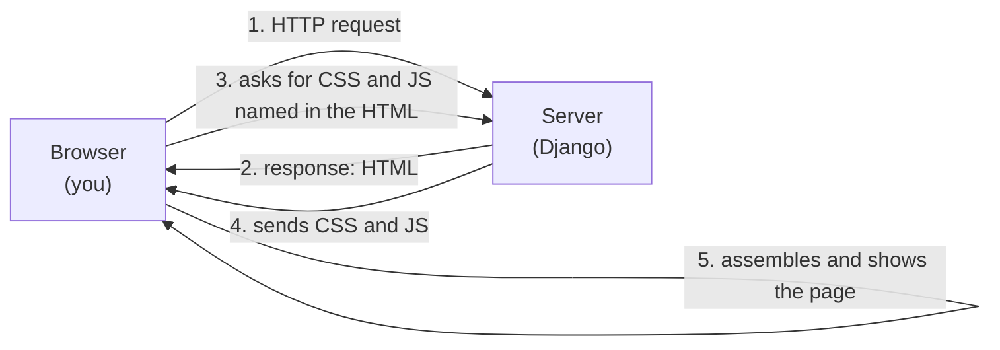

# How the web works

Before HTML, CSS and JS, a map: **what happens when you open a website?**
Understanding this makes everything else click into place — and shows you exactly
where Django fits in.

!!! quote "Think like a child 🧒"
    Asking for a page is like ordering a snack at a restaurant. You (the
    **browser**) place the order. The kitchen (the **server**, where Django lives)
    puts the plate together and sends it back. The plate has three parts: the
    **content** (HTML), the **look** (CSS) and the **tricks at the table**
    (JavaScript). You eat the finished plate.

## The request and the response

1. You type a URL. The browser sends an **HTTP request**.
2. The server responds with an **HTML** document (the content).
3. The HTML names **CSS** and **JS** files; the browser fetches them.
4. The server sends those files (the **statics**).
5. The browser **renders**: it applies the CSS and runs the JS.

!!! info "Where Django is in this story"
    Django is the **kitchen**. It receives the request, decides what to respond
    with and returns the HTML (via [templates](../tutorial/templates.md)). The CSS
    and JS are served as [static files](../referencia/static-media.md). The browser
    does the rest — Django never "runs" in the browser.

## The three languages, one metaphor

Think of a house:

| Language | In the house | On the site |
| --- | --- | --- |
| **HTML** | The structure: walls, rooms, doors | The content and how it's organized |
| **CSS** | The decoration: color, size, where the furniture goes | The look and the layout |
| **JavaScript** | The electricity: switches, doorbell | The behavior and interaction |

A house **without decoration** still works (HTML alone opens). **Without
electricity** too (HTML+CSS show everything, they just don't react). But **without
structure** there's no house — that's why HTML comes first.

## Front-end × back-end

Think like a child: the **dining room** of the restaurant (where you sit and eat)
is the **front-end** — it runs in the browser (HTML/CSS/JS). The **kitchen**
(closed off, where they cook) is the **back-end** — it runs on the server
(Django/Python, database).

| | Front-end | Back-end |
| --- | --- | --- |
| Where it runs | In the browser | On the server |
| Languages | HTML, CSS, JS | Python (Django), SQL |
| Takes care of | Showing and interacting | Data, rules, security |

!!! warning "Never trust the front-end for security"
    Everything that reaches the browser the user can see and change (just press
    F12). Validating the look is front-end work; **validation that matters**
    (permissions, business rules) always lives in the back-end. We'll come back to
    this when we join up with Django.

## What you'll learn in this section

A path from zero, one step per page:

1. **[HTML from scratch](html.md)** — the structure and the content.
2. **[CSS from scratch](css.md)** — colors, text, box, layout, responsive.
3. **[JavaScript from scratch](javascript.md)** — variables, DOM, events, `fetch`.
4. **[Joining up with Django](django-integracao.md)** — templates, statics,
   forms and talking to an API.

!!! tip "For those who already know a bit"
    If you already know HTML/CSS/JS, jump straight to
    **[Joining up with Django](django-integracao.md)** — that's where the
    Django-specific part of integrating the front-end lives.

## Recap

- Opening a website is a **request** (browser) and a **response** (server) over HTTP.
- **HTML** = structure, **CSS** = look, **JS** = behavior — like the structure,
  decoration and electricity of a house.
- The **front-end** runs in the browser; the **back-end** (Django) runs on the
  server. Never trust the front-end for security.
- Django returns the HTML and serves CSS/JS as statics; the browser renders.

Let's build the structure: **[HTML from scratch](html.md)**.
