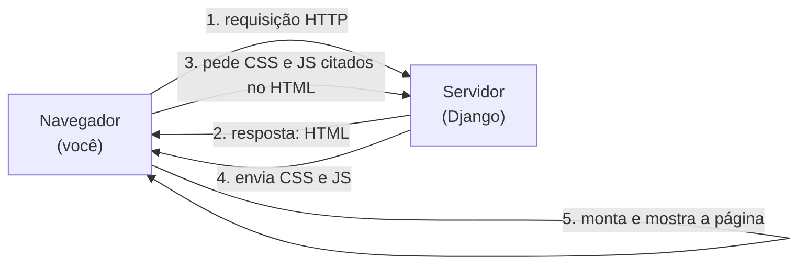

# Como a web funciona

Antes de HTML, CSS e JS, um mapa: **o que acontece quando você abre um site?**
Entender isso faz todo o resto encaixar — e mostra exatamente onde o Django entra.

!!! quote "Pensa como criança 🧒"
    Pedir uma página é como pedir um lanche num restaurante. Você (o **navegador**)
    faz o pedido. A cozinha (o **servidor**, onde mora o Django) monta o prato e
    manda de volta. O prato tem três partes: o **conteúdo** (HTML), a **aparência**
    (CSS) e os **truques na mesa** (JavaScript). Você come o prato montado.

## O pedido e a resposta

1. Você digita uma URL. O navegador manda uma **requisição HTTP**.
2. O servidor responde com um documento **HTML** (o conteúdo).
3. O HTML cita arquivos de **CSS** e **JS**; o navegador os busca.
4. O servidor envia esses arquivos (são os **estáticos**).
5. O navegador **renderiza**: aplica o CSS e roda o JS.

!!! info "Onde o Django está nessa história"
    O Django é a **cozinha**. Ele recebe a requisição, decide o que responder e
    devolve o HTML (via [templates](../tutorial/templates.md)). O CSS e o JS são
    servidos como [arquivos estáticos](../referencia/static-media.md). O navegador
    faz o resto — o Django nunca "roda" no navegador.

## As três linguagens, uma metáfora

Pensa numa casa:

| Linguagem | Na casa | No site |
| --- | --- | --- |
| **HTML** | A estrutura: paredes, cômodos, portas | O conteúdo e sua organização |
| **CSS** | A decoração: cor, tamanho, posição dos móveis | A aparência e o layout |
| **JavaScript** | A eletricidade: interruptores, campainha | O comportamento e a interação |

Uma casa **sem decoração** ainda funciona (HTML sozinho abre). **Sem
eletricidade** também (HTML+CSS mostram tudo, só não reagem). Mas **sem estrutura**
não há casa — por isso o HTML vem primeiro.

## Front-end × back-end

Pensa como criança: o **salão** do restaurante (onde você senta e come) é o
**front-end** — roda no navegador (HTML/CSS/JS). A **cozinha** (fechada, onde
preparam) é o **back-end** — roda no servidor (Django/Python, banco de dados).

| | Front-end | Back-end |
| --- | --- | --- |
| Onde roda | No navegador | No servidor |
| Linguagens | HTML, CSS, JS | Python (Django), SQL |
| Cuida de | Mostrar e interagir | Dados, regras, segurança |

!!! warning "Nunca confie no front-end para segurança"
    Tudo que chega ao navegador o usuário pode ver e alterar (é só apertar F12).
    Validação de aparência é front-end; **validação que importa** (permissão,
    regra de negócio) é sempre no back-end. Voltaremos a isso ao juntar com Django.

## O que você vai aprender nesta seção

Uma trilha do zero, um passo por página:

1. **[HTML do zero](html.md)** — a estrutura e o conteúdo.
2. **[CSS do zero](css.md)** — cores, texto, caixa, layout, responsivo.
3. **[JavaScript do zero](javascript.md)** — variáveis, DOM, eventos, `fetch`.
4. **[Juntando com Django](django-integracao.md)** — templates, estáticos,
   formulários e conversar com uma API.

!!! tip "Para quem já sabe um pouco"
    Se você já manja de HTML/CSS/JS, pule direto para
    **[Juntando com Django](django-integracao.md)** — é lá que mora a parte
    específica de integrar front-end com Django.

## Recapitulando

- Abrir um site é um **pedido** (navegador) e uma **resposta** (servidor) via HTTP.
- **HTML** = estrutura, **CSS** = aparência, **JS** = comportamento — como
  estrutura, decoração e eletricidade de uma casa.
- **Front-end** roda no navegador; **back-end** (Django) roda no servidor. Nunca
  confie no front-end para segurança.
- O Django devolve o HTML e serve CSS/JS como estáticos; o navegador renderiza.

Bora construir a estrutura: **[HTML do zero](html.md)**.
