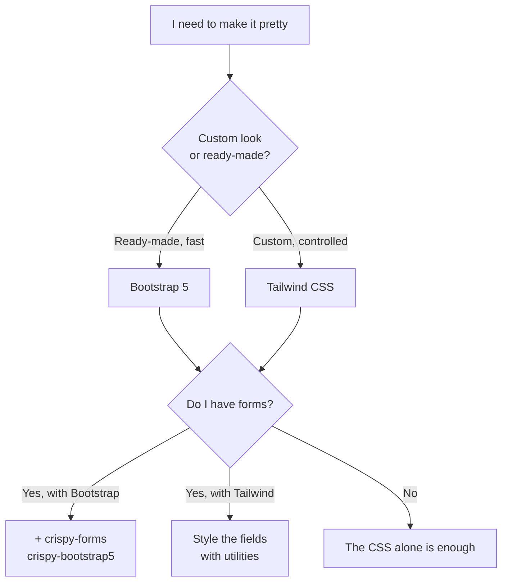

# Making it pretty: Bootstrap, Tailwind and crispy-forms

Your blog works: it lists posts, accepts comments, authenticates people. But it
looks **raw** — Times New Roman, blue links, forms glued to the margin. Time to
dress the application up without rewriting HTML line by line.

!!! quote "Think like a child 🧒"
    Picture a cardboard doll. **Bootstrap** is a box of ready-made outfits: you
    pick the pieces and dress it fast. **Tailwind** is a kit of fabric and
    scissors: you cut each piece exactly the way you want. And **crispy-forms** is
    the sewing machine that dresses the form on its own, without you buttoning up
    field by field.

## Use case

We have the blog's comment form. With no styling it comes out like this:

```django title="blog/post_detail.html (unstyled)"
<form method="post">
  
  {{ form.as_p }}
  <button type="submit">Send</button>
</form>
```

The result is misaligned labels and inputs with no decent border. We want **the
same view and the same form** to look professional — rounded buttons, spaced
fields, error messages in red — touching only the presentation layer. That is
exactly what Bootstrap, Tailwind and crispy-forms solve.

## Possibilities

Three paths, from fastest to most controllable:

| Tool | What it is | When to pick it |
| --- | --- | --- |
| **Bootstrap 5** | Component library with ready-made classes (`btn`, `card`, `row`) | Prototypes, MVP, when you want "pretty and done" without thinking about design |
| **Tailwind CSS** | Low-level utilities (`px-4`, `flex`, `text-gray-700`) | When you want a custom look and fine control, without loose CSS |
| **crispy-forms** | Renders Django forms already carrying your CSS framework's classes | Whenever you have forms — works with Bootstrap or Tailwind |

Let's go piece by piece.

### Bootstrap 5 — the fast path

Bootstrap ships ready-made classes. The simplest way to start is via the **CDN**:
you paste two links into `base.html` and you're done.

```django title="templates/base.html" hl_lines="7 8 20"
<!doctype html>
<html lang="en">
<head>
  <meta charset="utf-8">
  <meta name="viewport" content="width=device-width, initial-scale=1">
  <title>Blog</title>
  <link
    href="https://cdn.jsdelivr.net/npm/bootstrap@5.3.3/dist/css/bootstrap.min.css"
    rel="stylesheet">
</head>
<body>
  <main class="container py-4">
    
  </main>
  <script
    src="https://cdn.jsdelivr.net/npm/bootstrap@5.3.3/dist/js/bootstrap.bundle.min.js">
  </script>
</body>
</html>
```

Now any template that extends `base.html` can already use the classes:

```django title="blog/post_list.html"



  <h1 class="mb-4">Latest posts</h1>
  <div class="row g-3">
    
      <div class="col-md-6">
        <div class="card h-100">
          <div class="card-body">
            <h2 class="card-title h5">
              <a href="{{ post.get_absolute_url }}"
                 class="text-decoration-none">{{ post.title }}</a>
            </h2>
            <p class="card-text text-muted">
              {{ post.body|truncatewords:20 }}
            </p>
          </div>
        </div>
      </div>
    
      <p class="text-muted">No posts yet.</p>
    
  </div>

```

!!! tip "CDN to learn, `static/` for production"
    The CDN is great to start fast, but it depends on an external server and the
    user's connection. In production, **download** `bootstrap.min.css` and serve it
    locally as a [static file](../referencia/organizando-assets.md):

    ```django
    
    <link rel="stylesheet" href="">
    ```

    That way your site works offline, loads faster, and doesn't break if the CDN
    goes down.

!!! warning "Beware of the CDN version"
    Always pin the exact version in the URL (`bootstrap@5.3.3`), never something
    like `@latest`. An automatic Bootstrap update can change classes and break
    your layout without warning.

### Tailwind CSS — full control

Bootstrap gives ready-made components; Tailwind gives **small pieces** you
combine. Instead of `btn btn-primary`, you write `bg-blue-600 text-white px-4 py-2
rounded`. More verbose, but 100% yours.

You have two ways to integrate Tailwind into Django:

=== "django-tailwind (more integrated)"

    The [`django-tailwind`](https://django-tailwind.readthedocs.io/) package
    creates a dedicated app and manages the build for you.

    ```bash
    pip install django-tailwind
    ```

    ```python title="config/settings.py"
    INSTALLED_APPS = [
        # ...
        "tailwind",
        "theme",
    ]

    TAILWIND_APP_NAME = "theme"

    INTERNAL_IPS = ["127.0.0.1"]
    ```

    ```bash
    python manage.py tailwind init
    python manage.py tailwind install
    python manage.py tailwind start
    ```

    In the template, load the app's tags and the generated CSS:

    ```django title="templates/base.html"
    
    <!doctype html>
    <html lang="en">
    <head>
      
    </head>
    <body class="bg-gray-50 text-gray-800">
      
    </body>
    </html>
    ```

=== "Tailwind CLI (lighter)"

    Don't want an extra app? Tailwind's standalone binary reads your templates and
    generates a single `.css`.

    ```bash
    npx tailwindcss -i ./static/src/input.css \
      -o ./static/css/tailwind.css --watch
    ```

    ```css title="static/src/input.css"
    @import "tailwindcss";
    ```

    And in `base.html` you serve the generated file as a normal static file:

    ```django title="templates/base.html"
    
    <link rel="stylesheet" href="">
    ```

!!! info "Tailwind needs to 'see' your templates"
    Tailwind only includes in the final CSS the classes it **finds** in your
    files. If a button loses its styling, it's almost always because the template
    isn't in the list of files Tailwind scans — check the `content` setting or
    keep `--watch` running while you edit.

!!! note "Tailwind requires a build step"
    Unlike Bootstrap via CDN, Tailwind needs a Node process running to generate
    the CSS. More power in exchange for more configuration. If you just want
    "something pretty now", start with Bootstrap.

### crispy-forms — beautiful forms without the pain

`{{ form.as_p }}` produces HTML with no classes at all — ugly in any framework.
[`django-crispy-forms`](https://django-crispy-forms.readthedocs.io/) renders the
form **already carrying** your CSS framework's classes. Install it and the
Bootstrap 5 template pack:

```bash
pip install django-crispy-forms crispy-bootstrap5
```

```python title="config/settings.py"
INSTALLED_APPS = [
    # ...
    "crispy_forms",
    "crispy_bootstrap5",
]

CRISPY_ALLOWED_TEMPLATE_PACKS = "bootstrap5"
CRISPY_TEMPLATE_PACK = "bootstrap5"
```

The simplest use is the `crispy` filter in the template:

```django title="blog/post_detail.html" hl_lines="1 5"


<form method="post">
  
  {{ form|crispy }}
  <button type="submit" class="btn btn-primary">Send</button>
</form>
```

Done: the same `CommentForm` as before now comes out with labels, spacing and
errors already styled by Bootstrap.

#### FormHelper — the button comes along

Want the **form itself** to carry the button and layout, without writing the
`<form>` in the template? Use `FormHelper` in the form definition:

```python title="blog/forms.py"
from crispy_forms.helper import FormHelper
from crispy_forms.layout import Submit
from django import forms

from apps.blog.models import Comment


class CommentForm(forms.ModelForm):
    """Comment form styled with crispy-forms."""

    def __init__(self, *args: object, **kwargs: object) -> None:
        """Attach a FormHelper that renders the form and submit button.

        Args:
            *args: Positional arguments forwarded to the base form.
            **kwargs: Keyword arguments forwarded to the base form.
        """
        super().__init__(*args, **kwargs)
        self.helper = FormHelper()
        self.helper.form_method = "post"
        self.helper.add_input(Submit("submit", "Send comment"))

    class Meta:
        model = Comment
        fields = ["body"]
```

With the helper configured, the whole template becomes one line:

```django title="blog/post_detail.html"



```

The `` tag generates the `<form>`, the ``, the
fields **and** the button — all with Bootstrap classes.

!!! tip "`|crispy` vs ``"
    - The **`{{ form|crispy }}`** filter styles only the **fields**; you keep the
      `<form>` and the button in the template. Good for fine control.
    - The **``** tag uses the `FormHelper` and generates the
      **whole** form. Good for standardizing everything in one place (Python).

!!! warning "crispy-forms pairs with a pack, it doesn't replace the CSS"
    crispy only adds the **classes** (`form-control`, `btn`, etc.). You still need
    to load Bootstrap's CSS in `base.html`. Without Bootstrap, the classes exist
    but nobody paints them.

!!! danger "Use the right pack for your CSS"
    `crispy-bootstrap5` generates Bootstrap 5 classes. If your project uses
    Tailwind, those classes have **no** effect — for Tailwind, style forms with
    utilities or a forms plugin, not with the Bootstrap pack.

### A consistent `base.html` ties it all together

No matter the framework: the secret is having **one** skeleton that every page
extends, so styling, navigation and messages are identical everywhere.

```django title="templates/base.html"

<!doctype html>
<html lang="en">
<head>
  <meta charset="utf-8">
  <meta name="viewport" content="width=device-width, initial-scale=1">
  <title>Blog</title>
  <link rel="stylesheet" href="">
  
</head>
<body class="bg-light">
  <nav class="navbar navbar-expand bg-white border-bottom mb-4">
    <div class="container">
      <a class="navbar-brand" href="">📓 Blog</a>
      
        <form method="post" action="" class="ms-auto">
          
          <button class="btn btn-outline-secondary btn-sm">
            Log out ({{ user.username }})
          </button>
        </form>
      
        <a class="btn btn-primary btn-sm ms-auto" href="">
          Log in
        </a>
      
    </div>
  </nav>

  <main class="container">
    
      
        <div class="alert alert-{{ message.tags }}">{{ message }}</div>
      
    
    
  </main>
</body>
</html>
```

- `logout` is a **POST** (a form with ``) — in Django 6.0
  `LogoutView` only accepts POST, so a plain `<a href>` won't work.
- The `extra_css` block lets specific pages inject their own styling without
  touching the base.
- The `messages` show up styled as Bootstrap `alert`s.

### Which one to choose?



!!! tip "The most common combo to start with"
    Bootstrap 5 (served from `static/`) + crispy-forms with `crispy-bootstrap5`.
    It's the lowest-friction path: decent pages right away and pretty forms
    without writing field HTML. Move to Tailwind when the design demands its own
    identity.

!!! quote "📖 In the official docs"
    - [Bootstrap](https://getbootstrap.com/)
    - [Tailwind CSS](https://tailwindcss.com/)
    - [django-crispy-forms](https://django-crispy-forms.readthedocs.io/)

## Recap

- **Bootstrap 5** gives ready-made components: fast, great for an MVP. Start with
  the CDN, but serve from [`static/`](../referencia/organizando-assets.md) in
  production.
- **Tailwind CSS** gives low-level utilities: a custom look and fine control, at
  the cost of a build step (django-tailwind or the standalone CLI).
- **django-crispy-forms** + **crispy-bootstrap5** style forms on their own: the
  `{{ form|crispy }}` filter for the fields, the `` tag with
  `FormHelper` for the whole form.
- crispy adds **classes**, not the CSS — you still load the framework, and the
  pack must match it (don't use `crispy-bootstrap5` with Tailwind).
- A consistent `base.html` is what ties it all together — every page inherits the
  same styling, navigation and messages. Remember `LogoutView` is POST-only.

Back to the start of the visual path: if you want to understand the foundation
before the frameworks, re-read **[Templates](../tutorial/templates.md)**.
