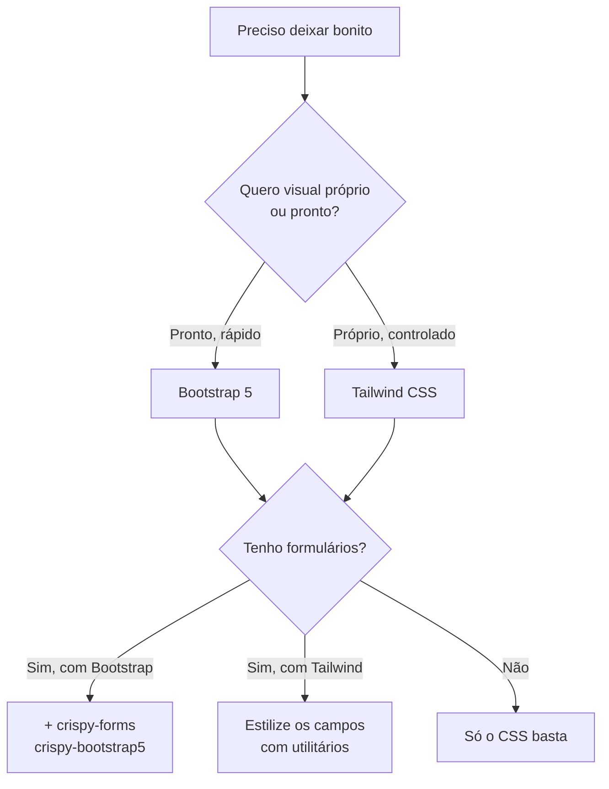

# Deixando bonito: Bootstrap, Tailwind e crispy-forms

Seu blog funciona: lista posts, aceita comentários, autentica gente. Mas está
**cru** — Times New Roman, links azuis, formulários grudados na margem. Chegou a
hora de vestir a aplicação sem reescrever HTML linha por linha.

!!! quote "Pensa como criança 🧒"
    Imagine um boneco de papelão. O **Bootstrap** é uma caixa de roupinhas prontas:
    você escolhe as peças e veste rápido. O **Tailwind** é um estojo de tecido e
    tesoura: você corta cada peça do jeito exato que quer. E o **crispy-forms** é a
    máquina de costura que veste o formulário sozinho, sem você abotoar campo por
    campo.

## Caso de uso

Temos o formulário de comentário do blog. Sem estilo, ele sai assim:

```django title="blog/post_detail.html (sem estilo)"
<form method="post">
  
  {{ form.as_p }}
  <button type="submit">Enviar</button>
</form>
```

O resultado são labels desalinhadas e inputs sem borda decente. Queremos que
**a mesma view e o mesmo formulário** apareçam com cara profissional — botões
arredondados, campos espaçados, mensagens de erro em vermelho — só mexendo na
camada de apresentação. É exatamente isso que Bootstrap, Tailwind e crispy-forms
resolvem.

## Possibilidades

Três caminhos, do mais rápido ao mais controlável:

| Ferramenta | O que é | Quando escolher |
| --- | --- | --- |
| **Bootstrap 5** | Biblioteca de componentes com classes prontas (`btn`, `card`, `row`) | Protótipos, MVP, quando você quer "bonito e pronto" sem pensar em design |
| **Tailwind CSS** | Utilitários de baixo nível (`px-4`, `flex`, `text-gray-700`) | Quando você quer um visual próprio e controle fino, sem CSS solto |
| **crispy-forms** | Renderiza formulários Django já com as classes do seu framework CSS | Sempre que tiver formulários — funciona junto do Bootstrap ou do Tailwind |

Vamos por partes.

### Bootstrap 5 — o caminho rápido

Bootstrap traz classes prontas. A forma mais simples de começar é pela **CDN**:
você cola dois links no `base.html` e pronto.

```django title="templates/base.html" hl_lines="7 8 20"
<!doctype html>
<html lang="pt-br">
<head>
  <meta charset="utf-8">
  <meta name="viewport" content="width=device-width, initial-scale=1">
  <title>Blog</title>
  <link
    href="https://cdn.jsdelivr.net/npm/bootstrap@5.3.3/dist/css/bootstrap.min.css"
    rel="stylesheet">
</head>
<body>
  <main class="container py-4">
    
  </main>
  <script
    src="https://cdn.jsdelivr.net/npm/bootstrap@5.3.3/dist/js/bootstrap.bundle.min.js">
  </script>
</body>
</html>
```

Agora qualquer template que estende o `base.html` já pode usar as classes:

```django title="blog/post_list.html"



  <h1 class="mb-4">Últimos posts</h1>
  <div class="row g-3">
    
      <div class="col-md-6">
        <div class="card h-100">
          <div class="card-body">
            <h2 class="card-title h5">
              <a href="{{ post.get_absolute_url }}"
                 class="text-decoration-none">{{ post.title }}</a>
            </h2>
            <p class="card-text text-muted">
              {{ post.body|truncatewords:20 }}
            </p>
          </div>
        </div>
      </div>
    
      <p class="text-muted">Nenhum post ainda.</p>
    
  </div>

```

!!! tip "CDN para aprender, `static/` para produção"
    A CDN é ótima para começar rápido, mas depende de um servidor externo e da
    conexão do usuário. Em produção, **baixe** o `bootstrap.min.css` e sirva local
    como [estático](../referencia/organizando-assets.md):

    ```django
    
    <link rel="stylesheet" href="">
    ```

    Assim seu site funciona offline, carrega mais rápido e não quebra se a CDN cair.

!!! warning "Cuidado com a versão da CDN"
    Fixe sempre a versão exata na URL (`bootstrap@5.3.3`), nunca algo como
    `@latest`. Uma atualização automática do Bootstrap pode mudar classes e
    quebrar seu layout sem aviso.

### Tailwind CSS — controle total

Bootstrap dá componentes prontos; Tailwind dá **peças pequenas** que você combina.
Em vez de `btn btn-primary`, você escreve `bg-blue-600 text-white px-4 py-2
rounded`. Mais verboso, porém 100% seu.

Você tem dois jeitos de integrar Tailwind ao Django:

=== "django-tailwind (mais integrado)"

    O pacote [`django-tailwind`](https://django-tailwind.readthedocs.io/) cria um
    app dedicado e gerencia o build para você.

    ```bash
    pip install django-tailwind
    ```

    ```python title="config/settings.py"
    INSTALLED_APPS = [
        # ...
        "tailwind",
        "theme",
    ]

    TAILWIND_APP_NAME = "theme"

    INTERNAL_IPS = ["127.0.0.1"]
    ```

    ```bash
    python manage.py tailwind init
    python manage.py tailwind install
    python manage.py tailwind start
    ```

    No template, carregue as tags do app e o CSS gerado:

    ```django title="templates/base.html"
    
    <!doctype html>
    <html lang="pt-br">
    <head>
      
    </head>
    <body class="bg-gray-50 text-gray-800">
      
    </body>
    </html>
    ```

=== "Tailwind CLI (mais leve)"

    Não quer um app extra? O binário standalone do Tailwind lê seus templates e
    gera um único `.css`.

    ```bash
    npx tailwindcss -i ./static/src/input.css \
      -o ./static/css/tailwind.css --watch
    ```

    ```css title="static/src/input.css"
    @import "tailwindcss";
    ```

    E no `base.html` você serve o arquivo gerado como estático normal:

    ```django title="templates/base.html"
    
    <link rel="stylesheet" href="">
    ```

!!! info "Tailwind precisa 'ver' seus templates"
    O Tailwind só inclui no CSS final as classes que **encontra** nos seus
    arquivos. Se um botão sumir de estilo, quase sempre é porque o template não
    está na lista de arquivos que o Tailwind escaneia — confira o `content` da
    configuração ou deixe o `--watch` rodando enquanto você edita.

!!! note "Tailwind exige um passo de build"
    Diferente do Bootstrap por CDN, o Tailwind precisa de um processo Node
    rodando para gerar o CSS. É mais poder em troca de mais configuração. Se você
    quer só "algo bonito agora", comece com Bootstrap.

### crispy-forms — formulários lindos sem sofrer

`{{ form.as_p }}` gera HTML sem classe nenhuma — feio em qualquer framework. O
[`django-crispy-forms`](https://django-crispy-forms.readthedocs.io/) renderiza o
formulário **já com as classes** do seu framework CSS. Instale ele e o pacote de
template do Bootstrap 5:

```bash
pip install django-crispy-forms crispy-bootstrap5
```

```python title="config/settings.py"
INSTALLED_APPS = [
    # ...
    "crispy_forms",
    "crispy_bootstrap5",
]

CRISPY_ALLOWED_TEMPLATE_PACKS = "bootstrap5"
CRISPY_TEMPLATE_PACK = "bootstrap5"
```

O uso mais simples é a tag `crispy` no template:

```django title="blog/post_detail.html" hl_lines="1 5"


<form method="post">
  
  {{ form|crispy }}
  <button type="submit" class="btn btn-primary">Enviar</button>
</form>
```

Pronto: o mesmo `CommentForm` de antes agora sai com labels, espaçamento e erros
já estilizados pelo Bootstrap.

#### FormHelper — o botão vai junto

Quer que o **próprio formulário** carregue o botão e o layout, sem escrever o
`<form>` no template? Use o `FormHelper` na definição do form:

```python title="blog/forms.py"
from crispy_forms.helper import FormHelper
from crispy_forms.layout import Submit
from django import forms

from apps.blog.models import Comment


class CommentForm(forms.ModelForm):
    """Comment form styled with crispy-forms."""

    def __init__(self, *args: object, **kwargs: object) -> None:
        """Attach a FormHelper that renders the form and submit button.

        Args:
            *args: Positional arguments forwarded to the base form.
            **kwargs: Keyword arguments forwarded to the base form.
        """
        super().__init__(*args, **kwargs)
        self.helper = FormHelper()
        self.helper.form_method = "post"
        self.helper.add_input(Submit("submit", "Enviar comentário"))

    class Meta:
        model = Comment
        fields = ["body"]
```

Com o helper configurado, o template inteiro vira uma linha:

```django title="blog/post_detail.html"



```

A tag `` gera o `<form>`, o ``, os campos **e** o
botão — tudo com as classes do Bootstrap.

!!! tip "`|crispy` vs ``"
    - O filtro **`{{ form|crispy }}`** estiliza só os **campos**; você mantém o
      `<form>` e o botão no template. Bom para controle fino.
    - A tag **``** usa o `FormHelper` e gera o formulário
      **inteiro**. Bom para padronizar tudo num lugar só (o Python).

!!! warning "crispy-forms combina com um pack, não substitui o CSS"
    O crispy só adiciona as **classes** (`form-control`, `btn`, etc.). Você ainda
    precisa carregar o CSS do Bootstrap no `base.html`. Sem o Bootstrap, as
    classes existem mas ninguém as pinta.

!!! danger "Use o pack certo para o seu CSS"
    `crispy-bootstrap5` gera classes do Bootstrap 5. Se o seu projeto usa Tailwind,
    essas classes **não** têm efeito — para Tailwind, estilize os formulários com
    utilitários ou um plugin de forms, não com o pack do Bootstrap.

### Um `base.html` consistente amarra tudo

Não importa o framework: o segredo é ter **um** esqueleto que todas as páginas
estendem, para que estilo, navegação e mensagens sejam idênticos em todo lugar.

```django title="templates/base.html"

<!doctype html>
<html lang="pt-br">
<head>
  <meta charset="utf-8">
  <meta name="viewport" content="width=device-width, initial-scale=1">
  <title>Blog</title>
  <link rel="stylesheet" href="">
  
</head>
<body class="bg-light">
  <nav class="navbar navbar-expand bg-white border-bottom mb-4">
    <div class="container">
      <a class="navbar-brand" href="">📓 Blog</a>
      
        <form method="post" action="" class="ms-auto">
          
          <button class="btn btn-outline-secondary btn-sm">
            Sair ({{ user.username }})
          </button>
        </form>
      
        <a class="btn btn-primary btn-sm ms-auto" href="">
          Entrar
        </a>
      
    </div>
  </nav>

  <main class="container">
    
      
        <div class="alert alert-{{ message.tags }}">{{ message }}</div>
      
    
    
  </main>
</body>
</html>
```

- O `logout` é um **POST** (formulário com ``) — no Django 6.0 a
  `LogoutView` só aceita POST, então um `<a href>` simples não funciona.
- O bloco `extra_css` deixa páginas específicas injetarem estilo próprio sem
  tocar no base.
- As `messages` aparecem estilizadas como `alert` do Bootstrap.

### Qual escolher?



!!! tip "A combinação mais comum para começar"
    Bootstrap 5 (servido de `static/`) + crispy-forms com `crispy-bootstrap5`. É o
    caminho de menor atrito: páginas decentes na hora e formulários bonitos sem
    escrever HTML de campo. Migre para Tailwind quando o design pedir identidade
    própria.

!!! quote "📖 Na documentação oficial"
    - [Bootstrap](https://getbootstrap.com/)
    - [Tailwind CSS](https://tailwindcss.com/)
    - [django-crispy-forms](https://django-crispy-forms.readthedocs.io/)

## Recap

- **Bootstrap 5** dá componentes prontos: rápido, ótimo para MVP. Comece pela
  CDN, mas sirva de [`static/`](../referencia/organizando-assets.md) em produção.
- **Tailwind CSS** dá utilitários de baixo nível: visual próprio e controle fino,
  ao custo de um passo de build (django-tailwind ou o CLI standalone).
- **django-crispy-forms** + **crispy-bootstrap5** estilizam formulários sozinhos:
  o filtro `{{ form|crispy }}` para os campos, a tag `` com
  `FormHelper` para o formulário inteiro.
- crispy adiciona **classes**, não o CSS — você ainda carrega o framework, e o
  pack precisa combinar com ele (não use `crispy-bootstrap5` com Tailwind).
- Um `base.html` consistente é o que amarra tudo — todas as páginas herdam o
  mesmo estilo, navegação e mensagens. Lembre que a `LogoutView` é POST-only.

Voltando ao começo do caminho visual: se você quer entender a base antes dos
frameworks, releia **[Templates](../tutorial/templates.md)**.
