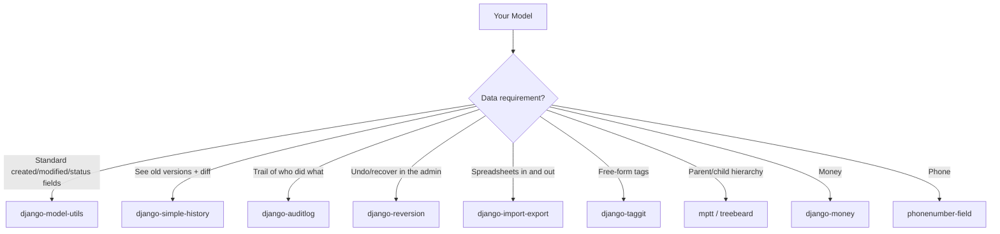

# Data libraries: history, audit, import-export, tags and trees

Back to the [ecosystem map](index.md): allauth handles login, Celery handles
tasks, Channels handles real time. This page is the catalog of libraries that
touch the **data layer** — how you store, version, audit, import and organize
your models. They are pieces you snap in when a requirement shows up ("I need to
know who changed this record", "I want to export to Excel", "categories have
subcategories").

!!! quote "Think like a child 🧒"
    Picture a **sketchbook**. On its own it keeps today's drawing. But sometimes
    you want more: a **tracing sheet** that records every version you made
    (history), a **stamp** telling who touched it and when (audit), a **magic
    eraser** that undoes back to yesterday's drawing (reversion), **colored
    labels** to group things (tags) and a **family tree** showing who is whose
    child (trees). Each library on this page is one of those extra sheets you
    glue into the sketchbook.

## Use case

You have a blog (the `example/` project, with `Post`, `Author`, `Tag`,
`Comment`). The editor-in-chief walks in with requests that plain Django does
not solve on its own:

- "Every model should have `created` and `modified` without me typing it again."
- "When someone edits a `Post`, I want to see **what changed and who changed it**."
- "If an intern deletes a post, I want to **restore** it with one click."
- "I need to **import** 500 posts from a spreadsheet and **export** the report."
- "Tags must be **free-form** (the author types them) and reusable."
- "Categories become **subcategories** — I want to walk the tree fast."

Each request is solved by a mature community library. On to the catalog.

## Possibilities

### Summary table

| Library | Category | What for |
| --- | --- | --- |
| [django-model-utils](https://github.com/jazzband/django-model-utils) | Model helpers | `TimeStampedModel`, `StatusField`, `InheritanceManager` |
| [django-simple-history](https://github.com/jazzband/django-simple-history) | History | Shadow table with every version of the record |
| [django-auditlog](https://github.com/jazzband/django-auditlog) | Audit | Generic create/update/delete log (who, when, what) |
| [django-reversion](https://github.com/etianen/django-reversion) | Version/undo | Snapshots with rollback from the admin |
| [django-import-export](https://github.com/django-import-export/django-import-export) | Import/Export | CSV/XLSX/JSON via admin or code |
| [django-taggit](https://github.com/jazzband/django-taggit) | Tags | Free-form reusable tags (`TaggableManager`) |
| [django-mptt](https://github.com/django-mptt/django-mptt) | Trees | Hierarchies with MPTT (fast reads) |
| [django-treebeard](https://github.com/django-treebeard/django-treebeard) | Trees | Hierarchies (MP/NS/AL) — used by the Django admin |
| [django-money](https://github.com/django-money/django-money) | Special field | Amount + currency (`MoneyField`) |
| [django-phonenumber-field](https://github.com/stefanfoulis/django-phonenumber-field) | Special field | Validated international phone (E.164) |

!!! tip "The catalog's golden rule"
    Don't install them all at once. Each dependency is maintenance. Add a library
    **when the requirement arrives** — and confirm on GitHub that it has recent
    commits and declared compatibility with Django 6.0.

### django-model-utils — the fields you always rewrite

**What:** a kit of mixins and fields you would end up copying from project to
project: `TimeStampedModel` (gives `created`/`modified` for free), `StatusField`
+ `Choices` (readable status with transitions), `MonitorField` (records when a
field changed) and `InheritanceManager` (fetches subclasses without N+1).

**Why:** stop repeating `created = DateTimeField(auto_now_add=True)` in every
model and get a manager that resolves concrete-table inheritance.

```bash
uv add django-model-utils
```

```python
from django.db import models
from model_utils import Choices
from model_utils.fields import MonitorField, StatusField
from model_utils.managers import InheritanceManager
from model_utils.models import TimeStampedModel


class Post(TimeStampedModel):
    """A blog post that tracks creation, update and publication time."""

    STATUS = Choices("draft", "published", "archived")

    title: str = models.CharField(max_length=200)
    status: str = models.CharField(max_length=20, choices=STATUS, default=STATUS.draft)
    published_at = MonitorField(monitor="status", when=["published"])


class Content(models.Model):
    """Base content type queried polymorphically via InheritanceManager."""

    objects = InheritanceManager()


class VideoContent(Content):
    """A concrete subclass returned by select_subclasses()."""

    duration_seconds: int = models.PositiveIntegerField(default=0)
```

`TimeStampedModel` already provides `created` and `modified`. `MonitorField`
records the moment `status` became `"published"`. And the manager resolves
subclasses:

```python
for item in Content.objects.select_subclasses():
    print(type(item).__name__)
```

!!! note "It's just inheritance and mixins"
    `django-model-utils` creates no tables of its own and no middleware. They are
    utility classes — the lowest maintenance cost in the catalog.

### django-simple-history — the tracing sheet

**What:** creates a **shadow table** (`historical<model>`) that stores one row
per version of the record, with `history_date`, `history_type` (`+`/`~`/`-`)
and, if you enable the middleware, `history_user`.

**Why:** you want the **diff over time** — see how the `Post` looked last week,
who changed what. It's the go-to for "change history".

```bash
uv add django-simple-history
```

```python
INSTALLED_APPS = ["simple_history", ...]
MIDDLEWARE = [..., "simple_history.middleware.HistoryRequestMiddleware"]
```

```python
from django.db import models
from simple_history.models import HistoricalRecords


class Post(models.Model):
    """A post whose every change is snapshotted into a shadow table."""

    title: str = models.CharField(max_length=200)
    body: str = models.TextField()
    history = HistoricalRecords()
```

```bash
python manage.py makemigrations
python manage.py migrate
```

Querying the history:

```python
post = Post.objects.get(pk=1)
for record in post.history.all():
    print(record.history_date, record.history_type, record.history_user, record.title)

previous = post.history.first().prev_record
if previous:
    delta = post.history.first().diff_against(previous)
    for change in delta.changes:
        print(change.field, change.old, "->", change.new)
```

!!! warning "The shadow table grows"
    Every change becomes an extra row. On very busy models, schedule a cleanup
    (`python manage.py clean_duplicate_history` and retention policies) so the
    table does not blow up.

### django-auditlog — the stamp of who touched it

**What:** a **generic log** (a single `LogEntry` table) that records
create/update/delete of any registered model, with the actor, the timestamp and
the JSON of the changes. It uses a `GenericForeignKey`, so one place holds
everything.

**Why:** when the focus is **security/compliance auditing** ("who deleted
this?") more than reconstructing old versions. It's lighter than simple-history
because it doesn't create a table per model.

```bash
uv add django-auditlog
```

```python
INSTALLED_APPS = ["auditlog", ...]
MIDDLEWARE = [..., "auditlog.middleware.AuditlogMiddleware"]
```

```python
from auditlog.registry import auditlog
from django.db import models


class Post(models.Model):
    """A post whose CRUD operations are recorded in the global audit log."""

    title: str = models.CharField(max_length=200)
    body: str = models.TextField()


auditlog.register(Post)
```

```python
from auditlog.models import LogEntry

for entry in LogEntry.objects.get_for_object(post):
    print(entry.timestamp, entry.actor, entry.action, entry.changes_dict)
```

!!! tip "simple-history vs auditlog — which one?"
    Use **simple-history** when you want to **reconstruct versions** and show
    rich diffs per model. Use **auditlog** when you want a **single trail** of
    "who did what" across all models, without a table per model. They can
    coexist, but you usually pick one.

### django-reversion — the magic eraser (undo in the admin)

**What:** stores **snapshots** (versions) of an object and its relations and lets
you **revert** or even **recover deleted objects** right in the Django admin.

**Why:** when you need a "go back to yesterday's version" button with a ready-made
UI — typical of CMSs and admin dashboards.

```bash
uv add django-reversion
```

```python
INSTALLED_APPS = ["reversion", ...]
```

```python
from django.contrib import admin
from reversion.admin import VersionAdmin

from blog.models import Post


@admin.register(Post)
class PostAdmin(VersionAdmin):
    """Admin that stores a version on every save and enables recover/revert."""
```

Versioning outside the admin:

```python
import reversion

with reversion.create_revision():
    post.title = "New title"
    post.save()
    reversion.set_comment("Fixed the title")
```

```python
from reversion.models import Version

for version in Version.objects.get_for_object(post):
    print(version.revision.date_created, version.revision.comment)
```

!!! note "reversion vs history — different focus"
    `simple-history` is **observational** (records and shows). `reversion` is
    **actionable** (revert/recover from the admin UI). If the request is "undo
    button in the admin", it's reversion.

### django-import-export — the bridge to spreadsheets

**What:** imports and exports data in **CSV, XLSX, JSON, YAML** and more, both by
**code** and via **buttons in the admin**, with a preview and row-by-row
validation before writing.

**Why:** the classic "I got a spreadsheet from the client" and "I need to export
this month's report". It does the heavy lifting of parsing and dry-run.

```bash
uv add django-import-export
```

```python
INSTALLED_APPS = ["import_export", ...]
```

```python
from import_export import resources
from import_export.admin import ImportExportModelAdmin
from django.contrib import admin

from blog.models import Post


class PostResource(resources.ModelResource):
    """Declares which fields of Post are imported/exported."""

    class Meta:
        model = Post
        fields = ("id", "title", "status")


@admin.register(Post)
class PostAdmin(ImportExportModelAdmin):
    """Adds Import and Export buttons to the Post admin page."""

    resource_classes = [PostResource]
```

Exporting in code (no admin):

```python
dataset = PostResource().export()
with open("posts.csv", "w", encoding="utf-8") as file:
    file.write(dataset.csv)
```

!!! info "XLSX needs an extra"
    CSV/JSON work out of the box. For Excel, install the format:
    `uv add "django-import-export[xlsx]"` (brings `tablib` with XLSX support).

### django-taggit — the colored labels

**What:** a system of **free-form, reusable tags**. You add a `TaggableManager`
to the model and get `add`/`remove`/`set`/`filter` without building the tag
tables by hand.

**Why:** the `Tag` in the `example/` project works, but taggit already delivers
the many-to-many relationship, normalization and tag lookups ready to go.

```bash
uv add django-taggit
```

```python
INSTALLED_APPS = ["taggit", ...]
```

```python
from django.db import models
from taggit.managers import TaggableManager


class Post(models.Model):
    """A post with free-form, reusable tags."""

    title: str = models.CharField(max_length=200)
    tags = TaggableManager()
```

```python
post.tags.add("django", "orm", "tutorial")
post.tags.all()

Post.objects.filter(tags__name__in=["django"]).distinct()
```

!!! tip "Prefetch in listings"
    When listing posts with tags, use `Post.objects.prefetch_related("tags")` so
    you don't fall into the [N+1](../referencia/querysets-api.md) when accessing
    `post.tags.all()` on each row.

### django-mptt / django-treebeard — the trees

**What:** two libraries for **hierarchies** (category → subcategory, nested
comments, menus). They store the tree in a way that reads ("give me the whole
subtree") stay fast without recursive queries.

**Why:** a pure parent/child relation (`parent = ForeignKey("self")`) forces one
query per level to walk down the tree. These libraries pre-compute the structure.

**django-mptt** uses the MPTT algorithm (`lft`/`rght` fields): very fast reads,
more expensive writes.

```bash
uv add django-mptt
```

```python
from django.db import models
from mptt.models import MPTTModel, TreeForeignKey


class Category(MPTTModel):
    """A category node in an MPTT tree."""

    name: str = models.CharField(max_length=100)
    parent = TreeForeignKey(
        "self",
        on_delete=models.CASCADE,
        null=True,
        blank=True,
        related_name="children",
    )

    class MPTTMeta:
        order_insertion_by = ["name"]
```

```python
root = Category.objects.get(name="Technology")
root.get_descendants(include_self=True)
root.get_ancestors()
```

**django-treebeard** offers three strategies (Materialized Path, Nested Sets,
Adjacency List) and is the tree library the **Django admin itself uses
internally** — it tends to be the current recommendation for new projects.

```bash
uv add django-treebeard
```

```python
from django.db import models
from treebeard.mp_tree import MP_Node


class Category(MP_Node):
    """A category node stored with the Materialized Path strategy."""

    name: str = models.CharField(max_length=100)

    node_order_by = ["name"]
```

```python
root = Category.add_root(name="Technology")
child = root.add_child(name="Django")
root.get_descendants()
```

!!! tip "mptt or treebeard?"
    For **new projects**, prefer **treebeard** (`MP_Node`): active maintenance,
    flexible strategies, and it's what Django uses under the hood. **mptt** is
    still great and very widespread, but pick it knowing its evolution is slower.

!!! warning "A tree is not just ForeignKey('self')"
    A raw `parent = ForeignKey("self")` handles simple cases, but walking down
    the tree becomes N+1. Only switch to mptt/treebeard when the hierarchy is
    **deep and read often** — otherwise, `ForeignKey("self")` is enough.

### django-money — money is amount + currency

**What:** a `MoneyField` that stores **amount and currency together** (using the
`py-moneyed` library underneath), with correct arithmetic and conversion.

**Why:** storing a price as a bare `DecimalField` loses the currency and invites
adding reais to dollars. `MoneyField` carries the unit.

```bash
uv add django-money
```

```python
INSTALLED_APPS = ["djmoney", ...]
```

```python
from django.db import models
from djmoney.models.fields import MoneyField


class Product(models.Model):
    """A product whose price carries both amount and currency."""

    name: str = models.CharField(max_length=100)
    price = MoneyField(max_digits=14, decimal_places=2, default_currency="BRL")
```

```python
from djmoney.money import Money

product = Product(name="Course", price=Money(199, "BRL"))
product.price + Money(50, "BRL")
```

!!! danger "Never add different currencies without converting"
    `Money(10, "USD") + Money(10, "BRL")` raises an error — and that's good. Add
    only what's in the same currency; to convert, use `djmoney`'s exchange rates.

### django-phonenumber-field — a truly validated phone

**What:** a `PhoneNumberField` that validates and normalizes phone numbers into
the international **E.164** format (`+5511999999999`), backed by Google's
`phonenumbers` library.

**Why:** a `CharField` accepts `"call me"`. This field guarantees the number
exists in that country and stores it in a single format, easy to compare and to
send SMS.

```bash
uv add "django-phonenumber-field[phonenumbers]"
```

```python
from django.db import models
from phonenumber_field.modelfields import PhoneNumberField


class Author(models.Model):
    """An author with a validated international phone number."""

    name: str = models.CharField(max_length=100)
    phone = PhoneNumberField(region="BR", blank=True)
```

```python
author = Author(name="Ana", phone="+55 11 99999-9999")
author.full_clean()
str(author.phone)
author.phone.as_e164
```

!!! note "Choose the backend"
    The `[phonenumbers]` extra uses Google's full dataset (more accurate,
    heavier). There's also `[phonenumberslite]` (smaller dataset) — pick
    according to whether deploy size matters to you.

### How these roles fit together



!!! quote "📖 In the official docs"
    - Package directory: <https://djangopackages.org/>
    - django-model-utils: <https://github.com/jazzband/django-model-utils>
    - django-simple-history: <https://github.com/jazzband/django-simple-history>
    - django-auditlog: <https://github.com/jazzband/django-auditlog>
    - django-reversion: <https://github.com/etianen/django-reversion>
    - django-import-export: <https://github.com/django-import-export/django-import-export>
    - django-taggit: <https://github.com/jazzband/django-taggit>
    - django-mptt: <https://github.com/django-mptt/django-mptt>
    - django-treebeard: <https://github.com/django-treebeard/django-treebeard>
    - django-money: <https://github.com/django-money/django-money>
    - django-phonenumber-field: <https://github.com/stefanfoulis/django-phonenumber-field>

## Recap

- **Model helpers**: `django-model-utils` gives `TimeStampedModel`, `StatusField`
  + `Choices`, `MonitorField` and `InheritanceManager` — stop rewriting fields.
- **History**: `django-simple-history` creates a shadow table with per-version diffs.
- **Audit**: `django-auditlog` keeps a single trail of create/update/delete.
- **Undo**: `django-reversion` stores snapshots and reverts/recovers from the admin.
- **Spreadsheets**: `django-import-export` imports/exports CSV/XLSX/JSON (admin or code).
- **Tags**: `django-taggit` gives free-form reusable tags (`TaggableManager`);
  use `prefetch_related` to avoid the N+1.
- **Trees**: `django-mptt` and `django-treebeard` for hierarchies — prefer
  **treebeard** for new projects; only swap `ForeignKey("self")` when the tree is
  deep and read often.
- **Special fields**: `django-money` (amount + currency) and
  `django-phonenumber-field` (validated E.164 phone).
- Golden rule: install **on demand** and check maintenance/compatibility on
  GitHub before adding.

Back to the library map: **[ecosystem index](index.md)**.
