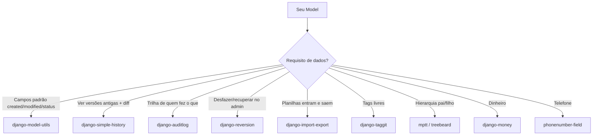

# Libs de dados: historico, auditoria, import-export, tags e arvores

Voltando ao [mapa do ecossistema](index.md): allauth cuida do login, Celery das
tarefas, Channels do tempo real. Esta página é o catálogo das bibliotecas que
mexem na **camada de dados** — o jeito de guardar, versionar, auditar, importar
e organizar os seus models. São peças que você encaixa quando o requisito
aparece ("preciso saber quem mudou este registro", "quero exportar em Excel",
"categorias têm subcategorias").

!!! quote "Pensa como criança 🧒"
    Imagina um **caderno de desenhos**. Sozinho ele guarda o desenho de hoje.
    Mas às vezes você quer mais: uma **folha de decalque** que registra cada
    versão que você fez (histórico), um **carimbo** dizendo quem mexeu e quando
    (auditoria), uma **borracha mágica** que desfaz até o desenho de ontem
    (reversão), **etiquetas coloridas** para agrupar (tags) e uma **árvore
    genealógica** que mostra quem é filho de quem (árvores). Cada lib desta
    página é uma dessas folhas extras que você cola no caderno.

## Caso de uso

Você tem um blog (o projeto `example/`, com `Post`, `Author`, `Tag`,
`Comment`). O editor-chefe chega com pedidos que o Django puro não resolve
sozinho:

- "Todo model deveria ter `created` e `modified` sem eu digitar de novo."
- "Quando alguém editar um `Post`, quero ver **o que mudou e quem mudou**."
- "Se um estagiário apagar um post, quero **restaurar** com um clique."
- "Preciso **importar** 500 posts de uma planilha e **exportar** o relatório."
- "As tags têm que ser **livres** (o autor digita) e reaproveitáveis."
- "Categorias viram **subcategorias** — quero navegar a árvore rápido."

Cada pedido é resolvido por uma lib madura da comunidade. Vamos ao catálogo.

## Possibilidades

### Tabela-resumo

| Biblioteca | Categoria | Para quê |
| --- | --- | --- |
| [django-model-utils](https://github.com/jazzband/django-model-utils) | Helpers de model | `TimeStampedModel`, `StatusField`, `InheritanceManager` |
| [django-simple-history](https://github.com/jazzband/django-simple-history) | Histórico | Tabela-sombra com cada versão do registro |
| [django-auditlog](https://github.com/jazzband/django-auditlog) | Auditoria | Log genérico de create/update/delete (quem, quando, o quê) |
| [django-reversion](https://github.com/etianen/django-reversion) | Versão/desfazer | Snapshots com rollback pelo admin |
| [django-import-export](https://github.com/django-import-export/django-import-export) | Import/Export | CSV/XLSX/JSON via admin ou código |
| [django-taggit](https://github.com/jazzband/django-taggit) | Tags | Tags livres reaproveitáveis (`TaggableManager`) |
| [django-mptt](https://github.com/django-mptt/django-mptt) | Árvores | Hierarquias com MPTT (leitura rápida) |
| [django-treebeard](https://github.com/django-treebeard/django-treebeard) | Árvores | Hierarquias (MP/NS/AL) — recomendado pelo admin do Django |
| [django-money](https://github.com/django-money/django-money) | Campo especial | Valor + moeda (`MoneyField`) |
| [django-phonenumber-field](https://github.com/stefanfoulis/django-phonenumber-field) | Campo especial | Telefone validado internacional (E.164) |

!!! tip "Regra de ouro do catálogo"
    Não instale todas de uma vez. Cada dependência é manutenção. Adicione a lib
    **quando o requisito chegar** — e confirme no GitHub se ela tem commits
    recentes e compatibilidade declarada com o Django 6.0.

### django-model-utils — os campos que você sempre reescreve

**O quê:** um kit de mixins e campos que você acabaria copiando de projeto em
projeto: `TimeStampedModel` (dá `created`/`modified` de graça), `StatusField` +
`Choices` (status legível com transições), `MonitorField` (guarda quando um
campo mudou) e `InheritanceManager` (busca subclasses sem N+1).

**Por quê:** para de repetir `created = DateTimeField(auto_now_add=True)` em todo
model e ganha um manager que resolve herança de tabela concreta.

```bash
uv add django-model-utils
```

```python
from django.db import models
from model_utils import Choices
from model_utils.fields import MonitorField, StatusField
from model_utils.managers import InheritanceManager
from model_utils.models import TimeStampedModel


class Post(TimeStampedModel):
    """A blog post that tracks creation, update and publication time."""

    STATUS = Choices("draft", "published", "archived")

    title: str = models.CharField(max_length=200)
    status: str = models.CharField(max_length=20, choices=STATUS, default=STATUS.draft)
    published_at = MonitorField(monitor="status", when=["published"])


class Content(models.Model):
    """Base content type queried polymorphically via InheritanceManager."""

    objects = InheritanceManager()


class VideoContent(Content):
    """A concrete subclass returned by select_subclasses()."""

    duration_seconds: int = models.PositiveIntegerField(default=0)
```

`TimeStampedModel` já traz `created` e `modified`. `MonitorField` grava o
instante em que `status` virou `"published"`. E o manager resolve subclasses:

```python
for item in Content.objects.select_subclasses():
    print(type(item).__name__)
```

!!! note "É só herança e mixins"
    `django-model-utils` não cria tabelas próprias nem middleware. São classes
    utilitárias — o custo de manutenção é o menor do catálogo.

### django-simple-history — a folha de decalque

**O quê:** cria uma **tabela-sombra** (`historical<model>`) que guarda uma linha
para cada versão do registro, com `history_date`, `history_type` (`+`/`~`/`-`) e,
se você ligar o middleware, `history_user`.

**Por quê:** você quer o **diff no tempo** — ver como o `Post` estava semana
passada, quem mudou o quê. É o padrão para "histórico de alterações".

```bash
uv add django-simple-history
```

```python
INSTALLED_APPS = ["simple_history", ...]
MIDDLEWARE = [..., "simple_history.middleware.HistoryRequestMiddleware"]
```

```python
from django.db import models
from simple_history.models import HistoricalRecords


class Post(models.Model):
    """A post whose every change is snapshotted into a shadow table."""

    title: str = models.CharField(max_length=200)
    body: str = models.TextField()
    history = HistoricalRecords()
```

```bash
python manage.py makemigrations
python manage.py migrate
```

Consultando o histórico:

```python
post = Post.objects.get(pk=1)
for record in post.history.all():
    print(record.history_date, record.history_type, record.history_user, record.title)

previous = post.history.first().prev_record
if previous:
    delta = post.history.first().diff_against(previous)
    for change in delta.changes:
        print(change.field, change.old, "->", change.new)
```

!!! warning "A tabela-sombra cresce"
    Cada alteração vira uma linha extra. Em models muito movimentados, agende
    uma limpeza (`python manage.py clean_duplicate_history` e políticas de
    retenção) para a tabela não explodir.

### django-auditlog — o carimbo de quem mexeu

**O quê:** um **log genérico** (uma única tabela `LogEntry`) que registra
create/update/delete de qualquer model registrado, com o ator, o timestamp e o
JSON das mudanças. Usa `GenericForeignKey`, então um só lugar guarda tudo.

**Por quê:** quando o foco é **auditoria de segurança/conformidade** ("quem
apagou isso?") mais do que reconstruir versões antigas. É mais leve que o
simple-history porque não cria uma tabela por model.

```bash
uv add django-auditlog
```

```python
INSTALLED_APPS = ["auditlog", ...]
MIDDLEWARE = [..., "auditlog.middleware.AuditlogMiddleware"]
```

```python
from auditlog.registry import auditlog
from django.db import models


class Post(models.Model):
    """A post whose CRUD operations are recorded in the global audit log."""

    title: str = models.CharField(max_length=200)
    body: str = models.TextField()


auditlog.register(Post)
```

```python
from auditlog.models import LogEntry

for entry in LogEntry.objects.get_for_object(post):
    print(entry.timestamp, entry.actor, entry.action, entry.changes_dict)
```

!!! tip "simple-history x auditlog — qual escolher?"
    Use **simple-history** quando quiser **reconstruir versões** e mostrar diffs
    ricos por model. Use **auditlog** quando quiser um **trilha única** de "quem
    fez o quê" para todos os models, sem uma tabela por model. Dá para conviver,
    mas geralmente você escolhe um.

### django-reversion — a borracha mágica (desfazer no admin)

**O quê:** guarda **snapshots** (versões) de um objeto e suas relações e permite
**reverter** ou até **recuperar objetos deletados** direto no admin do Django.

**Por quê:** quando você precisa de um botão "voltar para a versão de ontem" com
interface pronta — típico de CMS e painéis administrativos.

```bash
uv add django-reversion
```

```python
INSTALLED_APPS = ["reversion", ...]
```

```python
from django.contrib import admin
from reversion.admin import VersionAdmin

from blog.models import Post


@admin.register(Post)
class PostAdmin(VersionAdmin):
    """Admin that stores a version on every save and enables recover/revert."""
```

Versionando fora do admin:

```python
import reversion

with reversion.create_revision():
    post.title = "Novo título"
    post.save()
    reversion.set_comment("Corrigiu o título")
```

```python
from reversion.models import Version

for version in Version.objects.get_for_object(post):
    print(version.revision.date_created, version.revision.comment)
```

!!! note "reversion x history — foco diferente"
    `simple-history` é **observacional** (registra e mostra). `reversion` é
    **acionável** (reverter/recuperar pela UI do admin). Se o pedido é "botão de
    desfazer no admin", é reversion.

### django-import-export — a ponte com planilhas

**O quê:** importa e exporta dados em **CSV, XLSX, JSON, YAML** e outros, tanto
por **código** quanto por **botões no admin**, com pré-visualização e validação
linha a linha antes de gravar.

**Por quê:** o clássico "recebi uma planilha do cliente" e "preciso exportar o
relatório do mês". Faz o trabalho pesado de parsing e dry-run.

```bash
uv add django-import-export
```

```python
INSTALLED_APPS = ["import_export", ...]
```

```python
from import_export import resources
from import_export.admin import ImportExportModelAdmin
from django.contrib import admin

from blog.models import Post


class PostResource(resources.ModelResource):
    """Declares which fields of Post are imported/exported."""

    class Meta:
        model = Post
        fields = ("id", "title", "status")


@admin.register(Post)
class PostAdmin(ImportExportModelAdmin):
    """Adds Import and Export buttons to the Post admin page."""

    resource_classes = [PostResource]
```

Exportando em código (sem admin):

```python
dataset = PostResource().export()
with open("posts.csv", "w", encoding="utf-8") as file:
    file.write(dataset.csv)
```

!!! info "XLSX pede um extra"
    CSV/JSON funcionam de imediato. Para Excel, instale o formato:
    `uv add "django-import-export[xlsx]"` (traz o `tablib` com suporte a XLSX).

### django-taggit — as etiquetas coloridas

**O quê:** um sistema de **tags livres** reaproveitáveis. Você adiciona um
`TaggableManager` ao model e ganha `add`/`remove`/`set`/`filter` sem criar as
tabelas de tag na mão.

**Por quê:** o `Tag` do projeto `example/` funciona, mas taggit já entrega o
relacionamento many-to-many, a normalização e a busca por tag prontos.

```bash
uv add django-taggit
```

```python
INSTALLED_APPS = ["taggit", ...]
```

```python
from django.db import models
from taggit.managers import TaggableManager


class Post(models.Model):
    """A post with free-form, reusable tags."""

    title: str = models.CharField(max_length=200)
    tags = TaggableManager()
```

```python
post.tags.add("django", "orm", "tutorial")
post.tags.all()

Post.objects.filter(tags__name__in=["django"]).distinct()
```

!!! tip "Prefetch nas listagens"
    Ao listar posts com tags, use `Post.objects.prefetch_related("tags")` para
    não cair no [N+1](../referencia/querysets-api.md) ao acessar `post.tags.all()`
    em cada linha.

### django-mptt / django-treebeard — as árvores

**O quê:** duas libs para **hierarquias** (categoria → subcategoria, comentários
aninhados, menus). Guardam a árvore de um jeito que a leitura ("me dá toda a
subárvore") fica rápida sem consultas recursivas.

**Por quê:** relação pai/filho pura (`parent = ForeignKey("self")`) força uma
query por nível para descer a árvore. Essas libs pré-calculam a estrutura.

**django-mptt** usa o algoritmo MPTT (campos `lft`/`rght`): leitura muito
rápida, escrita mais cara.

```bash
uv add django-mptt
```

```python
from django.db import models
from mptt.models import MPTTModel, TreeForeignKey


class Category(MPTTModel):
    """A category node in an MPTT tree."""

    name: str = models.CharField(max_length=100)
    parent = TreeForeignKey(
        "self",
        on_delete=models.CASCADE,
        null=True,
        blank=True,
        related_name="children",
    )

    class MPTTMeta:
        order_insertion_by = ["name"]
```

```python
root = Category.objects.get(name="Tecnologia")
root.get_descendants(include_self=True)
root.get_ancestors()
```

**django-treebeard** oferece três estratégias (Materialized Path, Nested Sets,
Adjacency List) e é a lib de árvore que o **próprio admin do Django usa
internamente** — costuma ser a recomendação atual para projetos novos.

```bash
uv add django-treebeard
```

```python
from django.db import models
from treebeard.mp_tree import MP_Node


class Category(MP_Node):
    """A category node stored with the Materialized Path strategy."""

    name: str = models.CharField(max_length=100)

    node_order_by = ["name"]
```

```python
root = Category.add_root(name="Tecnologia")
child = root.add_child(name="Django")
root.get_descendants()
```

!!! tip "mptt ou treebeard?"
    Para **projetos novos**, prefira **treebeard** (`MP_Node`): manutenção ativa,
    estratégias flexíveis e é o que o Django usa por dentro. O **mptt** ainda é
    ótimo e muito difundido, mas escolha-o sabendo que a evolução é mais lenta.

!!! warning "Árvore não é só ForeignKey('self')"
    Um `parent = ForeignKey("self")` cru resolve casos simples, mas descer a
    árvore vira N+1. Só troque por mptt/treebeard quando a hierarquia for
    **profunda e lida com frequência** — senão, o `ForeignKey("self")` basta.

### django-money — dinheiro é valor + moeda

**O quê:** um `MoneyField` que guarda **valor e moeda juntos** (usando as libs
`py-moneyed` por baixo), com aritmética correta e conversão.

**Por quê:** guardar preço como `DecimalField` solto perde a moeda e convida a
somar reais com dólares. `MoneyField` carrega a unidade.

```bash
uv add django-money
```

```python
INSTALLED_APPS = ["djmoney", ...]
```

```python
from django.db import models
from djmoney.models.fields import MoneyField


class Product(models.Model):
    """A product whose price carries both amount and currency."""

    name: str = models.CharField(max_length=100)
    price = MoneyField(max_digits=14, decimal_places=2, default_currency="BRL")
```

```python
from djmoney.money import Money

product = Product(name="Curso", price=Money(199, "BRL"))
product.price + Money(50, "BRL")
```

!!! danger "Nunca some moedas diferentes sem converter"
    `Money(10, "USD") + Money(10, "BRL")` levanta erro — e isso é bom. Some só o
    que estiver na mesma moeda; para converter, use as taxas do `djmoney`.

### django-phonenumber-field — telefone validado de verdade

**O quê:** um `PhoneNumberField` que valida e normaliza telefones no formato
internacional **E.164** (`+5511999999999`), apoiado na biblioteca `phonenumbers`
do Google.

**Por quê:** `CharField` aceita `"liga pra mim"`. Este campo garante que o número
existe naquele país e o guarda num formato único, fácil de comparar e enviar SMS.

```bash
uv add "django-phonenumber-field[phonenumbers]"
```

```python
from django.db import models
from phonenumber_field.modelfields import PhoneNumberField


class Author(models.Model):
    """An author with a validated international phone number."""

    name: str = models.CharField(max_length=100)
    phone = PhoneNumberField(region="BR", blank=True)
```

```python
author = Author(name="Ana", phone="+55 11 99999-9999")
author.full_clean()
str(author.phone)
author.phone.as_e164
```

!!! note "Escolha o backend"
    O extra `[phonenumbers]` usa a base completa do Google (mais precisa, mais
    pesada). Há também `[phonenumberslite]` (base menor) — escolha conforme o
    tamanho do deploy importar.

### Como esses papéis se encaixam



!!! quote "📖 Na documentação oficial"
    - Diretório de pacotes: <https://djangopackages.org/>
    - django-model-utils: <https://github.com/jazzband/django-model-utils>
    - django-simple-history: <https://github.com/jazzband/django-simple-history>
    - django-auditlog: <https://github.com/jazzband/django-auditlog>
    - django-reversion: <https://github.com/etianen/django-reversion>
    - django-import-export: <https://github.com/django-import-export/django-import-export>
    - django-taggit: <https://github.com/jazzband/django-taggit>
    - django-mptt: <https://github.com/django-mptt/django-mptt>
    - django-treebeard: <https://github.com/django-treebeard/django-treebeard>
    - django-money: <https://github.com/django-money/django-money>
    - django-phonenumber-field: <https://github.com/stefanfoulis/django-phonenumber-field>

## Recap

- **Helpers de model**: `django-model-utils` dá `TimeStampedModel`, `StatusField`
  + `Choices`, `MonitorField` e `InheritanceManager` — para de reescrever campos.
- **Histórico**: `django-simple-history` cria tabela-sombra com diffs por versão.
- **Auditoria**: `django-auditlog` mantém uma trilha única de create/update/delete.
- **Desfazer**: `django-reversion` guarda snapshots e reverte/recupera pelo admin.
- **Planilhas**: `django-import-export` importa/exporta CSV/XLSX/JSON (admin ou código).
- **Tags**: `django-taggit` dá tags livres reaproveitáveis (`TaggableManager`);
  use `prefetch_related` para não cair no N+1.
- **Árvores**: `django-mptt` e `django-treebeard` para hierarquias — prefira
  **treebeard** em projetos novos; só troque `ForeignKey("self")` quando a árvore
  for profunda e muito lida.
- **Campos especiais**: `django-money` (valor + moeda) e `django-phonenumber-field`
  (telefone E.164 validado).
- Regra de ouro: instale **sob demanda** e confira manutenção/compatibilidade no
  GitHub antes de adicionar.

Voltando ao mapa das bibliotecas: **[índice do ecossistema](index.md)**.
