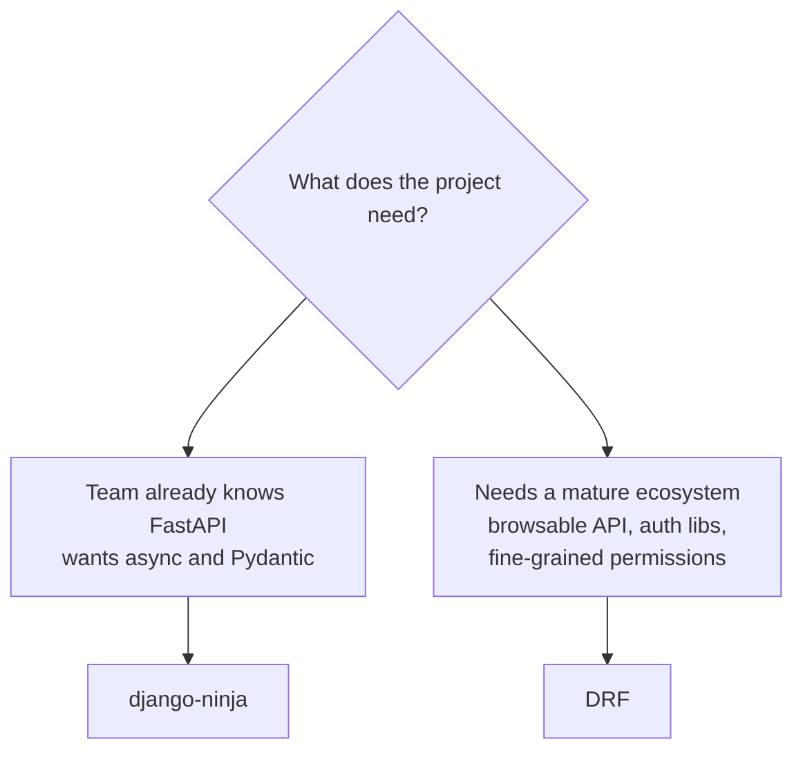

# django-ninja (modern API)

You have already seen how to expose the blog models as a **REST API** using
[DRF](../advanced/drf.md). **django-ninja** does the same job, but with a
different feel: **FastAPI**-style syntax, **Pydantic v2** schemas,
**async-first**, and **OpenAPI/Swagger** docs generated automatically from your
type hints.

!!! quote "Think like a child 🧒"
    Picture two cake molds for the same batter. DRF is the traditional mold:
    sturdy, full of pieces (serializers, viewsets, routers). django-ninja is a
    new, lightweight mold: you write a function, **annotate the types**, and the
    mold already knows how to validate the input, build the response, and draw
    the manual (Swagger) by itself. Same batter (your Django models), leaner
    shape.

## Use case

You know FastAPI and want the **same ergonomics** inside a Django project,
reusing the ORM, the admin, and the migrations you already have. With
django-ninja, an API that lists and creates posts fits in a few lines:

```python
# apps/blog/api.py
from ninja import NinjaAPI, Schema

api = NinjaAPI()


class PostOut(Schema):
    """Response schema for a blog post."""

    id: int
    title: str
    slug: str


@api.get("/posts", response=list[PostOut])
def list_posts(request) -> list[PostOut]:
    """Return every published post as JSON."""
    from apps.blog.models import Post

    return list(Post.objects.all())
```

```python
# config/urls.py
from django.contrib import admin
from django.urls import path

from apps.blog.api import api

urlpatterns = [
    path("admin/", admin.site.urls),
    path("api/", api.urls),
]
```

Install it with:

```bash
uv add django-ninja
```

You do not register anything in `INSTALLED_APPS`: django-ninja is wired up
through the URL. Start the server and open **`/api/docs`** — the Swagger UI is
already there, with the `PostOut` schema documented from your type hints.

!!! tip "If you come from FastAPI, you already know 90% of this"
    `NinjaAPI` plays the role of `FastAPI()`, `Schema` is Pydantic's
    `BaseModel`, `@api.get(...)` is `@app.get(...)`. The big difference: the
    first parameter of every operation is Django's **`request`**
    (`HttpRequest`), not dependency injection via the signature.

## Possibilities

### The mental bridge: FastAPI and DRF

| Concept | FastAPI | django-ninja | DRF |
| --- | --- | --- | --- |
| App/entry point | `FastAPI()` | `NinjaAPI()` | `DefaultRouter()` |
| Data schema | `BaseModel` | `Schema` (is Pydantic v2) | `Serializer` |
| Operation | `@app.get` | `@api.get` | `ViewSet` / `APIView` |
| Group routes | `APIRouter` | `Router` | `Router` |
| Validation | Pydantic | Pydantic | `Serializer.is_valid()` |
| Docs | Auto Swagger | Auto Swagger | Swagger via external lib |

!!! info "`Schema` is real Pydantic v2"
    `ninja.Schema` inherits from `pydantic.BaseModel`. Everything you know from
    Pydantic v2 applies: `Field`, `field_validator`, `model_config`,
    `Annotated`, nested types. It is the same library — just with a
    `Config.from_attributes` already turned on so it reads ORM instances
    directly.

### Router: split the API into modules

Just like FastAPI's `APIRouter`, django-ninja's `Router` groups related
operations in one file and then plugs into the main API:

```python
# apps/blog/api.py
from ninja import NinjaAPI, Router, Schema

from apps.blog.models import Post

api = NinjaAPI()
router = Router()


class PostOut(Schema):
    """Response schema for a blog post."""

    id: int
    title: str
    slug: str


@router.get("/", response=list[PostOut])
def list_posts(request) -> list[PostOut]:
    """List all posts."""
    return list(Post.objects.all())


@router.get("/{int:post_id}", response=PostOut)
def get_post(request, post_id: int) -> Post:
    """Return a single post by its primary key."""
    return Post.objects.get(pk=post_id)


api.add_router("/posts", router, tags=["posts"])
```

The `tags=["posts"]` groups those routes into one section in Swagger — just like
FastAPI tags.

### Parameters: path, query, and body

django-ninja decides **where** each parameter comes from by its type, just like
FastAPI:

- Appears in the URL (`/{post_id}`) → comes from the **path**.
- A simple type that is not in the URL → comes from the **query string**.
- A `Schema` → comes from the **body** (JSON).

```python
# apps/blog/api.py
from ninja import NinjaAPI, Query, Schema

from apps.blog.models import Post

api = NinjaAPI()


class PostFilters(Schema):
    """Query filters for listing posts."""

    search: str = ""
    limit: int = 10


class PostIn(Schema):
    """Request body to create a post."""

    title: str
    slug: str


class PostOut(Schema):
    """Response schema for a blog post."""

    id: int
    title: str
    slug: str


@api.get("/posts/{int:post_id}", response=PostOut)
def get_post(request, post_id: int) -> Post:
    """Path param: read `post_id` straight from the URL."""
    return Post.objects.get(pk=post_id)


@api.get("/posts", response=list[PostOut])
def list_posts(request, filters: Query[PostFilters]) -> list[PostOut]:
    """Query params: `?search=django&limit=5` fill the `PostFilters` schema."""
    qs = Post.objects.all()
    if filters.search:
        qs = qs.filter(title__icontains=filters.search)
    return list(qs[: filters.limit])


@api.post("/posts", response={201: PostOut})
def create_post(request, data: PostIn) -> tuple[int, Post]:
    """Body param: JSON is parsed and validated into the `PostIn` schema."""
    post = Post.objects.create(title=data.title, slug=data.slug)
    return 201, post
```

!!! note "`Query[Schema]` groups many query params"
    For one or two filters, you can declare `search: str = ""` right in the
    signature. When there are many, wrap them in a `Schema` and receive it as
    `Query[PostFilters]` — it stays organized and reusable, and Swagger
    documents every field.

### Response schema and status codes

The `response=` controls **what goes out** and validates the output against the
schema (no accidental field leaks). You can map **status → schema**:

```python
# apps/blog/api.py
from ninja import NinjaAPI, Schema
from ninja.errors import HttpError

from apps.blog.models import Post

api = NinjaAPI()


class PostOut(Schema):
    """Successful response."""

    id: int
    title: str


class ErrorOut(Schema):
    """Error response body."""

    detail: str


@api.get("/posts/{int:post_id}", response={200: PostOut, 404: ErrorOut})
def get_post(request, post_id: int) -> tuple[int, object]:
    """Return the post, or a 404 body when it does not exist."""
    try:
        post = Post.objects.get(pk=post_id)
    except Post.DoesNotExist:
        return 404, {"detail": "Post not found"}
    return 200, post
```

!!! tip "Shortcut for 404: `get_object_or_404`"
    Instead of the `try/except`, you can `raise HttpError(404, "...")` or use
    Django's `get_object_or_404(Post, pk=post_id)` — django-ninja converts the
    `Http404` into a 404 response automatically.

### Async-first

Swapping `def` for `async def` is all it takes: django-ninja runs the operation
asynchronously. Use the ORM's `a...` variants (`aget`, `acreate`, `async for`):

```python
# apps/blog/api.py
from asgiref.sync import sync_to_async

from ninja import NinjaAPI, Schema

from apps.blog.models import Post

api = NinjaAPI()


class PostOut(Schema):
    """Response schema for a blog post."""

    id: int
    title: str


@api.get("/posts", response=list[PostOut])
async def list_posts(request) -> list[PostOut]:
    """Async operation reading the ORM without blocking the event loop."""
    return [post async for post in Post.objects.all()]


@api.get("/posts/{int:post_id}", response=PostOut)
async def get_post(request, post_id: int) -> Post:
    """Await the async ORM accessor `aget`."""
    return await Post.objects.aget(pk=post_id)
```

!!! warning "It must run under ASGI to be truly async"
    An `async def` operation only gains real concurrency when served by an
    **ASGI** server (uvicorn, daphne, hypercorn). Under WSGI it still works, but
    Django runs it in a thread — without the event-loop benefit. See
    [sync vs async](../advanced/sync-vs-async.md) for the big picture.

### Authentication

django-ninja ships ready-made classes and a simple way to write your own. Auth
can be applied per operation, per router, or globally (`NinjaAPI(auth=...)`):

```python
# apps/blog/api.py
from ninja import NinjaAPI
from ninja.security import HttpBearer

api = NinjaAPI()


class TokenAuth(HttpBearer):
    """Authenticate requests carrying a bearer token."""

    def authenticate(self, request, token: str) -> str | None:
        """Return the token when valid, or None to reject with 401.

        Args:
            request: The incoming Django request.
            token: The bearer token extracted from the Authorization header.

        Returns:
            The token string when accepted, otherwise None.
        """
        if token == "supersecret":
            return token
        return None


@api.get("/private", auth=TokenAuth())
def private(request) -> dict[str, str]:
    """Only reachable with a valid bearer token."""
    return {"token": request.auth}
```

| Class | For |
| --- | --- |
| `HttpBearer` | Token in the `Authorization: Bearer <token>` header |
| `APIKeyQuery` / `APIKeyHeader` / `APIKeyCookie` | API key in query/header/cookie |
| `HttpBasicAuth` | Username and password via Basic Auth |
| `django_auth` | Reuses Django's logged-in session (`request.user`) |

!!! info "`django_auth`: Django's session for free"
    `from ninja.security import django_auth` uses the session middleware you
    already have. Pass `auth=django_auth` and the operation requires a logged-in
    user — perfect for an API consumed by the same site that already logs in via
    session.

### When to choose django-ninja over DRF



| Criterion | django-ninja | DRF |
| --- | --- | --- |
| Learning curve from FastAPI | Minimal | Medium |
| Async | Native, first-class | Partial / more recent support |
| Validation | Pydantic v2 | Its own serializers |
| Ecosystem/plugins | Smaller, young | Huge and mature |
| Browsable API (HTML) | No | Yes |
| OpenAPI docs | Automatic, built in | Via external lib (drf-spectacular) |

!!! tip "The rule of thumb"
    Coming from **FastAPI**, starting a new project, wanting **async** and
    Pydantic? django-ninja fits like a glove. Need a **mature ecosystem** —
    fine-grained permissions, throttling, browsable API, tons of third-party
    packages? **[DRF](../advanced/drf.md)** is still the safer choice. The two
    coexist: you can have DRF and django-ninja in the same project.

!!! danger "One API per project, please"
    Avoid creating several `NinjaAPI()` instances without a distinct
    `urls_namespace`. Two APIs in the same namespace collide in routing and in
    the OpenAPI schema. If you truly need more than one, give each its own path
    and namespace.

!!! quote "📖 In the official docs"
    - [django-ninja](https://django-ninja.dev/)

## Recap

- django-ninja brings **FastAPI's ergonomics** into Django: Pydantic v2 schemas,
  type hints, automatic Swagger at `/api/docs`.
- `NinjaAPI()` is the entry point, `Schema` is `BaseModel`, `@api.get/post` are
  the operations; mount it on the URL with `path("api/", api.urls)`.
- Parameters come from the **path** (in the URL), **query** (simple types /
  `Query[Schema]`), or **body** (a `Schema`), decided by the type — just like
  FastAPI.
- `response=` validates and documents the output; use `response={200: X, 404: Y}`
  to map statuses to schemas.
- Just `async def` for asynchronous operations (with the ORM's `a...` variants),
  served under ASGI.
- Ready-made auth: `HttpBearer`, `APIKey*`, `HttpBasicAuth`, `django_auth`; apply
  it per operation, per router, or globally.
- Choose django-ninja coming from FastAPI and wanting async; **[DRF](../advanced/drf.md)**
  wins when you need the mature ecosystem.
