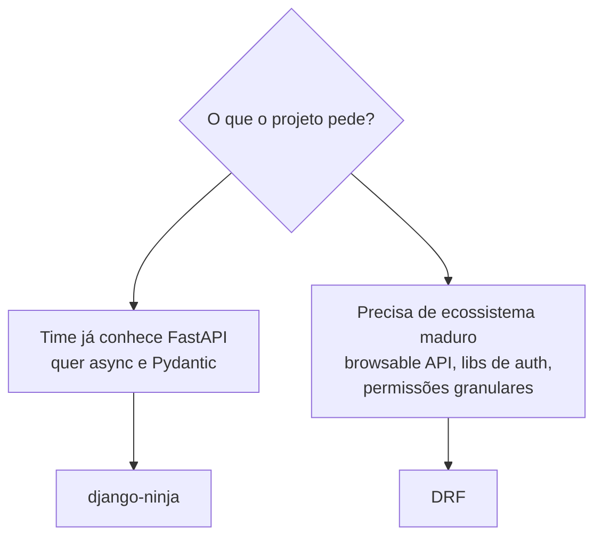

# django-ninja (API moderna)

Você já viu como expor os modelos do blog como **API REST** usando o
[DRF](../advanced/drf.md). O **django-ninja** faz o mesmo trabalho, mas com uma
pegada diferente: sintaxe estilo **FastAPI**, schemas **Pydantic v2**,
**async-first** e documentação **OpenAPI/Swagger** gerada sozinha a partir dos
seus type hints.

!!! quote "Pensa como criança 🧒"
    Imagine dois moldes de bolo para a mesma massa. O DRF é o molde tradicional:
    robusto, cheio de peças (serializers, viewsets, routers). O django-ninja é um
    molde novo e leve: você escreve uma função, **anota os tipos**, e o molde já
    sabe validar a entrada, montar a resposta e desenhar o manual (Swagger)
    sozinho. Mesma massa (seus modelos Django), forma mais enxuta.

## Caso de uso

Você conhece FastAPI e quer a **mesma ergonomia** dentro de um projeto Django,
aproveitando o ORM, o admin e as migrações que já tem. Com django-ninja, uma
API que lista e cria posts cabe em poucas linhas:

```python
# apps/blog/api.py
from ninja import NinjaAPI, Schema

api = NinjaAPI()


class PostOut(Schema):
    """Response schema for a blog post."""

    id: int
    title: str
    slug: str


@api.get("/posts", response=list[PostOut])
def list_posts(request) -> list[PostOut]:
    """Return every published post as JSON."""
    from apps.blog.models import Post

    return list(Post.objects.all())
```

```python
# config/urls.py
from django.contrib import admin
from django.urls import path

from apps.blog.api import api

urlpatterns = [
    path("admin/", admin.site.urls),
    path("api/", api.urls),
]
```

Instale com:

```bash
uv add django-ninja
```

Não precisa registrar nada em `INSTALLED_APPS`: o django-ninja é montado pela
URL. Suba o servidor e abra **`/api/docs`** — o Swagger UI já está lá, com o
schema `PostOut` documentado a partir dos seus type hints.

!!! tip "Se você vem do FastAPI, já sabe 90% disto"
    `NinjaAPI` faz o papel do `FastAPI()`, `Schema` é `BaseModel` do Pydantic,
    `@api.get(...)` é `@app.get(...)`. A grande diferença: o primeiro parâmetro
    de toda operação é o **`request`** do Django (`HttpRequest`), não injeção de
    dependência via assinatura.

## Possibilidades

### A ponte mental: FastAPI e DRF

| Conceito | FastAPI | django-ninja | DRF |
| --- | --- | --- | --- |
| App/entrada | `FastAPI()` | `NinjaAPI()` | `DefaultRouter()` |
| Schema de dados | `BaseModel` | `Schema` (é Pydantic v2) | `Serializer` |
| Operação | `@app.get` | `@api.get` | `ViewSet` / `APIView` |
| Agrupar rotas | `APIRouter` | `Router` | `Router` |
| Validação | Pydantic | Pydantic | `Serializer.is_valid()` |
| Docs | Swagger auto | Swagger auto | Swagger via lib externa |

!!! info "`Schema` é Pydantic v2 de verdade"
    `ninja.Schema` herda de `pydantic.BaseModel`. Tudo que você sabe de Pydantic
    v2 vale: `Field`, `field_validator`, `model_config`, `Annotated`, tipos
    aninhados. É a mesma biblioteca — só com um `Config.from_attributes` já ligado
    para ler instâncias do ORM direto.

### Router: quebrar a API em módulos

Assim como o `APIRouter` do FastAPI, o `Router` do django-ninja agrupa
operações relacionadas em um arquivo e depois pluga na API principal:

```python
# apps/blog/api.py
from ninja import NinjaAPI, Router, Schema

from apps.blog.models import Post

api = NinjaAPI()
router = Router()


class PostOut(Schema):
    """Response schema for a blog post."""

    id: int
    title: str
    slug: str


@router.get("/", response=list[PostOut])
def list_posts(request) -> list[PostOut]:
    """List all posts."""
    return list(Post.objects.all())


@router.get("/{int:post_id}", response=PostOut)
def get_post(request, post_id: int) -> Post:
    """Return a single post by its primary key."""
    return Post.objects.get(pk=post_id)


api.add_router("/posts", router, tags=["posts"])
```

A `tags=["posts"]` agrupa essas rotas em uma seção no Swagger — igual às tags do
FastAPI.

### Parâmetros: path, query e body

O django-ninja decide **de onde** vem cada parâmetro pelo tipo, igual ao FastAPI:

- Aparece na URL (`/{post_id}`) → vem do **path**.
- É um tipo simples que não está na URL → vem da **query string**.
- É um `Schema` → vem do **body** (JSON).

```python
# apps/blog/api.py
from ninja import NinjaAPI, Query, Schema

from apps.blog.models import Post

api = NinjaAPI()


class PostFilters(Schema):
    """Query filters for listing posts."""

    search: str = ""
    limit: int = 10


class PostIn(Schema):
    """Request body to create a post."""

    title: str
    slug: str


class PostOut(Schema):
    """Response schema for a blog post."""

    id: int
    title: str
    slug: str


@api.get("/posts/{int:post_id}", response=PostOut)
def get_post(request, post_id: int) -> Post:
    """Path param: read `post_id` straight from the URL."""
    return Post.objects.get(pk=post_id)


@api.get("/posts", response=list[PostOut])
def list_posts(request, filters: Query[PostFilters]) -> list[PostOut]:
    """Query params: `?search=django&limit=5` fill the `PostFilters` schema."""
    qs = Post.objects.all()
    if filters.search:
        qs = qs.filter(title__icontains=filters.search)
    return list(qs[: filters.limit])


@api.post("/posts", response={201: PostOut})
def create_post(request, data: PostIn) -> tuple[int, Post]:
    """Body param: JSON is parsed and validated into the `PostIn` schema."""
    post = Post.objects.create(title=data.title, slug=data.slug)
    return 201, post
```

!!! note "`Query[Schema]` agrupa muitos query params"
    Para um ou dois filtros, você pode declarar `search: str = ""` direto na
    assinatura. Quando são muitos, envolva num `Schema` e receba como
    `Query[PostFilters]` — fica organizado e reaproveitável, e o Swagger
    documenta cada campo.

### Response schema e códigos de status

O `response=` controla **o que sai** e valida a saída contra o schema (nada de
vazar campos por acidente). Você pode mapear **status → schema**:

```python
# apps/blog/api.py
from ninja import NinjaAPI, Schema
from ninja.errors import HttpError

from apps.blog.models import Post

api = NinjaAPI()


class PostOut(Schema):
    """Successful response."""

    id: int
    title: str


class ErrorOut(Schema):
    """Error response body."""

    detail: str


@api.get("/posts/{int:post_id}", response={200: PostOut, 404: ErrorOut})
def get_post(request, post_id: int) -> tuple[int, object]:
    """Return the post, or a 404 body when it does not exist."""
    try:
        post = Post.objects.get(pk=post_id)
    except Post.DoesNotExist:
        return 404, {"detail": "Post not found"}
    return 200, post
```

!!! tip "Atalho para 404: `get_object_or_404`"
    Em vez do `try/except`, você pode levantar `raise HttpError(404, "...")` ou
    usar `get_object_or_404(Post, pk=post_id)` do Django — o django-ninja
    converte a `Http404` numa resposta 404 automaticamente.

### Async-first

Trocar `def` por `async def` é tudo: o django-ninja roda a operação de forma
assíncrona. Use as variantes `a...` do ORM (`aget`, `acreate`, `async for`):

```python
# apps/blog/api.py
from asgiref.sync import sync_to_async

from ninja import NinjaAPI, Schema

from apps.blog.models import Post

api = NinjaAPI()


class PostOut(Schema):
    """Response schema for a blog post."""

    id: int
    title: str


@api.get("/posts", response=list[PostOut])
async def list_posts(request) -> list[PostOut]:
    """Async operation reading the ORM without blocking the event loop."""
    return [post async for post in Post.objects.all()]


@api.get("/posts/{int:post_id}", response=PostOut)
async def get_post(request, post_id: int) -> Post:
    """Await the async ORM accessor `aget`."""
    return await Post.objects.aget(pk=post_id)
```

!!! warning "Precisa rodar sob ASGI para ser realmente async"
    Uma operação `async def` só ganha concorrência de verdade quando servida por
    um servidor **ASGI** (uvicorn, daphne, hypercorn). Sob WSGI ela ainda
    funciona, mas o Django a executa numa thread — sem o ganho do loop de
    eventos. Veja
    [sync vs async](../advanced/sync-vs-async.md) para o panorama.

### Autenticação

O django-ninja traz classes prontas e um jeito simples de escrever a sua. A
auth pode ser por operação, por router ou global (`NinjaAPI(auth=...)`):

```python
# apps/blog/api.py
from ninja import NinjaAPI
from ninja.security import HttpBearer

api = NinjaAPI()


class TokenAuth(HttpBearer):
    """Authenticate requests carrying a bearer token."""

    def authenticate(self, request, token: str) -> str | None:
        """Return the token when valid, or None to reject with 401.

        Args:
            request: The incoming Django request.
            token: The bearer token extracted from the Authorization header.

        Returns:
            The token string when accepted, otherwise None.
        """
        if token == "supersecret":
            return token
        return None


@api.get("/private", auth=TokenAuth())
def private(request) -> dict[str, str]:
    """Only reachable with a valid bearer token."""
    return {"token": request.auth}
```

| Classe | Para |
| --- | --- |
| `HttpBearer` | Token no header `Authorization: Bearer <token>` |
| `APIKeyQuery` / `APIKeyHeader` / `APIKeyCookie` | Chave de API em query/header/cookie |
| `HttpBasicAuth` | Usuário e senha via Basic Auth |
| `django_auth` | Reaproveita a sessão logada do Django (`request.user`) |

!!! info "`django_auth`: sessão do Django de graça"
    `from ninja.security import django_auth` usa o middleware de sessão que você
    já tem. Passe `auth=django_auth` e a operação exige um usuário logado —
    perfeito para uma API consumida pelo mesmo site que já faz login por sessão.

### Quando escolher django-ninja em vez de DRF



| Critério | django-ninja | DRF |
| --- | --- | --- |
| Curva vindo do FastAPI | Mínima | Média |
| Async | Nativo, first-class | Suporte parcial/mais recente |
| Validação | Pydantic v2 | Serializers próprios |
| Ecossistema/plugins | Menor, jovem | Enorme e maduro |
| Browsable API (HTML) | Não | Sim |
| Docs OpenAPI | Automática, embutida | Via lib externa (drf-spectacular) |

!!! tip "A regra prática"
    Vindo do **FastAPI**, começando um projeto novo, querendo **async** e
    Pydantic? django-ninja encaixa como uma luva. Precisa de **ecossistema
    maduro** — permissões finas, throttling, browsable API, toneladas de
    pacotes de terceiros? O **[DRF](../advanced/drf.md)** ainda é a escolha mais
    segura. Os dois convivem: dá para ter DRF e django-ninja no mesmo projeto.

!!! danger "Uma API por projeto, por favor"
    Evite criar várias instâncias de `NinjaAPI()` sem `urls_namespace` distinto.
    Duas APIs no mesmo namespace colidem no roteamento e no schema OpenAPI. Se
    precisar de mais de uma, dê a cada uma um caminho e namespace próprios.

!!! quote "📖 Na documentação oficial"
    - [django-ninja](https://django-ninja.dev/)

## Recap

- django-ninja traz a **ergonomia do FastAPI** para dentro do Django: schemas
  Pydantic v2, type hints, Swagger automático em `/api/docs`.
- `NinjaAPI()` é a entrada, `Schema` é `BaseModel`, `@api.get/post` são as
  operações; monte na URL com `path("api/", api.urls)`.
- Parâmetros vêm do **path** (na URL), **query** (tipos simples / `Query[Schema]`)
  ou **body** (um `Schema`), decidido pelo tipo — igual ao FastAPI.
- `response=` valida e documenta a saída; use `response={200: X, 404: Y}` para
  mapear status a schemas.
- Basta `async def` para operações assíncronas (com as variantes `a...` do ORM),
  servidas sob ASGI.
- Auth prontas: `HttpBearer`, `APIKey*`, `HttpBasicAuth`, `django_auth`; aplique
  por operação, router ou global.
- Escolha django-ninja vindo do FastAPI e querendo async; o
  **[DRF](../advanced/drf.md)** vence quando você precisa do ecossistema maduro.
