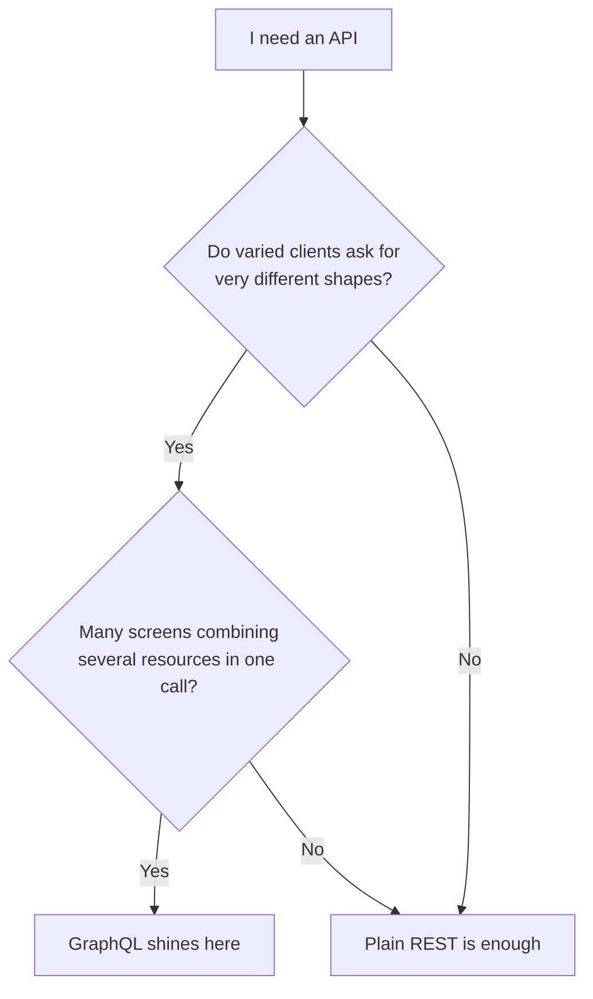

# GraphQL with Strawberry Django

In a REST API, the server decides **what** each endpoint returns. If the phone
screen only needs the post title, but the endpoint sends title, body, author,
comments and tags, the client **gets too much** — or has to call three endpoints
to assemble what it wants. **GraphQL** flips this around: there is a **single
endpoint**, and the **client** describes exactly the fields it wants.
**Strawberry Django** is the modern, typed way to speak GraphQL from your Django
models.

!!! quote "Think like a child 🧒"
    At a **fixed-menu** restaurant you order "Plate 3" and get whatever comes on
    the plate — rice, beans, salad, all of it. At a **buffet** you put on your
    plate only what you want. REST is the fixed menu; GraphQL is the buffet: the
    client builds the plate field by field.

## Use case

The app wants, on a single screen, each post's title **and** the author's name —
nothing else. With GraphQL, the client writes the query and gets exactly that
shape back.

```graphql
query {
  posts {
    title
    author {
      name
    }
  }
}
```

And the response mirrors the question, no more and no less:

```json
{
  "data": {
    "posts": [
      { "title": "ORM in practice", "author": { "name": "Ana" } },
      { "title": "Class-based views", "author": { "name": "Bruno" } }
    ]
  }
}
```

To answer that query, you describe **types** from the models and assemble a
**schema**.

```bash
uv add strawberry-graphql-django
```

```python
# config/settings.py
INSTALLED_APPS = [
    # ...
    "strawberry_django",
]
```

```python
# apps/blog/gql/types.py
import strawberry
import strawberry_django

from apps.blog.models import Author, Post


@strawberry_django.type(Author)
class AuthorType:
    """GraphQL type mapped from the Author model."""

    id: strawberry.auto
    name: strawberry.auto


@strawberry_django.type(Post)
class PostType:
    """GraphQL type mapped from the Post model."""

    id: strawberry.auto
    title: strawberry.auto
    author: AuthorType
```

```python
# apps/blog/gql/schema.py
import strawberry
import strawberry_django

from apps.blog.gql.types import PostType


@strawberry.type
class Query:
    """Root query exposing the blog's read operations."""

    posts: list[PostType] = strawberry_django.field()


schema = strawberry.Schema(query=Query)
```

```python
# config/urls.py
from django.urls import path
from strawberry.django.views import AsyncGraphQLView

from apps.blog.gql.schema import schema

urlpatterns = [
    path("graphql/", AsyncGraphQLView.as_view(schema=schema)),
]
```

Done: one `/graphql/` endpoint. `strawberry.auto` reads the type straight from
the model field, so you don't repeat `str`, `int`, `datetime` by hand.

!!! tip "GraphiQL comes for free"
    Open `/graphql/` in the browser (under `DEBUG`) and you get **GraphiQL**: a
    playground with autocompletion and schema docs generated automatically from
    your types. Great for exploring before writing a client.

## Possibilities

### Query with a filter and a single object

Beyond the list, you almost always want to fetch **one** record by `id`. Add a
typed resolver to `Query`.

```python
# apps/blog/gql/schema.py
import strawberry
import strawberry_django

from apps.blog.gql.types import PostType
from apps.blog.models import Post


@strawberry.type
class Query:
    """Root query exposing the blog's read operations."""

    posts: list[PostType] = strawberry_django.field()

    @strawberry.field
    def post(self, id: int) -> PostType | None:
        """Return a single post by its primary key, or ``None`` if absent."""
        return Post.objects.filter(pk=id).first()
```

```graphql
query {
  post(id: 1) {
    title
    author { name }
  }
}
```

### Mutations: creating and changing data

`Query` is for **reading**; `Mutation` is for **writing**. Strawberry Django
generates input types from the model.

```python
# apps/blog/gql/schema.py
import strawberry
import strawberry_django
from strawberry_django import mutations

from apps.blog.gql.types import PostType


@strawberry_django.input(Post)
class PostInput:
    """Input type used to create a Post."""

    title: strawberry.auto
    body: strawberry.auto
    author: strawberry.auto


@strawberry.type
class Mutation:
    """Root mutation exposing the blog's write operations."""

    create_post: PostType = mutations.create(PostInput)


schema = strawberry.Schema(query=Query, mutation=Mutation)
```

```graphql
mutation {
  createPost(data: { title: "Hello GraphQL", body: "...", author: 1 }) {
    id
    title
  }
}
```

!!! note "camelCase on the client, snake_case in Python"
    You write `created_at` in Python and the schema exposes `createdAt` — that's
    the GraphQL convention. Strawberry converts both sides for you, so don't be
    surprised to see the name change case between the model and the query.

### The three parts of Strawberry Django

| Piece | What it does | Decorator |
| --- | --- | --- |
| **Type** | Mirrors a model as a GraphQL type | `@strawberry_django.type(Model)` |
| **Input** | Shapes the data going into a mutation | `@strawberry_django.input(Model)` |
| **Query / Mutation** | Groups the read / write fields | `@strawberry.type` |
| **Schema** | Ties it all into one endpoint | `strawberry.Schema(query=, mutation=)` |

### The N+1 problem (and how Strawberry solves it)

When the client asks for `posts { author { name } }`, a naive implementation runs
**one query per post** to fetch the author — the classic N+1. Strawberry Django
integrates `select_related`/`prefetch_related` and **DataLoaders** to batch this.

```python
# apps/blog/gql/types.py
@strawberry_django.type(Post)
class PostType:
    """GraphQL type mapped from the Post model."""

    id: strawberry.auto
    title: strawberry.auto
    author: AuthorType = strawberry_django.field()
```

!!! warning "Measure your queries in GraphQL"
    Client flexibility is a double-edged sword: a nested query can fire a lot of
    queries. Enable optimization (`strawberry_django.field()` on relations) and
    watch it with **django-debug-toolbar** or SQL logs. See also the
    [ORM](../referencia/querysets-api.md).

### Why Strawberry and not Graphene?

For years **Graphene** was the GraphQL standard in Django, but the project went
**stagnant** (rare releases, weak typing, slow support for new versions).
**Strawberry** was born modern and is the recommended choice today.

| Criterion | Graphene | Strawberry |
| --- | --- | --- |
| Style | Classes with metaclasses | Pure **type hints** (dataclasses) |
| Static typing | Weak | Strong (mypy/pyright understand it) |
| Async | Retrofitted later | Native (`AsyncGraphQLView`) |
| Maintenance | Slow / stagnant | Active |
| Django integration | `graphene-django` | `strawberry-graphql-django` |

!!! danger "Graphene is legacy"
    If you are starting a new project in 2026, do **not** use Graphene. Use
    Strawberry. Only touch Graphene to maintain code that already exists.

### GraphQL makes sense when... (and when it doesn't)

GraphQL isn't "better than REST" — it's a **trade-off**. Choose it for a reason,
not for fashion.



| Prefer **GraphQL** when | Prefer **REST** when |
| --- | --- |
| Many clients with different needs (web, mobile, partners) | One stable client, predictable contract |
| Screens combine several resources in a single call | Simple resources, one per endpoint |
| Over/under-fetching genuinely hurts | HTTP cache and CDN matter a lot |
| The front-end evolves fast and wants autonomy | Small team, no desire to maintain a schema |

!!! info "GraphQL and REST coexist"
    You don't have to choose forever. A project commonly exposes **REST** with
    [DRF](../advanced/drf.md) or [Django Ninja](django-ninja.md) for
    the bulk of the API and one **GraphQL** endpoint only where the flexibility
    pays off.

!!! quote "📖 In the official docs"
    - [Strawberry Django](https://strawberry.rocks/docs/django)

## Recap

- **GraphQL** is a single endpoint where the **client** picks the fields — it
  cures REST's over/under-fetching.
- **Strawberry Django** generates **types** and **inputs** from your models with
  `strawberry.auto`, and you assemble `Query` (read) + `Mutation` (write) into a
  `strawberry.Schema`.
- Serve it with `AsyncGraphQLView` at `/graphql/`; **GraphiQL** comes along for
  exploring.
- Prefer **Strawberry** over **Graphene** (stagnant): strong typing, native
  async, active maintenance.
- Handle the **N+1** with Strawberry Django's optimized fields and measure your
  queries.
- Choose GraphQL when many clients ask for different shapes; stay on REST
  ([DRF](../advanced/drf.md) / [Django Ninja](django-ninja.md)) when
  the contract is simple and stable — the two can coexist.
