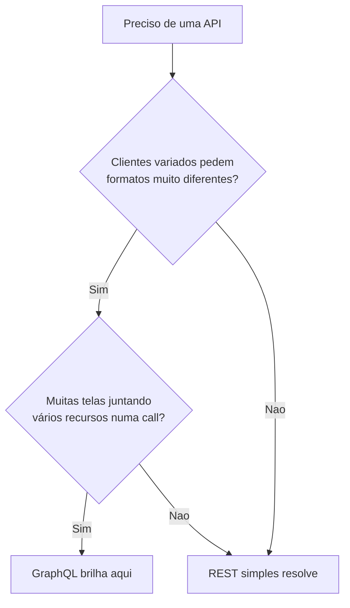

# GraphQL com Strawberry Django

Numa API REST, o servidor decide **o que** cada endpoint devolve. Se a tela do
celular só precisa do título do post, mas o endpoint manda título, corpo, autor,
comentários e tags, o cliente **recebe demais** — ou precisa chamar três
endpoints para juntar o que quer. O **GraphQL** inverte isso: existe **um único
endpoint**, e o **cliente** descreve exatamente os campos que deseja. O
**Strawberry Django** é a forma moderna e tipada de falar GraphQL a partir dos
seus modelos Django.

!!! quote "Pensa como criança 🧒"
    Num restaurante com **menu fixo**, você pede o "Prato 3" e vem o que vier no
    prato — arroz, feijão, salada, tudo. Num restaurante **self-service**, você
    pega só o que quer no seu prato. REST é o menu fixo; GraphQL é o
    self-service: o cliente monta o prato campo a campo.

## Caso de uso

O app quer, numa tela só, o título de cada post **e** o nome do autor — nada
mais. Com GraphQL, o cliente escreve a consulta e recebe exatamente esse formato.

```graphql
query {
  posts {
    title
    author {
      name
    }
  }
}
```

E a resposta espelha a pergunta, sem sobra nem falta:

```json
{
  "data": {
    "posts": [
      { "title": "ORM na prática", "author": { "name": "Ana" } },
      { "title": "Views baseadas em classe", "author": { "name": "Bruno" } }
    ]
  }
}
```

Para atender essa consulta, você descreve **tipos** a partir dos modelos e monta
um **schema**.

```bash
uv add strawberry-graphql-django
```

```python
# config/settings.py
INSTALLED_APPS = [
    # ...
    "strawberry_django",
]
```

```python
# apps/blog/gql/types.py
import strawberry
import strawberry_django

from apps.blog.models import Author, Post


@strawberry_django.type(Author)
class AuthorType:
    """GraphQL type mapped from the Author model."""

    id: strawberry.auto
    name: strawberry.auto


@strawberry_django.type(Post)
class PostType:
    """GraphQL type mapped from the Post model."""

    id: strawberry.auto
    title: strawberry.auto
    author: AuthorType
```

```python
# apps/blog/gql/schema.py
import strawberry
import strawberry_django

from apps.blog.gql.types import PostType


@strawberry.type
class Query:
    """Root query exposing the blog's read operations."""

    posts: list[PostType] = strawberry_django.field()


schema = strawberry.Schema(query=Query)
```

```python
# config/urls.py
from django.urls import path
from strawberry.django.views import AsyncGraphQLView

from apps.blog.gql.schema import schema

urlpatterns = [
    path("graphql/", AsyncGraphQLView.as_view(schema=schema)),
]
```

Pronto: um endpoint `/graphql/`. O `strawberry.auto` lê o tipo direto do campo do
modelo, então você não repete `str`, `int`, `datetime` à mão.

!!! tip "GraphiQL sai de graça"
    Abra `/graphql/` no navegador (em `DEBUG`) e você ganha o **GraphiQL**: um
    playground com autocompletar e a documentação do schema gerada sozinha a
    partir dos seus tipos. Ótimo para explorar antes de escrever cliente.

## Possibilidades

### Query com filtro e um objeto só

Além da lista, quase sempre você quer buscar **um** registro por `id`. Adicione
um resolver tipado na `Query`.

```python
# apps/blog/gql/schema.py
import strawberry
import strawberry_django

from apps.blog.gql.types import PostType
from apps.blog.models import Post


@strawberry.type
class Query:
    """Root query exposing the blog's read operations."""

    posts: list[PostType] = strawberry_django.field()

    @strawberry.field
    def post(self, id: int) -> PostType | None:
        """Return a single post by its primary key, or ``None`` if absent."""
        return Post.objects.filter(pk=id).first()
```

```graphql
query {
  post(id: 1) {
    title
    author { name }
  }
}
```

### Mutations: criar e alterar dados

`Query` é para **ler**; `Mutation` é para **escrever**. O Strawberry Django gera
tipos de entrada a partir do modelo.

```python
# apps/blog/gql/schema.py
import strawberry
import strawberry_django
from strawberry_django import mutations

from apps.blog.gql.types import PostType


@strawberry_django.input(Post)
class PostInput:
    """Input type used to create a Post."""

    title: strawberry.auto
    body: strawberry.auto
    author: strawberry.auto


@strawberry.type
class Mutation:
    """Root mutation exposing the blog's write operations."""

    create_post: PostType = mutations.create(PostInput)


schema = strawberry.Schema(query=Query, mutation=Mutation)
```

```graphql
mutation {
  createPost(data: { title: "Olá GraphQL", body: "...", author: 1 }) {
    id
    title
  }
}
```

!!! note "camelCase no cliente, snake_case no Python"
    Você escreve `created_at` em Python e o schema expõe `createdAt` — é a
    convenção do GraphQL. O Strawberry converte os dois lados sozinho, então não
    estranhe ver o nome mudar de caixa entre o modelo e a consulta.

### As três partes do Strawberry Django

| Peça | O que faz | Decorador |
| --- | --- | --- |
| **Type** | Espelha um modelo como tipo GraphQL | `@strawberry_django.type(Model)` |
| **Input** | Molda os dados que entram numa mutation | `@strawberry_django.input(Model)` |
| **Query / Mutation** | Agrupa os campos de leitura / escrita | `@strawberry.type` |
| **Schema** | Junta tudo num endpoint | `strawberry.Schema(query=, mutation=)` |

### O problema N+1 (e como o Strawberry resolve)

Quando o cliente pede `posts { author { name } }`, uma implementação ingênua faz
**uma query por post** para buscar o autor — o clássico N+1. O Strawberry Django
integra `select_related`/`prefetch_related` e **DataLoaders** para agrupar isso.

```python
# apps/blog/gql/types.py
@strawberry_django.type(Post)
class PostType:
    """GraphQL type mapped from the Post model."""

    id: strawberry.auto
    title: strawberry.auto
    author: AuthorType = strawberry_django.field()
```

!!! warning "Meça as queries em GraphQL"
    A flexibilidade do cliente é uma faca de dois gumes: uma consulta aninhada
    pode disparar muitas queries. Ative a otimização (`strawberry_django.field()`
    nas relações) e observe com o **django-debug-toolbar** ou logs de SQL. Veja
    também o [ORM](../referencia/querysets-api.md).

### Por que Strawberry e não Graphene?

Por anos o **Graphene** foi o padrão de GraphQL no Django, mas o projeto ficou
**estagnado** (releases raros, tipagem fraca, suporte lento a versões novas). O
**Strawberry** nasceu moderno e é a escolha recomendada hoje.

| Critério | Graphene | Strawberry |
| --- | --- | --- |
| Estilo | Classes com metaclasses | **Type hints** puros (dataclasses) |
| Tipagem estática | Fraca | Forte (mypy/pyright entendem) |
| Async | Adaptado depois | Nativo (`AsyncGraphQLView`) |
| Manutenção | Lenta / estagnada | Ativa |
| Integração Django | `graphene-django` | `strawberry-graphql-django` |

!!! danger "Graphene é legado"
    Se você está começando um projeto novo em 2026, **não** use Graphene. Use
    Strawberry. Só mexa em Graphene para manter código que já existe.

### GraphQL faz sentido quando... (e quando não)

GraphQL não é "melhor que REST" — é uma **troca**. Escolha por motivo, não por
moda.



| Prefira **GraphQL** quando | Prefira **REST** quando |
| --- | --- |
| Muitos clientes com necessidades diferentes (web, mobile, parceiros) | Um cliente estável, contrato previsível |
| Telas juntam vários recursos numa só chamada | Recursos simples, um por endpoint |
| Over/under-fetching dói de verdade | Cache HTTP e CDN importam muito |
| O front evolui rápido e quer autonomia | Time pequeno, sem quer manter schema |

!!! info "GraphQL e REST convivem"
    Não precisa escolher para sempre. É comum um projeto expor **REST** com
    [DRF](../advanced/drf.md) ou [Django Ninja](django-ninja.md) para
    o grosso da API e um endpoint **GraphQL** só onde a flexibilidade compensa.

!!! quote "📖 Na documentação oficial"
    - [Strawberry Django](https://strawberry.rocks/docs/django)

## Recap

- **GraphQL** é um endpoint único onde o **cliente** escolhe os campos — cura o
  over/under-fetching do REST.
- **Strawberry Django** gera **types** e **inputs** a partir dos seus modelos com
  `strawberry.auto`, e você monta `Query` (leitura) + `Mutation` (escrita) num
  `strawberry.Schema`.
- Sirva com `AsyncGraphQLView` em `/graphql/`; o **GraphiQL** vem junto para
  explorar.
- Prefira **Strawberry** ao **Graphene** (estagnado): tipagem forte, async
  nativo, manutenção ativa.
- Cuide do **N+1** com os campos otimizados do Strawberry Django e meça as
  queries.
- Escolha GraphQL quando muitos clientes pedem formatos diferentes; fique no
  REST ([DRF](../advanced/drf.md) / [Django Ninja](django-ninja.md))
  quando o contrato é simples e estável — os dois podem coexistir.
