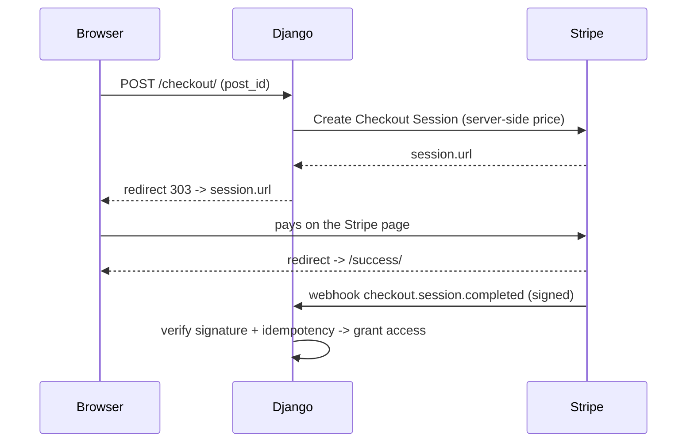

# Payments with Stripe

Charging real money is scary — and rightly so. A customer can tamper with the
price in the browser, a webhook can arrive twice, a secret key can leak.
**Stripe** handles the hard part (cards, fraud, PCI) and leaves us with just our
homework: **never trust the browser** and **verify the signature** of everything
it sends back to us.

!!! quote "Think like a child 🧒"
    You don't let the kid decide how much the ice cream costs at the register.
    The **store's menu** (the server) sets the price; the kid only points at the
    flavor. Stripe is the trusted register: it charges the price **you** set, not
    what the customer typed into the HTML.

## Use case

A reader of our blog wants to buy access to a premium post for $19.90. The safest
and fastest flow to build is **Stripe Checkout**: we create a *session* on the
server (with the price **we** choose), redirect the customer to the Stripe-hosted
page, and receive confirmation via **webhook** — not from the browser's return.



!!! danger "The gold arrives via the webhook, not the success URL"
    The success URL (`success_url`) only serves to **show** the customer a "thank
    you". It does **not** prove the payment happened — a curious visitor can open
    `/success/` by hand. The only source of truth for "it was paid" is the
    **webhook** signed by Stripe.

## Possibilities

### Installation and test keys

```bash
uv add stripe
```

Stripe gives you **two pairs** of keys: test (`sk_test_…` / `pk_test_…`) and
production (`sk_live_…`). Always start in test mode — the test cards
(`4242 4242 4242 4242`) only work with the test key.

!!! danger "The secret key NEVER goes in code or the repository"
    The `sk_…` gives full control of your account. It lives in an **environment
    variable**, never in a versioned `settings.py`, never in front-end
    JavaScript. Only the **publishable key** (`pk_…`) may appear in the browser.
    See [environment configuration](../referencia/config-ambientes.md).

```python
# settings.py
import os

STRIPE_SECRET_KEY = os.environ["STRIPE_SECRET_KEY"]
STRIPE_PUBLISHABLE_KEY = os.environ["STRIPE_PUBLISHABLE_KEY"]
STRIPE_WEBHOOK_SECRET = os.environ["STRIPE_WEBHOOK_SECRET"]
```

| Variable | Where it appears | Secret? |
| --- | --- | --- |
| `STRIPE_SECRET_KEY` (`sk_…`) | server only | **Yes** — if it leaks, revoke now |
| `STRIPE_PUBLISHABLE_KEY` (`pk_…`) | may go to the browser | No |
| `STRIPE_WEBHOOK_SECRET` (`whsec_…`) | server only | **Yes** |

### Storing customer and order

Before charging, we need somewhere to record **what** was bought and **whether**
it was paid. A simple `Order` does it. Notice the **price lives on the server**:
we never store "the amount the customer sent".

```python
# apps/shop/models.py
from django.conf import settings
from django.db import models


class Order(models.Model):
    """A purchase of a premium post by a user."""

    class Status(models.TextChoices):
        PENDING = "pending", "Pending"
        PAID = "paid", "Paid"

    user = models.ForeignKey(
        settings.AUTH_USER_MODEL,
        on_delete=models.PROTECT,
        related_name="orders",
    )
    post = models.ForeignKey(
        "blog.Post",
        on_delete=models.PROTECT,
        related_name="orders",
    )
    amount_cents = models.PositiveIntegerField()
    currency = models.CharField(max_length=3, default="brl")
    status = models.CharField(
        max_length=16,
        choices=Status.choices,
        default=Status.PENDING,
    )
    stripe_session_id = models.CharField(max_length=255, blank=True, db_index=True)
    stripe_customer_id = models.CharField(max_length=255, blank=True)
    created_at = models.DateTimeField(auto_now_add=True)

    class Meta:
        indexes = [
            models.indexes.Index(fields=["stripe_session_id"]),
        ]

    def __str__(self) -> str:
        """Return a human-readable label for the order."""
        return f"Order #{self.pk} ({self.status})"
```

!!! warning "The price lives on the server, always"
    The `amount_cents` is filled from **your** catalog (a dict, another model, a
    price table) — **never** from a field sent by the customer. If the value
    comes from the form, anyone can pay $0.01 for the post.

### Creating the Checkout Session

The view receives the `post_id`, computes the price **on the server side**,
creates the session and redirects. Note the `303` — it's the correct status for
redirecting after a `POST`.

```python
# apps/shop/views.py
import stripe
from django.conf import settings
from django.contrib.auth.decorators import login_required
from django.http import HttpRequest, HttpResponse
from django.shortcuts import get_object_or_404, redirect
from django.urls import reverse
from django.views.decorators.http import require_POST

from apps.blog.models import Post
from apps.shop.models import Order

stripe.api_key = settings.STRIPE_SECRET_KEY

PRICES_CENTS: dict[str, int] = {"premium_post": 1990}


@require_POST
@login_required
def create_checkout(request: HttpRequest, post_id: int) -> HttpResponse:
    """Create a Stripe Checkout Session for a premium post and redirect to it.

    Args:
        request: The incoming HTTP request (an authenticated user).
        post_id: Primary key of the post being purchased.

    Returns:
        A 303 redirect to the Stripe-hosted checkout page.
    """
    post = get_object_or_404(Post, pk=post_id)
    amount_cents = PRICES_CENTS["premium_post"]

    order = Order.objects.create(
        user=request.user,
        post=post,
        amount_cents=amount_cents,
        currency="brl",
    )

    session = stripe.checkout.Session.create(
        mode="payment",
        line_items=[
            {
                "price_data": {
                    "currency": "brl",
                    "product_data": {"name": f"Premium post: {post.title}"},
                    "unit_amount": amount_cents,
                },
                "quantity": 1,
            },
        ],
        success_url=request.build_absolute_uri(
            reverse("shop:success") + "?session_id={CHECKOUT_SESSION_ID}"
        ),
        cancel_url=request.build_absolute_uri(reverse("shop:cancel")),
        client_reference_id=str(order.pk),
        metadata={"order_id": str(order.pk)},
    )

    order.stripe_session_id = session.id
    order.save(update_fields=["stripe_session_id"])

    return redirect(session.url, permanent=False)
```

!!! info "`unit_amount` is in cents"
    Stripe works with the **smallest unit** of the currency. $19.90 = `1990`.
    This avoids float rounding errors — always work with integers.

!!! tip "`client_reference_id` and `metadata` are your anchors"
    Store the `order.pk` in the session (via `client_reference_id` **and**/or
    `metadata`). When the webhook arrives, that's how you find **which** order to
    pay without trusting anything that came from the browser.

### Receiving the webhook securely

Here lives the critical part. Stripe makes a `POST` to your URL when the payment
completes. Anyone on the internet can also `POST` to that URL — which is why we
**verify the signature** before believing anything.

```python
# apps/shop/views.py (continued)
import stripe
from django.conf import settings
from django.db import transaction
from django.http import HttpRequest, HttpResponse, HttpResponseBadRequest
from django.views.decorators.csrf import csrf_exempt
from django.views.decorators.http import require_POST

from apps.shop.models import Order


@csrf_exempt
@require_POST
def stripe_webhook(request: HttpRequest) -> HttpResponse:
    """Receive and verify Stripe webhook events, then fulfill paid orders.

    The request signature is verified against ``STRIPE_WEBHOOK_SECRET`` before
    any payload field is trusted. Fulfillment is idempotent: an order already
    marked as paid is skipped, so duplicated deliveries are harmless.

    Args:
        request: The raw webhook request delivered by Stripe.

    Returns:
        200 on success, 400 on an invalid payload or signature.
    """
    payload = request.body
    signature = request.headers.get("Stripe-Signature", "")

    try:
        event = stripe.Webhook.construct_event(
            payload=payload,
            sig_header=signature,
            secret=settings.STRIPE_WEBHOOK_SECRET,
        )
    except (ValueError, stripe.error.SignatureVerificationError):
        return HttpResponseBadRequest("Invalid payload or signature")

    if event["type"] == "checkout.session.completed":
        session = event["data"]["object"]
        order_id = session["metadata"]["order_id"]

        with transaction.atomic():
            order = (
                Order.objects.select_for_update()
                .filter(pk=order_id)
                .first()
            )
            if order is None:
                return HttpResponse(status=200)
            if order.status == Order.Status.PAID:
                return HttpResponse(status=200)
            if session["amount_total"] != order.amount_cents:
                return HttpResponseBadRequest("Amount mismatch")

            order.status = Order.Status.PAID
            order.stripe_customer_id = session.get("customer") or ""
            order.save(update_fields=["status", "stripe_customer_id"])

    return HttpResponse(status=200)
```

!!! danger "Without `construct_event`, there is no payment"
    `stripe.Webhook.construct_event(...)` recomputes the HMAC of the **raw** body
    using the `whsec_…` and compares it with the `Stripe-Signature` header. That
    is what proves the event really came from Stripe. Use `request.body` (**raw
    bytes**) — if you parse the JSON first, the signature won't match.

!!! warning "`csrf_exempt` is required here — and only here"
    Stripe doesn't have your site's CSRF cookie, so the webhook view needs
    `@csrf_exempt`. This is safe **because** authentication comes from the HMAC
    signature, not from CSRF. Never apply `csrf_exempt` to normal views.

!!! tip "Idempotency: the same event can arrive twice"
    Stripe **retries** delivery if you're slow or return an error — so the same
    `checkout.session.completed` may arrive again. Make the operation
    idempotent: an order already `PAID` is skipped. The `select_for_update()`
    inside `transaction.atomic()` prevents two simultaneous deliveries from
    processing the same order in parallel. See
    [transactions](../referencia/transactions.md).

### Check the amount again in the webhook

Notice the line `session["amount_total"] != order.amount_cents`. Even though we
create the session on the server, we check **again** that Stripe charged the
amount we stored on the order. It's defense in depth: the order is the source of
truth, the webhook confirms it.

### The webhook URL

```python
# apps/shop/urls.py
from django.urls import path

from apps.shop import views

app_name = "shop"

urlpatterns = [
    path("checkout/<int:post_id>/", views.create_checkout, name="checkout"),
    path("webhook/stripe/", views.stripe_webhook, name="stripe-webhook"),
    path("success/", views.success, name="success"),
    path("canceled/", views.cancel, name="cancel"),
]
```

In the Stripe dashboard (Developers → Webhooks) you register
`https://yoursite.com/webhook/stripe/` and subscribe to the
`checkout.session.completed` event. The dashboard shows you the matching
`whsec_…`.

!!! tip "Test webhooks locally with the Stripe CLI"
    In development, Stripe can't reach `localhost`. Use the **Stripe CLI**:
    ```bash
    stripe listen --forward-to localhost:8000/webhook/stripe/
    stripe trigger checkout.session.completed
    ```
    The `listen` command prints a temporary `whsec_…` — use it as your local
    `STRIPE_WEBHOOK_SECRET`.

### Payments and async

!!! note "The `stripe` library is synchronous by default"
    The official SDK makes blocking HTTP calls. In an `async def` view, wrap it
    with `asgiref.sync.sync_to_async` or use a plain synchronous view — Django
    handles synchronous views just fine. For external API call patterns, see
    [external APIs](../referencia/external-apis.md).

!!! quote "📖 In the official docs"
    - [Stripe Docs](https://docs.stripe.com/)
    - [Environment configuration](../referencia/config-ambientes.md)
    - [External APIs](../referencia/external-apis.md)

## Recap

- The **Checkout Session** is the safest path: you build the price **on the
  server**, the customer pays on a Stripe-hosted page.
- **Never trust values from the browser** — price and items come from your
  catalog; store them on an `Order` before charging.
- Keys live in **environment variables**: `sk_…` and `whsec_…` are secret; only
  the `pk_…` may go to the front-end. Start with the **test keys**.
- The truth about "it was paid" comes from the **webhook**, not the
  `success_url`.
- **Always** verify the signature with `stripe.Webhook.construct_event` using the
  raw body (`request.body`); the view carries `@csrf_exempt`.
- Make processing **idempotent** (an order already `PAID` is skipped) and guard
  it with `select_for_update()` — Stripe retries delivery.
- Check `amount_total` again in the webhook: defense in depth.
