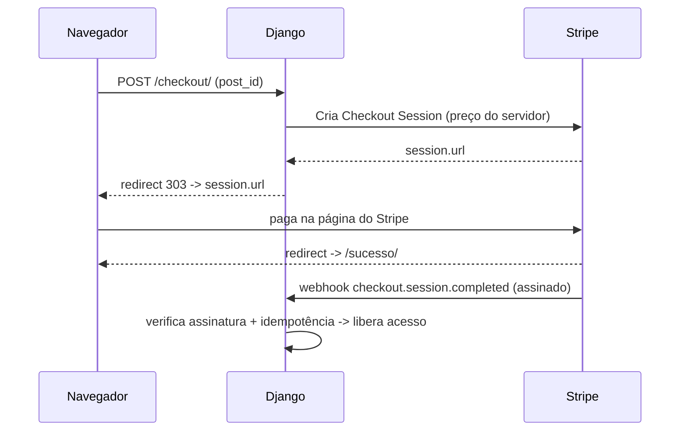

# Pagamentos com Stripe

Cobrar dinheiro de verdade dá medo — e com razão. Um cliente pode mexer no
preço no navegador, um webhook pode chegar duplicado, uma chave secreta pode
vazar. O **Stripe** resolve a parte difícil (cartão, PIX, antifraude, PCI) e nos
deixa só com o dever de casa: **nunca confiar no navegador** e **conferir a
assinatura** de tudo que ele nos manda de volta.

!!! quote "Pensa como criança 🧒"
    Você não deixa a criança dizer quanto custa o sorvete no caixa. O **cardápio
    da loja** (o servidor) define o preço; a criança só aponta o sabor. O Stripe
    é o caixa de confiança: ele cobra pelo preço que **você** definiu, não pelo
    que o cliente digitou no HTML.

## Caso de uso

Um leitor do nosso blog quer comprar acesso a um post premium por R$ 19,90.
O fluxo mais seguro e mais rápido de montar é o **Stripe Checkout**: nós criamos
uma *sessão* no servidor (com o preço que **nós** escolhemos), redirecionamos o
cliente para a página hospedada pelo Stripe, e recebemos a confirmação por
**webhook** — não pela volta do navegador.



!!! danger "O ouro vem pelo webhook, não pela URL de sucesso"
    A URL de sucesso (`success_url`) só serve para **mostrar** "obrigado" ao
    cliente. Ela **não** prova que o pagamento aconteceu — um curioso pode abrir
    `/sucesso/` na mão. A única fonte de verdade sobre "foi pago" é o **webhook**
    assinado pelo Stripe.

## Possibilidades

### Instalação e chaves de teste

```bash
uv add stripe
```

O Stripe te dá **dois pares** de chaves: teste (`sk_test_…` / `pk_test_…`) e
produção (`sk_live_…`). Comece sempre no modo teste — os cartões de teste
(`4242 4242 4242 4242`) só funcionam com a chave de teste.

!!! danger "Chave secreta NUNCA no código nem no repositório"
    A `sk_…` dá controle total da sua conta. Ela vive em **variável de
    ambiente**, nunca no `settings.py` versionado, nunca no JavaScript do
    front-end. Só a **publishable key** (`pk_…`) pode aparecer no navegador.
    Veja [configuração por ambiente](../referencia/config-ambientes.md).

```python
# settings.py
import os

STRIPE_SECRET_KEY = os.environ["STRIPE_SECRET_KEY"]
STRIPE_PUBLISHABLE_KEY = os.environ["STRIPE_PUBLISHABLE_KEY"]
STRIPE_WEBHOOK_SECRET = os.environ["STRIPE_WEBHOOK_SECRET"]
```

| Variável | Onde aparece | Segredo? |
| --- | --- | --- |
| `STRIPE_SECRET_KEY` (`sk_…`) | só no servidor | **Sim** — vazou, revogue já |
| `STRIPE_PUBLISHABLE_KEY` (`pk_…`) | pode ir ao navegador | Não |
| `STRIPE_WEBHOOK_SECRET` (`whsec_…`) | só no servidor | **Sim** |

### Guardar cliente e pedido

Antes de cobrar, precisamos de um lugar para registrar **o que** foi comprado e
**se** foi pago. Um `Order` simples resolve. Repare que o **preço fica no
servidor**: nunca guardamos "o valor que o cliente mandou".

```python
# apps/shop/models.py
from django.conf import settings
from django.db import models


class Order(models.Model):
    """A purchase of a premium post by a user."""

    class Status(models.TextChoices):
        PENDING = "pending", "Pending"
        PAID = "paid", "Paid"

    user = models.ForeignKey(
        settings.AUTH_USER_MODEL,
        on_delete=models.PROTECT,
        related_name="orders",
    )
    post = models.ForeignKey(
        "blog.Post",
        on_delete=models.PROTECT,
        related_name="orders",
    )
    amount_cents = models.PositiveIntegerField()
    currency = models.CharField(max_length=3, default="brl")
    status = models.CharField(
        max_length=16,
        choices=Status.choices,
        default=Status.PENDING,
    )
    stripe_session_id = models.CharField(max_length=255, blank=True, db_index=True)
    stripe_customer_id = models.CharField(max_length=255, blank=True)
    created_at = models.DateTimeField(auto_now_add=True)

    class Meta:
        indexes = [
            models.indexes.Index(fields=["stripe_session_id"]),
        ]

    def __str__(self) -> str:
        """Return a human-readable label for the order."""
        return f"Order #{self.pk} ({self.status})"
```

!!! warning "Preço mora no servidor, sempre"
    O `amount_cents` é preenchido a partir do **seu** catálogo (um dicionário,
    outro model, uma tabela de preços) — **nunca** de um campo enviado pelo
    cliente. Se o valor vier do formulário, qualquer um paga R$ 0,01 pelo post.

### Criar a Checkout Session

A view recebe o `post_id`, calcula o preço **do lado do servidor**, cria a
sessão e redireciona. Note o `303` — é o status correto para redirecionar depois
de um `POST`.

```python
# apps/shop/views.py
import stripe
from django.conf import settings
from django.contrib.auth.decorators import login_required
from django.http import HttpRequest, HttpResponse
from django.shortcuts import get_object_or_404, redirect
from django.urls import reverse
from django.views.decorators.http import require_POST

from apps.blog.models import Post
from apps.shop.models import Order

stripe.api_key = settings.STRIPE_SECRET_KEY

PRICES_CENTS: dict[str, int] = {"premium_post": 1990}


@require_POST
@login_required
def create_checkout(request: HttpRequest, post_id: int) -> HttpResponse:
    """Create a Stripe Checkout Session for a premium post and redirect to it.

    Args:
        request: The incoming HTTP request (an authenticated user).
        post_id: Primary key of the post being purchased.

    Returns:
        A 303 redirect to the Stripe-hosted checkout page.
    """
    post = get_object_or_404(Post, pk=post_id)
    amount_cents = PRICES_CENTS["premium_post"]

    order = Order.objects.create(
        user=request.user,
        post=post,
        amount_cents=amount_cents,
        currency="brl",
    )

    session = stripe.checkout.Session.create(
        mode="payment",
        line_items=[
            {
                "price_data": {
                    "currency": "brl",
                    "product_data": {"name": f"Post premium: {post.title}"},
                    "unit_amount": amount_cents,
                },
                "quantity": 1,
            },
        ],
        success_url=request.build_absolute_uri(
            reverse("shop:success") + "?session_id={CHECKOUT_SESSION_ID}"
        ),
        cancel_url=request.build_absolute_uri(reverse("shop:cancel")),
        client_reference_id=str(order.pk),
        metadata={"order_id": str(order.pk)},
    )

    order.stripe_session_id = session.id
    order.save(update_fields=["stripe_session_id"])

    return redirect(session.url, permanent=False)
```

!!! info "`unit_amount` é em centavos"
    Stripe trabalha com a **menor unidade** da moeda. R$ 19,90 = `1990`. Isso
    evita erros de arredondamento com float — trabalhe sempre com inteiros.

!!! tip "`client_reference_id` e `metadata` são suas âncoras"
    Guarde o `order.pk` na sessão (via `client_reference_id` **e**/ou
    `metadata`). Quando o webhook chegar, é assim que você reencontra **qual**
    pedido pagar sem confiar em nada que veio do navegador.

### Receber o webhook com segurança

Aqui mora a parte crítica. O Stripe faz um `POST` para a sua URL quando o
pagamento conclui. Qualquer um na internet também pode fazer um `POST` para essa
URL — por isso **verificamos a assinatura** antes de acreditar em qualquer coisa.

```python
# apps/shop/views.py (continuação)
import stripe
from django.conf import settings
from django.db import transaction
from django.http import HttpRequest, HttpResponse, HttpResponseBadRequest
from django.views.decorators.csrf import csrf_exempt
from django.views.decorators.http import require_POST

from apps.shop.models import Order


@csrf_exempt
@require_POST
def stripe_webhook(request: HttpRequest) -> HttpResponse:
    """Receive and verify Stripe webhook events, then fulfill paid orders.

    The request signature is verified against ``STRIPE_WEBHOOK_SECRET`` before
    any payload field is trusted. Fulfillment is idempotent: an order already
    marked as paid is skipped, so duplicated deliveries are harmless.

    Args:
        request: The raw webhook request delivered by Stripe.

    Returns:
        200 on success, 400 on an invalid payload or signature.
    """
    payload = request.body
    signature = request.headers.get("Stripe-Signature", "")

    try:
        event = stripe.Webhook.construct_event(
            payload=payload,
            sig_header=signature,
            secret=settings.STRIPE_WEBHOOK_SECRET,
        )
    except (ValueError, stripe.error.SignatureVerificationError):
        return HttpResponseBadRequest("Invalid payload or signature")

    if event["type"] == "checkout.session.completed":
        session = event["data"]["object"]
        order_id = session["metadata"]["order_id"]

        with transaction.atomic():
            order = (
                Order.objects.select_for_update()
                .filter(pk=order_id)
                .first()
            )
            if order is None:
                return HttpResponse(status=200)
            if order.status == Order.Status.PAID:
                return HttpResponse(status=200)
            if session["amount_total"] != order.amount_cents:
                return HttpResponseBadRequest("Amount mismatch")

            order.status = Order.Status.PAID
            order.stripe_customer_id = session.get("customer") or ""
            order.save(update_fields=["status", "stripe_customer_id"])

    return HttpResponse(status=200)
```

!!! danger "Sem `construct_event`, não há pagamento"
    `stripe.Webhook.construct_event(...)` recalcula o HMAC do corpo **cru**
    usando o `whsec_…` e compara com o cabeçalho `Stripe-Signature`. É o que
    prova que o evento veio mesmo do Stripe. Use `request.body` (**bytes
    crus**) — se você ler o JSON antes, a assinatura não bate.

!!! warning "`csrf_exempt` é obrigatório aqui — e só aqui"
    O Stripe não tem o cookie CSRF do seu site, então a view do webhook precisa
    de `@csrf_exempt`. Isso é seguro **porque** a autenticação vem da assinatura
    HMAC, não do CSRF. Nunca aplique `csrf_exempt` em views normais.

!!! tip "Idempotência: o mesmo evento pode chegar duas vezes"
    O Stripe **re-tenta** a entrega se você demora ou devolve erro — então o
    mesmo `checkout.session.completed` pode chegar de novo. Torne a operação
    idempotente: um pedido já `PAID` é ignorado. O `select_for_update()` dentro
    de `transaction.atomic()` evita que duas entregas simultâneas processem o
    mesmo pedido em paralelo. Veja [transações](../referencia/transactions.md).

### Confira o valor de novo no webhook

Repare na linha `session["amount_total"] != order.amount_cents`. Mesmo criando a
sessão no servidor, conferimos **de novo** que o Stripe cobrou o valor que
gravamos no pedido. É defesa em profundidade: o pedido é a fonte de verdade, o
webhook confirma.

### A URL do webhook

```python
# apps/shop/urls.py
from django.urls import path

from apps.shop import views

app_name = "shop"

urlpatterns = [
    path("checkout/<int:post_id>/", views.create_checkout, name="checkout"),
    path("webhook/stripe/", views.stripe_webhook, name="stripe-webhook"),
    path("sucesso/", views.success, name="success"),
    path("cancelado/", views.cancel, name="cancel"),
]
```

No painel do Stripe (Developers → Webhooks) você cadastra
`https://seusite.com/webhook/stripe/` e assina o evento
`checkout.session.completed`. O painel te mostra o `whsec_…` correspondente.

!!! tip "Teste webhooks localmente com a Stripe CLI"
    Em desenvolvimento, o Stripe não alcança `localhost`. Use a **Stripe CLI**:
    ```bash
    stripe listen --forward-to localhost:8000/webhook/stripe/
    stripe trigger checkout.session.completed
    ```
    O comando `listen` imprime um `whsec_…` temporário — use-o como
    `STRIPE_WEBHOOK_SECRET` local.

### Pagamentos e async

!!! note "A biblioteca `stripe` é síncrona por padrão"
    O SDK oficial faz chamadas HTTP bloqueantes. Numa view `async def`, envolva
    com `asgiref.sync.sync_to_async` ou use uma view síncrona comum — o Django
    lida bem com views síncronas. Para padrões de chamada a APIs externas, veja
    [APIs externas](../referencia/external-apis.md).

!!! quote "📖 Na documentação oficial"
    - [Stripe Docs](https://docs.stripe.com/)
    - [Configuração por ambiente](../referencia/config-ambientes.md)
    - [APIs externas](../referencia/external-apis.md)

## Recap

- O **Checkout Session** é o caminho mais seguro: você monta o preço **no
  servidor**, o cliente paga numa página hospedada pelo Stripe.
- **Nunca confie em valores do navegador** — preço e itens vêm do seu catálogo;
  guarde-os num `Order` antes de cobrar.
- Chaves ficam em **variáveis de ambiente**: `sk_…` e `whsec_…` são segredas; só
  a `pk_…` pode ir ao front-end. Comece pelas **chaves de teste**.
- A verdade sobre "foi pago" vem do **webhook**, não da `success_url`.
- Verifique **sempre** a assinatura com `stripe.Webhook.construct_event` usando o
  corpo cru (`request.body`); a view leva `@csrf_exempt`.
- Torne o processamento **idempotente** (pedido já `PAID` é ignorado) e proteja
  com `select_for_update()` — o Stripe re-tenta a entrega.
- Confira o `amount_total` de novo no webhook: defesa em profundidade.
