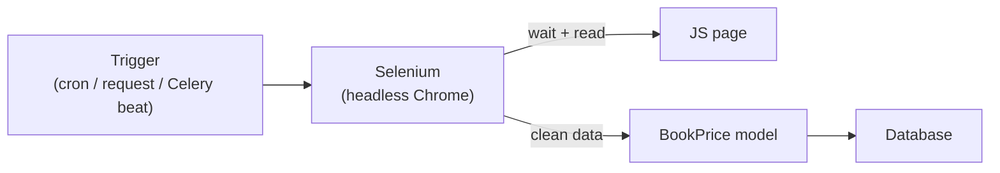

# Scraping with Selenium

Sometimes the data you need doesn't arrive in a nice API — it's **on a web page**,
rendered by JavaScript, hidden behind clicks and scrolls. That's where
**scraping** comes in: you open the page like a user would and **read what showed
up**. When the page only builds its content after JavaScript runs, `requests`
alone isn't enough — you need a **real browser**, and that's what **Selenium**
gives you.

!!! quote "Think like a child 🧒"
    `requests` is ordering the **menu over the phone**: you get the raw sheet, just
    the way the restaurant sent it. Selenium is **walking into the restaurant**,
    sitting down, waiting for the waiter to bring the dishes, pointing at what you
    want, and only then writing it down. If the food (the content) only appears
    **after you sit down** (JavaScript runs), you have to walk in — the phone won't
    show the plate.

## Use case

You have a Django blog and want to track **book prices** from a store that builds
its price list via JavaScript (so `requests` receives **empty** HTML). Once a day
you want to open the page, read each book's title and price, and **save them to
the database**.

Install Selenium:

```bash
uv add selenium
```

!!! info "Browser driver: bundled now (Selenium 4.6+)"
    You used to have to download `chromedriver` by hand and match its version to
    Chrome. Since Selenium 4.6 there's the **Selenium Manager**, which downloads
    and manages the driver automatically on first run. You just need Chrome (or
    Chromium) installed on the machine. On a server/container, install
    `google-chrome-stable` or `chromium` in the `Dockerfile`.

The model where we'll store the result:

```python
# apps/blog/models.py
from django.db import models


class BookPrice(models.Model):
    """A price observation scraped from an external store."""

    title = models.CharField(max_length=300)
    price = models.DecimalField(max_digits=8, decimal_places=2)
    source_url = models.URLField(max_length=500)
    scraped_at = models.DateTimeField(auto_now_add=True)

    class Meta:
        indexes = [
            models.Index(fields=["title", "scraped_at"]),
        ]

    def __str__(self) -> str:
        """Return a human-readable label."""
        return f"{self.title} — $ {self.price}"
```

The minimal scraper, with **headless Chrome** (no window) and **explicit wait**:

```python
# apps/blog/scraping.py
from decimal import Decimal

from selenium import webdriver
from selenium.webdriver.chrome.options import Options
from selenium.webdriver.common.by import By
from selenium.webdriver.support import expected_conditions as EC
from selenium.webdriver.support.wait import WebDriverWait


def make_driver() -> webdriver.Chrome:
    """Build a headless Chrome WebDriver ready for scraping.

    Returns:
        A configured Chrome WebDriver running without a visible window.
    """
    options = Options()
    options.add_argument("--headless=new")
    options.add_argument("--no-sandbox")
    options.add_argument("--disable-dev-shm-usage")
    options.add_argument("--window-size=1920,1080")
    return webdriver.Chrome(options=options)


def scrape_prices(url: str) -> list[dict[str, str | Decimal]]:
    """Open a JS-rendered store page and read every book title and price.

    Args:
        url: The store listing URL to scrape.

    Returns:
        A list of dicts with "title" and "price" keys. Empty if nothing matched.

    Raises:
        selenium.common.exceptions.TimeoutException: If the list never renders.
    """
    driver = make_driver()
    try:
        driver.get(url)
        WebDriverWait(driver, 15).until(
            EC.presence_of_element_located((By.CSS_SELECTOR, ".book-card"))
        )
        cards = driver.find_elements(By.CSS_SELECTOR, ".book-card")
        results: list[dict[str, str | Decimal]] = []
        for card in cards:
            title = card.find_element(By.CSS_SELECTOR, ".title").text.strip()
            raw = card.find_element(By.CSS_SELECTOR, ".price").text
            price = Decimal(raw.replace("$", "").replace(",", "").strip())
            results.append({"title": title, "price": price})
        return results
    finally:
        driver.quit()
```

!!! warning "Always `driver.quit()` in `finally`"
    Each driver spawns a Chrome process. If you don't close it, the processes
    **pile up** and take the server down with out-of-memory. Use `try/finally`
    (or a `contextmanager`) to guarantee `quit()` even when it errors.

## Possibilities

### 1. Locating elements: the `By` class

You point at elements with a **strategy** (`By.X`) and a **value**. The options:

| Strategy | Usage | When to choose |
| --- | --- | --- |
| `By.ID` | `find_element(By.ID, "main")` | Element has a stable `id` |
| `By.CSS_SELECTOR` | `find_element(By.CSS_SELECTOR, ".card .title")` | Recommended default — fast and flexible |
| `By.CLASS_NAME` | `find_element(By.CLASS_NAME, "price")` | A single class, simple |
| `By.NAME` | `find_element(By.NAME, "q")` | Form fields |
| `By.TAG_NAME` | `find_elements(By.TAG_NAME, "a")` | All of one kind |
| `By.LINK_TEXT` | `find_element(By.LINK_TEXT, "Next")` | Links by exact text |
| `By.PARTIAL_LINK_TEXT` | `find_element(By.PARTIAL_LINK_TEXT, "Nex")` | Links by part of the text |
| `By.XPATH` | `find_element(By.XPATH, "//div[@data-id='7']")` | Cases CSS can't reach |

!!! tip "`find_element` vs `find_elements`"
    - `find_element` (singular) returns **one** and raises
      `NoSuchElementException` if it finds nothing.
    - `find_elements` (plural) returns a **list**, and an **empty list** when it
      finds nothing — it never raises. Use the plural when "zero results" is a
      valid state (same empty-collection philosophy as the rest of the guide).

### 2. Waits: the heart of reliable scraping

A JavaScript page **isn't ready** when `get()` returns. If you read before the
content shows up, you get `NoSuchElementException` or empty data. There are three
approaches:

| Type | How | Verdict |
| --- | --- | --- |
| No wait | Read right after `get()` | ❌ Fragile, breaks on any slowness |
| Fixed wait (`time.sleep`) | `sleep(5)` | ❌ Either too slow or too short |
| **Explicit wait** | `WebDriverWait(...).until(EC...)` | ✅ Waits **only as needed**, up to a cap |
| Implicit wait | `driver.implicitly_wait(10)` | ⚠️ Global; okay, but less precise |

The **explicit wait** with `expected_conditions` is the correct way:

```python
# apps/blog/scraping.py
from selenium.webdriver.common.by import By
from selenium.webdriver.support import expected_conditions as EC
from selenium.webdriver.support.wait import WebDriverWait

wait = WebDriverWait(driver, 15)

wait.until(EC.presence_of_element_located((By.CSS_SELECTOR, ".book-card")))
wait.until(EC.visibility_of_element_located((By.ID, "total")))
wait.until(EC.element_to_be_clickable((By.CSS_SELECTOR, "button.load-more")))
wait.until(EC.text_to_be_present_in_element((By.ID, "status"), "Done"))
```

The most useful `expected_conditions`:

| Condition | Waits until... |
| --- | --- |
| `presence_of_element_located` | The element exists in the DOM |
| `visibility_of_element_located` | It exists **and** is visible |
| `element_to_be_clickable` | It's visible and enabled (ready to click) |
| `text_to_be_present_in_element` | Some text appears inside it |
| `presence_of_all_elements_located` | At least one of the group exists |
| `url_contains` | The URL changes to contain a substring |

!!! danger "Never use `time.sleep()` as a strategy"
    `time.sleep(5)` "works" on your machine and fails on the slow server — or
    wastes 5s when the page loaded in 0.5s. An explicit wait resolves **up to a
    cap**: it returns the moment the condition holds. It's both faster **and**
    more reliable.

### 3. Interacting: clicks, typing, scrolling

```python
# apps/blog/scraping.py
from selenium.webdriver.common.by import By
from selenium.webdriver.common.keys import Keys

search = driver.find_element(By.NAME, "q")
search.send_keys("django")
search.send_keys(Keys.RETURN)

driver.find_element(By.CSS_SELECTOR, "button.load-more").click()

driver.execute_script("window.scrollTo(0, document.body.scrollHeight);")
```

!!! note "Infinite-scroll pagination"
    Many stores load more items as you scroll. The pattern is: scroll to the
    bottom (`execute_script`), **wait** for the new cards to appear
    (`WebDriverWait`), repeat until the count stops growing. Don't scroll a fixed
    number of times — check the stop condition.

### 4. Running it: a management command (the simplest)

For **on-demand** scraping or via `cron`, a
[management command](../referencia/management-commands.md) is the most direct
route — it runs with all of Django loaded, so you already have the models at hand:

```python
# apps/blog/management/commands/scrape_prices.py
from django.core.management.base import BaseCommand

from apps.blog.models import BookPrice
from apps.blog.scraping import scrape_prices


class Command(BaseCommand):
    """Scrape book prices from a store and save them to the database."""

    help = "Scrape book prices and store them as BookPrice rows."

    def add_arguments(self, parser) -> None:
        """Register the required store URL argument."""
        parser.add_argument("url", type=str, help="Store listing URL to scrape.")

    def handle(self, *args: object, **options: object) -> None:
        """Run the scrape and persist each observation.

        Args:
            args: Unused positional arguments.
            options: Parsed CLI options, including the "url" string.
        """
        url = str(options["url"])
        rows = scrape_prices(url)
        created = [
            BookPrice(title=row["title"], price=row["price"], source_url=url)
            for row in rows
        ]
        BookPrice.objects.bulk_create(created)
        self.stdout.write(
            self.style.SUCCESS(f"Saved {len(created)} prices from {url}")
        )
```

Run it like this:

```bash
python manage.py scrape_prices "https://store.example.com/books"
```

Schedule it in the system `cron` (once a day, at 3 a.m.):

```cron
0 3 * * * cd /app && /app/.venv/bin/python manage.py scrape_prices "https://store.example.com/books"
```

### 5. Running it: a background task (for scale)

Selenium is **slow** and **heavy** (it opens a whole Chrome). Running it inside an
HTTP request blocks the worker for seconds. For frequent scraping, triggered by a
user action, or across many URLs, use a [Celery task](celery.md):

```python
# apps/blog/tasks.py
from celery import shared_task

from apps.blog.models import BookPrice
from apps.blog.scraping import scrape_prices


@shared_task
def scrape_prices_task(url: str) -> int:
    """Scrape a store URL in the background and store the results.

    Args:
        url: The store listing URL to scrape.

    Returns:
        The number of price rows created.
    """
    rows = scrape_prices(url)
    objs = [
        BookPrice(title=row["title"], price=row["price"], source_url=url)
        for row in rows
    ]
    BookPrice.objects.bulk_create(objs)
    return len(objs)
```

```python
scrape_prices_task.delay("https://store.example.com/books")
```



### 6. Selenium **or** BeautifulSoup + requests?

Selenium is a sledgehammer: it opens a real browser. Often you **don't need it**.
If the HTML already arrives complete (no JavaScript building the content),
`requests` + `beautifulsoup4` is **much** faster and lighter.

| Situation | Tool |
| --- | --- |
| HTML already complete in `curl`/`requests` | ✅ `requests` + BeautifulSoup |
| Content built by JavaScript | ✅ Selenium |
| Need to click / scroll / log in / wait | ✅ Selenium |
| Just reading static tables/lists | ✅ `requests` + BeautifulSoup |
| Thousands of pages, high speed | ✅ `requests` (Selenium is slow) |
| An official API exists (JSON) | ✅ Neither — [use the API](../referencia/external-apis.md) |

The same case, when the HTML **already arrives complete**:

```python
# apps/blog/scraping.py
import requests
from bs4 import BeautifulSoup


def scrape_static(url: str) -> list[dict[str, str]]:
    """Scrape a server-rendered page without a browser.

    Args:
        url: The page URL to fetch.

    Returns:
        A list of dicts with "title" and "price". Empty if nothing matched.

    Raises:
        requests.HTTPError: If the server returns a 4xx/5xx status.
    """
    response = requests.get(url, headers={"User-Agent": "MyBlog/1.0"}, timeout=10)
    response.raise_for_status()
    soup = BeautifulSoup(response.text, "html.parser")
    results: list[dict[str, str]] = []
    for card in soup.select(".book-card"):
        results.append(
            {
                "title": card.select_one(".title").get_text(strip=True),
                "price": card.select_one(".price").get_text(strip=True),
            }
        )
    return results
```

!!! tip "Test without a browser first"
    Before reaching for Selenium, run `curl https://site/page | grep 'price'`. If
    the data **already shows up** in the raw HTML, use `requests` + BeautifulSoup
    and you're done — you save memory, time, and headaches. Only step up to
    Selenium when the content **disappears** in the raw HTML (it's built by JS).

### 7. Ethics, `robots.txt`, and rate limits

Scraping touches **other people's** servers. Do it right:

- **Respect `robots.txt`.** It lists what the site asks you **not** to access.
  Check it first with `urllib.robotparser`:

```python
# apps/blog/scraping.py
from urllib.robotparser import RobotFileParser


def can_fetch(url: str, user_agent: str = "MyBlog/1.0") -> bool:
    """Check whether robots.txt allows fetching a URL.

    Args:
        url: The target URL.
        user_agent: The user agent string you will identify with.

    Returns:
        True if fetching is allowed by robots.txt, False otherwise.
    """
    parser = RobotFileParser()
    parser.set_url(url.rsplit("/", maxsplit=1)[0] + "/robots.txt")
    parser.read()
    return parser.can_fetch(user_agent, url)
```

- **Rate-limit yourself.** Don't fire hundreds of requests per second — put a
  pause between pages (e.g. 1–2s) and avoid the target's peak hours.
- **Identify yourself.** Use an honest `User-Agent` with a way to reach you.
- **Read the Terms of Service.** Some sites forbid scraping by contract. Personal
  data has extra rules (LGPD/GDPR).
- **Prefer the official API.** If one exists, it's more stable, faster, and
  legitimate. See [Consuming external APIs](../referencia/external-apis.md).

!!! danger "Scraping can be illegal or get you banned"
    Ignoring `robots.txt`, hammering the server, or collecting personal data can
    violate Terms of Service and laws (LGPD/GDPR/CFAA). Beyond the legal risk, you
    get an **IP ban**. Scrape slowly, respectfully, and only what you have the
    right to collect.

!!! warning "Selectors break — sites change"
    Your `.book-card` works today and vanishes tomorrow when the site redesigns.
    Scraping is **ongoing maintenance**: handle
    `NoSuchElementException`/`TimeoutException`, log the failures, and monitor.
    Don't trust that ran-once means runs-forever.

!!! quote "📖 In the official docs"
    - [Selenium — documentation](https://www.selenium.dev/documentation/)
    - [Management commands](../referencia/management-commands.md)
    - [Tasks with Celery](celery.md)
    - [Consuming external APIs](../referencia/external-apis.md)

## Recap

- **Selenium** drives a **real browser** (headless Chrome) — use it when the
  content is built by **JavaScript** and `requests` receives empty HTML.
- Since Selenium 4.6, the **Selenium Manager** downloads the driver for you; you
  just need Chrome/Chromium installed.
- Locate with `By` (prefer `By.CSS_SELECTOR`); `find_elements` returns an **empty
  list**, `find_element` raises when it finds nothing.
- Use an **explicit wait** (`WebDriverWait` + `expected_conditions`), **never**
  `time.sleep()`; always `driver.quit()` in `finally`.
- Run it via a **management command** (`cron`) for the simple case, or a **Celery
  task** for scale — Selenium is too slow for the HTTP request.
- If the HTML **already arrives complete**, use **`requests` + BeautifulSoup**
  (lighter and faster); if an **official API** exists, use the API.
- Scrape with **ethics**: respect `robots.txt`, rate-limit, identify yourself, and
  read the Terms of Service.

Data collection mastered. Next, see how Django talks to outside services cleanly:
**[Consuming external APIs](../referencia/external-apis.md)**.
