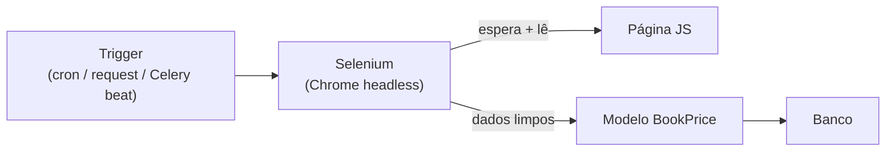

# Scraping com Selenium

Às vezes o dado que você precisa não vem numa API bonitinha — está **numa página
web**, renderizada por JavaScript, escondido atrás de cliques e rolagens. Aí
entra o **scraping**: você abre a página como um usuário faria e **lê o que
apareceu**. Quando a página só monta o conteúdo depois do JavaScript rodar, o
`requests` sozinho não basta — você precisa de um **navegador de verdade**, e é
isso que o **Selenium** dá.

!!! quote "Pensa como criança 🧒"
    `requests` é pedir o **cardápio pelo telefone**: você recebe o papel cru, do
    jeito que o restaurante mandou. Selenium é **entrar no restaurante**, sentar,
    esperar o garçom trazer os pratos, apontar para o que quer e só então anotar.
    Se a comida (o conteúdo) só aparece **depois que você senta** (o JavaScript
    roda), você precisa entrar — o telefone não mostra o prato.

## Caso de uso

Você tem um blog Django e quer acompanhar **preços de livros** de uma loja que
monta a lista de preços via JavaScript (então `requests` recebe o HTML **vazio**).
Você quer, uma vez por dia, abrir a página, ler título e preço de cada livro e
**guardar no banco**.

Instale o Selenium:

```bash
uv add selenium
```

!!! info "Driver do navegador: já vem junto (Selenium 4.6+)"
    Antigamente você tinha que baixar o `chromedriver` na mão e casar a versão com
    o Chrome. Desde o Selenium 4.6 existe o **Selenium Manager**, que baixa e
    gerencia o driver automaticamente na primeira execução. Basta ter o Chrome (ou
    Chromium) instalado na máquina. Em servidor/container, instale o
    `google-chrome-stable` ou `chromium` no `Dockerfile`.

O modelo onde vamos guardar o resultado:

```python
# apps/blog/models.py
from django.db import models


class BookPrice(models.Model):
    """A price observation scraped from an external store."""

    title = models.CharField(max_length=300)
    price = models.DecimalField(max_digits=8, decimal_places=2)
    source_url = models.URLField(max_length=500)
    scraped_at = models.DateTimeField(auto_now_add=True)

    class Meta:
        indexes = [
            models.Index(fields=["title", "scraped_at"]),
        ]

    def __str__(self) -> str:
        """Return a human-readable label."""
        return f"{self.title} — R$ {self.price}"
```

O scraper mínimo, com **Chrome headless** (sem janela) e **espera explícita**:

```python
# apps/blog/scraping.py
from decimal import Decimal

from selenium import webdriver
from selenium.webdriver.chrome.options import Options
from selenium.webdriver.common.by import By
from selenium.webdriver.support import expected_conditions as EC
from selenium.webdriver.support.wait import WebDriverWait


def make_driver() -> webdriver.Chrome:
    """Build a headless Chrome WebDriver ready for scraping.

    Returns:
        A configured Chrome WebDriver running without a visible window.
    """
    options = Options()
    options.add_argument("--headless=new")
    options.add_argument("--no-sandbox")
    options.add_argument("--disable-dev-shm-usage")
    options.add_argument("--window-size=1920,1080")
    return webdriver.Chrome(options=options)


def scrape_prices(url: str) -> list[dict[str, str | Decimal]]:
    """Open a JS-rendered store page and read every book title and price.

    Args:
        url: The store listing URL to scrape.

    Returns:
        A list of dicts with "title" and "price" keys. Empty if nothing matched.

    Raises:
        selenium.common.exceptions.TimeoutException: If the list never renders.
    """
    driver = make_driver()
    try:
        driver.get(url)
        WebDriverWait(driver, 15).until(
            EC.presence_of_element_located((By.CSS_SELECTOR, ".book-card"))
        )
        cards = driver.find_elements(By.CSS_SELECTOR, ".book-card")
        results: list[dict[str, str | Decimal]] = []
        for card in cards:
            title = card.find_element(By.CSS_SELECTOR, ".title").text.strip()
            raw = card.find_element(By.CSS_SELECTOR, ".price").text
            price = Decimal(raw.replace("R$", "").replace(",", ".").strip())
            results.append({"title": title, "price": price})
        return results
    finally:
        driver.quit()
```

!!! warning "Sempre `driver.quit()` no `finally`"
    Cada driver abre um processo do Chrome. Se você não fechar, os processos
    **acumulam** e derrubam o servidor por falta de memória. Use `try/finally`
    (ou um `contextmanager`) para garantir o `quit()` mesmo quando dá erro.

## Possibilidades

### 1. Localizando elementos: a classe `By`

Você aponta para elementos com uma **estratégia** (`By.X`) e um **valor**. As
opções:

| Estratégia | Uso | Quando escolher |
| --- | --- | --- |
| `By.ID` | `find_element(By.ID, "main")` | Elemento tem `id` estável |
| `By.CSS_SELECTOR` | `find_element(By.CSS_SELECTOR, ".card .title")` | Padrão recomendado — rápido e flexível |
| `By.CLASS_NAME` | `find_element(By.CLASS_NAME, "price")` | Uma classe só, simples |
| `By.NAME` | `find_element(By.NAME, "q")` | Campos de formulário |
| `By.TAG_NAME` | `find_elements(By.TAG_NAME, "a")` | Todos de um tipo |
| `By.LINK_TEXT` | `find_element(By.LINK_TEXT, "Próxima")` | Links pelo texto exato |
| `By.PARTIAL_LINK_TEXT` | `find_element(By.PARTIAL_LINK_TEXT, "Próx")` | Links por parte do texto |
| `By.XPATH` | `find_element(By.XPATH, "//div[@data-id='7']")` | Casos que CSS não alcança |

!!! tip "`find_element` vs `find_elements`"
    - `find_element` (singular) retorna **um** e lança `NoSuchElementException`
      se não achar.
    - `find_elements` (plural) retorna uma **lista**, e **lista vazia** quando não
      acha nada — nunca lança. Use o plural quando "zero resultados" é um estado
      válido (segue a mesma filosofia de coleções vazias do resto do guia).

### 2. Esperas: o coração do scraping confiável

Página com JavaScript **não está pronta** quando `get()` retorna. Se você ler
antes de o conteúdo aparecer, pega `NoSuchElementException` ou dados vazios. Há
três abordagens:

| Tipo | Como | Veredito |
| --- | --- | --- |
| Sem espera | Ler direto após `get()` | ❌ Frágil, quebra com qualquer lentidão |
| Espera fixa (`time.sleep`) | `sleep(5)` | ❌ Ou lento demais, ou curto demais |
| **Espera explícita** | `WebDriverWait(...).until(EC...)` | ✅ Espera **só o necessário**, até um teto |
| Espera implícita | `driver.implicitly_wait(10)` | ⚠️ Global; ok, mas menos preciso |

A **espera explícita** com `expected_conditions` é a forma correta:

```python
# apps/blog/scraping.py
from selenium.webdriver.common.by import By
from selenium.webdriver.support import expected_conditions as EC
from selenium.webdriver.support.wait import WebDriverWait

wait = WebDriverWait(driver, 15)

wait.until(EC.presence_of_element_located((By.CSS_SELECTOR, ".book-card")))
wait.until(EC.visibility_of_element_located((By.ID, "total")))
wait.until(EC.element_to_be_clickable((By.CSS_SELECTOR, "button.load-more")))
wait.until(EC.text_to_be_present_in_element((By.ID, "status"), "Pronto"))
```

Condições mais úteis de `expected_conditions`:

| Condição | Espera até... |
| --- | --- |
| `presence_of_element_located` | O elemento existir no DOM |
| `visibility_of_element_located` | Existir **e** estar visível |
| `element_to_be_clickable` | Estar visível e habilitado (pronto p/ clique) |
| `text_to_be_present_in_element` | Um texto aparecer dentro dele |
| `presence_of_all_elements_located` | Pelo menos um do grupo existir |
| `url_contains` | A URL mudar para conter um trecho |

!!! danger "Nunca use `time.sleep()` como estratégia"
    `time.sleep(5)` "funciona" na sua máquina e falha no servidor lento — ou
    desperdiça 5s quando a página carregou em 0,5s. Espera explícita resolve
    **até um teto**: retorna assim que a condição bate. É mais rápido **e** mais
    confiável.

### 3. Interagindo: cliques, digitação, rolagem

```python
# apps/blog/scraping.py
from selenium.webdriver.common.by import By
from selenium.webdriver.common.keys import Keys

search = driver.find_element(By.NAME, "q")
search.send_keys("django")
search.send_keys(Keys.RETURN)

driver.find_element(By.CSS_SELECTOR, "button.load-more").click()

driver.execute_script("window.scrollTo(0, document.body.scrollHeight);")
```

!!! note "Paginação por scroll infinito"
    Muitas lojas carregam mais itens conforme você rola. O padrão é: rolar até o
    fim (`execute_script`), **esperar** os novos cards aparecerem
    (`WebDriverWait`), repetir até a contagem parar de crescer. Não role um número
    fixo de vezes — verifique a condição de parada.

### 4. Rodando: management command (o mais simples)

Para scraping **sob demanda** ou via `cron`, um
[management command](../referencia/management-commands.md) é o caminho mais
direto — roda com todo o Django carregado, então você já tem os modelos à mão:

```python
# apps/blog/management/commands/scrape_prices.py
from django.core.management.base import BaseCommand

from apps.blog.models import BookPrice
from apps.blog.scraping import scrape_prices


class Command(BaseCommand):
    """Scrape book prices from a store and save them to the database."""

    help = "Scrape book prices and store them as BookPrice rows."

    def add_arguments(self, parser) -> None:
        """Register the required store URL argument."""
        parser.add_argument("url", type=str, help="Store listing URL to scrape.")

    def handle(self, *args: object, **options: object) -> None:
        """Run the scrape and persist each observation.

        Args:
            args: Unused positional arguments.
            options: Parsed CLI options, including the "url" string.
        """
        url = str(options["url"])
        rows = scrape_prices(url)
        created = [
            BookPrice(title=row["title"], price=row["price"], source_url=url)
            for row in rows
        ]
        BookPrice.objects.bulk_create(created)
        self.stdout.write(
            self.style.SUCCESS(f"Saved {len(created)} prices from {url}")
        )
```

Rode assim:

```bash
python manage.py scrape_prices "https://loja.exemplo.com/livros"
```

Agende no `cron` do sistema (uma vez por dia, às 3h):

```cron
0 3 * * * cd /app && /app/.venv/bin/python manage.py scrape_prices "https://loja.exemplo.com/livros"
```

### 5. Rodando: tarefa em background (para escala)

Selenium é **lento** e **pesado** (abre um Chrome inteiro). Rodar dentro de um
request HTTP trava o worker por segundos. Para scraping frequente, disparado por
ação do usuário, ou em muitas URLs, use uma
[tarefa Celery](celery.md):

```python
# apps/blog/tasks.py
from celery import shared_task

from apps.blog.models import BookPrice
from apps.blog.scraping import scrape_prices


@shared_task
def scrape_prices_task(url: str) -> int:
    """Scrape a store URL in the background and store the results.

    Args:
        url: The store listing URL to scrape.

    Returns:
        The number of price rows created.
    """
    rows = scrape_prices(url)
    objs = [
        BookPrice(title=row["title"], price=row["price"], source_url=url)
        for row in rows
    ]
    BookPrice.objects.bulk_create(objs)
    return len(objs)
```

```python
scrape_prices_task.delay("https://loja.exemplo.com/livros")
```



### 6. Selenium **ou** BeautifulSoup + requests?

Selenium é uma marreta: abre um navegador de verdade. Muitas vezes você **não
precisa dele**. Se o HTML já vem pronto (sem JavaScript montando o conteúdo),
`requests` + `beautifulsoup4` é **muito** mais rápido e leve.

| Situação | Ferramenta |
| --- | --- |
| HTML já vem completo no `curl`/`requests` | ✅ `requests` + BeautifulSoup |
| Conteúdo montado por JavaScript | ✅ Selenium |
| Precisa clicar / rolar / logar / esperar | ✅ Selenium |
| Só ler tabelas/listas estáticas | ✅ `requests` + BeautifulSoup |
| Milhares de páginas, alta velocidade | ✅ `requests` (Selenium é lento) |
| Existe uma API oficial (JSON) | ✅ Nem uma nem outra — [use a API](../referencia/external-apis.md) |

O mesmo caso, quando o HTML **já vem pronto**:

```python
# apps/blog/scraping.py
import requests
from bs4 import BeautifulSoup


def scrape_static(url: str) -> list[dict[str, str]]:
    """Scrape a server-rendered page without a browser.

    Args:
        url: The page URL to fetch.

    Returns:
        A list of dicts with "title" and "price". Empty if nothing matched.

    Raises:
        requests.HTTPError: If the server returns a 4xx/5xx status.
    """
    response = requests.get(url, headers={"User-Agent": "MeuBlog/1.0"}, timeout=10)
    response.raise_for_status()
    soup = BeautifulSoup(response.text, "html.parser")
    results: list[dict[str, str]] = []
    for card in soup.select(".book-card"):
        results.append(
            {
                "title": card.select_one(".title").get_text(strip=True),
                "price": card.select_one(".price").get_text(strip=True),
            }
        )
    return results
```

!!! tip "Teste primeiro sem navegador"
    Antes de trazer o Selenium, rode `curl https://site/pagina | grep 'preço'`.
    Se o dado **já aparece** no HTML cru, use `requests` + BeautifulSoup e
    pronto — você economiza memória, tempo e dor de cabeça. Só suba para Selenium
    quando o conteúdo **some** no HTML cru (é montado por JS).

### 7. Ética, `robots.txt` e limites

Scraping mexe com o servidor **dos outros**. Faça direito:

- **Respeite o `robots.txt`.** Ele lista o que o site pede para você **não**
  acessar. Verifique antes com `urllib.robotparser`:

```python
# apps/blog/scraping.py
from urllib.robotparser import RobotFileParser


def can_fetch(url: str, user_agent: str = "MeuBlog/1.0") -> bool:
    """Check whether robots.txt allows fetching a URL.

    Args:
        url: The target URL.
        user_agent: The user agent string you will identify with.

    Returns:
        True if fetching is allowed by robots.txt, False otherwise.
    """
    parser = RobotFileParser()
    parser.set_url(url.rsplit("/", maxsplit=1)[0] + "/robots.txt")
    parser.read()
    return parser.can_fetch(user_agent, url)
```

- **Limite a taxa.** Não dispare centenas de requisições por segundo — coloque
  uma pausa entre páginas (ex.: 1–2s) e evite horários de pico do alvo.
- **Identifique-se.** Use um `User-Agent` honesto com um jeito de contato.
- **Leia os Termos de Serviço.** Alguns sites proíbem scraping por contrato.
  Dados pessoais têm regras extras (LGPD/GDPR).
- **Prefira a API oficial.** Se existir, é mais estável, mais rápida e legítima.
  Veja [Consumindo APIs externas](../referencia/external-apis.md).

!!! danger "Scraping pode ser ilegal ou dar ban"
    Ignorar `robots.txt`, martelar o servidor ou coletar dados pessoais pode
    violar Termos de Serviço e leis (LGPD/GDPR/CFAA). Além do risco jurídico,
    você toma **bloqueio de IP**. Scrape devagar, com respeito, e só o que você
    tem direito de coletar.

!!! warning "Selectors quebram — sites mudam"
    Seu `.book-card` funciona hoje e some amanhã quando o site redesenha. Scraping
    é **manutenção contínua**: trate `NoSuchElementException`/`TimeoutException`,
    logue as falhas e monitore. Não confie que rodou uma vez = roda para sempre.

!!! quote "📖 Na documentação oficial"
    - [Selenium — documentação](https://www.selenium.dev/documentation/)
    - [Management commands](../referencia/management-commands.md)
    - [Tarefas com Celery](celery.md)
    - [Consumindo APIs externas](../referencia/external-apis.md)

## Recap

- **Selenium** dirige um **navegador de verdade** (Chrome headless) — use quando
  o conteúdo é montado por **JavaScript** e o `requests` recebe HTML vazio.
- Desde o Selenium 4.6, o **Selenium Manager** baixa o driver sozinho; só precisa
  do Chrome/Chromium instalado.
- Localize com `By` (prefira `By.CSS_SELECTOR`); `find_elements` retorna **lista
  vazia**, `find_element` lança quando não acha.
- Use **espera explícita** (`WebDriverWait` + `expected_conditions`), **nunca**
  `time.sleep()`; sempre `driver.quit()` no `finally`.
- Rode via **management command** (`cron`) para o simples, ou **tarefa Celery**
  para escala — Selenium é lento demais para o request HTTP.
- Se o HTML **já vem pronto**, use **`requests` + BeautifulSoup** (mais leve e
  rápido); se existe **API oficial**, use a API.
- Scrape com **ética**: respeite `robots.txt`, limite a taxa, identifique-se e
  leia os Termos de Serviço.

Coleta de dados dominada. A seguir, veja como o Django conversa com serviços de
fora de forma limpa: **[Consumindo APIs externas](../referencia/external-apis.md)**.
