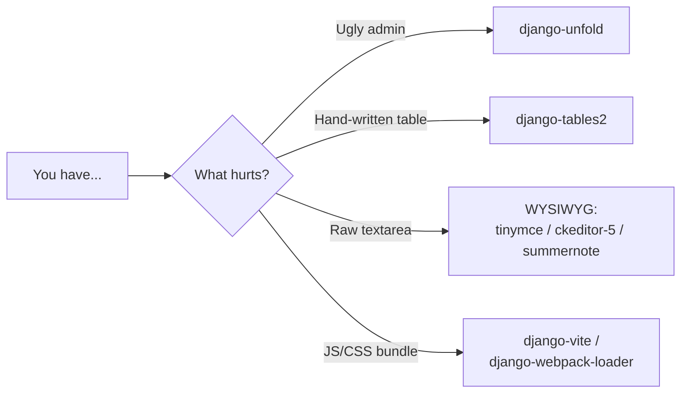

# UI libraries: unfold, tables2, WYSIWYG and vite

Django already ships a working admin and a template system that renders HTML. But
in 2026 almost every project ends up wanting a bit more: a **pretty**, modern
admin, **sortable and paginated** tables without hand-writing HTML, a **rich**
text editor (bold, images, links) for whoever writes content, and a bridge to a
**modern frontend** (Vite/React/Vue). This page is the catalog of those pieces.

!!! quote "Think like a child 🧒"
    You already have a house (Django) with walls and doors that work. These libs
    are the **decoration and furniture**: a nice coat of paint on the walls
    (unfold), shelves that organize themselves (tables2), a fancy typewriter
    (WYSIWYG) and plumbing that connects the new kitchen to the rest of the house
    (vite). The house works without them — but it's a lot nicer to live in.

## Use case

You have the sample blog (`apps.blog` with `Post`, `Author`, `Tag`, `Comment`).
Today:

- The admin works, but it's gray and dated — the client complains it "looks like
  2010".
- The public posts page is an HTML table you wrote by hand; sorting by date means
  touching the code.
- The `Post`'s `content` field is a raw `<textarea>` — the author can't add bold
  or images.
- You want to use React/Vite in one part of the site, but you don't know how
  Django serves the bundle with the right hash.

Each of these four pains has a ready-made lib. Let's go one at a time.

## Possibilities

| Lib | Solves | Install |
| --- | --- | --- |
| **django-unfold** | Modern Tailwind admin theme | `uv add django-unfold` |
| **django-tables2** | Declarative HTML tables, sortable and paginated | `uv add django-tables2` |
| **django-tinymce** / **django-ckeditor-5** / **django-summernote** | Rich text editor (WYSIWYG) | `uv add django-tinymce` |
| **django-vite** / **django-webpack-loader** | Serve Vite/webpack JS/CSS bundles in templates | `uv add django-vite` |

### 1. django-unfold — a pretty admin by default

Django's admin is functionally great, but visually it's been the same forever.
**django-unfold** is a modern theme based on Tailwind CSS: dark mode, an organized
sidebar, nicer filters — all without rewriting your `ModelAdmin` classes. In 2026
it became practically the default for anyone who wants to ship a presentable
admin.

The install trick: unfold **replaces** the `django.contrib.admin` app, so it must
come **before** it in `INSTALLED_APPS`.

```python
# config/settings.py
INSTALLED_APPS = [
    "unfold",                    # (1)!
    "django.contrib.admin",
    "django.contrib.auth",
    "django.contrib.contenttypes",
    "django.contrib.sessions",
    "django.contrib.messages",
    "django.contrib.staticfiles",
    "apps.blog",
]
```

1. `"unfold"` comes **before** `"django.contrib.admin"`. It overrides the admin
    templates; if it came after, Django would find the original templates first
    and nothing would change.

Now, instead of subclassing `admin.ModelAdmin`, you subclass
`unfold.admin.ModelAdmin` — the API is the same, only the looks change:

```python
# apps/blog/admin.py
from django.contrib import admin
from unfold.admin import ModelAdmin

from apps.blog.models import Post


@admin.register(Post)
class PostAdmin(ModelAdmin):
    """Blog post admin, styled with django-unfold."""

    list_display = ("title", "author", "status", "published_at")
    list_filter = ("status", "tags")
    search_fields = ("title", "content")
```

!!! tip "Configuration lives in `UNFOLD` in settings"
    Colors, logo, site title and sidebar items are defined in an
    `UNFOLD = {...}` dictionary in `settings.py`. You can swap the palette, hide
    apps and build your own sidebar menu without touching a template. See the
    [admin reference](../referencia/admin.md) for the basics of `ModelAdmin`.

!!! note "Not the only one"
    There are also `django-jazzmin`, `django-grappelli` and the classic
    `django-suit`. unfold is the most active and "Tailwind-native" in 2026, but
    they all follow the same idea: swap the admin templates for prettier ones.

### 2. django-tables2 — tables that organize themselves

Writing `<table><thead>...<tbody>...` by hand is tedious and, worse,
sorting by column turns into an `if request.GET` circus. **django-tables2** lets
you **declare** the table in a class (just like a form or a serializer) and takes
care of click-to-sort headers, pagination and rendering.

```python
# apps/blog/tables.py
import django_tables2 as tables

from apps.blog.models import Post


class PostTable(tables.Table):
    """Declarative table for listing blog posts."""

    class Meta:
        model = Post
        fields = ("title", "author", "status", "published_at")   # (1)!
        order_by = "-published_at"                                # (2)!
```

1. The columns that show up — in the order you list them.
2. Initial ordering (most recent first); the user can reorder by clicking the
    header.

In the view, you build the table with the queryset and hand it to the template:

```python
# apps/blog/views.py
from django.views.generic import ListView
from django_tables2 import SingleTableMixin

from apps.blog.models import Post
from apps.blog.tables import PostTable


class PostTableView(SingleTableMixin, ListView):
    """List posts using a django-tables2 table."""

    model = Post
    table_class = PostTable
    template_name = "blog/post_table.html"
    paginate_by = 10        # (1)!
```

1. Pagination for free — tables2 respects `paginate_by` and draws the page
    controls.

```django
{# templates/blog/post_table.html #}

        {# draws the whole table, with sorting and pagination #}
```

!!! tip "Pairs with django-filter"
    tables2 displays and sorts; [django-filter](django-filter.md) filters.
    Together (`django_tables2.SingleTableMixin` + `django_filters.views.FilterView`,
    via the `django-tables2` + `django-filter` libs) you get a complete listing:
    filter, sort and paginate, all through the URL.

!!! note "Custom columns"
    You can declare explicit columns instead of using `Meta.fields`:
    `title = tables.Column(verbose_name="Title")`,
    `tags = tables.ManyToManyColumn()`, or a
    `tables.TemplateColumn("{{ record.title|upper }}")` for bespoke HTML.

### 3. WYSIWYG editors — rich text for writers

WYSIWYG = *What You See Is What You Get*. Instead of a `<textarea>` where the
author types HTML by hand, they get a toolbar (bold, lists, links, images) and see
the result while writing. There are three popular options — all work by swapping
the widget of a `TextField`.

| Lib | Editor behind it | Note |
| --- | --- | --- |
| **django-tinymce** | TinyMCE | Mature, many plugins |
| **django-ckeditor-5** | CKEditor 5 | Modern; the old `django-ckeditor` (CKEditor 4) is discontinued — use `-5` |
| **django-summernote** | Summernote | Lightweight, Bootstrap-based |

Example with `django-tinymce`, which replaces the field with a rich editor:

```python
# config/settings.py
INSTALLED_APPS = ["tinymce", ...]
```

```python
# apps/blog/models.py
from django.db import models
from tinymce.models import HTMLField


class Post(models.Model):
    """A blog post whose body is edited with a rich-text editor."""

    title = models.CharField(max_length=200)
    content = HTMLField()       # (1)!

    def __str__(self) -> str:
        """Return the post title."""
        return self.title
```

1. `HTMLField` is a `TextField` that, in the admin and in forms, appears as the
    TinyMCE editor instead of a raw `<textarea>`.

If you want the editor only in the admin without changing the model field, use a
widget in the admin form:

```python
# apps/blog/admin.py
from django import forms
from django.contrib import admin
from tinymce.widgets import TinyMCE

from apps.blog.models import Post


class PostAdminForm(forms.ModelForm):
    """Admin form that renders the content field with TinyMCE."""

    class Meta:
        model = Post
        fields = "__all__"
        widgets = {"content": TinyMCE()}


@admin.register(Post)
class PostAdmin(admin.ModelAdmin):
    """Post admin using a rich-text editor for the body."""

    form = PostAdminForm
```

!!! danger "User HTML is dangerous — sanitize on output"
    A rich editor stores **HTML** in the database. If you render that HTML with
    `{{ post.content|safe }}` without cleaning it, you open the door to XSS (a
    malicious author injects `<script>`). Sanitize with a lib like `nh3` (a
    binding for `ammonia`) or `bleach` before saving/displaying, and restrict the
    allowed tags in the editor configuration. Never trust what came out of the
    editor.

!!! warning "Image uploads need configuration"
    Pasting/uploading images through the editor writes files to your
    `MEDIA_ROOT` — it only works with `MEDIA_URL`/`MEDIA_ROOT` configured and an
    upload handler (`django-ckeditor-5` and `django-tinymce` ship views for this).
    See [organizing assets](../referencia/organizando-assets.md).

### 4. django-vite / django-webpack-loader — bridge to the modern frontend

When part of the site uses **React, Vue or Svelte** compiled by **Vite** (or
webpack), the browser doesn't load your `.jsx` — it loads a **bundle** named
something like `main.a3f9c2.js` (the hash changes on every build, to bust the
cache). The problem: in the Django template you don't know the current hash. These
libs read the **manifest** generated by the bundler and resolve the right name for
you.

```python
# config/settings.py
INSTALLED_APPS = ["django_vite", ...]

DJANGO_VITE = {
    "default": {
        "dev_mode": DEBUG,          # (1)!
        "manifest_path": BASE_DIR / "assets" / "dist" / ".vite" / "manifest.json",
    }
}
```

1. In development (`dev_mode=True`), Django points to the Vite dev server with
    hot-reload. In production, it reads `manifest.json` and serves the already
    compiled, hashed files.

```django
{# templates/base.html #}

<!doctype html>
<html>
  <head>
                           {# only does something in dev_mode #}
                 {# resolves to the hashed bundle #}
  </head>
  <body>
    <div id="app"></div>
  </body>
</html>
```

!!! info "Vite or webpack?"
    `django-vite` is for projects using **Vite** (the modern default in 2026).
    `django-webpack-loader` is the classic equivalent for **webpack** and is still
    valid in older codebases. The idea is identical: match the hashed bundle name
    to the template tag. For the big picture of static assets in Django, see
    [organizing assets](../referencia/organizando-assets.md).



!!! quote "📖 In the official docs"
    - [django-unfold](https://github.com/unfoldadmin/django-unfold)
    - [django-tables2](https://django-tables2.readthedocs.io/)

## Recap

- **django-unfold**: modern Tailwind theme for the admin. Put `"unfold"` **before**
  `"django.contrib.admin"` and subclass `unfold.admin.ModelAdmin` — the
  `ModelAdmin` API is the same, only the looks change.
- **django-tables2**: you **declare** the table in a class (`Meta.model` +
  `fields`) and get header sorting and pagination for free; pairs with
  django-filter for complete listings.
- **WYSIWYG**: `django-tinymce`, `django-ckeditor-5` (use `-5`, not the old
  CKEditor 4) or `django-summernote` swap the `<textarea>` for a rich editor.
  **Sanitize** the generated HTML before rendering with `|safe` — otherwise it's
  XSS.
- **django-vite / django-webpack-loader**: bridge Django and a Vite/webpack
  frontend, resolving the hashed bundle name via `manifest.json`.
