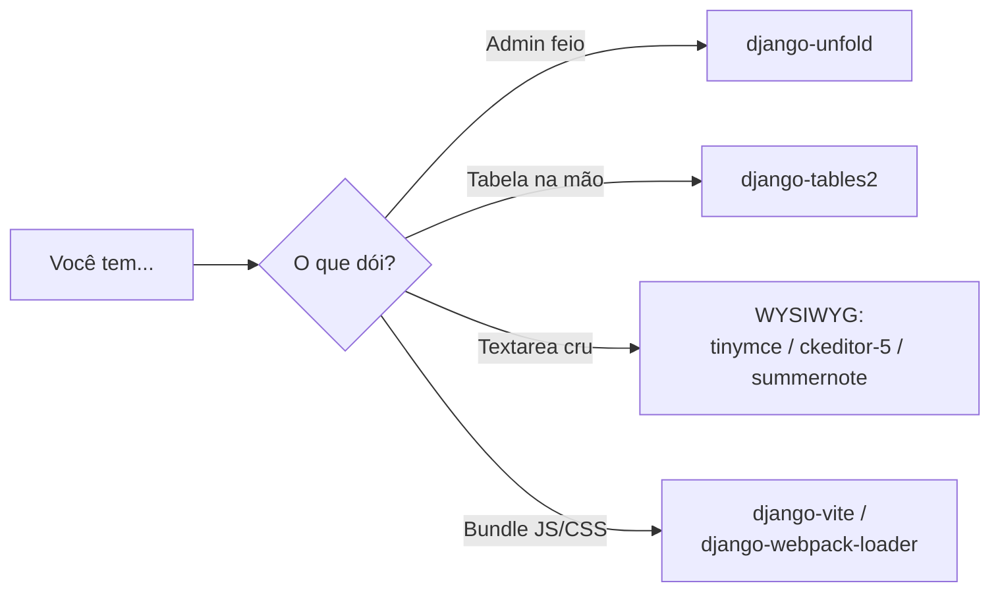

# Libs de UI: unfold, tables2, WYSIWYG e vite

O Django já vem com um admin funcional e um sistema de templates que renderiza
HTML. Mas em 2026 quase todo projeto acaba querendo um pouco mais: um admin
**bonito** e moderno, tabelas **ordenáveis e paginadas** sem escrever HTML na
mão, um editor de texto **rico** (negrito, imagens, links) para quem escreve
conteúdo, e uma ponte para o **frontend moderno** (Vite/React/Vue). Esta página é
o catálogo dessas peças.

!!! quote "Pensa como criança 🧒"
    Você já tem uma casa (o Django) com paredes e portas que funcionam. Estas
    libs são a **decoração e os móveis**: uma tinta bonita nas paredes (unfold),
    prateleiras que se organizam sozinhas (tables2), uma máquina de escrever
    chique (WYSIWYG) e um encanamento que liga a cozinha nova ao resto da casa
    (vite). A casa funciona sem elas — mas fica muito mais gostosa de morar.

## Caso de uso

Você tem o blog de exemplo (`apps.blog` com `Post`, `Author`, `Tag`, `Comment`).
Hoje:

- O admin funciona, mas é cinza e datado — o cliente reclama que "parece de
  2010".
- A página pública de posts é uma tabela HTML que você escreveu à mão; ordenar
  por data exige mexer no código.
- O campo `content` do `Post` é um `<textarea>` cru — o autor não consegue pôr
  negrito nem imagem.
- Você quer usar React/Vite em uma parte do site, mas não sabe como o Django
  serve o bundle com o hash certo.

Cada uma dessas quatro dores tem uma lib pronta. Vamos por partes.

## Possibilidades

| Lib | Resolve | Instalação |
| --- | --- | --- |
| **django-unfold** | Admin moderno com tema Tailwind | `uv add django-unfold` |
| **django-tables2** | Tabelas HTML declarativas, ordenáveis e paginadas | `uv add django-tables2` |
| **django-tinymce** / **django-ckeditor-5** / **django-summernote** | Editor de texto rico (WYSIWYG) | `uv add django-tinymce` |
| **django-vite** / **django-webpack-loader** | Servir bundles JS/CSS de Vite/webpack no template | `uv add django-vite` |

### 1. django-unfold — um admin bonito por padrão

O admin do Django é ótimo funcionalmente, mas visualmente é o mesmo desde
sempre. O **django-unfold** é um tema moderno baseado em Tailwind CSS: dark mode,
sidebar organizada, filtros mais agradáveis — tudo sem você reescrever seus
`ModelAdmin`. Em 2026 virou praticamente o default de quem quer entregar um admin
apresentável.

O truque de instalação: o unfold **substitui** o app `django.contrib.admin`, então
ele precisa vir **antes** dele em `INSTALLED_APPS`.

```python
# config/settings.py
INSTALLED_APPS = [
    "unfold",                    # (1)!
    "django.contrib.admin",
    "django.contrib.auth",
    "django.contrib.contenttypes",
    "django.contrib.sessions",
    "django.contrib.messages",
    "django.contrib.staticfiles",
    "apps.blog",
]
```

1. `"unfold"` vem **antes** de `"django.contrib.admin"`. Ele sobrescreve os
    templates do admin; se vier depois, o Django acha os templates originais
    primeiro e nada muda.

Agora, em vez de herdar de `admin.ModelAdmin`, você herda de
`unfold.admin.ModelAdmin` — a API é a mesma, só o visual muda:

```python
# apps/blog/admin.py
from django.contrib import admin
from unfold.admin import ModelAdmin

from apps.blog.models import Post


@admin.register(Post)
class PostAdmin(ModelAdmin):
    """Blog post admin, styled with django-unfold."""

    list_display = ("title", "author", "status", "published_at")
    list_filter = ("status", "tags")
    search_fields = ("title", "content")
```

!!! tip "Configuração fica em `UNFOLD` no settings"
    Cores, logo, título do site e itens da sidebar são definidos num dicionário
    `UNFOLD = {...}` no `settings.py`. Você pode trocar a paleta, esconder apps e
    montar um menu lateral próprio sem tocar em template. Veja a
    [referência do admin](../referencia/admin.md) para o básico de `ModelAdmin`.

!!! note "Não é o único"
    Existem `django-jazzmin`, `django-grappelli` e o clássico
    `django-suit`. O unfold é o mais ativo e "Tailwind-nativo" em 2026, mas todos
    seguem a mesma ideia: trocar os templates do admin por outros mais bonitos.

### 2. django-tables2 — tabelas que se organizam sozinhas

Escrever `<table><thead>...<tbody>...` na mão é chato e, pior, ordenar
por coluna vira um festival de `if request.GET`. O **django-tables2** deixa você
**declarar** a tabela numa classe (igual a um form ou um serializer) e cuida de
ordenação por clique no cabeçalho, paginação e renderização.

```python
# apps/blog/tables.py
import django_tables2 as tables

from apps.blog.models import Post


class PostTable(tables.Table):
    """Declarative table for listing blog posts."""

    class Meta:
        model = Post
        fields = ("title", "author", "status", "published_at")   # (1)!
        order_by = "-published_at"                                # (2)!
```

1. As colunas que aparecem — na ordem em que você listar.
2. Ordenação inicial (mais recentes primeiro); o usuário pode reordenar clicando
    no cabeçalho.

Na view, você monta a tabela com o queryset e a entrega ao template:

```python
# apps/blog/views.py
from django.views.generic import ListView
from django_tables2 import SingleTableMixin

from apps.blog.models import Post
from apps.blog.tables import PostTable


class PostTableView(SingleTableMixin, ListView):
    """List posts using a django-tables2 table."""

    model = Post
    table_class = PostTable
    template_name = "blog/post_table.html"
    paginate_by = 10        # (1)!
```

1. Paginação de graça — o tables2 respeita o `paginate_by` e desenha os controles
    de página.

```django
{# templates/blog/post_table.html #}

        {# desenha a tabela inteira, com ordenação e paginação #}
```

!!! tip "Combina com o django-filter"
    tables2 mostra e ordena; o [django-filter](django-filter.md) filtra. Juntos
    (`django_tables2.SingleTableMixin` + `django_filters.views.FilterView`, via a
    lib `django-tables2` + `django-filter`) você tem uma listagem completa:
    filtrar, ordenar e paginar, tudo pela URL.

!!! note "Colunas customizadas"
    Você pode declarar colunas explícitas em vez de usar `Meta.fields`:
    `title = tables.Column(verbose_name="Título")`,
    `tags = tables.ManyToManyColumn()`, ou uma
    `tables.TemplateColumn("{{ record.title|upper }}")` para HTML sob medida.

### 3. Editores WYSIWYG — texto rico para quem escreve

WYSIWYG = *What You See Is What You Get*. Em vez de um `<textarea>` onde o autor
digita HTML na mão, ele ganha uma barra de ferramentas (negrito, listas, links,
imagens) e vê o resultado enquanto escreve. Existem três opções populares — todas
funcionam trocando o widget de um campo `TextField`.

| Lib | Editor por trás | Nota |
| --- | --- | --- |
| **django-tinymce** | TinyMCE | Maduro, muitos plugins |
| **django-ckeditor-5** | CKEditor 5 | Moderno; o antigo `django-ckeditor` (CKEditor 4) está descontinuado — use o `-5` |
| **django-summernote** | Summernote | Leve, baseado em Bootstrap |

Exemplo com `django-tinymce`, que troca o campo por um editor rico:

```python
# config/settings.py
INSTALLED_APPS = ["tinymce", ...]
```

```python
# apps/blog/models.py
from django.db import models
from tinymce.models import HTMLField


class Post(models.Model):
    """A blog post whose body is edited with a rich-text editor."""

    title = models.CharField(max_length=200)
    content = HTMLField()       # (1)!

    def __str__(self) -> str:
        """Return the post title."""
        return self.title
```

1. `HTMLField` é um `TextField` que, no admin e em forms, aparece como o editor
    TinyMCE em vez de um `<textarea>` cru.

Se quiser o editor só no admin sem trocar o campo do modelo, use um widget no
form do admin:

```python
# apps/blog/admin.py
from django import forms
from django.contrib import admin
from tinymce.widgets import TinyMCE

from apps.blog.models import Post


class PostAdminForm(forms.ModelForm):
    """Admin form that renders the content field with TinyMCE."""

    class Meta:
        model = Post
        fields = "__all__"
        widgets = {"content": TinyMCE()}


@admin.register(Post)
class PostAdmin(admin.ModelAdmin):
    """Post admin using a rich-text editor for the body."""

    form = PostAdminForm
```

!!! danger "HTML de usuário é perigoso — sanitize na saída"
    Um editor rico grava **HTML** no banco. Se você renderizar esse HTML com
    `{{ post.content|safe }}` sem limpar, abre a porta para XSS (um autor
    malicioso injeta `<script>`). Sanitize com uma lib como `nh3` (binding do
    `ammonia`) ou `bleach` antes de salvar/exibir, e restrinja as tags permitidas
    na configuração do editor. Nunca confie no que veio do editor.

!!! warning "Uploads de imagem precisam de config"
    Colar/enviar imagens pelo editor grava arquivos no seu `MEDIA_ROOT` — só
    funciona com `MEDIA_URL`/`MEDIA_ROOT` configurados e um handler de upload
    (o `django-ckeditor-5` e o `django-tinymce` têm views prontas para isso).
    Veja [organizando assets](../referencia/organizando-assets.md).

### 4. django-vite / django-webpack-loader — ponte para o frontend moderno

Quando parte do site usa **React, Vue ou Svelte** compilados por **Vite** (ou
webpack), o navegador não carrega seu `.jsx` — ele carrega um **bundle** com nome
tipo `main.a3f9c2.js` (o hash muda a cada build, para furar cache). O problema: no
template Django você não sabe qual é o hash atual. Essas libs leem o
**manifest** gerado pelo bundler e resolvem o nome certo para você.

```python
# config/settings.py
INSTALLED_APPS = ["django_vite", ...]

DJANGO_VITE = {
    "default": {
        "dev_mode": DEBUG,          # (1)!
        "manifest_path": BASE_DIR / "assets" / "dist" / ".vite" / "manifest.json",
    }
}
```

1. Em desenvolvimento (`dev_mode=True`), o Django aponta para o dev server do
    Vite com hot-reload. Em produção, ele lê o `manifest.json` e serve os
    arquivos já compilados com hash.

```django
{# templates/base.html #}

<!doctype html>
<html>
  <head>
                           {# só faz algo em dev_mode #}
                 {# resolve para o bundle com hash #}
  </head>
  <body>
    <div id="app"></div>
  </body>
</html>
```

!!! info "Vite ou webpack?"
    `django-vite` é para projetos com **Vite** (o padrão moderno de 2026).
    `django-webpack-loader` é o equivalente clássico para **webpack** e continua
    válido em bases antigas. A ideia é idêntica: casar o nome com hash do bundle
    com a tag do template. Para o panorama de assets estáticos no Django, veja
    [organizando assets](../referencia/organizando-assets.md).



!!! quote "📖 Na documentação oficial"
    - [django-unfold](https://github.com/unfoldadmin/django-unfold)
    - [django-tables2](https://django-tables2.readthedocs.io/)

## Recap

- **django-unfold**: tema Tailwind moderno para o admin. Ponha `"unfold"` **antes**
  de `"django.contrib.admin"` e herde de `unfold.admin.ModelAdmin` — a API do
  `ModelAdmin` é a mesma, só o visual muda.
- **django-tables2**: você **declara** a tabela numa classe (`Meta.model` +
  `fields`) e ganha ordenação por cabeçalho e paginação de graça; combina com o
  django-filter para listagens completas.
- **WYSIWYG**: `django-tinymce`, `django-ckeditor-5` (use o `-5`, não o antigo
  CKEditor 4) ou `django-summernote` trocam o `<textarea>` por um editor rico.
  **Sanitize** o HTML gerado antes de renderizar com `|safe` — senão é XSS.
- **django-vite / django-webpack-loader**: fazem a ponte entre o Django e um
  frontend Vite/webpack, resolvendo o nome do bundle com hash via `manifest.json`.
