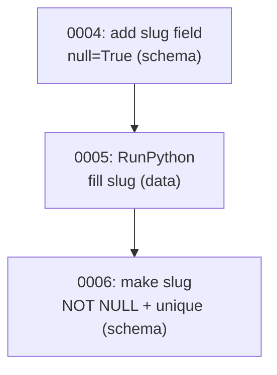

# Advanced ORM II: multi-DB, raw SQL, bulk and data migrations

!!! quote "Think like a child 🧒"
    Imagine you have **two toy boxes**: one for storage (you barely touch it) and
    one you play with every day. You learn the rule "books go in the blue box,
    toy cars go in the red one". Sometimes you want to put **a whole bunch** of
    toys away at once (much faster than one by one). And sometimes you want to
    talk straight to the box, in its own language, without going through mom.
    That's what this page is about: different databases, bulk shortcuts, and
    talking directly to the database.

## Use case

Your blog grew. **Reads** (listing posts) exploded, but **writes**
(publishing) are rare. You add a **read replica**: a second database, for
queries only. You need to tell Django "read from the replica, write to the
primary" — without changing your view code. That's where **database routers**
come in:

```python
class PrimaryReplicaRouter:
    """Route reads to the replica and writes to the primary database."""

    def db_for_read(self, model: type, **hints: object) -> str:
        """Send every read query to the replica connection."""
        return "replica"

    def db_for_write(self, model: type, **hints: object) -> str:
        """Send every write query to the primary connection."""
        return "default"

    def allow_relation(self, obj1: object, obj2: object, **hints: object) -> bool:
        """Allow relations between objects living in either configured DB."""
        return True

    def allow_migrate(self, db: str, app_label: str, **hints: object) -> bool:
        """Only run migrations against the primary database."""
        return db == "default"
```

Register it in `settings.py` and you're done — Django routes on its own:

```python
DATABASES = {
    "default": {
        "ENGINE": "django.db.backends.postgresql",
        "NAME": "blog",
        "HOST": "primary.db.internal",
    },
    "replica": {
        "ENGINE": "django.db.backends.postgresql",
        "NAME": "blog",
        "HOST": "replica.db.internal",
    },
}

DATABASE_ROUTERS = ["blog.routers.PrimaryReplicaRouter"]
```

Now `Post.objects.all()` reads from the replica and `post.save()` writes to the
primary, **without** you touching the views.

## Possibilities

### Multiple databases: the router's four methods

A router is just a class with (optionally) these four methods. Django walks the
`DATABASE_ROUTERS` list and uses the **first** one that returns something other
than `None`.

| Method | Question it answers | Return |
| --- | --- | --- |
| `db_for_read(model, **hints)` | "Which DB do I read from?" | alias (str) or `None` |
| `db_for_write(model, **hints)` | "Which DB do I write to?" | alias (str) or `None` |
| `allow_relation(obj1, obj2, **hints)` | "Can I relate these two objects?" | `True` / `False` / `None` |
| `allow_migrate(db, app_label, **hints)` | "Do I run this migration on this DB?" | `True` / `False` / `None` |

!!! tip "One router per rule"
    Don't try to solve everything in one giant class. You can have a router that
    sends the `analytics` app to one database and another that does the read
    replica. The list is evaluated in order; return `None` when the router has no
    opinion about that model.

### `using()`: picking the database by hand

Routers automate routing, but sometimes you want to be explicit. Every
`QuerySet` has `.using(alias)`, and `save()`/`delete()` accept `using=`:

```python
posts = Post.objects.using("replica").all()

post = Post(title="Hello")
post.save(using="default")

post.delete(using="default")
```

For a manager pinned to a database (handy in scripts), use `db_manager`:

```python
author = Author.objects.db_manager("default").create(name="Ada")
```

!!! warning "Objects don't move between databases on their own"
    An object read from `"replica"` remembers that origin in `obj._state.db`. If
    you call `obj.save()` without `using=`, the router decides again — and it may
    not be the DB you read from. In multi-DB flows, be explicit with `using=`
    when writing.

### Raw SQL: when the ORM isn't enough

Sometimes you need a query the ORM doesn't express well. There are two paths,
from safest to most raw.

#### `Manager.raw()`: SQL that returns models

`raw()` runs your SQL and maps each row to a model instance. It's *lazy* (only
executes when iterated) and returns a `RawQuerySet`:

```python
posts = Post.objects.raw(
    "SELECT id, title, views FROM blog_post WHERE views > %s",
    [1000],
)
for post in posts:
    print(post.title, post.views)
```

!!! danger "ALWAYS pass parameters in the list, never interpolate into the string"
    ```python
    # ✅ Safe — the driver escapes the value
    Post.objects.raw("SELECT * FROM blog_post WHERE title = %s", [title])

    # ❌ SQL injection — NEVER do this
    Post.objects.raw(f"SELECT * FROM blog_post WHERE title = '{title}'")
    ```
    Concatenating/interpolating user data into SQL is the classic doorway to SQL
    injection. The `%s` (or `%(name)s`) placeholders in the list are escaped by
    the driver.

The SQL must include the **primary key** for Django to build the object.
Columns you didn't select become *deferred* access (an extra query per missing
field).

#### `connection.cursor()`: raw SQL, no model

When the query doesn't map to a model (exotic aggregations, bulk `UPDATE`,
`DELETE` with a join), use the cursor directly:

```python
from django.db import connection


def top_tags(limit: int) -> list[tuple[str, int]]:
    """Return the most-used tags with their post counts via raw SQL."""
    with connection.cursor() as cursor:
        cursor.execute(
            """
            SELECT t.name, COUNT(*) AS total
            FROM blog_tag t
            JOIN blog_post_tags pt ON pt.tag_id = t.id
            GROUP BY t.name
            ORDER BY total DESC
            LIMIT %s
            """,
            [limit],
        )
        return cursor.fetchall()
```

To choose the database in multi-DB, use `connections["alias"].cursor()`:

```python
from django.db import connections

with connections["replica"].cursor() as cursor:
    cursor.execute("SELECT COUNT(*) FROM blog_post")
    total = cursor.fetchone()[0]
```

!!! info "`fetchone` / `fetchall` / `fetchmany`"
    The cursor returns **tuples**, not dictionaries. If you want dictionaries,
    map with `cursor.description`, or prefer `Manager.raw()` when the result is a
    model.

### Bulk operations: `bulk_create` and `bulk_update`

Saving 10,000 objects with one `.save()` each = 10,000 round trips to the
database. Bulk operations do it all in **a few** queries.

```python
posts = [Post(title=f"Post {i}", author_id=1) for i in range(1000)]
Post.objects.bulk_create(posts, batch_size=500)
```

To update many at once, tell it **which fields** changed:

```python
for post in posts:
    post.views += 1
Post.objects.bulk_update(posts, ["views"], batch_size=500)
```

| Operation | Does | Returns |
| --- | --- | --- |
| `bulk_create(objs, batch_size=...)` | batched `INSERT` | list of created objects |
| `bulk_update(objs, fields, batch_size=...)` | batched `UPDATE` | number of affected rows |

`bulk_create` can also handle conflicts (upsert), useful for idempotent
imports:

```python
Post.objects.bulk_create(
    posts,
    update_conflicts=True,
    unique_fields=["slug"],
    update_fields=["title", "views"],
)
```

!!! danger "Bulk operations DON'T fire signals nor call `save()`"
    This is the most important gotcha on the page:

    - `bulk_create` / `bulk_update` **don't** send `pre_save`/`post_save` (nor
      `pre_delete`/`post_delete` for a queryset `bulk` delete).
    - Your model's `save()` method is **not** called — logic you put there
      (generate slug, normalize text) is **ignored**.
    - `auto_now` / `auto_now_add` are not filled automatically by `bulk_update`.

    If you depend on signals or on logic in `save()`, either do it by hand before
    the batch, or don't use bulk.

!!! note "`bulk_create` details"
    - On PostgreSQL, objects come back **with the PK populated**. On other
      databases, not always.
    - It doesn't work with multi-table inheritance (models with a concrete
      parent).
    - Use `batch_size` so you don't blow past driver limits with millions of
      rows.

### Data migrations: touching the **data**, not the schema

A schema migration creates/alters tables. A **data migration** moves or fixes
**data** — for example, filling a new field from an old one. The vehicle is the
`RunPython` operation.

Create an empty skeleton and edit it:

```bash
python manage.py makemigrations --empty blog --name populate_slugs
```

```python
from django.db import migrations
from django.db.migrations.state import StateApps
from django.utils.text import slugify


def populate_slugs(apps: StateApps, schema_editor: object) -> None:
    """Fill the slug field from the title for every existing post."""
    Post = apps.get_model("blog", "Post")
    for post in Post.objects.filter(slug="").iterator():
        post.slug = slugify(post.title)
        post.save(update_fields=["slug"])


def clear_slugs(apps: StateApps, schema_editor: object) -> None:
    """Reverse operation: blank the slug field back out."""
    Post = apps.get_model("blog", "Post")
    Post.objects.update(slug="")


class Migration(migrations.Migration):
    """Backfill post slugs from their titles."""

    dependencies = [
        ("blog", "0004_post_slug"),
    ]

    operations = [
        migrations.RunPython(populate_slugs, clear_slugs),
    ]
```

!!! danger "Use `apps.get_model`, NEVER import the model directly"
    Inside a migration, `apps.get_model("blog", "Post")` gives you the
    **historical version** of the model — how it looked at that point in the
    migration history. If you `from blog.models import Post`, you grab the
    **current** model, which may have fields that don't exist yet at that point.
    The migration breaks when running from scratch on a fresh database.

!!! tip "Always write the reverse function"
    The second argument to `RunPython` is the *undo* (used by `migrate blog
    0004`). If reversing is impossible, use `migrations.RunPython.noop` on
    purpose, instead of leaving it blank:
    ```python
    migrations.RunPython(populate_slugs, migrations.RunPython.noop)
    ```

Typical flow for a new required field, done in safe steps:



!!! warning "Separate schema and data into different migrations"
    Adding a `NOT NULL` column **and** filling it in the same step usually fails:
    the column must exist and accept null before you can write values into it. Do
    it in three migrations (add nullable → fill → tighten the constraint), like
    in the diagram.

#### `RunSQL`: when you want raw SQL in the migration

For special indexes, PostgreSQL extensions, or bulk fixes the ORM can't
express, use `RunSQL` — always with the reverse SQL:

```python
from django.db import migrations


class Migration(migrations.Migration):
    """Enable the pg_trgm extension for trigram search."""

    dependencies = [
        ("blog", "0005_populate_slugs"),
    ]

    operations = [
        migrations.RunSQL(
            sql="CREATE EXTENSION IF NOT EXISTS pg_trgm;",
            reverse_sql="DROP EXTENSION IF EXISTS pg_trgm;",
        ),
    ]
```

!!! info "`elidable=True` for disposable migrations"
    Data migrations that only make sense once can be marked with
    `RunPython(..., elidable=True)`. When you **squash** the history
    (`squashmigrations`), Django drops the elidable operations. Fresh databases
    are born with the correct data and don't need to re-run the backfill.

### `GeneratedField`: columns computed by the database

Sometimes a field is **always** derived from others. Instead of computing it in
Python and risking drift, let the **database** compute it, via `GeneratedField`
(a real generated column, in the schema):

```python
from django.db import models
from django.db.models import F


class Product(models.Model):
    """A product whose total price is computed by the database."""

    price = models.DecimalField(max_digits=10, decimal_places=2)
    quantity = models.PositiveIntegerField()
    total = models.GeneratedField(
        expression=F("price") * F("quantity"),
        output_field=models.DecimalField(max_digits=12, decimal_places=2),
        db_persist=True,
    )
```

| Parameter | Meaning |
| --- | --- |
| `expression` | ORM expression that computes the value (`F`, `Concat`, etc.) |
| `output_field` | Type of the resulting column |
| `db_persist=True` | Physically stored (STORED); `False` = computed on read (VIRTUAL) |

!!! note "The database computes it — the field is read-only"
    You **don't** assign to `product.total`. The value shows up after you save
    and reread, because the DBMS is what computes it. Support for
    `STORED`/`VIRTUAL` varies by database: PostgreSQL has only `STORED`
    (`db_persist=True`); SQLite and MySQL have both.

!!! tip "Great for ordering/filtering without `annotate`"
    Since the column exists in the database, you can
    `Product.objects.filter(total__gt=100)` and index it — something a
    query-time annotation doesn't allow as easily.

### `select_for_update`: locking rows (recap)

The page closes with the same row locking seen in
[transactions](transactions.md): inside an `atomic`, `select_for_update` locks
the rows it reads until commit, preventing two requests from overwriting each
other (a race condition):

```python
from django.db import transaction


@transaction.atomic
def increment_views(post_id: int) -> None:
    """Safely increment a post's view counter under a row lock."""
    post = Post.objects.select_for_update().get(pk=post_id)
    post.views += 1
    post.save(update_fields=["views"])
```

!!! warning "Needs `atomic` and a real database"
    The lock lasts until the end of the transaction, so `select_for_update`
    **requires** being inside `atomic`. And it **doesn't** work on SQLite — use
    PostgreSQL/MySQL. For simple counters, `F("views") + 1` in an `update()` often
    solves it without a lock (see [ORM expressions](orm-expressions.md)).

!!! quote "📖 In the official docs"
    - [Multiple databases](https://docs.djangoproject.com/en/6.0/topics/db/multi-db/)
    - [Performing raw SQL queries](https://docs.djangoproject.com/en/6.0/topics/db/sql/)
    - [Writing database migrations](https://docs.djangoproject.com/en/6.0/howto/writing-migrations/)

## Recap

- **Multi-DB**: configure several aliases in `DATABASES` and use
  `DATABASE_ROUTERS` (`db_for_read`, `db_for_write`, `allow_relation`,
  `allow_migrate`) to route automatically; `.using(alias)` and `save(using=)`
  route by hand.
- **Raw SQL**: `Manager.raw()` maps rows to models (include the PK);
  `connection.cursor()` runs raw SQL. **Always** parametrize with `%s` — never
  interpolate user data.
- **Bulk**: `bulk_create` / `bulk_update` do everything in a few queries, but
  **don't** fire signals nor call `save()` — watch out for slugs, `auto_now`,
  etc.
- **Data migrations**: `RunPython` (with `apps.get_model` and a reverse
  function) and `RunSQL` (with `reverse_sql`); separate schema from data into
  steps; mark backfills as `elidable=True`.
- **`GeneratedField`**: a column computed by the database (`expression` +
  `output_field` + `db_persist`); read-only, great for filtering/indexing.
- **`select_for_update`**: locks rows inside `atomic` (not on SQLite),
  preventing race conditions.

You now command the ORM in depth. To wrap it all in a safe transaction, go back
to **[transactions](transactions.md)**; for the step-by-step of creating
migrations, see the **[migrations tutorial](../tutorial/migrations.md)**.
