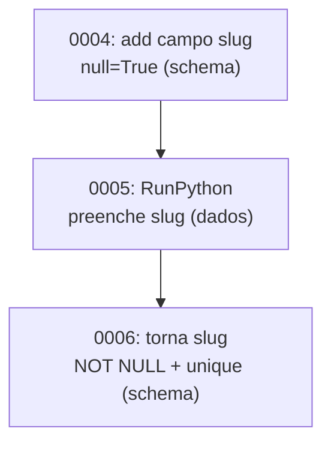

# ORM avançado II: multi-DB, raw SQL, bulk e data migrations

!!! quote "Pensa como criança 🧒"
    Imagine que você tem **duas caixas de brinquedos**: uma para guardar (que
    quase nunca mexe) e outra para brincar todo dia. Você aprende a regra "livro
    vai na caixa azul, carrinho vai na vermelha". Às vezes você quer guardar
    **um monte** de brinquedos de uma vez só (bem mais rápido que um por um). E
    às vezes você quer falar direto com a caixa, na língua dela, sem passar pela
    mamãe. É disso que esta página trata: bancos diferentes, atalhos em massa e
    conversar direto com o banco.

## Caso de uso

Seu blog cresceu. As **leituras** (listar posts) explodiram, mas as
**escritas** (publicar) são raras. Você cria uma **réplica de leitura**: um
segundo banco, só para consultas. Precisa dizer ao Django "leia da réplica,
escreva no primário" — sem trocar o código das views. É aqui que entram os
**database routers**:

```python
class PrimaryReplicaRouter:
    """Route reads to the replica and writes to the primary database."""

    def db_for_read(self, model: type, **hints: object) -> str:
        """Send every read query to the replica connection."""
        return "replica"

    def db_for_write(self, model: type, **hints: object) -> str:
        """Send every write query to the primary connection."""
        return "default"

    def allow_relation(self, obj1: object, obj2: object, **hints: object) -> bool:
        """Allow relations between objects living in either configured DB."""
        return True

    def allow_migrate(self, db: str, app_label: str, **hints: object) -> bool:
        """Only run migrations against the primary database."""
        return db == "default"
```

Registre em `settings.py` e pronto — o Django passa a rotear sozinho:

```python
DATABASES = {
    "default": {
        "ENGINE": "django.db.backends.postgresql",
        "NAME": "blog",
        "HOST": "primary.db.internal",
    },
    "replica": {
        "ENGINE": "django.db.backends.postgresql",
        "NAME": "blog",
        "HOST": "replica.db.internal",
    },
}

DATABASE_ROUTERS = ["blog.routers.PrimaryReplicaRouter"]
```

Agora `Post.objects.all()` lê da réplica e `post.save()` escreve no primário,
**sem** você tocar nas views.

## Possibilidades

### Múltiplos bancos: os quatro métodos do router

Um router é só uma classe com (opcionalmente) estes quatro métodos. O Django
percorre a lista `DATABASE_ROUTERS` e usa o **primeiro** que devolver algo
diferente de `None`.

| Método | Pergunta que responde | Retorno |
| --- | --- | --- |
| `db_for_read(model, **hints)` | "De qual banco eu leio?" | alias (str) ou `None` |
| `db_for_write(model, **hints)` | "Em qual banco eu escrevo?" | alias (str) ou `None` |
| `allow_relation(obj1, obj2, **hints)` | "Posso relacionar estes dois objetos?" | `True` / `False` / `None` |
| `allow_migrate(db, app_label, **hints)` | "Rodo esta migration neste banco?" | `True` / `False` / `None` |

!!! tip "Um router por regra"
    Não tente resolver tudo numa classe gigante. Você pode ter um router que
    manda o app `analytics` para um banco e outro que faz réplica de leitura. A
    lista é avaliada em ordem; devolva `None` quando o router não tem opinião
    sobre aquele modelo.

### `using()`: escolher o banco na mão

Routers automatizam o roteamento, mas às vezes você quer ser explícito. Todo
`QuerySet` tem `.using(alias)`, e `save()`/`delete()` aceitam `using=`:

```python
posts = Post.objects.using("replica").all()

post = Post(title="Olá")
post.save(using="default")

post.delete(using="default")
```

Para um manager preso a um banco (útil em scripts), use `db_manager`:

```python
autor = Author.objects.db_manager("default").create(name="Ada")
```

!!! warning "Objetos não migram de banco sozinhos"
    Um objeto lido de `"replica"` guarda essa origem em `obj._state.db`. Se você
    fizer `obj.save()` sem `using=`, o router decide de novo — e pode não ser o
    banco de onde você leu. Em fluxos multi-DB, seja explícito com `using=` ao
    gravar.

### Raw SQL: quando o ORM não basta

Às vezes você precisa de uma consulta que o ORM não expressa bem. Há dois
caminhos, do mais seguro ao mais cru.

#### `Manager.raw()`: SQL que devolve modelos

`raw()` roda seu SQL e mapeia cada linha para uma instância do modelo. É
*lazy* (só executa quando iterado) e devolve um `RawQuerySet`:

```python
posts = Post.objects.raw(
    "SELECT id, title, views FROM blog_post WHERE views > %s",
    [1000],
)
for post in posts:
    print(post.title, post.views)
```

!!! danger "SEMPRE passe parâmetros na lista, nunca interpole na string"
    ```python
    # ✅ Seguro — o driver escapa o valor
    Post.objects.raw("SELECT * FROM blog_post WHERE title = %s", [titulo])

    # ❌ Injeção de SQL — NUNCA faça isto
    Post.objects.raw(f"SELECT * FROM blog_post WHERE title = '{titulo}'")
    ```
    Concatenar/interpolar dados do usuário em SQL é a porta de entrada clássica
    de SQL injection. Os `%s` (ou `%(nome)s`) da lista são escapados pelo driver.

O SQL precisa incluir a **chave primária** para o Django montar o objeto.
Colunas que você não selecionou viram acesso *deferred* (uma query extra por
campo faltante).

#### `connection.cursor()`: SQL puro, sem modelo

Quando a consulta não mapeia para um modelo (agregações exóticas, `UPDATE` em
massa, `DELETE` com join), use o cursor direto:

```python
from django.db import connection


def top_tags(limit: int) -> list[tuple[str, int]]:
    """Return the most-used tags with their post counts via raw SQL."""
    with connection.cursor() as cursor:
        cursor.execute(
            """
            SELECT t.name, COUNT(*) AS total
            FROM blog_tag t
            JOIN blog_post_tags pt ON pt.tag_id = t.id
            GROUP BY t.name
            ORDER BY total DESC
            LIMIT %s
            """,
            [limit],
        )
        return cursor.fetchall()
```

Para escolher o banco no multi-DB, use `connections["alias"].cursor()`:

```python
from django.db import connections

with connections["replica"].cursor() as cursor:
    cursor.execute("SELECT COUNT(*) FROM blog_post")
    total = cursor.fetchone()[0]
```

!!! info "`fetchone` / `fetchall` / `fetchmany`"
    O cursor devolve **tuplas**, não dicionários. Se quiser dicionários, mapeie
    com `cursor.description`, ou prefira `Manager.raw()` quando o resultado é um
    modelo.

### Operações em massa: `bulk_create` e `bulk_update`

Salvar 10 mil objetos com um `.save()` cada = 10 mil idas ao banco. As
operações em massa fazem tudo em **poucas** queries.

```python
posts = [Post(title=f"Post {i}", author_id=1) for i in range(1000)]
Post.objects.bulk_create(posts, batch_size=500)
```

Para atualizar vários de uma vez, informe **quais campos** mudaram:

```python
for post in posts:
    post.views += 1
Post.objects.bulk_update(posts, ["views"], batch_size=500)
```

| Operação | Faz | Retorna |
| --- | --- | --- |
| `bulk_create(objs, batch_size=...)` | `INSERT` em lote | lista de objetos criados |
| `bulk_update(objs, fields, batch_size=...)` | `UPDATE` em lote | nº de linhas afetadas |

`bulk_create` também sabe lidar com conflitos (upsert), útil para importações
idempotentes:

```python
Post.objects.bulk_create(
    posts,
    update_conflicts=True,
    unique_fields=["slug"],
    update_fields=["title", "views"],
)
```

!!! danger "Operações em massa NÃO disparam signals nem chamam `save()`"
    Este é o pega-ratão mais importante da página:

    - `bulk_create` / `bulk_update` **não** enviam `pre_save`/`post_save` (nem
      `pre_delete`/`post_delete` no caso de `bulk` delete via queryset).
    - O método `save()` do seu modelo **não** é chamado — lógica que você pôs lá
      (gerar slug, normalizar texto) é **ignorada**.
    - `auto_now` / `auto_now_add` não são preenchidos automaticamente por
      `bulk_update`.

    Se você depende de signals ou de lógica no `save()`, ou faça isso à mão
    antes de mandar em lote, ou não use bulk.

!!! note "Detalhes de `bulk_create`"
    - Em PostgreSQL, os objetos voltam **com a PK preenchida**. Em outros bancos,
      nem sempre.
    - Não funciona com herança multi-tabela (modelos com pai concreto).
    - Use `batch_size` para não estourar limites do driver com milhões de linhas.

### Data migrations: mexer nos **dados**, não no schema

Migration de schema cria/altera tabelas. **Data migration** move ou conserta
**dados** — por exemplo, preencher um campo novo a partir de um antigo. O
veículo é a operação `RunPython`.

Crie um esqueleto vazio e edite:

```bash
python manage.py makemigrations --empty blog --name populate_slugs
```

```python
from django.db import migrations
from django.db.migrations.state import StateApps
from django.utils.text import slugify


def populate_slugs(apps: StateApps, schema_editor: object) -> None:
    """Fill the slug field from the title for every existing post."""
    Post = apps.get_model("blog", "Post")
    for post in Post.objects.filter(slug="").iterator():
        post.slug = slugify(post.title)
        post.save(update_fields=["slug"])


def clear_slugs(apps: StateApps, schema_editor: object) -> None:
    """Reverse operation: blank the slug field back out."""
    Post = apps.get_model("blog", "Post")
    Post.objects.update(slug="")


class Migration(migrations.Migration):
    """Backfill post slugs from their titles."""

    dependencies = [
        ("blog", "0004_post_slug"),
    ]

    operations = [
        migrations.RunPython(populate_slugs, clear_slugs),
    ]
```

!!! danger "Use `apps.get_model`, NUNCA importe o modelo direto"
    Dentro da migration, `apps.get_model("blog", "Post")` te dá a **versão
    histórica** do modelo — como ele era naquele ponto da história de
    migrations. Se você `from blog.models import Post`, pega o modelo **atual**,
    que pode ter campos que ainda não existem naquele ponto. A migration quebra
    ao rodar do zero num banco novo.

!!! tip "Sempre escreva a função reversa"
    O segundo argumento de `RunPython` é o *undo* (usado em `migrate blog 0004`).
    Se reverter for impossível, use `migrations.RunPython.noop` de propósito, em
    vez de deixar em branco:
    ```python
    migrations.RunPython(populate_slugs, migrations.RunPython.noop)
    ```

Fluxo típico de uma migration de campo novo obrigatório, feito em passos
seguros:



!!! warning "Separe schema e dados em migrations diferentes"
    Adicionar coluna `NOT NULL` **e** preencher no mesmo passo costuma falhar: a
    coluna precisa existir e aceitar nulo antes de você conseguir gravar valores.
    Faça em três migrations (adiciona nullable → preenche → aperta a
    constraint), como no diagrama.

#### `RunSQL`: quando você quer o SQL cru na migration

Para índices especiais, extensões do PostgreSQL ou correções em massa que o
ORM não expressa, use `RunSQL` — sempre com o SQL de reversão:

```python
from django.db import migrations


class Migration(migrations.Migration):
    """Enable the pg_trgm extension for trigram search."""

    dependencies = [
        ("blog", "0005_populate_slugs"),
    ]

    operations = [
        migrations.RunSQL(
            sql="CREATE EXTENSION IF NOT EXISTS pg_trgm;",
            reverse_sql="DROP EXTENSION IF EXISTS pg_trgm;",
        ),
    ]
```

!!! info "`elidable=True` para migrations descartáveis"
    Data migrations que só fazem sentido uma vez podem ser marcadas com
    `RunPython(..., elidable=True)`. Quando você **espremer** o histórico
    (`squashmigrations`), o Django remove as operações elidíveis. Bancos novos
    já nascem com os dados corretos e não precisam re-rodar o backfill.

### `GeneratedField`: colunas calculadas pelo banco

Às vezes um campo é **sempre** derivado de outros. Em vez de calcular no
Python e arriscar dessincronizar, deixe o **banco** calcular, via
`GeneratedField` (uma coluna gerada de verdade, no schema):

```python
from django.db import models
from django.db.models import F


class Product(models.Model):
    """A product whose total price is computed by the database."""

    price = models.DecimalField(max_digits=10, decimal_places=2)
    quantity = models.PositiveIntegerField()
    total = models.GeneratedField(
        expression=F("price") * F("quantity"),
        output_field=models.DecimalField(max_digits=12, decimal_places=2),
        db_persist=True,
    )
```

| Parâmetro | Significado |
| --- | --- |
| `expression` | Expressão do ORM que calcula o valor (`F`, `Concat`, etc.) |
| `output_field` | Tipo da coluna resultante |
| `db_persist=True` | Grava fisicamente (STORED); `False` = calcula na leitura (VIRTUAL) |

!!! note "É o banco quem calcula — o campo é somente-leitura"
    Você **não** atribui a `product.total`. O valor aparece após salvar e reler,
    porque quem computa é o SGBD. Suporte a `STORED`/`VIRTUAL` varia por banco:
    PostgreSQL só tem `STORED` (`db_persist=True`); SQLite e MySQL têm os dois.

!!! tip "Ótimo para ordenar/filtrar sem `annotate`"
    Como a coluna existe no banco, você pode `Product.objects.filter(total__gt=100)`
    e indexá-la, coisa que uma anotação em tempo de query não permite tão
    facilmente.

### `select_for_update`: travando linhas (recap)

Fecha a página o mesmo bloqueio de linhas visto em
[transações](transactions.md): dentro de um `atomic`, `select_for_update`
tranca as linhas lidas até o commit, evitando que duas requisições
sobrescrevam uma à outra (condição de corrida):

```python
from django.db import transaction


@transaction.atomic
def increment_views(post_id: int) -> None:
    """Safely increment a post's view counter under a row lock."""
    post = Post.objects.select_for_update().get(pk=post_id)
    post.views += 1
    post.save(update_fields=["views"])
```

!!! warning "Precisa de `atomic` e de um banco de verdade"
    O bloqueio dura até o fim da transação, então `select_for_update` **exige**
    estar dentro de `atomic`. E **não** funciona no SQLite — use
    PostgreSQL/MySQL. Para contadores simples, `F("views") + 1` num `update()`
    muitas vezes já resolve sem lock (veja
    [expressões do ORM](orm-expressions.md)).

!!! quote "📖 Na documentação oficial"
    - [Multiple databases](https://docs.djangoproject.com/en/6.0/topics/db/multi-db/)
    - [Performing raw SQL queries](https://docs.djangoproject.com/en/6.0/topics/db/sql/)
    - [Writing database migrations](https://docs.djangoproject.com/en/6.0/howto/writing-migrations/)

## Recap

- **Multi-DB**: configure vários aliases em `DATABASES` e use
  `DATABASE_ROUTERS` (`db_for_read`, `db_for_write`, `allow_relation`,
  `allow_migrate`) para rotear automaticamente; `.using(alias)` e
  `save(using=)` roteiam na mão.
- **Raw SQL**: `Manager.raw()` mapeia linhas para modelos (inclua a PK);
  `connection.cursor()` roda SQL puro. **Sempre** parametrize com `%s` — nunca
  interpole dados do usuário.
- **Bulk**: `bulk_create` / `bulk_update` fazem tudo em poucas queries, mas
  **não** disparam signals nem chamam `save()` — cuidado com slugs,
  `auto_now`, etc.
- **Data migrations**: `RunPython` (com `apps.get_model` e função reversa) e
  `RunSQL` (com `reverse_sql`); separe schema de dados em passos; marque
  backfills como `elidable=True`.
- **`GeneratedField`**: coluna calculada pelo banco (`expression` +
  `output_field` + `db_persist`); somente-leitura, ótima para filtrar/indexar.
- **`select_for_update`**: trava linhas dentro de `atomic` (não no SQLite),
  evitando condições de corrida.

Você já domina o ORM em profundidade. Para agrupar tudo numa transação segura,
volte às **[transações](transactions.md)**; para o passo a passo de criar
migrations, veja o **[tutorial de migrations](../tutorial/migrations.md)**.
