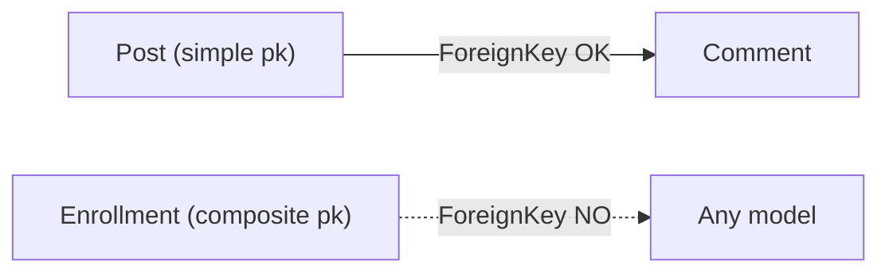

# Composite primary keys

!!! quote "Think like a child 🧒"
    In a classroom, nobody is identified by "row" alone nor by "column" alone —
    everyone sits in some row and some column. But **row 3, column 2** points to a
    single chair. A **composite primary key** is exactly that: the row's identity
    is born from **two (or more) columns together**, not from a lone `id`.

## Use case

You have a table that **links** posts to tags (the classic "through" table of a
many-to-many). Each pair `(post, tag)` must appear **exactly once**. Instead of
creating an automatic `id` and then a `unique_together` to block duplicates, you
say that the **pair itself is the key**:

```python
from django.db import models


class TagAssignment(models.Model):
    """Join table whose identity is the (post, tag) pair itself."""

    pk = models.CompositePrimaryKey("post_id", "tag_id")
    post = models.ForeignKey("blog.Post", on_delete=models.CASCADE)
    tag = models.ForeignKey("blog.Tag", on_delete=models.CASCADE)
    added_at = models.DateTimeField(auto_now_add=True)
```

Done: there is no `id` column, the pair `(post_id, tag_id)` is the primary key,
and the database rejects any duplicate without you writing anything else.

!!! info "Available since Django 5.2 — stable in 6.0"
    `CompositePrimaryKey` landed in Django 5.2 and is present in 6.0. It is
    especially handy for join tables and for mapping legacy databases that
    already use composite keys.

## Possibilities

### How to declare it

You **define the fields first** and then point `pk` at their names. The
`CompositePrimaryKey` is a **virtual** field: it creates no new column, it only
declares "these fields, together, are the identity".

```python
from django.db import models


class Enrollment(models.Model):
    """A student enrolled in a course; identity is (student, course)."""

    pk = models.CompositePrimaryKey("student_id", "course_id")
    student_id = models.IntegerField()
    course_id = models.IntegerField()
    grade = models.CharField(max_length=2, blank=True)
```

| What | Detail |
| --- | --- |
| Attribute name | Use **`pk`** — that is the name Django expects for the PK |
| Arguments | The **field names** that make up the key, in order |
| Column in the DB | **None new** — it is virtual, it reuses the cited columns |
| Automatic `id` | **Not created** once you declare a `CompositePrimaryKey` |
| Does order matter? | Yes — it defines the order of the index/constraint in the DB |

!!! tip "Cite the FK COLUMN name, not the relation field name"
    On a `ForeignKey` named `post`, the real column is `post_id`. In the composite
    key you cite **`"post_id"`**, not `"post"`. It is the column-attribute name
    Django generates for the FK.

### Accessing and filtering by the key

The value of `pk` becomes a **tuple**, in the order you declared:

```python
obj = Enrollment.objects.get(pk=(42, 7))    # (1)!
print(obj.pk)                                # (42, 7)

Enrollment.objects.filter(pk__in=[(42, 7), (42, 9)])
```

1. `get(pk=(...))` takes the tuple in the same order as
   `CompositePrimaryKey("student_id", "course_id")`.

!!! note "`aget_object_or_404` accepts the tuple too"
    In async land, `await aget_object_or_404(Enrollment, pk=(42, 7))` works the
    same way. It is the same old `pk` — it just happens to be a tuple now.

### Effect on relations (the biggest limitation)

Here lives the part that surprises people the most. A model with a composite key
**cannot be the target** of a relation.



| Relation | A model with a composite PK can... |
| --- | --- |
| `ForeignKey(target)` | ...**point to** another model normally ✅ |
| Be the target of a `ForeignKey` | ❌ Nobody can point to it |
| Be the target of a `OneToOneField` | ❌ Not supported |
| Be the target of a `ManyToManyField` | ❌ Not supported |
| `GenericForeignKey` | ❌ Not supported (neither pointing nor being a target) |

!!! danger "Nothing points to a composite key"
    A `ForeignKey` only knows how to store **one** column with the referenced
    value. It has no way to store a pair. That is why **no other model can
    reference a composite-PK model** via FK, O2O or M2M. If you need other models
    to point at this table, keep a simple `id` and use
    `UniqueConstraint(fields=[...])` to guarantee the pair's uniqueness.

### Forms and ModelForm

A `ModelForm` **does not render an input field** for the `CompositePrimaryKey`
(it would be odd to ask the user for the tuple). You fill in the fields that make
it up as usual:

```python
from django import forms

from myapp.models import Enrollment


class EnrollmentForm(forms.ModelForm):
    """Form for an enrollment; the composite pk is derived, not typed."""

    class Meta:
        model = Enrollment
        fields = ["student_id", "course_id", "grade"]
```

!!! warning "The `pk` is derived — do not put it in `fields`"
    The composite key's value is **born** from the fields that form it. List those
    fields in the form; the `pk` assembles itself on save. Putting `"pk"` in
    `fields` makes no sense and will raise an error.

### Admin

You **can** register the model in the admin, but with one caveat: `list_display`
and the edit links need something stable to build each row's URL.

```python
from django.contrib import admin

from myapp.models import Enrollment


@admin.register(Enrollment)
class EnrollmentAdmin(admin.ModelAdmin):
    """Admin for a model with a composite primary key."""

    list_display = ["student_id", "course_id", "grade"]
```

!!! note "Admin support is partial"
    The admin handles composite keys for common cases (listing, adding, editing),
    but features that assume a single-column PK — such as certain inlines or
    actions that serialize the PK into a simple URL — may behave in a limited way.
    Test the flows you actually use.

### Serialization (fixtures / dumpdata)

When serialized, the `pk` comes out as a **list** of the values, in the declared
order:

```json
[
  {
    "model": "myapp.enrollment",
    "pk": [42, 7],
    "fields": { "grade": "A" }
  }
]
```

- `dumpdata` produces the `"pk": [ ... ]`.
- `loaddata` reads that list back into the correct tuple.

!!! tip "Migrating from `id` to a composite key"
    If a table already exists with an `id`, switching to `CompositePrimaryKey` is
    a real schema migration (it swaps the PK in the database). Generate it with
    `python manage.py makemigrations`, **review** the SQL with
    `python manage.py sqlmigrate app 000X`, and test it on a copy of the database
    before applying it in production — swapping a primary key is not a trivial
    operation.

### Limitations at a glance

| Feature | Does composite support it? |
| --- | --- |
| Being the target of `ForeignKey` / `O2O` / `M2M` | ❌ |
| `GenericForeignKey` (contenttypes) | ❌ |
| Built-in `AutoField` inside the key | ❌ (the key is the fields you choose) |
| `db_default` on the key's fields | ⚠️ Avoid it; prefer explicit values |
| `filter(pk=(...))`, `get(pk=(...))` | ✅ |
| `dumpdata` / `loaddata` | ✅ (pk becomes a list) |
| `ModelForm` over the member fields | ✅ |

!!! quote "📖 In the official docs"
    - [Composite primary keys](https://docs.djangoproject.com/en/6.0/topics/composite-primary-keys/)
    - [Models — this guide's tutorial](../tutorial/models.md)

## Recap

- `pk = models.CompositePrimaryKey("a", "b")` says the row's identity is the
  **pair of columns**, not a lone `id` — perfect for join tables.
- It is a **virtual** field: it creates no column and **turns off** the automatic
  `id`.
- Cite the **column name** (`"post_id"`), not the relation field (`"post"`).
- `pk` becomes a **tuple**; `get(pk=(1, 2))` and `filter(pk__in=[...])` work.
- Biggest limitation: **nobody can point to** a composite-PK model (no
  `ForeignKey`, `OneToOneField`, `ManyToManyField` or `GenericForeignKey` as a
  target). Need that? Keep `id` + `UniqueConstraint`.
- Forms list the **member fields** (not the `pk`); the admin works partially;
  fixtures serialize the `pk` as a **list**.
