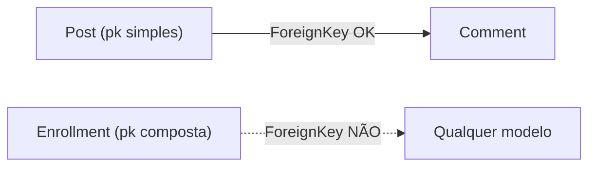

# Chaves primarias compostas

!!! quote "Pensa como criança 🧒"
    Numa sala de aula, ninguém é identificado só pela "fileira" nem só pela
    "coluna" — todo mundo senta em alguma fileira e em alguma coluna. Mas
    **fileira 3, coluna 2** aponta para uma cadeira única. Uma **chave primária
    composta** é isso: a identidade da linha nasce de **duas (ou mais) colunas
    juntas**, não de um `id` sozinho.

## Caso de uso

Você tem uma tabela que **liga** posts a tags (o famoso "through" de um
muitos-para-muitos). Cada par `(post, tag)` deve aparecer **uma única vez**. Em
vez de criar um `id` automático e depois um `unique_together` para impedir
duplicatas, você diz que a **própria dupla é a chave**:

```python
from django.db import models


class TagAssignment(models.Model):
    """Join table whose identity is the (post, tag) pair itself."""

    pk = models.CompositePrimaryKey("post_id", "tag_id")
    post = models.ForeignKey("blog.Post", on_delete=models.CASCADE)
    tag = models.ForeignKey("blog.Tag", on_delete=models.CASCADE)
    added_at = models.DateTimeField(auto_now_add=True)
```

Pronto: não existe coluna `id`, o par `(post_id, tag_id)` é a chave primária, e
o banco recusa qualquer duplicata sem você escrever mais nada.

!!! info "Disponível a partir do Django 5.2 — estável no 6.0"
    `CompositePrimaryKey` chegou no Django 5.2 e está presente no 6.0. É
    especialmente útil para tabelas "de junção" e para mapear bancos legados que
    já usam chaves compostas.

## Possibilidades

### Como declarar

Você **primeiro define os campos** e depois aponta a `pk` para os nomes deles.
O `CompositePrimaryKey` é um campo **virtual**: ele não cria coluna nova, só
declara "estes campos, juntos, são a identidade".

```python
from django.db import models


class Enrollment(models.Model):
    """A student enrolled in a course; identity is (student, course)."""

    pk = models.CompositePrimaryKey("student_id", "course_id")
    student_id = models.IntegerField()
    course_id = models.IntegerField()
    grade = models.CharField(max_length=2, blank=True)
```

| O que | Detalhe |
| --- | --- |
| Nome do atributo | Use **`pk`** — é o nome que o Django espera para a PK |
| Argumentos | Os **nomes dos campos** que compõem a chave, na ordem |
| Coluna no banco | **Nenhuma nova** — é virtual, reaproveita as colunas citadas |
| `id` automático | **Não é criado** quando você declara uma `CompositePrimaryKey` |
| Ordem importa? | Sim — define a ordem do índice/constraint no banco |

!!! tip "Cite o nome da COLUNA da FK, não o nome do campo de relação"
    Numa `ForeignKey` chamada `post`, a coluna real é `post_id`. Na chave
    composta você cita **`"post_id"`**, não `"post"`. É o nome do atributo-coluna
    que o Django gera para a FK.

### Acessando e filtrando pela chave

O valor de `pk` vira uma **tupla**, na ordem em que você declarou:

```python
obj = Enrollment.objects.get(pk=(42, 7))    # (1)!
print(obj.pk)                                # (42, 7)

Enrollment.objects.filter(pk__in=[(42, 7), (42, 9)])
```

1. `get(pk=(...))` recebe a tupla na mesma ordem de
   `CompositePrimaryKey("student_id", "course_id")`.

!!! note "`aget_object_or_404` também aceita a tupla"
    No mundo assíncrono, `await aget_object_or_404(Enrollment, pk=(42, 7))`
    funciona igual. É o mesmo `pk` de sempre — só que agora ele é uma tupla.

### Efeito nas relações (a maior limitação)

Aqui mora o ponto que mais surpreende. Um modelo com chave composta **não pode
ser alvo** de uma relação.



| Relação | Modelo com PK composta pode... |
| --- | --- |
| `ForeignKey(target)` | ...**apontar para** outro modelo normalmente ✅ |
| Ser alvo de `ForeignKey` | ❌ Ninguém pode apontar para ele |
| Ser alvo de `OneToOneField` | ❌ Não suportado |
| Ser alvo de `ManyToManyField` | ❌ Não suportado |
| `GenericForeignKey` | ❌ Não suportado (nem apontar, nem ser alvo) |

!!! danger "Nada aponta para uma chave composta"
    Uma `ForeignKey` só sabe guardar **uma** coluna com o valor referenciado. Ela
    não tem como guardar uma dupla. Por isso **nenhum outro modelo pode referenciar
    um modelo de PK composta** via FK, O2O ou M2M. Se você precisa que outros
    modelos apontem para esta tabela, mantenha um `id` simples e use
    `UniqueConstraint(fields=[...])` para garantir a unicidade do par.

### Forms e ModelForm

Um `ModelForm` **não gera um campo de entrada** para o `CompositePrimaryKey`
(seria estranho pedir a tupla ao usuário). Você preenche os campos que a compõem
normalmente:

```python
from django import forms

from myapp.models import Enrollment


class EnrollmentForm(forms.ModelForm):
    """Form for an enrollment; the composite pk is derived, not typed."""

    class Meta:
        model = Enrollment
        fields = ["student_id", "course_id", "grade"]
```

!!! warning "A `pk` é derivada — não a coloque em `fields`"
    O valor da chave composta **nasce** dos campos que a formam. Liste esses
    campos no form; a `pk` se monta sozinha ao salvar. Colocar `"pk"` em `fields`
    não faz sentido e vai dar erro.

### Admin

Você **pode** registrar o modelo no admin, mas com um cuidado: a `list_display`
e os links de edição precisam de algo estável para montar a URL de cada linha.

```python
from django.contrib import admin

from myapp.models import Enrollment


@admin.register(Enrollment)
class EnrollmentAdmin(admin.ModelAdmin):
    """Admin for a model with a composite primary key."""

    list_display = ["student_id", "course_id", "grade"]
```

!!! note "Suporte no admin é parcial"
    O admin lida com chaves compostas para casos comuns (listar, adicionar,
    editar), mas recursos que assumem uma PK de coluna única — como certos
    inlines ou ações que serializam a PK numa URL simples — podem se comportar de
    forma limitada. Teste os fluxos que você realmente usa.

### Serialização (fixtures / dumpdata)

Ao serializar, a `pk` sai como uma **lista** com os valores, na ordem declarada:

```json
[
  {
    "model": "myapp.enrollment",
    "pk": [42, 7],
    "fields": { "grade": "A" }
  }
]
```

- `dumpdata` produz o `"pk": [ ... ]`.
- `loaddata` lê essa lista de volta para a tupla certa.

!!! tip "Migrando de `id` para chave composta"
    Se uma tabela já existe com `id`, mudar para `CompositePrimaryKey` é uma
    migração de esquema real (troca a PK no banco). Gere com
    `python manage.py makemigrations`, **revise** o SQL com
    `python manage.py sqlmigrate app 000X` e teste num banco de cópia antes de
    aplicar em produção — trocar chave primária não é operação trivial.

### Limitações em resumo

| Recurso | Composta suporta? |
| --- | --- |
| Ser alvo de `ForeignKey` / `O2O` / `M2M` | ❌ |
| `GenericForeignKey` (contenttypes) | ❌ |
| `AutoField` embutido na chave | ❌ (a chave é dos campos que você escolhe) |
| `db_default` nos campos da chave | ⚠️ Evite; prefira valores explícitos |
| `filter(pk=(...))`, `get(pk=(...))` | ✅ |
| `dumpdata` / `loaddata` | ✅ (pk vira lista) |
| `ModelForm` sobre os campos-membro | ✅ |

!!! quote "📖 Na documentação oficial"
    - [Composite primary keys](https://docs.djangoproject.com/en/6.0/topics/composite-primary-keys/)
    - [Models — tutorial deste guia](../tutorial/models.md)

## Recap

- `pk = models.CompositePrimaryKey("a", "b")` diz que a identidade da linha é a
  **dupla de colunas**, não um `id` sozinho — perfeito para tabelas de junção.
- É um campo **virtual**: não cria coluna e **desliga** o `id` automático.
- Cite o **nome da coluna** (`"post_id"`), não o campo de relação (`"post"`).
- `pk` vira uma **tupla**; `get(pk=(1, 2))` e `filter(pk__in=[...])` funcionam.
- Maior limitação: **ninguém pode apontar para** um modelo de PK composta
  (sem `ForeignKey`, `OneToOneField`, `ManyToManyField` ou `GenericForeignKey`
  como alvo). Precisa disso? Mantenha `id` + `UniqueConstraint`.
- Forms listam os **campos-membro** (não a `pk`); admin funciona parcialmente;
  fixtures serializam a `pk` como **lista**.
