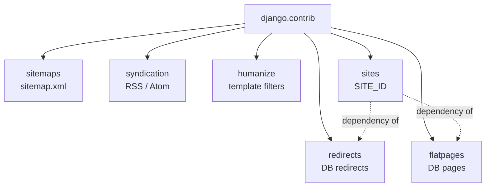

# Contrib apps: sitemaps, RSS, humanize, sites, redirects, flatpages

!!! quote "Think like a child 🧒"
    Imagine Django is a giant LEGO box. Besides the pieces you use every day
    (models, views, templates), there's a **drawer of ready-made pieces** already
    inside the box: a site map to hand to Google, a "news channel" (RSS), a
    translator that turns `1000000` into `1 million`, a little notebook of "this
    address changed to that one", and text pages you edit without programming. You
    don't need to build these pieces — just open the drawer.

That drawer is the `django.contrib` package. Each piece is an **app** you switch
on in `INSTALLED_APPS` (see **[settings](settings.md)**) and use. Let's open one
at a time.

## Use case

Your blog is live. Then requests come in that look like they need a "new backend",
but Django already solves them:

- "Google can't find my posts." → **sitemaps**
- "I want an RSS feed for readers." → **syndication**
- "Show `3 hours ago` instead of the raw date." → **humanize**
- "I run the same code on two domains." → **sites**
- "I changed a post's URL and old links broke." → **redirects**
- "I need an /about page the content team edits." → **flatpages**

Six apps, zero external dependencies. One at a time.

## Possibilities

A map of what's in the drawer:

| App | `INSTALLED_APPS` | Solves |
| --- | --- | --- |
| `django.contrib.sitemaps` | yes | Generates `sitemap.xml` for search engines |
| `django.contrib.syndication` | no* | RSS/Atom feeds via the `Feed` class |
| `django.contrib.humanize` | yes | Template filters (`intcomma`, `naturaltime`) |
| `django.contrib.sites` | yes | Site domain/name in the database (`SITE_ID`) |
| `django.contrib.redirects` | yes | DB-editable redirects + middleware |
| `django.contrib.flatpages` | yes | HTML pages stored in the database |

\* `syndication` works just by importing the `Feed` class; it doesn't need to be
in `INSTALLED_APPS` (but nothing breaks if it is).



### sitemaps — the map for Google

Think like a child: the sitemap is a **list of addresses** you hand to the search
engine saying "look, these pages exist, visit them all".

You describe each kind of content in a `Sitemap` class and wire it into the URLconf.

```python
from django.contrib.sitemaps import Sitemap
from apps.blog.models import Post


class PostSitemap(Sitemap):
    """Sitemap entry describing every published blog post."""

    changefreq: str = "weekly"
    priority: float = 0.8

    def items(self) -> "list[Post]":
        """Return the objects to list in the sitemap.

        Returns:
            The published posts, newest first.
        """
        return list(Post.objects.filter(published=True))

    def lastmod(self, obj: Post) -> "object":
        """Return the last-modified timestamp for a post.

        Args:
            obj: The post being serialized into the sitemap.

        Returns:
            The post's updated timestamp.
        """
        return obj.updated_at
```

Each object needs to know its own URL. The idiomatic way is to give the model a
`get_absolute_url()`:

```python
from django.db import models
from django.urls import reverse


class Post(models.Model):
    """A blog post."""

    slug = models.SlugField(unique=True)

    def get_absolute_url(self) -> str:
        """Return the canonical URL for this post.

        Returns:
            The absolute path to the post's detail page.
        """
        return reverse("blog:post_detail", kwargs={"slug": self.slug})
```

Now wire it into the root URLconf:

```python
from django.contrib.sitemaps.views import sitemap
from django.urls import path

from apps.blog.sitemaps import PostSitemap

sitemaps = {
    "posts": PostSitemap,
}

urlpatterns = [
    path(
        "sitemap.xml",
        sitemap,
        {"sitemaps": sitemaps},
        name="django.contrib.sitemaps.views.sitemap",
    ),
]
```

Add `django.contrib.sitemaps` (and `django.contrib.sites`, which it depends on) to
`INSTALLED_APPS`. Done: `GET /sitemap.xml` returns the XML.

!!! tip "Static sitemaps, no model"
    For fixed pages (home, about, contact) use a `Sitemap` whose `items()` returns
    **route names** and a `location()` that does the `reverse`:
    ```python
    from django.urls import reverse


    class StaticViewSitemap(Sitemap):
        """Sitemap for fixed, non-model pages."""

        def items(self) -> list[str]:
            """Return the URL names to include."""
            return ["home", "about", "contact"]

        def location(self, item: str) -> str:
            """Resolve a route name to its path."""
            return reverse(item)
    ```

!!! info "Many objects? Django paginates for you"
    Above ~50k URLs Django splits into a **sitemap index**. Use the `index` view
    from `django.contrib.sitemaps.views` to serve `sitemap.xml` as an index
    pointing at `sitemap-posts.xml`, etc.

### syndication — RSS and Atom feeds

Think like a child: a feed is an **automatic little newspaper**. Every time a new
post comes out, subscribers get it. You describe the newspaper in a `Feed` class.

```python
from django.contrib.syndication.views import Feed
from django.urls import reverse

from apps.blog.models import Post


class LatestPostsFeed(Feed):
    """RSS feed of the most recent published posts."""

    title: str = "My Blog"
    link: str = "/feed/"
    description: str = "Most recent blog posts."

    def items(self) -> "list[Post]":
        """Return the entries for the feed.

        Returns:
            The five newest published posts.
        """
        return list(Post.objects.filter(published=True).order_by("-created_at")[:5])

    def item_title(self, item: Post) -> str:
        """Return the title for a feed entry.

        Args:
            item: The post being rendered.

        Returns:
            The post title.
        """
        return item.title

    def item_description(self, item: Post) -> str:
        """Return the summary for a feed entry.

        Args:
            item: The post being rendered.

        Returns:
            The post's excerpt.
        """
        return item.excerpt

    def item_link(self, item: Post) -> str:
        """Return the absolute link for a feed entry.

        Args:
            item: The post being rendered.

        Returns:
            The URL of the post detail page.
        """
        return reverse("blog:post_detail", kwargs={"slug": item.slug})
```

Wire it into the URLconf:

```python
from django.urls import path

from apps.blog.feeds import LatestPostsFeed

urlpatterns = [
    path("feed/", LatestPostsFeed(), name="post_feed"),
]
```

`GET /feed/` returns RSS 2.0.

!!! tip "Atom instead of RSS"
    Swap the feed's base class:
    ```python
    from django.utils.feedgenerator import Atom1Feed


    class LatestPostsAtomFeed(LatestPostsFeed):
        """Atom variant of the latest-posts feed."""

        feed_type = Atom1Feed
        subtitle = LatestPostsFeed.description
    ```

!!! note "`item_link` vs `get_absolute_url`"
    If each `Post` already has `get_absolute_url()`, you can **omit** `item_link` —
    the `Feed` calls the object's `get_absolute_url()` automatically. Only declare
    `item_link` when you want a URL different from the canonical one.

### humanize — friendly numbers and dates

Think like a child: `humanize` is a **robot-to-human translator**. It takes
`1000000` and says `1.0 million`; it takes a timestamp and says `3 hours ago`.

They're **template filters**. Switch on `django.contrib.humanize` in
`INSTALLED_APPS` and load it in the template (see **[templates](templates.md)**):

```django


{{ post.views|intcomma }}          {# 1000000 -> 1,000,000 #}
{{ post.created_at|naturaltime }}  {# 3 hours ago #}
{{ post.created_at|naturalday }}   {# yesterday / today / Jul 22 #}
{{ 4|apnumber }}                    {# "four" (one through nine spelled out) #}
{{ 1000000|intword }}              {# 1.0 million #}
{{ 3|ordinal }}                     {# 3rd #}
```

| Filter | Input | Output (locale) |
| --- | --- | --- |
| `intcomma` | `1000000` | `1,000,000` |
| `intword` | `1000000` | `1.0 million` |
| `naturaltime` | a `datetime` | `3 hours ago` |
| `naturalday` | a date | `yesterday`, `today`, `Jul 22` |
| `apnumber` | `4` | `four` |
| `ordinal` | `3` | `3rd` |

!!! tip "Output respects the active language"
    `naturaltime`, `intword`, `naturalday` and `ordinal` follow the `LANGUAGE_CODE`
    / active translation. Under `pt-br`, `naturaltime` says "há 3 horas" instead of
    "3 hours ago". Combine it with the project's **[i18n](i18n.md)**.

!!! warning "`intcomma` and the separator"
    Under `USE_THOUSAND_SEPARATOR = True`, the separator follows the locale (a dot
    in pt-br: `1.000.000`). Without that setting, `intcomma` uses a fixed comma.
    Decide which behavior you want before promising the client a format.

### sites — one project, several domains

Think like a child: the `sites` framework is a **little sign with your store's name
and address**, stored in the database. Code that needs to know "which site am I on
right now?" reads the sign instead of guessing.

Switch on `django.contrib.sites` and set `SITE_ID` in settings:

```python
INSTALLED_APPS = [
    # ...
    "django.contrib.sites",
]

SITE_ID = 1
```

Run `migrate`: Django creates the table and an initial row (`example.com`). Edit it
via the admin or in code:

```python
from django.contrib.sites.models import Site

site = Site.objects.get_current()
site.domain = "myblog.com"
site.name = "My Blog"
site.save()
```

Inside a view, use the request to discover the current site:

```python
from django.contrib.sites.shortcuts import get_current_site
from django.http import HttpRequest, HttpResponse


def home(request: HttpRequest) -> HttpResponse:
    """Render the home page with the current site name.

    Args:
        request: The incoming HTTP request.

    Returns:
        A response embedding the active site's name.
    """
    site = get_current_site(request)
    return HttpResponse(f"Welcome to {site.name}")
```

!!! info "Why this exists"
    Feeds, sitemaps, and "reset your password" emails need to build **absolute
    URLs** (`https://myblog.com/...`). Without `sites`, Django doesn't know your
    domain. That's why `sitemaps`, `redirects` and `flatpages` **depend** on `sites`.

!!! note "`SITE_ID` is required when `sites` is installed"
    If you switch on `django.contrib.sites` but forget `SITE_ID`, `get_current()`
    tries to figure out the site from the request host; outside a request (in a
    command, in a test) that fails. Set `SITE_ID = 1` and move on.

### redirects — an editable "from/to" in the database

Think like a child: it's a **change-of-address notebook**. "Anyone looking for the
old street, send them to the new one." The team edits the notebook via the admin,
no deploy.

Switch on the app **and** the middleware:

```python
INSTALLED_APPS = [
    # ...
    "django.contrib.sites",
    "django.contrib.redirects",
]

MIDDLEWARE = [
    # ...
    "django.contrib.redirects.middleware.RedirectFallbackMiddleware",
]
```

Run `migrate`. Now create redirects (via the admin or in code):

```python
from django.contrib.redirects.models import Redirect
from django.contrib.sites.models import Site

Redirect.objects.create(
    site=Site.objects.get_current(),
    old_path="/blog/old-post/",
    new_path="/blog/new-post/",
)
```

How it works: the `RedirectFallbackMiddleware` only acts when **another view
returned 404**. Then it looks up `old_path` in the table; if it finds it, it
redirects.

| `new_path` | Response |
| --- | --- |
| Filled | `301 Moved Permanently` to `new_path` |
| Empty (`""`) | `410 Gone` (the page is gone for good) |

!!! warning "It's a fallback, it doesn't intercept"
    The middleware only kicks in **after** normal routing failed with 404. If one
    of your views already answers `/blog/old-post/`, the redirect never fires. It
    fixes broken links, it doesn't override existing routes.

!!! tip "301 is permanent and aggressively cached"
    Browsers cache the `301` for a long time. If you got `new_path` wrong, the user
    can get stuck at the wrong destination. For temporary redirects, prefer handling
    it in the view with a `302`; use the `redirects` table for definitive URL
    changes.

### flatpages — content pages in the database

Think like a child: flatpages are **sheets of paper stored in a drawer**. The
content team writes the HTML for "About", "Terms", "Contact" and files it away;
Django serves each sheet at the URL you choose — no view, no programmer.

Switch on the app, the middleware, and make sure the request `context_processors`
are present:

```python
INSTALLED_APPS = [
    # ...
    "django.contrib.sites",
    "django.contrib.flatpages",
]

MIDDLEWARE = [
    # ...
    "django.contrib.flatpages.middleware.FlatpageFallbackMiddleware",
]
```

Run `migrate`. Create a template at `templates/flatpages/default.html`:

```django
<!DOCTYPE html>
<html lang="en">
<head><title>{{ flatpage.title }}</title></head>
<body>
  <h1>{{ flatpage.title }}</h1>
  {{ flatpage.content }}
</body>
</html>
```

Create the page (via the admin or in code):

```python
from django.contrib.flatpages.models import FlatPage
from django.contrib.sites.models import Site

page = FlatPage.objects.create(
    url="/about/",
    title="About us",
    content="<p>We're a blog about Django.</p>",
)
page.sites.add(Site.objects.get_current())
```

`GET /about/` renders the template with the content. Like `redirects`, the
`FlatpageFallbackMiddleware` is a **fallback**: it only acts when normal routing
returned 404.

!!! tip "Explicit URL, no fallback"
    If you'd rather control the route (instead of relying on the 404), skip the
    middleware and include the app's URLconf:
    ```python
    from django.urls import include, path

    urlpatterns = [
        path("pages/", include("django.contrib.flatpages.urls")),
    ]
    ```

!!! danger "`flatpage.content` is raw HTML — mind who edits it"
    The content is rendered **without escaping** (that's intentional: the team
    writes HTML). This means anyone with access to the flatpages admin can inject
    `<script>`. Grant that permission only to trusted people and treat it as
    privileged content. See the security chapter.

!!! quote "📖 In the official docs"
    - [django.contrib — overview](https://docs.djangoproject.com/en/6.0/ref/contrib/)
    - [The sitemap framework](https://docs.djangoproject.com/en/6.0/ref/contrib/sitemaps/)
    - [The syndication feed framework](https://docs.djangoproject.com/en/6.0/ref/contrib/syndication/)
    - [django.contrib.humanize](https://docs.djangoproject.com/en/6.0/ref/contrib/humanize/)
    - [The "sites" framework](https://docs.djangoproject.com/en/6.0/ref/contrib/sites/)
    - [The redirects app](https://docs.djangoproject.com/en/6.0/ref/contrib/redirects/)
    - [The flatpages app](https://docs.djangoproject.com/en/6.0/ref/contrib/flatpages/)

## Recap

- `django.contrib` is the **drawer of ready-made pieces**: six apps, zero external
  dependencies.
- **sitemaps** — a `Sitemap` class + the `sitemap` view in the URLconf →
  `sitemap.xml`. Give models a `get_absolute_url()`.
- **syndication** — subclass `Feed`; wire `Feed()` into the URLconf. Swap to
  `Atom1Feed` for Atom.
- **humanize** — template filters (`intcomma`, `intword`, `naturaltime`,
  `naturalday`, `ordinal`); output respects the active language.
- **sites** — `SITE_ID` + `get_current_site(request)`; the base for absolute URLs.
  `sitemaps`, `redirects` and `flatpages` depend on it.
- **redirects** — a "from/to" table + `RedirectFallbackMiddleware`; acts only on
  404. Empty `new_path` → `410 Gone`.
- **flatpages** — HTML in the database + `FlatpageFallbackMiddleware` (or an
  explicit URLconf); content is raw HTML, so restrict who edits it.
