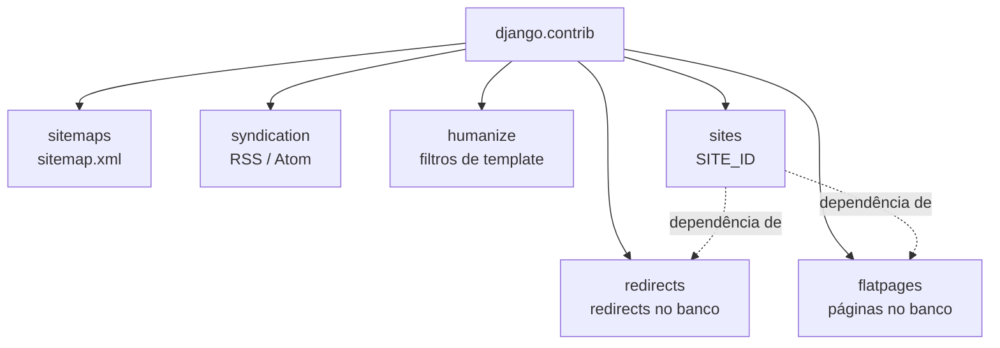

# Apps contrib: sitemaps, RSS, humanize, sites, redirects, flatpages

!!! quote "Pensa como criança 🧒"
    Imagina que o Django é uma caixa de LEGO gigante. Além das peças que você usa
    todo dia (models, views, templates), tem uma **gaveta de peças prontas** já
    dentro da caixa: um mapa do site pra dar pro Google, um "canal de notícias"
    (RSS), um tradutor que transforma `1000000` em `1 milhão`, um caderninho de
    "de qual endereço isso mudou pra qual", e páginas de texto que você edita sem
    programar. Você não precisa fabricar essas peças — é só abrir a gaveta.

Essa gaveta é o pacote `django.contrib`. Cada peça é um **app** que você liga em
`INSTALLED_APPS` (veja **[settings](settings.md)**) e usa. Vamos abrir uma de cada vez.

## Caso de uso

Seu blog está no ar. Aí chegam pedidos que parecem exigir "backend novo", mas o
Django já resolve:

- "O Google não acha meus posts." → **sitemaps**
- "Quero um feed RSS pros leitores." → **syndication**
- "Mostra `há 3 horas` em vez da data crua." → **humanize**
- "Rodo o mesmo código em dois domínios." → **sites**
- "Mudei a URL de um post e os links velhos quebraram." → **redirects**
- "Preciso de uma página /sobre que a equipe de conteúdo edita." → **flatpages**

Seis apps, zero dependências externas. Um de cada vez.

## Possibilidades

Um mapa do que vem na gaveta:

| App | `INSTALLED_APPS` | Resolve |
| --- | --- | --- |
| `django.contrib.sitemaps` | sim | Gera `sitemap.xml` pros buscadores |
| `django.contrib.syndication` | não* | Feeds RSS/Atom via classe `Feed` |
| `django.contrib.humanize` | sim | Filtros de template (`intcomma`, `naturaltime`) |
| `django.contrib.sites` | sim | Domínio/nome do site no banco (`SITE_ID`) |
| `django.contrib.redirects` | sim | Redirects editáveis no banco + middleware |
| `django.contrib.flatpages` | sim | Páginas HTML guardadas no banco |

\* `syndication` funciona só importando a classe `Feed`; não precisa estar em
`INSTALLED_APPS` (mas nada quebra se estiver).



### sitemaps — o mapa pro Google

Pensa como criança: o sitemap é uma **lista de endereços** que você entrega pro
buscador dizendo "olha, essas páginas existem, visita todas".

Você descreve cada tipo de conteúdo numa classe `Sitemap` e liga na URLconf.

```python
from django.contrib.sitemaps import Sitemap
from apps.blog.models import Post


class PostSitemap(Sitemap):
    """Sitemap entry describing every published blog post."""

    changefreq: str = "weekly"
    priority: float = 0.8

    def items(self) -> "list[Post]":
        """Return the objects to list in the sitemap.

        Returns:
            The published posts, newest first.
        """
        return list(Post.objects.filter(published=True))

    def lastmod(self, obj: Post) -> "object":
        """Return the last-modified timestamp for a post.

        Args:
            obj: The post being serialized into the sitemap.

        Returns:
            The post's updated timestamp.
        """
        return obj.updated_at
```

Cada objeto precisa saber sua própria URL. O jeito idiomático é dar um
`get_absolute_url()` ao modelo:

```python
from django.db import models
from django.urls import reverse


class Post(models.Model):
    """A blog post."""

    slug = models.SlugField(unique=True)

    def get_absolute_url(self) -> str:
        """Return the canonical URL for this post.

        Returns:
            The absolute path to the post's detail page.
        """
        return reverse("blog:post_detail", kwargs={"slug": self.slug})
```

Agora conecte na URLconf raiz:

```python
from django.contrib.sitemaps.views import sitemap
from django.urls import path

from apps.blog.sitemaps import PostSitemap

sitemaps = {
    "posts": PostSitemap,
}

urlpatterns = [
    path(
        "sitemap.xml",
        sitemap,
        {"sitemaps": sitemaps},
        name="django.contrib.sitemaps.views.sitemap",
    ),
]
```

Adicione `django.contrib.sitemaps` (e `django.contrib.sites`, do qual ele depende)
em `INSTALLED_APPS`. Pronto: `GET /sitemap.xml` devolve o XML.

!!! tip "Sitemaps estáticos, sem model"
    Para páginas fixas (home, sobre, contato) use um `Sitemap` com `items()`
    devolvendo **nomes de rota** e um `location()` que faz o `reverse`:
    ```python
    from django.urls import reverse


    class StaticViewSitemap(Sitemap):
        """Sitemap for fixed, non-model pages."""

        def items(self) -> list[str]:
            """Return the URL names to include."""
            return ["home", "about", "contact"]

        def location(self, item: str) -> str:
            """Resolve a route name to its path."""
            return reverse(item)
    ```

!!! info "Muitos objetos? O Django pagina sozinho"
    Acima de ~50 mil URLs o Django divide em um **índice de sitemaps**. Use a view
    `index` de `django.contrib.sitemaps.views` para servir `sitemap.xml` como
    índice apontando para `sitemap-posts.xml`, etc.

### syndication — feeds RSS e Atom

Pensa como criança: um feed é um **jornalzinho automático**. Toda vez que sai post
novo, quem assina recebe. Você descreve o jornal numa classe `Feed`.

```python
from django.contrib.syndication.views import Feed
from django.urls import reverse

from apps.blog.models import Post


class LatestPostsFeed(Feed):
    """RSS feed of the most recent published posts."""

    title: str = "Meu Blog"
    link: str = "/feed/"
    description: str = "Posts mais recentes do blog."

    def items(self) -> "list[Post]":
        """Return the entries for the feed.

        Returns:
            The five newest published posts.
        """
        return list(Post.objects.filter(published=True).order_by("-created_at")[:5])

    def item_title(self, item: Post) -> str:
        """Return the title for a feed entry.

        Args:
            item: The post being rendered.

        Returns:
            The post title.
        """
        return item.title

    def item_description(self, item: Post) -> str:
        """Return the summary for a feed entry.

        Args:
            item: The post being rendered.

        Returns:
            The post's excerpt.
        """
        return item.excerpt

    def item_link(self, item: Post) -> str:
        """Return the absolute link for a feed entry.

        Args:
            item: The post being rendered.

        Returns:
            The URL of the post detail page.
        """
        return reverse("blog:post_detail", kwargs={"slug": item.slug})
```

Ligue na URLconf:

```python
from django.urls import path

from apps.blog.feeds import LatestPostsFeed

urlpatterns = [
    path("feed/", LatestPostsFeed(), name="post_feed"),
]
```

`GET /feed/` já devolve RSS 2.0.

!!! tip "Atom em vez de RSS"
    Troque a classe-base do feed:
    ```python
    from django.utils.feedgenerator import Atom1Feed


    class LatestPostsAtomFeed(LatestPostsFeed):
        """Atom variant of the latest-posts feed."""

        feed_type = Atom1Feed
        subtitle = LatestPostsFeed.description
    ```

!!! note "`item_link` vs `get_absolute_url`"
    Se cada `Post` já tem `get_absolute_url()`, você pode **omitir** `item_link` —
    o `Feed` chama o `get_absolute_url()` do objeto automaticamente. Só declare
    `item_link` quando quiser uma URL diferente da canônica.

### humanize — números e datas amigáveis

Pensa como criança: `humanize` é um **tradutor de robô pra gente**. Ele pega
`1000000` e fala `1.0 milhão`; pega um horário e fala `há 3 horas`.

São **filtros de template**. Ligue `django.contrib.humanize` em `INSTALLED_APPS`
e carregue no template (veja **[templates](templates.md)**):

```django


{{ post.views|intcomma }}          {# 1000000 -> 1,000,000 #}
{{ post.created_at|naturaltime }}  {# há 3 horas #}
{{ post.created_at|naturalday }}   {# ontem / hoje / 22 de jul #}
{{ 4|apnumber }}                    {# "four" (um a nove por extenso, em inglês) #}
{{ 1000000|intword }}              {# 1.0 milhão #}
{{ 3|ordinal }}                     {# 3rd #}
```

| Filtro | Entrada | Saída (locale) |
| --- | --- | --- |
| `intcomma` | `1000000` | `1,000,000` |
| `intword` | `1000000` | `1.0 milhão` |
| `naturaltime` | um `datetime` | `há 3 horas` |
| `naturalday` | uma data | `ontem`, `hoje`, `22 de jul` |
| `apnumber` | `4` | `four` |
| `ordinal` | `3` | `3rd` |

!!! tip "A saída respeita o idioma ativo"
    `naturaltime`, `intword`, `naturalday` e `ordinal` seguem o `LANGUAGE_CODE` /
    a tradução ativa. Com `pt-br`, `naturaltime` diz "há 3 horas" em vez de
    "3 hours ago". Combine com o **[i18n](i18n.md)** do projeto.

!!! warning "`intcomma` e o separador"
    Sob `USE_THOUSAND_SEPARATOR = True`, o separador segue o locale (ponto em
    pt-br: `1.000.000`). Sem essa setting, `intcomma` usa vírgula fixa. Decida qual
    comportamento quer antes de prometer um formato ao cliente.

### sites — um projeto, vários domínios

Pensa como criança: o framework `sites` é uma **plaquinha com o nome e o endereço
da sua loja**, guardada no banco. Código que precisa saber "em que site estou
agora?" lê a plaquinha em vez de chutar.

Ligue `django.contrib.sites` e defina `SITE_ID` no settings:

```python
INSTALLED_APPS = [
    # ...
    "django.contrib.sites",
]

SITE_ID = 1
```

Rode `migrate`: o Django cria a tabela e uma linha inicial (`example.com`). Edite
pelo admin ou por código:

```python
from django.contrib.sites.models import Site

site = Site.objects.get_current()
site.domain = "meublog.com.br"
site.name = "Meu Blog"
site.save()
```

Dentro de uma view, use o request para descobrir o site atual:

```python
from django.contrib.sites.shortcuts import get_current_site
from django.http import HttpRequest, HttpResponse


def home(request: HttpRequest) -> HttpResponse:
    """Render the home page with the current site name.

    Args:
        request: The incoming HTTP request.

    Returns:
        A response embedding the active site's name.
    """
    site = get_current_site(request)
    return HttpResponse(f"Bem-vindo a {site.name}")
```

!!! info "Por que isso existe"
    Feeds, sitemaps, e-mails de "resetar senha" precisam montar **URLs absolutas**
    (`https://meublog.com.br/...`). Sem `sites`, o Django não sabe seu domínio. Por
    isso `sitemaps`, `redirects` e `flatpages` **dependem** de `sites`.

!!! note "`SITE_ID` é obrigatório com `sites` instalado"
    Se você liga `django.contrib.sites` mas esquece `SITE_ID`, `get_current()`
    tenta descobrir o site pelo host do request; fora de um request (num comando,
    num teste) isso falha. Defina `SITE_ID = 1` e siga em frente.

### redirects — "de/para" editável no banco

Pensa como criança: é um **caderninho de mudança de endereço**. "Quem procurar a
rua velha, mande pra rua nova." A equipe edita o caderninho pelo admin, sem deploy.

Ligue o app **e** o middleware:

```python
INSTALLED_APPS = [
    # ...
    "django.contrib.sites",
    "django.contrib.redirects",
]

MIDDLEWARE = [
    # ...
    "django.contrib.redirects.middleware.RedirectFallbackMiddleware",
]
```

Rode `migrate`. Agora crie redirects (pelo admin ou por código):

```python
from django.contrib.redirects.models import Redirect
from django.contrib.sites.models import Site

Redirect.objects.create(
    site=Site.objects.get_current(),
    old_path="/blog/post-antigo/",
    new_path="/blog/post-novo/",
)
```

Como funciona: o `RedirectFallbackMiddleware` só age quando **outra view devolveu
404**. Aí ele procura o `old_path` na tabela; se achar, redireciona.

| `new_path` | Resposta |
| --- | --- |
| Preenchido | `301 Moved Permanently` para `new_path` |
| Vazio (`""`) | `410 Gone` (a página sumiu de vez) |

!!! warning "É fallback, não intercepta"
    O middleware só entra em ação **depois** que o roteamento normal falhou com
    404. Se uma view sua já responde `/blog/post-antigo/`, o redirect nunca dispara.
    Ele resolve links quebrados, não sobrescreve rotas existentes.

!!! tip "301 é permanente e agressivamente cacheado"
    Navegadores guardam o `301` por muito tempo. Se você errou o `new_path`, o
    usuário pode ficar preso no destino errado. Para redirects temporários prefira
    tratar na view com um `302`; use a tabela `redirects` para mudanças definitivas
    de URL.

### flatpages — páginas de conteúdo no banco

Pensa como criança: flatpages são **folhas de papel guardadas numa gaveta**. A
equipe de conteúdo escreve o HTML de "Sobre", "Termos", "Contato" e guarda; o
Django serve cada folha na URL que você escolher — sem view, sem programador.

Ligue o app, o middleware, e garanta os `context_processors` de request:

```python
INSTALLED_APPS = [
    # ...
    "django.contrib.sites",
    "django.contrib.flatpages",
]

MIDDLEWARE = [
    # ...
    "django.contrib.flatpages.middleware.FlatpageFallbackMiddleware",
]
```

Rode `migrate`. Crie um template em `templates/flatpages/default.html`:

```django
<!DOCTYPE html>
<html lang="pt-br">
<head><title>{{ flatpage.title }}</title></head>
<body>
  <h1>{{ flatpage.title }}</h1>
  {{ flatpage.content }}
</body>
</html>
```

Crie a página (pelo admin ou por código):

```python
from django.contrib.flatpages.models import FlatPage
from django.contrib.sites.models import Site

page = FlatPage.objects.create(
    url="/sobre/",
    title="Sobre nós",
    content="<p>Somos um blog sobre Django.</p>",
)
page.sites.add(Site.objects.get_current())
```

`GET /sobre/` renderiza o template com o conteúdo. Como `redirects`, o
`FlatpageFallbackMiddleware` é **fallback**: só age quando o roteamento normal
devolveu 404.

!!! tip "URL explícita, sem fallback"
    Se preferir controlar a rota (em vez de depender do 404), pule o middleware e
    inclua a URLconf do app:
    ```python
    from django.urls import include, path

    urlpatterns = [
        path("pages/", include("django.contrib.flatpages.urls")),
    ]
    ```

!!! danger "`flatpage.content` é HTML bruto — cuidado com quem edita"
    O conteúdo é renderizado **sem escape** (é a intenção: a equipe escreve HTML).
    Isso significa que quem tem acesso ao admin de flatpages pode injetar
    `<script>`. Dê essa permissão só a gente de confiança e trate como conteúdo
    privilegiado. Veja o capítulo de segurança.

!!! quote "📖 Na documentação oficial"
    - [django.contrib — visão geral](https://docs.djangoproject.com/en/6.0/ref/contrib/)
    - [The sitemap framework](https://docs.djangoproject.com/en/6.0/ref/contrib/sitemaps/)
    - [The syndication feed framework](https://docs.djangoproject.com/en/6.0/ref/contrib/syndication/)
    - [django.contrib.humanize](https://docs.djangoproject.com/en/6.0/ref/contrib/humanize/)
    - [The "sites" framework](https://docs.djangoproject.com/en/6.0/ref/contrib/sites/)
    - [The redirects app](https://docs.djangoproject.com/en/6.0/ref/contrib/redirects/)
    - [The flatpages app](https://docs.djangoproject.com/en/6.0/ref/contrib/flatpages/)

## Recap

- `django.contrib` é a **gaveta de peças prontas**: seis apps, zero dependências
  externas.
- **sitemaps** — classe `Sitemap` + view `sitemap` na URLconf → `sitemap.xml`.
  Dê `get_absolute_url()` aos modelos.
- **syndication** — subclasse de `Feed`; ligue `Feed()` na URLconf. Troque para
  `Atom1Feed` para Atom.
- **humanize** — filtros de template (`intcomma`, `intword`, `naturaltime`,
  `naturalday`, `ordinal`); a saída respeita o idioma ativo.
- **sites** — `SITE_ID` + `get_current_site(request)`; base para URLs absolutas.
  `sitemaps`, `redirects` e `flatpages` dependem dele.
- **redirects** — tabela "de/para" + `RedirectFallbackMiddleware`; age só no 404.
  `new_path` vazio → `410 Gone`.
- **flatpages** — HTML no banco + `FlatpageFallbackMiddleware` (ou URLconf
  explícita); conteúdo é HTML bruto, então restrinja quem edita.
