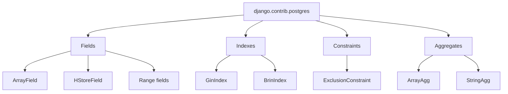

# django.contrib.postgres

!!! quote "Think like a child 🧒"
    A normal text field is a little box that holds **one** thing. But PostgreSQL
    has magic boxes: one that holds a **whole list** inside a single cell, one
    that holds a **mini-dictionary**, one that holds a **range** ("Monday to
    Friday"). `django.contrib.postgres` is the toolbox that teaches Django to use
    these toys that only Postgres has.

## Use case

You have a blog `Post` and you want to store its **tags** as a list of strings
inside the row itself — without a separate table. In PostgreSQL that is an
`ArrayField`:

```python
from django.contrib.postgres.fields import ArrayField
from django.db import models


class Post(models.Model):
    """A blog post that stores its tags inline as a PostgreSQL array."""

    title = models.CharField(max_length=200)
    tags = ArrayField(models.CharField(max_length=30), default=list, blank=True)

    def __str__(self) -> str:
        """Return the post title for admin and shell display."""
        return self.title
```

Now you filter straight in the database, no `join`:

```python
Post.objects.create(title="Django 6", tags=["django", "python", "orm"])

Post.objects.filter(tags__contains=["python"])
Post.objects.filter(tags__len=3)
Post.objects.filter(tags__0="django")
```

!!! danger "PostgreSQL only"
    Everything on this page requires the database `ENGINE` to be
    `django.db.backends.postgresql`. On SQLite/MySQL these fields **do not exist**
    and the migration breaks. Add `"django.contrib.postgres"` to `INSTALLED_APPS`
    to enable the operators, forms and validators.

## Possibilities

### Overview



### PostgreSQL-specific fields

| Field | Stores | Good for |
| --- | --- | --- |
| `ArrayField(base_field)` | A list of values of the same type | Tags, coordinates, scores |
| `HStoreField()` | A `str -> str` map (key/value) | Simple flat metadata |
| `IntegerRangeField` | Integer range | Age band, quantities |
| `DecimalRangeField` | Decimal range | Price bands |
| `DateRangeField` | Date range | Bookings, seasons |
| `DateTimeRangeField` | Datetime range | Scheduling, shifts |
| `BigIntegerRangeField` | Big integer range | Huge IDs, counters |

!!! note "`JSONField` moved out"
    The old `django.contrib.postgres.fields.JSONField` was promoted to
    `django.db.models.JSONField` — today it works across several databases, not
    just Postgres. Always use `from django.db import models` and
    `models.JSONField`. Its richer operators, though, truly shine on PostgreSQL.

#### `ArrayField`

```python
from django.contrib.postgres.fields import ArrayField
from django.db import models


class Board(models.Model):
    """A tic-tac-toe board stored as a 3x3 nested integer array."""

    grid = ArrayField(
        ArrayField(models.IntegerField(), size=3),
        size=3,
    )
```

Handy `ArrayField` lookups:

| Lookup | Means |
| --- | --- |
| `tags__contains=["a"]` | The array contains all these items |
| `tags__contained_by=["a", "b"]` | All items belong to this set |
| `tags__overlap=["a", "b"]` | Shares at least one item |
| `tags__len=3` | The array has exactly 3 items |
| `tags__0="a"` | The item at index 0 is `"a"` |
| `tags__0_2` | Slice (indexes 0 and 1) |

#### `HStoreField`

`HStoreField` needs the `hstore` extension in the database. Add the
`HStoreExtension` operation to your first migration:

```python
from django.contrib.postgres.operations import HStoreExtension
from django.db import migrations


class Migration(migrations.Migration):
    """Enable the hstore extension before any HStoreField is used."""

    operations = [
        HStoreExtension(),
    ]
```

```python
from django.contrib.postgres.fields import HStoreField
from django.db import models


class Product(models.Model):
    """A product whose flat attributes live in a single hstore column."""

    name = models.CharField(max_length=200)
    attributes = HStoreField(default=dict, blank=True)


Product.objects.create(name="T-shirt", attributes={"color": "blue", "size": "M"})
Product.objects.filter(attributes__color="blue")
Product.objects.filter(attributes__has_key="size")
Product.objects.filter(attributes__contains={"color": "blue"})
```

!!! warning "hstore is always text"
    Every value in an `HStoreField` is stored as a **string** (`"1"`, not `1`).
    For nested or typed data, prefer `models.JSONField`.

#### Range fields

```python
from django.contrib.postgres.fields import DateTimeRangeField
from django.db import models
from psycopg.types.range import TimestamptzRange


class Reservation(models.Model):
    """A room reservation spanning a start/end datetime range."""

    room = models.CharField(max_length=50)
    during = DateTimeRangeField()


from datetime import datetime, timezone

Reservation.objects.create(
    room="Room 1",
    during=TimestamptzRange(
        datetime(2026, 7, 22, 9, tzinfo=timezone.utc),
        datetime(2026, 7, 22, 11, tzinfo=timezone.utc),
    ),
)

Reservation.objects.filter(
    during__contains=datetime(2026, 7, 22, 10, tzinfo=timezone.utc)
)
Reservation.objects.filter(during__overlap=("2026-07-22", "2026-07-23"))
```

!!! info "Range objects come from the driver"
    With **psycopg 3** (the default in Django 6.0) the types are
    `psycopg.types.range.Range` and variants like `TimestamptzRange`. Lookups such
    as `contains`, `contained_by`, `overlap`, `fully_lt` and `fully_gt` translate
    directly to Postgres range operators.

### PostgreSQL indexes

Specialized indexes live in `django.contrib.postgres.indexes` and go into the
model's `Meta.indexes`. `GinIndex` speeds up searches inside arrays, hstore and
JSON; `BrinIndex` is tiny and great for large, naturally ordered columns
(ascending dates, for example).

```python
from django.contrib.postgres.fields import ArrayField
from django.contrib.postgres.indexes import BrinIndex, GinIndex
from django.db import models


class Article(models.Model):
    """An article indexed for fast tag search and time-range scans."""

    title = models.CharField(max_length=200)
    tags = ArrayField(models.CharField(max_length=30), default=list, blank=True)
    published_at = models.DateTimeField()

    class Meta:
        indexes = [
            GinIndex(fields=["tags"], name="article_tags_gin"),
            BrinIndex(fields=["published_at"], name="article_pub_brin"),
        ]
```

| Index | When to use |
| --- | --- |
| `GinIndex` | `contains`/`has_key`/`overlap` searches on array, hstore, JSON and full-text |
| `BrinIndex` | Large columns whose physical order tracks the value (dates, sequential IDs) |
| `GistIndex` | Range fields and the natural companion of `ExclusionConstraint` |
| `BTreeIndex` / `HashIndex` / `SpGistIndex` | Niche cases mirroring Postgres index types |

!!! tip "`index_together` is gone"
    Multi-column indexes are now declared **only** in `Meta.indexes`. The old
    `index_together` attribute was removed — use `models.Index(fields=[...])` or
    the Postgres indexes above.

### `ExclusionConstraint`

An `ExclusionConstraint` prevents two rows from "conflicting" according to an
operator. The classic case: **no reservation of the same room may overlap in
time**. It needs the `btree_gist` extension and an implicit GiST index.

```python
from django.contrib.postgres.constraints import ExclusionConstraint
from django.contrib.postgres.fields import DateTimeRangeField, RangeOperators
from django.db import models


class Reservation(models.Model):
    """A reservation that cannot overlap another for the same room."""

    room = models.CharField(max_length=50)
    during = DateTimeRangeField()

    class Meta:
        constraints = [
            ExclusionConstraint(
                name="exclude_overlapping_reservations",
                expressions=[
                    ("room", RangeOperators.EQUAL),
                    ("during", RangeOperators.OVERLAPS),
                ],
            ),
        ]
```

```python
from django.contrib.postgres.operations import BtreeGistExtension
from django.db import migrations


class Migration(migrations.Migration):
    """Enable btree_gist so the exclusion constraint can be created."""

    operations = [
        BtreeGistExtension(),
    ]
```

!!! warning "`CheckConstraint` uses `condition=`"
    When mixing with ordinary constraints, remember that in Django 6.0
    `CheckConstraint` takes `condition=` (the old `check=` was removed):

    ```python
    from django.db import models
    from django.db.models import Q

    class Meta:
        constraints = [
            models.CheckConstraint(
                condition=Q(price__gte=0),
                name="price_non_negative",
            ),
        ]
    ```

### Aggregates: `ArrayAgg` and `StringAgg`

These functions live in `django.contrib.postgres.aggregates` and collapse **many
rows into one** — a list or a joined string.

```python
from django.contrib.postgres.aggregates import ArrayAgg, StringAgg
from django.db.models import F


authors = Author.objects.annotate(
    post_titles=ArrayAgg("posts__title", default=[]),
    tag_line=StringAgg(
        "posts__title",
        delimiter=", ",
        order_by=F("posts__published_at").desc(),
        default="",
    ),
)

for a in authors:
    print(a.display_name, a.post_titles, a.tag_line)
```

| Aggregate | Returns | Key arguments |
| --- | --- | --- |
| `ArrayAgg(field)` | A Python list | `distinct=True`, `order_by=...`, `filter=Q(...)`, `default=[]` |
| `StringAgg(field, delimiter)` | A joined string | `distinct=True`, `order_by=...`, `filter=Q(...)`, `default=""` |

!!! tip "`default=` avoids `None`"
    When there are no rows to aggregate, Postgres would return `NULL`. Pass
    `default=[]` (for `ArrayAgg`) or `default=""` (for `StringAgg`) to get an
    empty collection back — matching the "an empty collection is not an error"
    rule.

!!! note "`order_by` inside the aggregate"
    In Django 6.0 the `order_by` of `ArrayAgg`/`StringAgg` accepts field names,
    `F(...)` expressions and `.desc()`/`.asc()`, ordering the items **within**
    each aggregated group.

!!! quote "📖 In the official docs"
    - [django.contrib.postgres](https://docs.djangoproject.com/en/6.0/ref/contrib/postgres/)
    - [Model fields](models-fields.md)
    - [Full-text search with PostgreSQL](search-postgres.md)

## Recap

- `django.contrib.postgres` unlocks features exclusive to **PostgreSQL** — add
  `"django.contrib.postgres"` to `INSTALLED_APPS`.
- **Fields**: `ArrayField` (lists), `HStoreField` (`str->str` map, needs the
  `hstore` extension) and the **range fields** (`IntegerRangeField`,
  `DateTimeRangeField`, etc.) for intervals.
- Use `models.JSONField` (no longer the `contrib.postgres` one) for JSON.
- **Indexes**: `GinIndex` for array/hstore/JSON/full-text searches; `BrinIndex`
  for large, ordered columns — declared in `Meta.indexes`.
- **`ExclusionConstraint`** prevents conflicting rows (e.g. overlapping
  reservations); needs the `btree_gist` extension. `CheckConstraint` uses
  `condition=`.
- **Aggregates** `ArrayAgg` and `StringAgg` collapse rows into a list/string;
  pass `default=[]`/`default=""` to avoid `None`.
