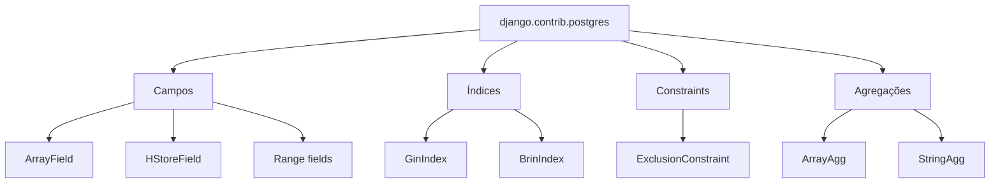

# django.contrib.postgres

!!! quote "Pensa como criança 🧒"
    Um campo de texto normal é uma caixinha que guarda **uma** coisa. Mas o
    PostgreSQL tem caixas mágicas: uma que guarda uma **lista inteira** dentro de
    uma célula, outra que guarda um **mini-dicionário**, outra que guarda um
    **intervalo** ("de segunda a sexta"). O `django.contrib.postgres` é a caixa
    de ferramentas que ensina o Django a usar esses brinquedos que só o Postgres
    tem.

## Caso de uso

Você tem um `Post` do blog e quer guardar as **tags** como uma lista de textos
dentro da própria linha — sem criar uma tabela separada. No PostgreSQL isso é um
`ArrayField`:

```python
from django.contrib.postgres.fields import ArrayField
from django.db import models


class Post(models.Model):
    """A blog post that stores its tags inline as a PostgreSQL array."""

    title = models.CharField(max_length=200)
    tags = ArrayField(models.CharField(max_length=30), default=list, blank=True)

    def __str__(self) -> str:
        """Return the post title for admin and shell display."""
        return self.title
```

Agora você filtra direto no banco, sem `join`:

```python
Post.objects.create(title="Django 6", tags=["django", "python", "orm"])

Post.objects.filter(tags__contains=["python"])
Post.objects.filter(tags__len=3)
Post.objects.filter(tags__0="django")
```

!!! danger "Só funciona no PostgreSQL"
    Tudo nesta página exige que o `ENGINE` do banco seja
    `django.db.backends.postgresql`. Em SQLite/MySQL esses campos **não existem**
    e a migration quebra. Adicione `"django.contrib.postgres"` ao
    `INSTALLED_APPS` para habilitar os operadores, formulários e validadores.

## Possibilidades

### Panorama



### Campos específicos do PostgreSQL

| Campo | Guarda | Bom para |
| --- | --- | --- |
| `ArrayField(base_field)` | Uma lista de valores do mesmo tipo | Tags, coordenadas, notas |
| `HStoreField()` | Um mapa `str -> str` (chave/valor) | Metadados simples e planos |
| `IntegerRangeField` | Intervalo de inteiros | Faixa etária, quantidades |
| `DecimalRangeField` | Intervalo de decimais | Faixas de preço |
| `DateRangeField` | Intervalo de datas | Reservas, temporadas |
| `DateTimeRangeField` | Intervalo de data/hora | Agendamentos, turnos |
| `BigIntegerRangeField` | Intervalo de inteiros grandes | IDs, contadores enormes |

!!! note "`JSONField` mudou de casa"
    O antigo `django.contrib.postgres.fields.JSONField` foi promovido para
    `django.db.models.JSONField` — hoje ele funciona em vários bancos, não só no
    Postgres. Use sempre `from django.db import models` e `models.JSONField`. Os
    operadores mais ricos, porém, brilham mesmo no PostgreSQL.

#### `ArrayField`

```python
from django.contrib.postgres.fields import ArrayField
from django.db import models


class Board(models.Model):
    """A tic-tac-toe board stored as a 3x3 nested integer array."""

    grid = ArrayField(
        ArrayField(models.IntegerField(), size=3),
        size=3,
    )
```

Lookups úteis do `ArrayField`:

| Lookup | Significa |
| --- | --- |
| `tags__contains=["a"]` | O array contém todos esses itens |
| `tags__contained_by=["a", "b"]` | Todos os itens estão nesse conjunto |
| `tags__overlap=["a", "b"]` | Compartilha ao menos um item |
| `tags__len=3` | O array tem exatamente 3 itens |
| `tags__0="a"` | O item no índice 0 é `"a"` |
| `tags__0_2` | Fatia (índices 0 e 1) |

#### `HStoreField`

O `HStoreField` precisa da extensão `hstore` no banco. Adicione a operação
`HStoreExtension` na sua primeira migration:

```python
from django.contrib.postgres.operations import HStoreExtension
from django.db import migrations


class Migration(migrations.Migration):
    """Enable the hstore extension before any HStoreField is used."""

    operations = [
        HStoreExtension(),
    ]
```

```python
from django.contrib.postgres.fields import HStoreField
from django.db import models


class Product(models.Model):
    """A product whose flat attributes live in a single hstore column."""

    name = models.CharField(max_length=200)
    attributes = HStoreField(default=dict, blank=True)


Product.objects.create(name="Camiseta", attributes={"cor": "azul", "tam": "M"})
Product.objects.filter(attributes__cor="azul")
Product.objects.filter(attributes__has_key="tam")
Product.objects.filter(attributes__contains={"cor": "azul"})
```

!!! warning "hstore é sempre texto"
    Todo valor de um `HStoreField` é armazenado como **string** (`"1"`, não `1`).
    Para dados aninhados ou tipados, prefira `models.JSONField`.

#### Range fields

```python
from django.contrib.postgres.fields import DateTimeRangeField
from django.db import models
from psycopg.types.range import TimestamptzRange


class Reservation(models.Model):
    """A room reservation spanning a start/end datetime range."""

    room = models.CharField(max_length=50)
    during = DateTimeRangeField()


from datetime import datetime, timezone

Reservation.objects.create(
    room="Sala 1",
    during=TimestamptzRange(
        datetime(2026, 7, 22, 9, tzinfo=timezone.utc),
        datetime(2026, 7, 22, 11, tzinfo=timezone.utc),
    ),
)

Reservation.objects.filter(
    during__contains=datetime(2026, 7, 22, 10, tzinfo=timezone.utc)
)
Reservation.objects.filter(during__overlap=("2026-07-22", "2026-07-23"))
```

!!! info "Objetos de intervalo vêm do driver"
    Com o **psycopg 3** (padrão no Django 6.0) os tipos são
    `psycopg.types.range.Range` e variantes como `TimestamptzRange`. Lookups como
    `contains`, `contained_by`, `overlap`, `fully_lt` e `fully_gt` traduzem
    diretamente para os operadores de intervalo do Postgres.

### Índices do PostgreSQL

Índices especializados vivem em `django.contrib.postgres.indexes` e entram no
`Meta.indexes` do modelo. O `GinIndex` acelera buscas dentro de arrays, hstore e
JSON; o `BrinIndex` é minúsculo e ótimo para colunas grandes e ordenadas (datas
crescentes, por exemplo).

```python
from django.contrib.postgres.fields import ArrayField
from django.contrib.postgres.indexes import BrinIndex, GinIndex
from django.db import models


class Article(models.Model):
    """An article indexed for fast tag search and time-range scans."""

    title = models.CharField(max_length=200)
    tags = ArrayField(models.CharField(max_length=30), default=list, blank=True)
    published_at = models.DateTimeField()

    class Meta:
        indexes = [
            GinIndex(fields=["tags"], name="article_tags_gin"),
            BrinIndex(fields=["published_at"], name="article_pub_brin"),
        ]
```

| Índice | Quando usar |
| --- | --- |
| `GinIndex` | Buscas `contains`/`has_key`/`overlap` em array, hstore, JSON e busca full-text |
| `BrinIndex` | Colunas grandes cuja ordem física acompanha o valor (datas, IDs sequenciais) |
| `GistIndex` | Range fields e o companheiro natural do `ExclusionConstraint` |
| `BTreeIndex` / `HashIndex` / `SpGistIndex` | Casos pontuais que espelham os tipos de índice do Postgres |

!!! tip "`index_together` acabou"
    Índices de várias colunas hoje se declaram **só** em `Meta.indexes`. O antigo
    atributo `index_together` foi removido — use `models.Index(fields=[...])` ou
    os índices do Postgres acima.

### `ExclusionConstraint`

Um `ExclusionConstraint` impede que duas linhas "conflitem" segundo um operador.
O caso clássico: **nenhuma reserva da mesma sala pode se sobrepor no tempo**.
Precisa da extensão `btree_gist` e de um índice GiST implícito.

```python
from django.contrib.postgres.constraints import ExclusionConstraint
from django.contrib.postgres.fields import DateTimeRangeField, RangeOperators
from django.db import models


class Reservation(models.Model):
    """A reservation that cannot overlap another for the same room."""

    room = models.CharField(max_length=50)
    during = DateTimeRangeField()

    class Meta:
        constraints = [
            ExclusionConstraint(
                name="exclude_overlapping_reservations",
                expressions=[
                    ("room", RangeOperators.EQUAL),
                    ("during", RangeOperators.OVERLAPS),
                ],
            ),
        ]
```

```python
from django.contrib.postgres.operations import BtreeGistExtension
from django.db import migrations


class Migration(migrations.Migration):
    """Enable btree_gist so the exclusion constraint can be created."""

    operations = [
        BtreeGistExtension(),
    ]
```

!!! warning "`CheckConstraint` usa `condition=`"
    Ao misturar com constraints comuns, lembre que no Django 6.0 o
    `CheckConstraint` recebe `condition=` (o antigo `check=` foi removido):

    ```python
    from django.db import models
    from django.db.models import Q

    class Meta:
        constraints = [
            models.CheckConstraint(
                condition=Q(price__gte=0),
                name="price_non_negative",
            ),
        ]
    ```

### Agregações: `ArrayAgg` e `StringAgg`

Essas funções vivem em `django.contrib.postgres.aggregates` e colapsam **várias
linhas em uma só** — uma lista ou um texto juntado.

```python
from django.contrib.postgres.aggregates import ArrayAgg, StringAgg
from django.db.models import F


authors = Author.objects.annotate(
    post_titles=ArrayAgg("posts__title", default=[]),
    tag_line=StringAgg(
        "posts__title",
        delimiter=", ",
        order_by=F("posts__published_at").desc(),
        default="",
    ),
)

for a in authors:
    print(a.display_name, a.post_titles, a.tag_line)
```

| Agregação | Retorna | Argumentos-chave |
| --- | --- | --- |
| `ArrayAgg(field)` | Uma lista Python | `distinct=True`, `order_by=...`, `filter=Q(...)`, `default=[]` |
| `StringAgg(field, delimiter)` | Uma string juntada | `distinct=True`, `order_by=...`, `filter=Q(...)`, `default=""` |

!!! tip "`default=` evita o `None`"
    Quando não há linhas para agregar, o Postgres devolveria `NULL`. Passe
    `default=[]` (para `ArrayAgg`) ou `default=""` (para `StringAgg`) para receber
    uma coleção vazia — combina com a regra "coleção vazia não é erro".

!!! note "`order_by` dentro da agregação"
    No Django 6.0 o `order_by` de `ArrayAgg`/`StringAgg` aceita nomes de campo,
    expressões `F(...)` e `.desc()`/`.asc()`, ordenando os itens **dentro** de
    cada grupo agregado.

!!! quote "📖 Na documentação oficial"
    - [django.contrib.postgres](https://docs.djangoproject.com/en/6.0/ref/contrib/postgres/)
    - [Campos de modelo](models-fields.md)
    - [Busca full-text com PostgreSQL](search-postgres.md)

## Recap

- `django.contrib.postgres` desbloqueia recursos exclusivos do **PostgreSQL** —
  adicione `"django.contrib.postgres"` ao `INSTALLED_APPS`.
- **Campos**: `ArrayField` (listas), `HStoreField` (mapa `str->str`, exige a
  extensão `hstore`) e os **range fields** (`IntegerRangeField`,
  `DateTimeRangeField`, etc.) para intervalos.
- Use `models.JSONField` (não mais o de `contrib.postgres`) para JSON.
- **Índices**: `GinIndex` para buscas em array/hstore/JSON/full-text; `BrinIndex`
  para colunas grandes e ordenadas — declarados em `Meta.indexes`.
- **`ExclusionConstraint`** impede linhas conflitantes (ex.: reservas
  sobrepostas); exige a extensão `btree_gist`. `CheckConstraint` usa `condition=`.
- **Agregações** `ArrayAgg` e `StringAgg` colapsam linhas em uma lista/texto;
  passe `default=[]`/`default=""` para evitar `None`.
