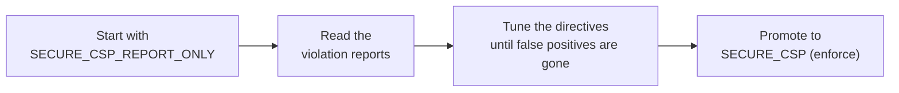

# Content Security Policy (CSP)

!!! quote "Think like a child 🧒"
    Picture a party where the bouncer has a little list: "only people I invited get
    in". If a stranger tries to walk in, the bouncer stops them at the door.
    **CSP** is that little list for the browser: "only run scripts that came from
    these places". If an attacker manages to paste a malicious `<script>` into your
    page, the browser checks the list, doesn't recognize the origin, and **refuses
    to run it**.

## Use case

Your blog shows readers' comments. A malicious reader writes a comment with
`<script>stealCookies()</script>` inside it. If that text is rendered carelessly,
the next victim's browser runs the script — that's an **XSS** (Cross-Site
Scripting) attack.

CSP is your second line of defense. Even if the script leaks into the HTML, you
tell the browser: "only execute scripts that come from my own origin". The
injected script doesn't have that credential, so the browser blocks it.

In Django 6.0 this became native: one middleware and a single setting.

```python
# config/settings.py
from django.utils.csp import CSP

MIDDLEWARE = [
    "django.middleware.security.SecurityMiddleware",
    "django.middleware.csp.ContentSecurityPolicyMiddleware",
    "django.contrib.sessions.middleware.SessionMiddleware",
    "django.middleware.common.CommonMiddleware",
    "django.middleware.csrf.CsrfViewMiddleware",
    "django.contrib.auth.middleware.AuthenticationMiddleware",
    "django.contrib.messages.middleware.MessageMiddleware",
    "django.middleware.clickjacking.XFrameOptionsMiddleware",
]

SECURE_CSP = {
    "default-src": [CSP.SELF],
    "script-src": [CSP.SELF],
    "style-src": [CSP.SELF],
    "img-src": [CSP.SELF, "data:"],
}
```

With this, every response gains a header:

```text
Content-Security-Policy: default-src 'self'; script-src 'self'; style-src 'self'; img-src 'self' data:
```

## What's possible

### The Django 6.0 pieces

| Piece | What it is |
| --- | --- |
| `django.middleware.csp.ContentSecurityPolicyMiddleware` | Middleware that adds the header on every response |
| `SECURE_CSP` | Dict with the enforced policy (blocking mode) |
| `SECURE_CSP_REPORT_ONLY` | Same shape, but only **reports** — doesn't block |
| `django.utils.csp.CSP` | Enum with the special values (`CSP.SELF`, `CSP.NONE`, `CSP.NONCE`...) |
| `request.csp_nonce` | That request's nonce, to use in the template |

!!! info "Why an enum and not plain strings?"
    Values like `'self'` and `'none'` **need** their single quotes inside the
    header. Writing `"self"` (without the inner quotes) is a classic mistake that
    silently turns the protection off. Using `CSP.SELF` you can't get it wrong:
    Django writes `'self'` correctly for you.

### The `CSP` enum: the special values

```python
from django.utils.csp import CSP
```

| Value | Becomes in the header | Use |
| --- | --- | --- |
| `CSP.NONE` | `'none'` | Block everything for that directive |
| `CSP.SELF` | `'self'` | Only the site's own origin |
| `CSP.NONCE` | `'nonce-<random>'` | Allow scripts/styles tagged with the request's nonce |
| `CSP.UNSAFE_INLINE` | `'unsafe-inline'` | Allow inline `<script>` and `style=` (**dangerous**) |
| `CSP.UNSAFE_EVAL` | `'unsafe-eval'` | Allow `eval()` (**dangerous**) |
| `CSP.STRICT_DYNAMIC` | `'strict-dynamic'` | Trust scripts loaded by an already-trusted script |
| `CSP.WASM_UNSAFE_EVAL` | `'wasm-unsafe-eval'` | Allow compiling WebAssembly |
| `CSP.REPORT_SAMPLE` | `'report-sample'` | Include a snippet of the offending code in the report |

Ordinary origins also go in as normal strings: `CSP.SELF`, `"https:"`,
`"data:"`, `"https://cdn.example.com"`.

### Nonces: letting YOUR inline scripts run

Think like a child: the nonce is a party wristband. Every time the page loads, the
bouncer hands out a brand-new wristband. Your scripts get the wristband; the
script the attacker injected **doesn't know today's wristband**, so it's left out.

First, ask for the nonce in the directive:

```python
# config/settings.py
from django.utils.csp import CSP

SECURE_CSP = {
    "default-src": [CSP.SELF],
    "script-src": [CSP.SELF, CSP.NONCE],
    "style-src": [CSP.SELF, CSP.NONCE],
}
```

Then tag your inline elements in the template with `request.csp_nonce`:

```html
{# templates/blog/post_detail.html #}
<script nonce="{{ request.csp_nonce }}">
  document.title = "Post loaded";
</script>

<style nonce="{{ request.csp_nonce }}">
  .highlight { color: rebeccapurple; }
</style>
```

Django generates a random value per request and places it both in the header and
in the `nonce="..."` attribute. They match, so the browser trusts it. A `<script>`
injected via XSS won't have the right `nonce` and will be **blocked**.

!!! tip "The nonce only appears if you use it"
    `request.csp_nonce` is lazy: Django only generates and injects the value into
    the header when a template actually reads it. If you never use the nonce in a
    template, no `nonce-...` shows up in the header — no cost.

!!! warning "A new nonce on every request"
    Don't cache pages with the nonce baked in without care. If you serve the same
    page (with an old nonce) to another request, the value in the HTML won't match
    the one in the header and your own scripts will be blocked.

### Report-only mode: test without breaking anything

Before turning on real blocking, you can run in **report-only** mode. The browser
blocks nothing — it only warns (in the console and/or at a reporting endpoint)
what it **would** have blocked. Perfect for discovering what your page uses today
without taking the site down.

```python
# config/settings.py
from django.utils.csp import CSP

SECURE_CSP_REPORT_ONLY = {
    "default-src": [CSP.SELF],
    "script-src": [CSP.SELF, CSP.NONCE],
    "report-uri": ["/csp-report/"],
}
```

This sends the `Content-Security-Policy-Report-Only` header. You can have both at
once: `SECURE_CSP` (enforcing an already-validated policy) and
`SECURE_CSP_REPORT_ONLY` (testing a stricter policy before promoting it).



!!! note "Collecting reports"
    The `report-uri` and `report-to` directives tell the browser where to send a
    JSON describing each violation. You create a simple view that receives that
    `POST` and logs it. Start with `report-uri` (more compatible) and move to
    `report-to` as browser support allows.

### The most common directives

| Directive | Controls |
| --- | --- |
| `default-src` | Fallback for anything without a specific directive |
| `script-src` | Where scripts may come from / run |
| `style-src` | Where styles may come from |
| `img-src` | Where images may load from |
| `connect-src` | Targets of `fetch`, `XHR`, WebSocket |
| `font-src` | Where fonts may load from |
| `frame-ancestors` | Who may put you in an `<iframe>` (anti-clickjacking) |
| `base-uri` | Restricts the `<base href>` |
| `form-action` | Where forms may `POST` |

Boolean directives (which take no value) use `True`:

```python
from django.utils.csp import CSP

SECURE_CSP = {
    "default-src": [CSP.SELF],
    "upgrade-insecure-requests": True,
}
```

!!! danger "`unsafe-inline` cancels the XSS protection"
    Putting `CSP.UNSAFE_INLINE` in `script-src` is like the bouncer letting
    everyone in without checking the list. Any injected `<script>` starts running —
    which is exactly what CSP exists to prevent. Prefer **nonces** (`CSP.NONCE`) or
    hashes. Only use `unsafe-inline` as a last resort and knowing the risk.

!!! check "CSP is defense in depth, not a substitute"
    CSP **mitigates** XSS; it doesn't fix unsafe HTML. Keep escaping output (Django
    templates' autoescape already does this), validating input, and using the other
    security headers. See the big picture in
    [security](../referencia/security.md).

### Per-view policy (advanced)

Sometimes a specific page needs a different policy (for example, a dashboard that
embeds a third-party map). Django lets you override the policy per response via
decorators in the `django.views.decorators.csp` module, keeping the global default
for the rest of the site.

!!! info "Start global, refine later"
    The vast majority of sites solve everything with a single `SECURE_CSP`. Only
    reach for per-view policies when you have a real, localized exception —
    otherwise complexity grows with no security gain.

!!! quote "📖 In the official docs"
    - [Content Security Policy (reference)](https://docs.djangoproject.com/en/6.0/ref/csp/)
    - [How to use a Content Security Policy](https://docs.djangoproject.com/en/6.0/howto/csp/)

## Recap

- **CSP** is a little list of trusted origins the browser respects; it blocks
  scripts/styles outside the list, mitigating **XSS**.
- In Django 6.0 it's native: add the
  `django.middleware.csp.ContentSecurityPolicyMiddleware` and set `SECURE_CSP`.
- Use the `django.utils.csp.CSP` enum (`CSP.SELF`, `CSP.NONE`, `CSP.NONCE`...) so
  you don't get the quoting of the special values wrong.
- **Nonces** (`CSP.NONCE` + `{{ request.csp_nonce }}`) allow your inline scripts
  while blocking injected ones — the value changes on every request.
- Start with `SECURE_CSP_REPORT_ONLY` to discover violations without breaking the
  site, then promote to `SECURE_CSP`.
- Avoid `CSP.UNSAFE_INLINE` — it cancels the protection. CSP is defense in depth;
  it doesn't replace escaping output and validating input.

Want the full map of Django's security headers and safeguards? See
**[security](../referencia/security.md)**.
