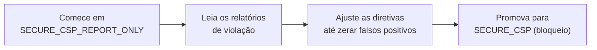

# Content Security Policy (CSP)

!!! quote "Pensa como criança 🧒"
    Imagina uma festa onde o segurança tem uma listinha: "só entra quem eu chamei".
    Se alguém desconhecido tenta entrar, o segurança barra na porta. O **CSP** é
    essa listinha para o navegador: "só rode scripts que vieram destes lugares".
    Se um invasor conseguir colar um `<script>` malicioso na sua página, o
    navegador olha a listinha, não reconhece a origem e **se recusa a executar**.

## Caso de uso

Seu blog mostra comentários dos leitores. Um leitor mal-intencionado escreve um
comentário com `<script>roubaCookies()</script>` dentro. Se esse texto for
renderizado sem cuidado, o navegador da próxima vítima roda o script — isso é um
ataque **XSS** (Cross-Site Scripting).

O CSP é a sua segunda linha de defesa. Mesmo que o script vaze para o HTML, você
diz ao navegador: "só execute scripts que venham da minha própria origem". O
script injetado não tem essa credencial, então o navegador o bloqueia.

No Django 6.0 isso virou nativo: um middleware e uma única configuração.

```python
# config/settings.py
from django.utils.csp import CSP

MIDDLEWARE = [
    "django.middleware.security.SecurityMiddleware",
    "django.middleware.csp.ContentSecurityPolicyMiddleware",
    "django.contrib.sessions.middleware.SessionMiddleware",
    "django.middleware.common.CommonMiddleware",
    "django.middleware.csrf.CsrfViewMiddleware",
    "django.contrib.auth.middleware.AuthenticationMiddleware",
    "django.contrib.messages.middleware.MessageMiddleware",
    "django.middleware.clickjacking.XFrameOptionsMiddleware",
]

SECURE_CSP = {
    "default-src": [CSP.SELF],
    "script-src": [CSP.SELF],
    "style-src": [CSP.SELF],
    "img-src": [CSP.SELF, "data:"],
}
```

Com isso, toda resposta ganha um header:

```text
Content-Security-Policy: default-src 'self'; script-src 'self'; style-src 'self'; img-src 'self' data:
```

## Possibilidades

### As peças do Django 6.0

| Peça | O que é |
| --- | --- |
| `django.middleware.csp.ContentSecurityPolicyMiddleware` | Middleware que adiciona o header em cada resposta |
| `SECURE_CSP` | Dicionário com a política aplicada (modo bloqueio) |
| `SECURE_CSP_REPORT_ONLY` | Mesma forma, mas só **reporta** — não bloqueia |
| `django.utils.csp.CSP` | Enum com os valores especiais (`CSP.SELF`, `CSP.NONE`, `CSP.NONCE`...) |
| `request.csp_nonce` | O nonce daquela requisição, para usar no template |

!!! info "Por que um enum e não strings soltas?"
    Valores como `'self'` e `'none'` **precisam** das aspas simples dentro do
    header. Escrever `"self"` (sem as aspas internas) é um erro clássico que
    silenciosamente desliga a proteção. Usando `CSP.SELF` você não erra: o Django
    escreve `'self'` corretamente para você.

### O enum `CSP`: os valores especiais

```python
from django.utils.csp import CSP
```

| Valor | Vira no header | Uso |
| --- | --- | --- |
| `CSP.NONE` | `'none'` | Bloqueia tudo naquela diretiva |
| `CSP.SELF` | `'self'` | Só a própria origem do site |
| `CSP.NONCE` | `'nonce-<aleatório>'` | Libera scripts/estilos marcados com o nonce da requisição |
| `CSP.UNSAFE_INLINE` | `'unsafe-inline'` | Permite `<script>` e `style=` inline (**perigoso**) |
| `CSP.UNSAFE_EVAL` | `'unsafe-eval'` | Permite `eval()` (**perigoso**) |
| `CSP.STRICT_DYNAMIC` | `'strict-dynamic'` | Confia em scripts carregados por um script já confiável |
| `CSP.WASM_UNSAFE_EVAL` | `'wasm-unsafe-eval'` | Permite compilar WebAssembly |
| `CSP.REPORT_SAMPLE` | `'report-sample'` | Inclui um trecho do código violador no relatório |

Origens comuns também entram como strings normais: `CSP.SELF`, `"https:"`,
`"data:"`, `"https://cdn.exemplo.com"`.

### Nonces: deixar os SEUS scripts inline rodarem

Pensa como criança: o nonce é uma pulseirinha da festa. Toda vez que a página
carrega, o segurança distribui uma pulseira nova. Os seus scripts recebem a
pulseira; o script que o invasor injetou **não sabe qual é a pulseira de hoje**,
então fica de fora.

Primeiro, peça o nonce na diretiva:

```python
# config/settings.py
from django.utils.csp import CSP

SECURE_CSP = {
    "default-src": [CSP.SELF],
    "script-src": [CSP.SELF, CSP.NONCE],
    "style-src": [CSP.SELF, CSP.NONCE],
}
```

Depois, marque os seus elementos inline no template com `request.csp_nonce`:

```html
{# templates/blog/post_detail.html #}
<script nonce="{{ request.csp_nonce }}">
  document.title = "Post carregado";
</script>

<style nonce="{{ request.csp_nonce }}">
  .destaque { color: rebeccapurple; }
</style>
```

O Django gera um valor aleatório por requisição e o coloca tanto no header quanto
no atributo `nonce="..."`. Eles batem, então o navegador confia. Um `<script>`
injetado por XSS não terá o `nonce` certo e será **bloqueado**.

!!! tip "O nonce só aparece se você usar"
    `request.csp_nonce` é preguiçoso (lazy): o Django só gera e injeta o valor no
    header quando o template realmente o lê. Se você nunca usar o nonce em um
    template, nenhum `nonce-...` aparece no header — sem custo.

!!! warning "Nonce novo a cada requisição"
    Não faça cache de páginas com o nonce embutido sem cuidado. Se você servir a
    mesma página (com um nonce antigo) para outra requisição, o valor no HTML não
    vai bater com o do header e seus próprios scripts serão bloqueados.

### Modo report-only: testar sem quebrar nada

Antes de ligar o bloqueio de verdade, você pode rodar em modo **só relatório**. O
navegador não bloqueia nada — apenas avisa (no console e/ou num endpoint de
relatório) o que **teria** bloqueado. Perfeito para descobrir o que sua página
usa hoje sem tirar o site do ar.

```python
# config/settings.py
from django.utils.csp import CSP

SECURE_CSP_REPORT_ONLY = {
    "default-src": [CSP.SELF],
    "script-src": [CSP.SELF, CSP.NONCE],
    "report-uri": ["/csp-report/"],
}
```

Isso manda o header `Content-Security-Policy-Report-Only`. Você pode ter os dois
ao mesmo tempo: `SECURE_CSP` (bloqueando uma política já validada) e
`SECURE_CSP_REPORT_ONLY` (testando uma política mais estrita antes de promovê-la).



!!! note "Coletando relatórios"
    As diretivas `report-uri` e `report-to` dizem ao navegador para onde enviar um
    JSON descrevendo cada violação. Você cria uma view simples que recebe esse
    `POST` e registra em log. Comece com `report-uri` (mais compatível) e evolua
    para `report-to` conforme o suporte dos navegadores.

### Diretivas mais comuns

| Diretiva | Controla |
| --- | --- |
| `default-src` | Padrão para tudo que não tiver diretiva específica |
| `script-src` | De onde scripts podem vir / rodar |
| `style-src` | De onde estilos podem vir |
| `img-src` | De onde imagens podem carregar |
| `connect-src` | Alvos de `fetch`, `XHR`, WebSocket |
| `font-src` | De onde fontes podem carregar |
| `frame-ancestors` | Quem pode te colocar num `<iframe>` (anti-clickjacking) |
| `base-uri` | Restringe o `<base href>` |
| `form-action` | Para onde formulários podem dar `POST` |

Diretivas booleanas (que não têm valor) usam `True`:

```python
from django.utils.csp import CSP

SECURE_CSP = {
    "default-src": [CSP.SELF],
    "upgrade-insecure-requests": True,
}
```

!!! danger "`unsafe-inline` anula a proteção contra XSS"
    Colocar `CSP.UNSAFE_INLINE` em `script-src` é como o segurança deixar todo
    mundo entrar sem conferir a lista. Qualquer `<script>` injetado passa a
    executar — que é exatamente o que o CSP existe para impedir. Prefira **nonces**
    (`CSP.NONCE`) ou hashes. Só use `unsafe-inline` como último recurso e ciente do
    risco.

!!! check "CSP é defesa em profundidade, não substituto"
    O CSP **mitiga** XSS; ele não conserta HTML inseguro. Continue escapando saída
    (o autoescape dos templates Django já faz isso), validando entrada e usando os
    demais headers de segurança. Veja o panorama em
    [segurança](../referencia/security.md).

### Política por view (avançado)

Às vezes uma página específica precisa de uma política diferente (por exemplo, um
painel que embute um mapa de terceiros). O Django deixa você sobrescrever a
política por resposta via decorators do módulo `django.views.decorators.csp`,
mantendo o padrão global para o resto do site.

!!! info "Comece global, refine depois"
    A esmagadora maioria dos sites resolve tudo com um único `SECURE_CSP`. Só parta
    para políticas por view quando tiver uma exceção real e localizada — senão a
    complexidade cresce sem ganho de segurança.

!!! quote "📖 Na documentação oficial"
    - [Content Security Policy (referência)](https://docs.djangoproject.com/en/6.0/ref/csp/)
    - [How to use a Content Security Policy](https://docs.djangoproject.com/en/6.0/howto/csp/)

## Recap

- **CSP** é uma listinha de origens confiáveis que o navegador respeita; ele
  bloqueia scripts/estilos fora da lista, mitigando **XSS**.
- No Django 6.0 é nativo: adicione o
  `django.middleware.csp.ContentSecurityPolicyMiddleware` e defina `SECURE_CSP`.
- Use o enum `django.utils.csp.CSP` (`CSP.SELF`, `CSP.NONE`, `CSP.NONCE`...) para
  não errar as aspas dos valores especiais.
- **Nonces** (`CSP.NONCE` + `{{ request.csp_nonce }}`) liberam os seus scripts
  inline enquanto barram os injetados — o valor muda a cada requisição.
- Comece em `SECURE_CSP_REPORT_ONLY` para descobrir violações sem quebrar o site,
  depois promova para `SECURE_CSP`.
- Fuja de `CSP.UNSAFE_INLINE` — ele anula a proteção. CSP é defesa em
  profundidade, não substitui escapar saída e validar entrada.

Quer o mapa completo dos headers e travas de segurança do Django? Veja
**[segurança](../referencia/security.md)**.
