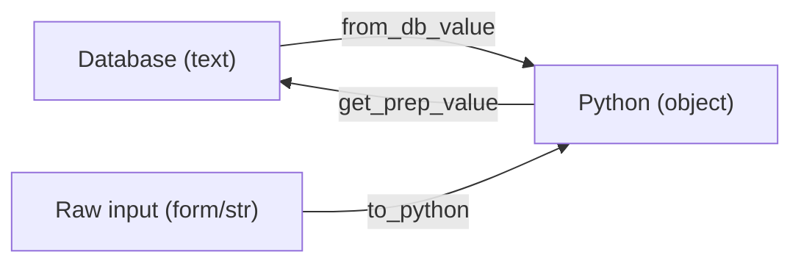

# Reference: custom model fields

!!! quote "Think like a child 🧒"
    The built-in fields are drawers of ready-made sizes. Sometimes you want a
    **special** drawer — one that stores a color, a coordinate, a list of tags as
    text. A **custom field** is you building your own drawer, teaching Django how
    to put the thing in there (for the database) and how to take it back out (for
    Python).

## Use case

You want a field that, in Python, is always **upper case** — handy for codes
(`"abc"` becomes `"ABC"` automatically). You inherit from an existing field and
adjust the entry/exit points:

```python
from django.db import models


class UpperCaseField(models.CharField):
    """A CharField that always stores and returns upper-cased text."""

    def get_prep_value(self, value: str | None) -> str | None:
        """Normalize the value on its way TO the database."""
        value = super().get_prep_value(value)
        return value.upper() if value is not None else value


class Coupon(models.Model):
    code = UpperCaseField(max_length=20)
```

Now `Coupon(code="promo10").code` stores `"PROMO10"`.

## What's possible

### The life cycle of a value

Think like a child: the value takes a round trip between Python and the database.
You can intercept every point of the trip.



| Method | Called when | You do |
| --- | --- | --- |
| `from_db_value(value, ...)` | Reading from the database | Convert text → Python object |
| `to_python(value)` | On validating / deserializing | Ensure it became the right object |
| `get_prep_value(value)` | Writing to the database | Convert object → database value |
| `get_internal_type()` | On creating the column | Say which base type to lean on |
| `db_type(connection)` | On creating the column | Exact SQL type (advanced cases) |

### Full example: a field that stores a list

Store `["a", "b"]` as the text `"a,b"` in the database:

```python
from django.db import models


class CommaSepField(models.TextField):
    """Store a Python list of strings as comma-separated text."""

    def from_db_value(self, value, expression, connection) -> list[str]:
        """DB text -> Python list (called when loading rows)."""
        if value is None:
            return []
        return value.split(",") if value else []

    def to_python(self, value) -> list[str]:
        """Ensure a Python list (called during validation/deserialization)."""
        if isinstance(value, list):
            return value
        if value is None:
            return []
        return value.split(",") if value else []

    def get_prep_value(self, value: list[str] | None) -> str:
        """Python list -> DB text (called when saving)."""
        if not value:
            return ""
        return ",".join(value)
```

```python
class Article(models.Model):
    keywords = CommaSepField(blank=True)

# usage: article.keywords == ["django", "orm"]
```

!!! warning "`from_db_value` and `to_python` do similar things — but at different moments"
    - **`from_db_value`** runs when **reading from the database** (every loaded row).
    - **`to_python`** runs during **validation** and when deserializing (e.g. fixtures).

    Implement both so the field behaves the same no matter where it comes from.

### `deconstruct`: surviving migrations

If your field accepts its own arguments in `__init__`, teach Django how to
recreate it in migrations by overriding `deconstruct`:

```python
class FixedCharField(models.CharField):
    def __init__(self, *args, prefix: str = "", **kwargs) -> None:
        self.prefix = prefix
        super().__init__(*args, **kwargs)

    def deconstruct(self):
        """Tell migrations how to rebuild this field."""
        name, path, args, kwargs = super().deconstruct()
        if self.prefix:
            kwargs["prefix"] = self.prefix       # (1)!
        return name, path, args, kwargs
```

1. Return in `kwargs` everything `__init__` needs. Without it, the migration
    forgets the `prefix` and recreates the wrong field.

!!! danger "Inherit from an existing field whenever possible"
    Creating a field from scratch (inheriting directly from `models.Field`) is rare
    and laborious. In practice, almost every custom field **inherits from an
    existing one** (`CharField`, `TextField`, `IntegerField`) and just overrides one
    or two methods. Start that way.

### Alternatives before creating a field

!!! tip "Do you really need a new field?"
    Often, no:

    - Value only normalized on save? Override `save()` on the model, or use a
      **validator**/`clean()`.
    - Store a structure (list/dict)? Use the built-in `JSONField`.
    - Enum? `TextChoices`/`IntegerChoices`.

    Create a custom field when the behavior is **reusable** across several models
    and truly belongs to the "type of the drawer".

## Recap

- A custom field teaches Django how to move a value between Python and the
  database.
- Hooks: `from_db_value` (read), `to_python` (validate), `get_prep_value`
  (write), `get_internal_type`/`db_type` (the column).
- Implement `from_db_value` **and** `to_python` for consistency.
- `deconstruct` makes your own arguments survive migrations.
- Prefer to **inherit** from an existing field; and check whether a `JSONField`,
  `TextChoices`, a validator or `save()` already solves it before creating one.

Some values don't belong to "just one model" — they point at any of them. In come
the **[content types and generic relations](contenttypes.md)**.
