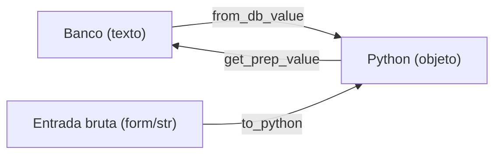

# Referência: campos de modelo customizados

!!! quote "Pensa como criança 🧒"
    Os campos embutidos são gavetas de tamanhos prontos. Às vezes você quer uma
    gaveta **especial** — que guarda uma cor, uma coordenada, uma lista de
    tags como texto. Um **campo customizado** é você fabricar sua própria gaveta,
    ensinando ao Django como pôr a coisa lá dentro (para o banco) e como tirar de
    volta (para o Python).

## Caso de uso

Você quer um campo que, no Python, é sempre **maiúsculo** — útil para códigos
(`"abc"` vira `"ABC"` automaticamente). Você herda de um campo existente e
ajusta os pontos de entrada/saída:

```python
from django.db import models


class UpperCaseField(models.CharField):
    """A CharField that always stores and returns upper-cased text."""

    def get_prep_value(self, value: str | None) -> str | None:
        """Normalize the value on its way TO the database."""
        value = super().get_prep_value(value)
        return value.upper() if value is not None else value


class Coupon(models.Model):
    code = UpperCaseField(max_length=20)
```

Agora `Coupon(code="promo10").code` grava `"PROMO10"`.

## Possibilidades

### O ciclo de vida de um valor

Pensa como criança: o valor faz uma viagem de ida e volta entre o Python e o
banco. Você pode interceptar cada ponto da viagem.



| Método | Chamado quando | Você faz |
| --- | --- | --- |
| `from_db_value(value, ...)` | Lendo do banco | Converter texto → objeto Python |
| `to_python(value)` | Ao validar / desserializar | Garantir que virou o objeto certo |
| `get_prep_value(value)` | Escrevendo no banco | Converter objeto → valor do banco |
| `get_internal_type()` | Ao criar a coluna | Dizer em qual tipo base se apoiar |
| `db_type(connection)` | Ao criar a coluna | Tipo SQL exato (casos avançados) |

### Exemplo completo: um campo que guarda uma lista

Guardar `["a", "b"]` como texto `"a,b"` no banco:

```python
from django.db import models


class CommaSepField(models.TextField):
    """Store a Python list of strings as comma-separated text."""

    def from_db_value(self, value, expression, connection) -> list[str]:
        """DB text -> Python list (called when loading rows)."""
        if value is None:
            return []
        return value.split(",") if value else []

    def to_python(self, value) -> list[str]:
        """Ensure a Python list (called during validation/deserialization)."""
        if isinstance(value, list):
            return value
        if value is None:
            return []
        return value.split(",") if value else []

    def get_prep_value(self, value: list[str] | None) -> str:
        """Python list -> DB text (called when saving)."""
        if not value:
            return ""
        return ",".join(value)
```

```python
class Article(models.Model):
    keywords = CommaSepField(blank=True)

# uso: article.keywords == ["django", "orm"]
```

!!! warning "`from_db_value` e `to_python` fazem coisas parecidas — mas em momentos diferentes"
    - **`from_db_value`** roda ao **ler do banco** (toda linha carregada).
    - **`to_python`** roda na **validação** e ao desserializar (ex.: fixtures).

    Implemente os dois para o campo se comportar igual venha de onde vier.

### `deconstruct`: sobreviver às migrações

Se o seu campo aceita argumentos próprios no `__init__`, ensine o Django a
recriá-lo nas migrações sobrescrevendo `deconstruct`:

```python
class FixedCharField(models.CharField):
    def __init__(self, *args, prefix: str = "", **kwargs) -> None:
        self.prefix = prefix
        super().__init__(*args, **kwargs)

    def deconstruct(self):
        """Tell migrations how to rebuild this field."""
        name, path, args, kwargs = super().deconstruct()
        if self.prefix:
            kwargs["prefix"] = self.prefix       # (1)!
        return name, path, args, kwargs
```

1. Devolva no `kwargs` tudo que o `__init__` precisa. Sem isso, a migração
    esquece o `prefix` e recria o campo errado.

!!! danger "Herde de um campo existente sempre que possível"
    Criar um campo do zero (herdando direto de `models.Field`) é raro e trabalhoso.
    Na prática, quase todo campo customizado **herda de um existente**
    (`CharField`, `TextField`, `IntegerField`) e só sobrescreve um ou dois
    métodos. Comece assim.

### Alternativas antes de criar um campo

!!! tip "Você precesa mesmo de um campo novo?"
    Muitas vezes, não:

    - Valor só normalizado ao salvar? Sobrescreva `save()` no modelo, ou use um
      **validator**/`clean()`.
    - Guardar estrutura (lista/dict)? Use o `JSONField` embutido.
    - Enum? `TextChoices`/`IntegerChoices`.

    Crie um campo customizado quando o comportamento é **reutilizável** em vários
    modelos e realmente pertence ao "tipo da gaveta".

## Recap

- Campo customizado ensina o Django a mover um valor entre Python e banco.
- Ganchos: `from_db_value` (ler), `to_python` (validar), `get_prep_value`
  (escrever), `get_internal_type`/`db_type` (a coluna).
- Implemente `from_db_value` **e** `to_python` para consistência.
- `deconstruct` faz argumentos próprios sobreviverem às migrações.
- Prefira **herdar** de um campo existente; e cheque se um `JSONField`,
  `TextChoices`, validator ou `save()` já resolve antes de criar um.

Alguns valores não são "de um só modelo" — apontam para qualquer um. Entram os
**[content types e relações genéricas](contenttypes.md)**.
