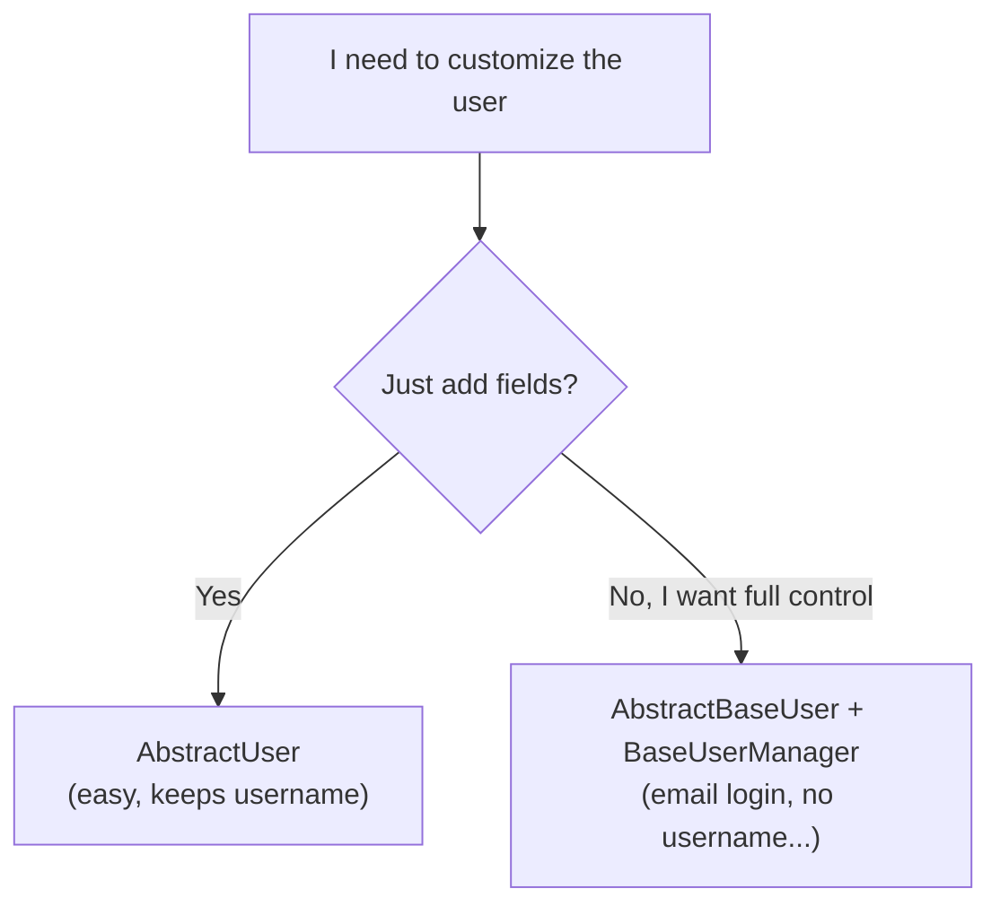

# Custom user model

!!! quote "Think like a child 🧒"
    Imagine every school hands you a standard badge: name and photo. But **your**
    school also wants the class and birthday on the badge. You don't throw the
    template away — you take the standard badge and **add** the missing fields.
    A custom user model is exactly that: Django's badge with the fields your
    project needs.

## Use case

The `User` that ships with Django is great, but sooner or later you want to store
a bit more: a phone number, a bio, or to log in by **email** instead of
`username`.

The golden rule: **define your user model before the first migration.** Swapping
the user after the database already exists is one of Django's most annoying pains.
So every new project starts like this:

```python
from django.contrib.auth.models import AbstractUser
from django.db import models


class User(AbstractUser):
    """Application user extending Django's default user.

    Adds a phone number and a short bio on top of the built-in fields
    (username, email, password, first_name, last_name, permissions...).
    """

    phone = models.CharField(max_length=20, blank=True)
    bio = models.TextField(blank=True)
```

And in `settings.py`, you tell Django to use that model:

```python
AUTH_USER_MODEL = "accounts.User"
```

Done. You just gained all the fields of the default user **plus** yours, and
you'll never be stuck with the built-in model.

!!! danger "Set `AUTH_USER_MODEL` BEFORE the first `migrate`"
    This is pitfall number one. As soon as you run `migrate` for the first time,
    the database creates tables and foreign keys pointing at the current user.
    Swapping `AUTH_USER_MODEL` after that means recreating tables by hand, editing
    migrations, and often **wiping the development database**.

    Rule of thumb: in **every** new project, create an `accounts` app with a
    custom `User` (even an empty one, just inheriting `AbstractUser`) **before**
    the first migration. "I'll customize it later" is a trap.

## Possibilities

There are two paths to customize the user. Choose by asking: "do I just want to
**add fields**, or do I want to **change how the user works**?".

| Approach | When to use | Effort | What you control |
| --- | --- | --- | --- |
| `AbstractUser` | I just want to add fields and keep `username` | Low | Extra fields |
| `AbstractBaseUser` + `BaseUserManager` | I want email login, no `username`, full control | High | Login, fields, user creation |



### Approach 1: `AbstractUser` (easy, the recommended default)

`AbstractUser` is Django's full user (with `username`, `email`, `password`,
`is_staff`, permissions, groups...) but **open for you to add fields**. For most
projects, it's all you need.

```python
from django.contrib.auth.models import AbstractUser
from django.db import models


class User(AbstractUser):
    """Application user with a couple of extra profile fields."""

    phone = models.CharField(max_length=20, blank=True)
    avatar = models.ImageField(upload_to="avatars/", blank=True)
    is_verified = models.BooleanField(default=False)

    def __str__(self) -> str:
        """Return the username for admin and shell display."""
        return self.username
```

!!! tip "Want email login without the heavy lifting?"
    With `AbstractUser` you can even make `email` required and use it as the login
    field by adjusting `USERNAME_FIELD`. But if you want to **remove** `username`
    entirely, that's a case for Approach 2.

### Approach 2: `AbstractBaseUser` + `BaseUserManager` (full control)

When you want to control everything — for example, **email login with no
username** — use `AbstractBaseUser`. It gives you only the essentials (password
and "last login"), and you build the rest. This involves three pieces:

1. **`USERNAME_FIELD`** — which field identifies the user at login (here, `email`).
2. **`REQUIRED_FIELDS`** — fields prompted besides `USERNAME_FIELD` and the
   password when creating a superuser.
3. **A `Manager`** — since there's no more `username`, you need to teach Django
   how to create a user and a superuser.

First the manager:

```python
from __future__ import annotations

from typing import Any

from django.contrib.auth.models import BaseUserManager


class UserManager(BaseUserManager):
    """Manager that creates users identified by email instead of username."""

    use_in_migrations = True

    def create_user(
        self,
        email: str,
        password: str | None = None,
        **extra_fields: Any,
    ) -> "User":
        """Create and save a regular user.

        Args:
            email: The login email; normalized and required.
            password: The raw password; hashed before saving.
            **extra_fields: Any other model fields (e.g. first_name).

        Returns:
            The persisted user instance.

        Raises:
            ValueError: If no email is provided.
        """
        if not email:
            raise ValueError("The email is required.")
        email = self.normalize_email(email)
        user = self.model(email=email, **extra_fields)
        user.set_password(password)
        user.save(using=self._db)
        return user

    def create_superuser(
        self,
        email: str,
        password: str | None = None,
        **extra_fields: Any,
    ) -> "User":
        """Create and save a superuser.

        Args:
            email: The login email.
            password: The raw password.
            **extra_fields: Extra fields; is_staff and is_superuser are forced True.

        Returns:
            The persisted superuser instance.

        Raises:
            ValueError: If is_staff or is_superuser is not True.
        """
        extra_fields.setdefault("is_staff", True)
        extra_fields.setdefault("is_superuser", True)
        if extra_fields.get("is_staff") is not True:
            raise ValueError("Superuser requires is_staff=True.")
        if extra_fields.get("is_superuser") is not True:
            raise ValueError("Superuser requires is_superuser=True.")
        return self.create_user(email, password, **extra_fields)
```

!!! note "Why `set_password` and not `password=...`?"
    `set_password` **hashes** the password. If you wrote `password` directly, it
    would sit in plain text in the database — and nobody could log in anymore,
    because Django expects a hash. Always use `set_password`.

Now the model:

```python
from django.contrib.auth.models import AbstractBaseUser, PermissionsMixin
from django.db import models


class User(AbstractBaseUser, PermissionsMixin):
    """Email-based user with full control over the login flow."""

    email = models.EmailField(unique=True)
    first_name = models.CharField(max_length=150, blank=True)
    is_active = models.BooleanField(default=True)
    is_staff = models.BooleanField(default=False)
    date_joined = models.DateTimeField(auto_now_add=True)

    objects = UserManager()

    USERNAME_FIELD = "email"
    REQUIRED_FIELDS: list[str] = []

    def __str__(self) -> str:
        """Return the email for admin and shell display."""
        return self.email
```

| Piece | Role |
| --- | --- |
| `AbstractBaseUser` | Provides `password` + `last_login` and minimal authentication |
| `PermissionsMixin` | Provides `is_superuser`, groups and permissions (what the admin expects) |
| `USERNAME_FIELD = "email"` | The field used to log in |
| `REQUIRED_FIELDS` | Extras prompted by `createsuperuser` (besides email and password) |
| `objects = UserManager()` | Teaches Django to create users/superusers |

!!! warning "`REQUIRED_FIELDS` does not include `USERNAME_FIELD` or `password`"
    Those two are always prompted. If you put `email` in `REQUIRED_FIELDS`,
    `createsuperuser` will ask for the email twice and complain. List only the
    **other** required fields there (e.g. `["first_name"]`).

### Wiring the admin

If you used `AbstractUser`, you can register it in the admin by reusing Django's
`UserAdmin`:

```python
from django.contrib import admin
from django.contrib.auth.admin import UserAdmin

from accounts.models import User

admin.site.register(User, UserAdmin)
```

With Approach 2 (email login), the default `UserAdmin` references `username` and
will break. You need your own admin, with forms that use `email`:

```python
from django.contrib import admin
from django.contrib.auth.admin import UserAdmin
from django.contrib.auth.forms import UserChangeForm, UserCreationForm

from accounts.models import User


class UserCreationForm(UserCreationForm):
    """Creation form bound to the email-based user."""

    class Meta:
        model = User
        fields = ("email",)


class UserChangeForm(UserChangeForm):
    """Change form bound to the email-based user."""

    class Meta:
        model = User
        fields = ("email", "first_name", "is_active", "is_staff")


@admin.register(User)
class CustomUserAdmin(UserAdmin):
    """Admin for the email-based user (no username field)."""

    add_form = UserCreationForm
    form = UserChangeForm
    model = User
    ordering = ("email",)
    list_display = ("email", "first_name", "is_staff", "is_active")
    search_fields = ("email", "first_name")
    fieldsets = (
        (None, {"fields": ("email", "password")}),
        ("Personal info", {"fields": ("first_name",)}),
        ("Permissions", {"fields": ("is_active", "is_staff", "is_superuser", "groups", "user_permissions")}),
        ("Dates", {"fields": ("last_login", "date_joined")}),
    )
    add_fieldsets = (
        (None, {
            "classes": ("wide",),
            "fields": ("email", "password1", "password2"),
        }),
    )
```

### Referencing the user in your code

Here comes a golden rule that saves refactors: **never import `User` directly.**
Instead, ask Django which user model is active. That way your code keeps working
even if the user changes from project to project.

In **models** and migrations, use the setting string:

```python
from django.conf import settings
from django.db import models


class Post(models.Model):
    """A blog post owned by a user."""

    author = models.ForeignKey(
        settings.AUTH_USER_MODEL,
        on_delete=models.CASCADE,
        related_name="posts",
    )
    title = models.CharField(max_length=200)
```

In **views, forms and the rest of your code**, use `get_user_model()`:

```python
from django.contrib.auth import get_user_model


User = get_user_model()

active_users = User.objects.filter(is_active=True)
```

| Where | How to reference | Why |
| --- | --- | --- |
| ForeignKey / OneToOne / ManyToMany | `settings.AUTH_USER_MODEL` (string) | The model may not be loaded yet; the string avoids circular imports |
| Views, forms, services, tests | `get_user_model()` | Returns the real class, resolved at runtime |

!!! danger "Don't do `from django.contrib.auth.models import User`"
    If you import the built-in `User` directly, your code ignores your custom
    model. It locks you into the default user and breaks the moment another
    project uses a different user. Always `settings.AUTH_USER_MODEL` (in models)
    or `get_user_model()` (everywhere else).

!!! info "What about a separate profile (`OneToOneField`)?"
    If you **can't** swap the user (a legacy project already migrated) but still
    need extra fields, create a `Profile` model with
    `OneToOneField(settings.AUTH_USER_MODEL, on_delete=models.CASCADE)`. It's the
    escape hatch when it's too late for `AUTH_USER_MODEL`. In a new project,
    prefer the custom user — it's simpler to query.

!!! quote "📖 In the official docs"
    - [Customizing authentication in Django](https://docs.djangoproject.com/en/6.0/topics/auth/customizing/)

## Recap

- **Always** define `AUTH_USER_MODEL` (and create the `accounts` app with a
  `User`) **before the first migration** — swapping later is painful.
- **`AbstractUser`**: easy, keeps `username`, you just **add fields**. It's the
  path for most projects.
- **`AbstractBaseUser` + `BaseUserManager`**: full control (email login, no
  `username`). You define `USERNAME_FIELD`, `REQUIRED_FIELDS` and a manager with
  `create_user` / `create_superuser` (always with `set_password`).
- In the **admin**: `AbstractUser` reuses `UserAdmin`; Approach 2 needs a custom
  `UserAdmin` with email-based forms.
- Reference the user via **`settings.AUTH_USER_MODEL`** (in models) and
  **`get_user_model()`** (everywhere else); never import the built-in `User`
  directly.

With the user in place, the next step is to protect it and let it in: see
**[authentication](../tutorial/authentication.md)** and the **[auth](auth.md)**
reference.
