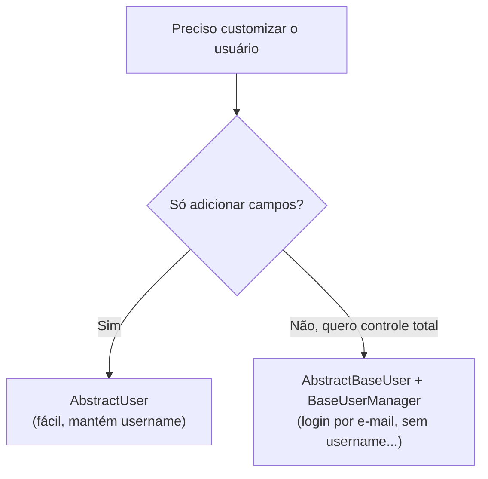

# Custom user model

!!! quote "Pensa como criança 🧒"
    Imagina que toda escola te dá um crachá padrão: nome e foto. Mas a **sua**
    escola também quer a turma e a data de aniversário no crachá. Você não joga o
    modelo fora — você pega o crachá padrão e **acrescenta** os campos que faltam.
    O modelo de usuário customizado é isso: o crachá do Django com os campos que
    o seu projeto precisa.

## Caso de uso

O `User` que vem com o Django é ótimo, mas cedo ou tarde você quer guardar algo a
mais: um telefone, uma bio, ou logar por **e-mail** em vez de `username`.

A regra de ouro: **defina o seu modelo de usuário antes da primeira migração.**
Trocar o usuário depois que o banco já foi criado é uma das dores mais chatas do
Django. Então, todo projeto novo começa assim:

```python
from django.contrib.auth.models import AbstractUser
from django.db import models


class User(AbstractUser):
    """Application user extending Django's default user.

    Adds a phone number and a short bio on top of the built-in fields
    (username, email, password, first_name, last_name, permissions...).
    """

    phone = models.CharField(max_length=20, blank=True)
    bio = models.TextField(blank=True)
```

E no `settings.py`, você diz ao Django para usar esse modelo:

```python
AUTH_USER_MODEL = "accounts.User"
```

Pronto. Você acabou de ganhar todos os campos do usuário padrão **mais** os seus,
e nunca vai ficar preso ao modelo embutido.

!!! danger "Defina `AUTH_USER_MODEL` ANTES da primeira `migrate`"
    Este é o pega-ratão nº 1. Assim que você roda `migrate` pela primeira vez, o
    banco cria tabelas e chaves estrangeiras apontando para o usuário atual.
    Trocar o `AUTH_USER_MODEL` depois disso significa recriar tabelas na mão,
    mexer em migrações e, muitas vezes, **zerar o banco de desenvolvimento**.

    Regra prática: em **todo** projeto novo, crie um app `accounts` com um `User`
    customizado (mesmo que vazio, só herdando `AbstractUser`) **antes** da
    primeira migração. O "eu customizo depois" é uma armadilha.

## Possibilidades

Existem dois caminhos para customizar o usuário. Escolha pela pergunta: "eu só
quero **adicionar campos**, ou quero **mudar como o usuário funciona**?".

| Abordagem | Quando usar | Esforço | O que você controla |
| --- | --- | --- | --- |
| `AbstractUser` | Só quero adicionar campos e manter `username` | Baixo | Campos extras |
| `AbstractBaseUser` + `BaseUserManager` | Quero logar por e-mail, remover `username`, controlar tudo | Alto | Login, campos, criação de usuário |



### Abordagem 1: `AbstractUser` (fácil, o padrão recomendado)

`AbstractUser` é o usuário completo do Django (com `username`, `email`, `password`,
`is_staff`, permissões, grupos...) mas **aberto para você adicionar campos**. Na
maioria dos projetos, é tudo que você precisa.

```python
from django.contrib.auth.models import AbstractUser
from django.db import models


class User(AbstractUser):
    """Application user with a couple of extra profile fields."""

    phone = models.CharField(max_length=20, blank=True)
    avatar = models.ImageField(upload_to="avatars/", blank=True)
    is_verified = models.BooleanField(default=False)

    def __str__(self) -> str:
        """Return the username for admin and shell display."""
        return self.username
```

!!! tip "Quer logar por e-mail mas sem trabalho pesado?"
    Com `AbstractUser` você pode até deixar o `email` obrigatório e usá-lo como
    campo de login, ajustando `USERNAME_FIELD`. Mas se você quer **remover** o
    `username` de vez, aí é caso para a Abordagem 2.

### Abordagem 2: `AbstractBaseUser` + `BaseUserManager` (controle total)

Quando você quer mandar em tudo — por exemplo, **login por e-mail sem username** —
use `AbstractBaseUser`. Ele te dá só o essencial (senha e "último login"), e você
constrói o resto. Isso envolve três peças:

1. **`USERNAME_FIELD`** — qual campo identifica o usuário no login (aqui, `email`).
2. **`REQUIRED_FIELDS`** — campos pedidos além do `USERNAME_FIELD` e da senha ao
   criar um superusuário.
3. **Um `Manager`** — porque não existe mais `username`, você precisa ensinar o
   Django a criar usuário e superusuário.

Primeiro o manager:

```python
from __future__ import annotations

from typing import Any

from django.contrib.auth.models import BaseUserManager


class UserManager(BaseUserManager):
    """Manager that creates users identified by email instead of username."""

    use_in_migrations = True

    def create_user(
        self,
        email: str,
        password: str | None = None,
        **extra_fields: Any,
    ) -> "User":
        """Create and save a regular user.

        Args:
            email: The login email; normalized and required.
            password: The raw password; hashed before saving.
            **extra_fields: Any other model fields (e.g. first_name).

        Returns:
            The persisted user instance.

        Raises:
            ValueError: If no email is provided.
        """
        if not email:
            raise ValueError("O e-mail é obrigatório.")
        email = self.normalize_email(email)
        user = self.model(email=email, **extra_fields)
        user.set_password(password)
        user.save(using=self._db)
        return user

    def create_superuser(
        self,
        email: str,
        password: str | None = None,
        **extra_fields: Any,
    ) -> "User":
        """Create and save a superuser.

        Args:
            email: The login email.
            password: The raw password.
            **extra_fields: Extra fields; is_staff and is_superuser are forced True.

        Returns:
            The persisted superuser instance.

        Raises:
            ValueError: If is_staff or is_superuser is not True.
        """
        extra_fields.setdefault("is_staff", True)
        extra_fields.setdefault("is_superuser", True)
        if extra_fields.get("is_staff") is not True:
            raise ValueError("Superusuário precisa de is_staff=True.")
        if extra_fields.get("is_superuser") is not True:
            raise ValueError("Superusuário precisa de is_superuser=True.")
        return self.create_user(email, password, **extra_fields)
```

!!! note "Por que `set_password` e não `password=...`?"
    `set_password` faz o **hash** da senha. Se você gravasse `password` direto, ela
    ficaria em texto puro no banco — e ninguém consegue mais logar, porque o Django
    espera um hash. Sempre use `set_password`.

Agora o modelo:

```python
from django.contrib.auth.models import AbstractBaseUser, PermissionsMixin
from django.db import models


class User(AbstractBaseUser, PermissionsMixin):
    """Email-based user with full control over the login flow."""

    email = models.EmailField(unique=True)
    first_name = models.CharField(max_length=150, blank=True)
    is_active = models.BooleanField(default=True)
    is_staff = models.BooleanField(default=False)
    date_joined = models.DateTimeField(auto_now_add=True)

    objects = UserManager()

    USERNAME_FIELD = "email"
    REQUIRED_FIELDS: list[str] = []

    def __str__(self) -> str:
        """Return the email for admin and shell display."""
        return self.email
```

| Peça | Papel |
| --- | --- |
| `AbstractBaseUser` | Dá `password` + `last_login` e o mínimo de autenticação |
| `PermissionsMixin` | Dá `is_superuser`, grupos e permissões (o que o admin espera) |
| `USERNAME_FIELD = "email"` | O campo usado para logar |
| `REQUIRED_FIELDS` | Extras pedidos no `createsuperuser` (sem o e-mail e a senha) |
| `objects = UserManager()` | Ensina o Django a criar usuário/superusuário |

!!! warning "`REQUIRED_FIELDS` não inclui `USERNAME_FIELD` nem `password`"
    Esses dois já são sempre pedidos. Se você colocar `email` em `REQUIRED_FIELDS`,
    o `createsuperuser` vai perguntar o e-mail duas vezes e reclamar. Liste ali só
    os **outros** campos obrigatórios (ex.: `["first_name"]`).

### Ligando no admin

Se você usou `AbstractUser`, dá pra registrar no admin reaproveitando o
`UserAdmin` do Django:

```python
from django.contrib import admin
from django.contrib.auth.admin import UserAdmin

from accounts.models import User

admin.site.register(User, UserAdmin)
```

Com a Abordagem 2 (login por e-mail), o `UserAdmin` padrão referencia `username` e
vai quebrar. Você precisa de um admin próprio, com formulários que usam `email`:

```python
from django.contrib import admin
from django.contrib.auth.admin import UserAdmin
from django.contrib.auth.forms import UserChangeForm, UserCreationForm

from accounts.models import User


class UserCreationForm(UserCreationForm):
    """Creation form bound to the email-based user."""

    class Meta:
        model = User
        fields = ("email",)


class UserChangeForm(UserChangeForm):
    """Change form bound to the email-based user."""

    class Meta:
        model = User
        fields = ("email", "first_name", "is_active", "is_staff")


@admin.register(User)
class CustomUserAdmin(UserAdmin):
    """Admin for the email-based user (no username field)."""

    add_form = UserCreationForm
    form = UserChangeForm
    model = User
    ordering = ("email",)
    list_display = ("email", "first_name", "is_staff", "is_active")
    search_fields = ("email", "first_name")
    fieldsets = (
        (None, {"fields": ("email", "password")}),
        ("Informações pessoais", {"fields": ("first_name",)}),
        ("Permissões", {"fields": ("is_active", "is_staff", "is_superuser", "groups", "user_permissions")}),
        ("Datas", {"fields": ("last_login", "date_joined")}),
    )
    add_fieldsets = (
        (None, {
            "classes": ("wide",),
            "fields": ("email", "password1", "password2"),
        }),
    )
```

### Referenciando o usuário no seu código

Aqui vem uma regra de ouro que salva refatorações: **nunca importe o `User`
diretamente**. Em vez disso, pergunte ao Django qual é o modelo de usuário ativo.
Assim seu código continua funcionando mesmo se o usuário mudar de projeto para
projeto.

Em **modelos** e migrações, use a string do setting:

```python
from django.conf import settings
from django.db import models


class Post(models.Model):
    """A blog post owned by a user."""

    author = models.ForeignKey(
        settings.AUTH_USER_MODEL,
        on_delete=models.CASCADE,
        related_name="posts",
    )
    title = models.CharField(max_length=200)
```

Em **views, forms e o resto do código**, use `get_user_model()`:

```python
from django.contrib.auth import get_user_model


User = get_user_model()

active_users = User.objects.filter(is_active=True)
```

| Onde | Como referenciar | Por quê |
| --- | --- | --- |
| ForeignKey / OneToOne / ManyToMany | `settings.AUTH_USER_MODEL` (string) | O modelo pode não estar carregado ainda; a string evita import circular |
| Views, forms, services, testes | `get_user_model()` | Retorna a classe real, resolvida em tempo de execução |

!!! danger "Não faça `from django.contrib.auth.models import User`"
    Se você importar o `User` embutido direto, seu código ignora o seu modelo
    customizado. Prende você ao usuário padrão e quebra na hora que outro projeto
    usa um usuário diferente. Sempre `settings.AUTH_USER_MODEL` (em models) ou
    `get_user_model()` (no resto).

!!! info "E um perfil separado (`OneToOneField`)?"
    Se você **não** pode trocar o usuário (projeto legado já migrado) mas ainda
    precisa de campos extras, crie um modelo `Profile` com
    `OneToOneField(settings.AUTH_USER_MODEL, on_delete=models.CASCADE)`. É a saída
    quando já é tarde para o `AUTH_USER_MODEL`. Em projeto novo, prefira o usuário
    customizado — é mais simples de consultar.

!!! quote "📖 Na documentação oficial"
    - [Customizing authentication in Django](https://docs.djangoproject.com/en/6.0/topics/auth/customizing/)

## Recap

- **Sempre** defina `AUTH_USER_MODEL` (e crie o app `accounts` com um `User`)
  **antes da primeira migração** — trocar depois é dolorido.
- **`AbstractUser`**: fácil, mantém `username`, você só **adiciona campos**. É o
  caminho para a maioria dos projetos.
- **`AbstractBaseUser` + `BaseUserManager`**: controle total (login por e-mail,
  sem `username`). Você define `USERNAME_FIELD`, `REQUIRED_FIELDS` e um manager
  com `create_user` / `create_superuser` (sempre com `set_password`).
- No **admin**: `AbstractUser` reaproveita o `UserAdmin`; a Abordagem 2 precisa de
  um `UserAdmin` customizado com formulários baseados em `email`.
- Referencie o usuário por **`settings.AUTH_USER_MODEL`** (em models) e
  **`get_user_model()`** (no resto); nunca importe o `User` embutido direto.

Com o usuário no lugar, o próximo passo é protegê-lo e deixá-lo entrar:
veja **[autenticação](../tutorial/authentication.md)** e a referência de
**[auth](auth.md)**.
