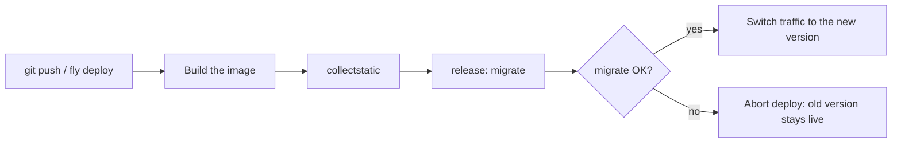

# Deploying to PaaS (Fly, Railway, Render)

!!! quote "Think like a child 🧒"
    Building the server yourself is like building your own house: you buy the
    land, raise the walls, install the plumbing. A **PaaS** (Platform as a
    Service) is like renting a finished apartment: you just show up with your
    stuff (the code), say "turn on the water and power" (database, variables) and
    the building handles the rest — from the janitor to the backup generator. You
    focus on living, not on fixing pipes.

## Use case

You have the blog running with Docker (see
[deploy-docker](deploy-docker.md)) and want to put it online **without managing a
Linux server**. With Fly.io, that's two commands:

```bash
fly launch
fly deploy
```

`fly launch` detects a Django app, creates a `fly.toml`, offers a **managed
Postgres** database and injects `DATABASE_URL` as a secret. `fly deploy` builds
the image, runs `migrate` on release and brings the app up with HTTPS already
configured. You open `https://your-app.fly.dev/` and you're live.

The same idea holds for Railway and Render: you connect the repository, define
the **build command** and the **start command**, add a Postgres with one click
and the platform handles TLS, scaling and restarts.

## Possibilities

### The three platforms in one table

| | Fly.io | Railway | Render |
| --- | --- | --- | --- |
| How you ship | CLI (`fly deploy`) or Docker | Git push / Docker | Git push / Docker |
| Django detection | Yes (`fly launch`) | Buildpack (Nixpacks) | Buildpack or Docker |
| Managed Postgres | Yes (`fly postgres`) | Yes (add-on) | Yes (managed) |
| Managed Redis | Yes (Upstash) | Yes (add-on) | Yes (Key Value) |
| Release/migrate step | `release_command` in `fly.toml` | Deploy hook | `preDeployCommand` |
| Automatic HTTPS | Yes | Yes | Yes |
| Scale to zero | Yes (auto stop/start) | No (always on) | Yes (free tier) |

!!! info "They all start from the same place"
    Regardless of the platform, a Django deploy needs: a WSGI/ASGI server
    (**Gunicorn** or **Uvicorn/Granian**), **`collectstatic`** with WhiteNoise
    serving the static files, **`migrate`** run on release, a **health check**
    and the **secrets** (SECRET_KEY, passwords) in the environment — never in the
    code. The sections below show each piece.

### Fly.io: `fly launch` and the `fly.toml`

Fly runs **containers** (it uses your `Dockerfile` if one exists). `fly launch`
generates a `fly.toml` like this:

```toml
app = "django-blog"
primary_region = "gru"

[build]

[deploy]
  release_command = "python manage.py migrate --no-input"

[http_service]
  internal_port = 8000
  force_https = true
  auto_stop_machines = "stop"
  auto_start_machines = true
  min_machines_running = 0

  [[http_service.checks]]
    method = "get"
    path = "/healthz/"
    interval = "15s"
    timeout = "2s"

[[vm]]
  memory = "512mb"
  cpu_kind = "shared"
  cpus = 1
```

- **`release_command`** runs **once per deploy**, before the new machines enter
  service — the right place for `migrate`.
- **`internal_port = 8000`** must match the port Gunicorn listens on.
- **`checks`** is the HTTP health check (see the health check section below).

Add the managed database and connect it to the app:

```bash
fly postgres create --name blog-db --region gru
fly postgres attach blog-db --app django-blog
```

`attach` creates the `DATABASE_URL` as a **secret** on the app. Set the remaining
secrets like this:

```bash
fly secrets set DJANGO_SECRET_KEY="$(python -c 'import secrets; print(secrets.token_urlsafe(50))')"
fly secrets set DJANGO_ALLOWED_HOSTS="django-blog.fly.dev"
fly secrets set DJANGO_DEBUG="false"
```

!!! tip "`fly secrets set` restarts the app"
    Each `fly secrets set` triggers a new deploy with the secret already
    available. Secrets are stored encrypted and **never** appear in logs or in
    the `fly.toml`. To list them (without revealing values): `fly secrets list`.

### Railway and Render: build and start without a Dockerfile

Railway and Render can build without a `Dockerfile`, using **buildpacks** that
detect Python from `pyproject.toml`/`requirements.txt`. You only provide two
commands.

=== "Railway"

    In the service settings (or in `railway.json`):

    ```json
    {
      "build": {
        "builder": "NIXPACKS"
      },
      "deploy": {
        "startCommand": "gunicorn config.wsgi:application --bind 0.0.0.0:$PORT --workers 3",
        "healthcheckPath": "/healthz/",
        "healthcheckTimeout": 30
      }
    }
    ```

    `collectstatic` and `migrate` go in as part of the start command or in a
    **deploy hook**. A simple approach is a release script:

    ```bash
    python manage.py collectstatic --no-input && \
    python manage.py migrate --no-input && \
    gunicorn config.wsgi:application --bind 0.0.0.0:$PORT --workers 3
    ```

    Add Postgres and Redis with the **New → Database** button — Railway injects
    `DATABASE_URL` and `REDIS_URL` as variables into the service.

=== "Render"

    In a `render.yaml` (Blueprint) at the repository root:

    ```yaml
    services:
      - type: web
        name: django-blog
        runtime: python
        buildCommand: "pip install -r requirements.txt && python manage.py collectstatic --no-input"
        preDeployCommand: "python manage.py migrate --no-input"
        startCommand: "gunicorn config.wsgi:application --bind 0.0.0.0:$PORT --workers 3"
        healthCheckPath: "/healthz/"
        envVars:
          - key: DJANGO_SECRET_KEY
            generateValue: true
          - key: DJANGO_DEBUG
            value: "false"
          - key: DATABASE_URL
            fromDatabase:
              name: blog-db
              property: connectionString

    databases:
      - name: blog-db
        plan: free
    ```

    - **`buildCommand`** runs at build time (dependencies + `collectstatic`).
    - **`preDeployCommand`** runs `migrate` **before** switching the live version.
    - **`generateValue: true`** makes Render generate a secure `SECRET_KEY` on its
      own.

!!! note "The port comes from the platform: `$PORT`"
    Railway and Render set the `PORT` variable and expect your process to listen
    **on it**. Always use `--bind 0.0.0.0:$PORT` — never hardcode `8000`. Fly is
    the opposite: you fix the internal port and declare it in the `fly.toml`.

### Reading `DATABASE_URL` in `settings.py`

All three platforms hand you the database as a single URL. Instead of splitting
host, port and password by hand, use `dj-database-url`:

```bash
uv add dj-database-url
```

```python
import os

import dj_database_url

DATABASES = {
    "default": dj_database_url.config(
        default=os.environ.get("DATABASE_URL", ""),
        conn_max_age=600,
        ssl_require=not os.environ.get("DJANGO_DEBUG", "").lower() == "true",
    )
}
```

- **`conn_max_age=600`** reuses connections for 10 min — avoids opening a new
  connection on every request (important on managed Postgres).
- **`ssl_require`** forces TLS to the database in production; most managed
  Postgres instances require it.

!!! tip "`ALLOWED_HOSTS` from the environment"
    Each platform gives you a domain (`*.fly.dev`, `*.up.railway.app`,
    `*.onrender.com`). Read it from the environment so you don't hardcode it:

    ```python
    import os

    ALLOWED_HOSTS = os.environ.get("DJANGO_ALLOWED_HOSTS", "").split(",")
    CSRF_TRUSTED_ORIGINS = [f"https://{h}" for h in ALLOWED_HOSTS if h]
    ```

### The pieces common to every PaaS deploy

#### Gunicorn (WSGI) or Uvicorn/Granian (ASGI)

```bash
# Synchronous WSGI — the default for most Django apps
gunicorn config.wsgi:application --bind 0.0.0.0:$PORT --workers 3

# ASGI (async views/consumers, WebSockets) — Uvicorn
uvicorn config.asgi:application --host 0.0.0.0 --port $PORT --workers 3
```

!!! info "Granian: a newer server, written in Rust"
    [Granian](https://github.com/emmett-framework/granian) is a WSGI/ASGI server
    written in Rust, with native HTTP/2. It's an alternative to Gunicorn/Uvicorn
    and runs the same on any PaaS:

    ```bash
    granian --interface wsgi config.wsgi:application --host 0.0.0.0 --port $PORT
    ```

    It's optional — Gunicorn is still the safe, best-documented choice.

#### WhiteNoise for static files

On a PaaS you rarely have a separate Nginx, so **WhiteNoise** serves the static
files straight from the Django process:

```python
MIDDLEWARE = [
    "django.middleware.security.SecurityMiddleware",
    "whitenoise.middleware.WhiteNoiseMiddleware",
    "django.contrib.sessions.middleware.SessionMiddleware",
]

STORAGES = {
    "staticfiles": {
        "BACKEND": "whitenoise.storage.CompressedManifestStaticFilesStorage",
    },
}
```

`collectstatic` (at build or release time) gathers everything into
`STATIC_ROOT`, and WhiteNoise serves it with compression and hash-based
cache-busting.

#### `migrate` on release, not on start



!!! warning "Why separate `migrate` from start"
    If `migrate` runs in the **start** command, every replica that boots tries to
    migrate at the same time — a race and errors. In the **release** step
    (`release_command` on Fly, `preDeployCommand` on Render, deploy hook on
    Railway) it runs **once**, and if it fails the deploy is aborted with the old
    version intact. That's the behavior you want.

#### Health check

The platform makes a periodic GET to a route to know if the app is alive. A
minimal view:

```python
from django.http import HttpResponse, HttpRequest
from django.urls import path


def healthz(request: HttpRequest) -> HttpResponse:
    """Return 200 so the platform knows the app is alive.

    Args:
        request: The incoming HTTP request.

    Returns:
        A plain 200 response with body "ok".
    """
    return HttpResponse("ok", content_type="text/plain")


urlpatterns = [
    path("healthz/", healthz),
]
```

!!! tip "A lightweight health check must not touch the database"
    Keep `/healthz/` **cheap**: just a 200. If it queries the database, a slow
    Postgres takes the whole app down as "unhealthy". If you want to check
    dependencies, use a **separate** route (`/readyz/`) for that.

#### Secrets in the environment, never in the code

| Platform | How to set | How to read |
| --- | --- | --- |
| Fly.io | `fly secrets set K=V` | `os.environ["K"]` |
| Railway | Panel → Variables, or `railway variables` | `os.environ["K"]` |
| Render | Panel → Environment, or `render.yaml` | `os.environ["K"]` |

```python
import os

SECRET_KEY = os.environ["DJANGO_SECRET_KEY"]
DEBUG = os.environ.get("DJANGO_DEBUG", "false").lower() == "true"
```

!!! danger "Run `check --deploy` before exposing"
    Before sending real traffic, run `python manage.py check --deploy` and fix
    the warnings: `SECURE_SSL_REDIRECT`, `SESSION_COOKIE_SECURE`,
    `CSRF_COOKIE_SECURE`, HSTS. On a PaaS the TLS terminates at the platform's
    edge, and Django needs to trust the proxy header:

    ```python
    SECURE_PROXY_SSL_HEADER = ("HTTP_X_FORWARDED_PROTO", "https")
    SECURE_SSL_REDIRECT = True
    SESSION_COOKIE_SECURE = True
    CSRF_COOKIE_SECURE = True
    ```

    The full checklist is in [deploy](deploy.md).

### And Kubernetes?

!!! note "k8s: when the PaaS gets too small"
    PaaS is the right path for 99% of projects. If one day you need fine-grained
    orchestration — multiple services, metric-based autoscaling, canary deploys —
    **Kubernetes** enters the picture. There the same concepts reappear under
    other names: secrets become a **`Secret`** (mounted as env vars or files),
    `migrate` becomes an init/pre-deploy **`Job`**, the health check becomes a
    **`livenessProbe`/`readinessProbe`** and the `fly.toml` becomes a
    **`Deployment` + `Service`** in YAML. Don't start here: only migrate when the
    real pain justifies the complexity.

!!! quote "📖 In the official docs"
    - [Fly.io — Django](https://fly.io/docs/django/)
    - [Render — Deploy Django](https://render.com/docs/deploy-django)
    - [Railway docs](https://docs.railway.app/)
    - [Django — Deployment checklist](https://docs.djangoproject.com/en/stable/howto/deployment/checklist/)

## Recap

- PaaS is "a finished apartment": you hand over the code and the platform handles
  TLS, scaling and restarts. Fly.io (`fly launch`/`fly deploy` + `fly postgres`),
  Railway and Render (build/start commands + managed Postgres/Redis) cover the
  common case.
- Every recipe has the **same pieces**: Gunicorn (or Uvicorn/Granian),
  `collectstatic` + WhiteNoise, `migrate` on **release** (not on start), a
  lightweight **health check** and **secrets** in the environment.
- Read `DATABASE_URL` with `dj-database-url` and the domain with `ALLOWED_HOSTS`
  from the environment. Fly fixes the port in `fly.toml`; Railway/Render use
  `$PORT`.
- Run `check --deploy` and configure `SECURE_PROXY_SSL_HEADER` — the TLS
  terminates at the PaaS edge.
- Kubernetes is the next step up only when the PaaS gets too small; the same
  concepts reappear as `Secret`, `Job` and probes.

For the step-by-step with Docker, see **[deploy-docker](deploy-docker.md)**; for
the general production checklist, **[deploy](deploy.md)**.
