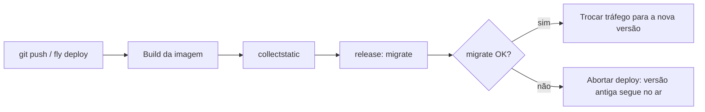

# Deploy em PaaS (Fly, Railway, Render)

!!! quote "Pensa como criança 🧒"
    Montar o servidor sozinho é como construir a própria casa: você compra o
    terreno, levanta as paredes, instala o encanamento. Uma **PaaS** (Plataforma
    como Serviço) é como alugar um apartamento já pronto: você só chega com suas
    coisas (o código), diz "ligue a água e a luz" (banco, variáveis) e o prédio
    cuida do resto — do zelador ao gerador de emergência. Você foca em morar, não
    em consertar cano.

## Caso de uso

Você tem o blog rodando com Docker (ver [deploy-docker](deploy-docker.md)) e quer
colocá-lo no ar **sem administrar um servidor Linux**. Com a Fly.io, são dois
comandos:

```bash
fly launch
fly deploy
```

O `fly launch` detecta que é um app Django, cria um `fly.toml`, oferece um banco
**Postgres gerenciado** e injeta a `DATABASE_URL` como segredo. O `fly deploy`
constrói a imagem, roda `migrate` no release e sobe o app com HTTPS já
configurado. Você abre `https://seu-app.fly.dev/` e está no ar.

A mesma ideia vale para Railway e Render: você conecta o repositório, define o
**comando de build** e o **comando de start**, adiciona um Postgres com um clique
e a plataforma cuida de TLS, escalonamento e reinício.

## Possibilidades

### As três plataformas em uma tabela

| | Fly.io | Railway | Render |
| --- | --- | --- | --- |
| Como você entrega | CLI (`fly deploy`) ou Docker | Git push / Docker | Git push / Docker |
| Detecção de Django | Sim (`fly launch`) | Buildpack (Nixpacks) | Buildpack ou Docker |
| Postgres gerenciado | Sim (`fly postgres`) | Sim (add-on) | Sim (managed) |
| Redis gerenciado | Sim (Upstash) | Sim (add-on) | Sim (Key Value) |
| Passo de release/migrate | `release_command` no `fly.toml` | Deploy hook | `preDeployCommand` |
| HTTPS automático | Sim | Sim | Sim |
| Escala para zero | Sim (auto stop/start) | Não (sempre ligado) | Sim (free tier) |

!!! info "Todas partem do mesmo lugar"
    Independentemente da plataforma, um deploy de Django precisa de: um servidor
    WSGI/ASGI (**Gunicorn** ou **Uvicorn/Granian**), **`collectstatic`** com
    WhiteNoise servindo os estáticos, **`migrate`** rodado no release, um
    **health check** e os **segredos** (SECRET_KEY, senhas) no ambiente — nunca no
    código. As seções abaixo mostram cada peça.

### Fly.io: `fly launch` e o `fly.toml`

A Fly roda **contêineres** (usa seu `Dockerfile` se ele existir). O `fly launch`
gera um `fly.toml` como este:

```toml
app = "django-blog"
primary_region = "gru"

[build]

[deploy]
  release_command = "python manage.py migrate --no-input"

[http_service]
  internal_port = 8000
  force_https = true
  auto_stop_machines = "stop"
  auto_start_machines = true
  min_machines_running = 0

  [[http_service.checks]]
    method = "get"
    path = "/healthz/"
    interval = "15s"
    timeout = "2s"

[[vm]]
  memory = "512mb"
  cpu_kind = "shared"
  cpus = 1
```

- **`release_command`** roda **uma vez por deploy**, antes das novas máquinas
  entrarem em serviço — o lugar certo para `migrate`.
- **`internal_port = 8000`** deve bater com a porta em que o Gunicorn escuta.
- **`checks`** é o health check HTTP (ver a seção de health check adiante).

Adicione o banco gerenciado e conecte-o ao app:

```bash
fly postgres create --name blog-db --region gru
fly postgres attach blog-db --app django-blog
```

O `attach` cria a `DATABASE_URL` como **segredo** no app. Defina os demais
segredos assim:

```bash
fly secrets set DJANGO_SECRET_KEY="$(python -c 'import secrets; print(secrets.token_urlsafe(50))')"
fly secrets set DJANGO_ALLOWED_HOSTS="django-blog.fly.dev"
fly secrets set DJANGO_DEBUG="false"
```

!!! tip "`fly secrets set` reinicia o app"
    Cada `fly secrets set` dispara um novo deploy com o segredo já disponível. Os
    segredos ficam criptografados e **nunca** aparecem em logs ou no `fly.toml`.
    Para listar (sem revelar valores): `fly secrets list`.

### Railway e Render: build e start sem Dockerfile

Railway e Render conseguem construir sem `Dockerfile`, usando **buildpacks** que
detectam Python pelo `pyproject.toml`/`requirements.txt`. Você só informa dois
comandos.

=== "Railway"

    No painel do serviço (ou em `railway.json`):

    ```json
    {
      "build": {
        "builder": "NIXPACKS"
      },
      "deploy": {
        "startCommand": "gunicorn config.wsgi:application --bind 0.0.0.0:$PORT --workers 3",
        "healthcheckPath": "/healthz/",
        "healthcheckTimeout": 30
      }
    }
    ```

    O `collectstatic` e o `migrate` entram como parte do start ou num **deploy
    hook**. Um jeito simples é um script de release:

    ```bash
    python manage.py collectstatic --no-input && \
    python manage.py migrate --no-input && \
    gunicorn config.wsgi:application --bind 0.0.0.0:$PORT --workers 3
    ```

    Adicione Postgres e Redis pelo botão **New → Database** — o Railway injeta
    `DATABASE_URL` e `REDIS_URL` como variáveis no serviço.

=== "Render"

    Num `render.yaml` (Blueprint) na raiz do repositório:

    ```yaml
    services:
      - type: web
        name: django-blog
        runtime: python
        buildCommand: "pip install -r requirements.txt && python manage.py collectstatic --no-input"
        preDeployCommand: "python manage.py migrate --no-input"
        startCommand: "gunicorn config.wsgi:application --bind 0.0.0.0:$PORT --workers 3"
        healthCheckPath: "/healthz/"
        envVars:
          - key: DJANGO_SECRET_KEY
            generateValue: true
          - key: DJANGO_DEBUG
            value: "false"
          - key: DATABASE_URL
            fromDatabase:
              name: blog-db
              property: connectionString

    databases:
      - name: blog-db
        plan: free
    ```

    - **`buildCommand`** roda no build (dependências + `collectstatic`).
    - **`preDeployCommand`** roda o `migrate` **antes** de trocar a versão no ar.
    - **`generateValue: true`** faz a Render gerar um `SECRET_KEY` seguro sozinha.

!!! note "A porta vem da plataforma: `$PORT`"
    Railway e Render definem a variável `PORT` e esperam que seu processo escute
    **nela**. Sempre use `--bind 0.0.0.0:$PORT` — nunca fixe `8000`. A Fly é o
    contrário: você fixa a porta interna e declara-a no `fly.toml`.

### Lendo `DATABASE_URL` no `settings.py`

As três plataformas entregam o banco como uma única URL. Em vez de decompor host,
porta e senha à mão, use `dj-database-url`:

```bash
uv add dj-database-url
```

```python
import os

import dj_database_url

DATABASES = {
    "default": dj_database_url.config(
        default=os.environ.get("DATABASE_URL", ""),
        conn_max_age=600,
        ssl_require=not os.environ.get("DJANGO_DEBUG", "").lower() == "true",
    )
}
```

- **`conn_max_age=600`** reaproveita conexões por 10 min — evita abrir uma
  conexão nova a cada request (importante em Postgres gerenciado).
- **`ssl_require`** força TLS no banco em produção; a maioria dos Postgres
  gerenciados exige.

!!! tip "`ALLOWED_HOSTS` a partir do ambiente"
    Cada plataforma dá um domínio (`*.fly.dev`, `*.up.railway.app`,
    `*.onrender.com`). Leia-o do ambiente para não hardcodar:

    ```python
    import os

    ALLOWED_HOSTS = os.environ.get("DJANGO_ALLOWED_HOSTS", "").split(",")
    CSRF_TRUSTED_ORIGINS = [f"https://{h}" for h in ALLOWED_HOSTS if h]
    ```

### As peças comuns a todo deploy PaaS

#### Gunicorn (WSGI) ou Uvicorn/Granian (ASGI)

```bash
# WSGI síncrono — o padrão para a maioria dos apps Django
gunicorn config.wsgi:application --bind 0.0.0.0:$PORT --workers 3

# ASGI (views/consumers async, WebSockets) — Uvicorn
uvicorn config.asgi:application --host 0.0.0.0 --port $PORT --workers 3
```

!!! info "Granian: um servidor mais novo, em Rust"
    O [Granian](https://github.com/emmett-framework/granian) é um servidor
    WSGI/ASGI escrito em Rust, com HTTP/2 nativo. Serve como alternativa ao
    Gunicorn/Uvicorn e roda igual em qualquer PaaS:

    ```bash
    granian --interface wsgi config.wsgi:application --host 0.0.0.0 --port $PORT
    ```

    É opcional — o Gunicorn continua sendo a escolha segura e mais documentada.

#### WhiteNoise para os estáticos

Numa PaaS você raramente tem um Nginx separado, então o **WhiteNoise** serve os
estáticos direto do processo Django:

```python
MIDDLEWARE = [
    "django.middleware.security.SecurityMiddleware",
    "whitenoise.middleware.WhiteNoiseMiddleware",
    "django.contrib.sessions.middleware.SessionMiddleware",
]

STORAGES = {
    "staticfiles": {
        "BACKEND": "whitenoise.storage.CompressedManifestStaticFilesStorage",
    },
}
```

O `collectstatic` (no build ou no release) junta tudo em `STATIC_ROOT`, e o
WhiteNoise serve com compressão e cache-busting por hash.

#### `migrate` no release, não no start



!!! warning "Por que separar o `migrate` do start"
    Se o `migrate` roda no comando de **start**, cada réplica que sobe tenta
    migrar ao mesmo tempo — corrida e erros. No passo de **release**
    (`release_command` na Fly, `preDeployCommand` na Render, deploy hook no
    Railway) ele roda **uma vez**, e se falhar o deploy é abortado com a versão
    antiga intacta. É o comportamento que você quer.

#### Health check

A plataforma faz um GET periódico numa rota para saber se o app está vivo. Uma
view mínima:

```python
from django.http import HttpResponse, HttpRequest
from django.urls import path


def healthz(request: HttpRequest) -> HttpResponse:
    """Return 200 so the platform knows the app is alive.

    Args:
        request: The incoming HTTP request.

    Returns:
        A plain 200 response with body "ok".
    """
    return HttpResponse("ok", content_type="text/plain")


urlpatterns = [
    path("healthz/", healthz),
]
```

!!! tip "Health check leve não deve tocar no banco"
    Mantenha o `/healthz/` **barato**: só um 200. Se ele consultar o banco, uma
    lentidão no Postgres derruba o app inteiro por "unhealthy". Se quiser checar
    dependências, faça uma rota **separada** (`/readyz/`) para isso.

#### Segredos no ambiente, nunca no código

| Plataforma | Como definir | Como ler |
| --- | --- | --- |
| Fly.io | `fly secrets set K=V` | `os.environ["K"]` |
| Railway | Painel → Variables, ou `railway variables` | `os.environ["K"]` |
| Render | Painel → Environment, ou `render.yaml` | `os.environ["K"]` |

```python
import os

SECRET_KEY = os.environ["DJANGO_SECRET_KEY"]
DEBUG = os.environ.get("DJANGO_DEBUG", "false").lower() == "true"
```

!!! danger "Rode `check --deploy` antes de expor"
    Antes de mandar tráfego real, rode `python manage.py check --deploy` e resolva
    os avisos: `SECURE_SSL_REDIRECT`, `SESSION_COOKIE_SECURE`,
    `CSRF_COOKIE_SECURE`, HSTS. Numa PaaS o TLS termina na borda da plataforma, e
    o Django precisa confiar no cabeçalho de proxy:

    ```python
    SECURE_PROXY_SSL_HEADER = ("HTTP_X_FORWARDED_PROTO", "https")
    SECURE_SSL_REDIRECT = True
    SESSION_COOKIE_SECURE = True
    CSRF_COOKIE_SECURE = True
    ```

    O checklist completo está em [deploy](deploy.md).

### E o Kubernetes?

!!! note "k8s: quando a PaaS fica pequena"
    PaaS é o caminho certo para 99% dos projetos. Se um dia você precisar de
    orquestração fina — múltiplos serviços, autoscaling por métrica, deploys
    canário — o **Kubernetes** entra em cena. Ali os mesmos conceitos reaparecem
    com outros nomes: os segredos viram **`Secret`** (montados como env vars ou
    arquivos), o `migrate` vira um **`Job`** de init/pré-deploy, o health check
    vira **`livenessProbe`/`readinessProbe`** e o `fly.toml` vira um
    **`Deployment` + `Service`** em YAML. Não comece por aqui: só migre quando a
    dor real justificar a complexidade.

!!! quote "📖 Na documentação oficial"
    - [Fly.io — Django](https://fly.io/docs/django/)
    - [Render — Deploy Django](https://render.com/docs/deploy-django)
    - [Railway docs](https://docs.railway.app/)
    - [Django — Deployment checklist](https://docs.djangoproject.com/en/stable/howto/deployment/checklist/)

## Recap

- PaaS é "apartamento pronto": você entrega o código e a plataforma cuida de
  TLS, escala e reinício. Fly.io (`fly launch`/`fly deploy` + `fly postgres`),
  Railway e Render (build/start commands + Postgres/Redis gerenciados) resolvem o
  caso comum.
- Toda receita tem as **mesmas peças**: Gunicorn (ou Uvicorn/Granian),
  `collectstatic` + WhiteNoise, `migrate` no **release** (não no start), um
  **health check** leve e **segredos** no ambiente.
- Leia `DATABASE_URL` com `dj-database-url` e o domínio com `ALLOWED_HOSTS` do
  ambiente. A Fly fixa a porta no `fly.toml`; Railway/Render usam `$PORT`.
- Rode `check --deploy` e configure `SECURE_PROXY_SSL_HEADER` — o TLS termina na
  borda da PaaS.
- Kubernetes é o próximo degrau só quando a PaaS fica pequena; os mesmos
  conceitos reaparecem como `Secret`, `Job` e probes.

Para o passo a passo com Docker, veja **[deploy-docker](deploy-docker.md)**; para
o checklist geral de produção, **[deploy](deploy.md)**.
