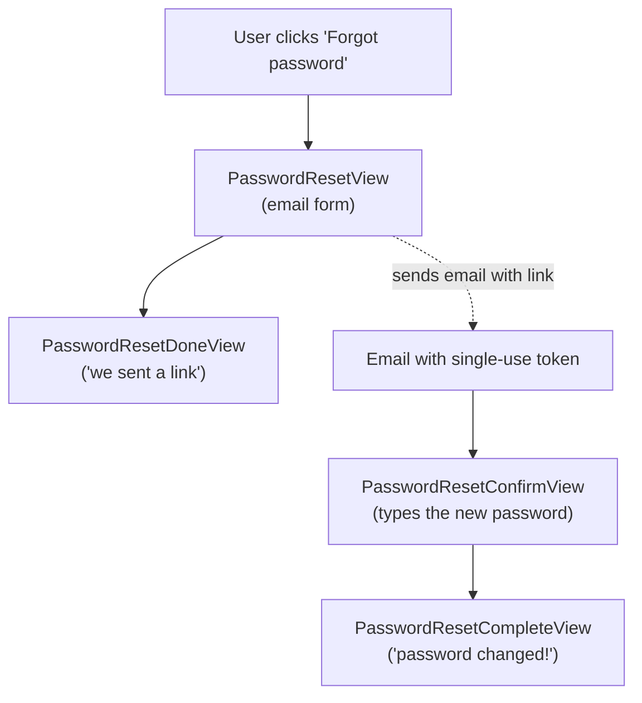

# Email and password reset

!!! quote "Think like a child 🧒"
    When you want to tell grandma something, you **write a note** and drop it in
    the **mailbox**. The mailman delivers it. In development, the "mailman" just
    reads the note out loud so you can check it (the console). In production,
    it's a real mailman (an SMTP server) delivering it to grandma's house.

    And when you **forget the padlock password**, the building owner sends you a
    temporary key that only works once. That's exactly what Django does with
    "reset my password".

## Use case

Your blog needs to (1) send an email when a new comment arrives and (2) let a
user reset their password when they forget it. You don't have to write either
from scratch — Django already ships everything.

Sending an email is one line:

```python
from django.core.mail import send_mail

send_mail(
    subject="New comment on your post",
    message="Someone commented on 'Django 6.0 in practice'.",
    from_email="blog@example.com",
    recipient_list=["author@example.com"],
)
```

In development you don't even need a mail server: set the console backend and
the "email" shows up in the terminal.

```python
# settings.py
EMAIL_BACKEND = "django.core.mail.backends.console.EmailBackend"
DEFAULT_FROM_EMAIL = "blog@example.com"
```

## Possibilities

### Choosing the email backend

`EMAIL_BACKEND` decides **who delivers** the email. You swap one string in the
settings and the rest of your code stays the same.

| Backend | When to use |
| --- | --- |
| `django.core.mail.backends.console.EmailBackend` | Dev: prints the email to the terminal |
| `django.core.mail.backends.filebased.EmailBackend` | Dev: writes each email to a file (`EMAIL_FILE_PATH`) |
| `django.core.mail.backends.locmem.EmailBackend` | Tests: stores them in `django.core.mail.outbox` |
| `django.core.mail.backends.smtp.EmailBackend` | Production: delivers via a real SMTP server |
| `django.core.mail.backends.dummy.EmailBackend` | Discards everything (does nothing) |

In production, the SMTP backend needs the provider's credentials:

```python
# settings.py — production
EMAIL_BACKEND = "django.core.mail.backends.smtp.EmailBackend"
EMAIL_HOST = "smtp.sendgrid.net"
EMAIL_PORT = 587
EMAIL_HOST_USER = "apikey"
EMAIL_HOST_PASSWORD = "SG.xxxxx"
EMAIL_USE_TLS = True
DEFAULT_FROM_EMAIL = "blog@example.com"
```

!!! tip "Read secrets from the environment, never from the code"
    Never write `EMAIL_HOST_PASSWORD` straight into `settings.py`. Read it from
    an environment variable (for example with `os.environ` or `django-environ`).
    See the [settings](settings.md) page.

!!! warning "Use `EMAIL_USE_TLS` OR `EMAIL_USE_SSL`, never both"
    `EMAIL_USE_TLS = True` is for port 587 (STARTTLS); `EMAIL_USE_SSL = True` is
    for port 465. Turning both on at the same time raises an error.

### `send_mail` vs `EmailMessage`

`send_mail` is the shortcut for the simple case (plain text, one subject, one
recipient list). When you need **attachments**, **CC/BCC**, headers, or an HTML
body, use the `EmailMessage` class.

```python
from django.core.mail import EmailMessage

email = EmailMessage(
    subject="Monthly report",
    body="The report is attached.",
    from_email="blog@example.com",
    to=["author@example.com"],
    cc=["boss@example.com"],
    bcc=["archive@example.com"],
    reply_to=["do-not-reply@example.com"],
)
email.attach_file("/path/report.pdf")
email.send()
```

To send **several emails** reusing a single SMTP connection (much faster than
opening one connection per message):

```python
from django.core.mail import send_mass_mail

message1 = (
    "Welcome",
    "Thanks for signing up!",
    "blog@example.com",
    ["ana@example.com"],
)
message2 = (
    "Welcome",
    "Thanks for signing up!",
    "blog@example.com",
    ["bruno@example.com"],
)
send_mass_mail((message1, message2), fail_silently=False)
```

### HTML + text email (multipart)

Good emails send **two versions**: plain text (for old clients) and HTML
(pretty). Render both with templates and combine them with
`EmailMultiAlternatives`.

```python
from django.core.mail import EmailMultiAlternatives
from django.template.loader import render_to_string


def send_welcome_email(to_email: str, username: str) -> None:
    """Send a multipart welcome email.

    Args:
        to_email: Recipient address.
        username: Name shown inside the message body.
    """
    context = {"username": username}
    text_body = render_to_string("emails/welcome.txt", context)
    html_body = render_to_string("emails/welcome.html", context)

    email = EmailMultiAlternatives(
        subject="Welcome to the blog!",
        body=text_body,
        from_email="blog@example.com",
        to=[to_email],
    )
    email.attach_alternative(html_body, "text/html")
    email.send()
```

```html
<!-- templates/emails/welcome.html -->
<h1>Hi, {{ username }}! 👋</h1>
<p>So glad to have you on our blog.</p>
```

!!! note "`render_to_string` renders any template"
    The email body is just a regular Django template. You use the same tags and
    filters as in HTML pages. See [templates](templates.md).

### Testing emails

With the in-memory backend (`locmem`), each sent email ends up in
`django.core.mail.outbox`, a list you inspect in your tests.

```python
from django.core import mail
from django.test import TestCase


class WelcomeEmailTests(TestCase):
    """Tests for the welcome email flow."""

    def test_welcome_email_is_sent(self) -> None:
        """One email lands in the outbox with the right subject."""
        send_welcome_email("ana@example.com", "Ana")

        self.assertEqual(len(mail.outbox), 1)
        self.assertEqual(mail.outbox[0].subject, "Welcome to the blog!")
        self.assertIn("ana@example.com", mail.outbox[0].to)
```

`django.test.TestCase` already uses the `locmem` backend automatically and
clears the `outbox` between tests. See [testing](testing.md).

### The password reset flow

Here's the magic: Django ships **four views** that together do the whole "forgot
my password" dance. You only wire the URLs and create the templates.



The four views, in the order the user goes through them:

| View | Role |
| --- | --- |
| `PasswordResetView` | Shows the email form and fires the email with the link |
| `PasswordResetDoneView` | "We sent a link to your email" page |
| `PasswordResetConfirmView` | Validates the token from the URL and shows the new-password form |
| `PasswordResetCompleteView` | "Your password was changed, log in" page |

Wire all of them with just Django's defaults:

```python
# urls.py
from django.contrib.auth import views as auth_views
from django.urls import path

urlpatterns = [
    path(
        "password-reset/",
        auth_views.PasswordResetView.as_view(),
        name="password_reset",
    ),
    path(
        "password-reset/done/",
        auth_views.PasswordResetDoneView.as_view(),
        name="password_reset_done",
    ),
    path(
        "reset/<uidb64>/<token>/",
        auth_views.PasswordResetConfirmView.as_view(),
        name="password_reset_confirm",
    ),
    path(
        "reset/done/",
        auth_views.PasswordResetCompleteView.as_view(),
        name="password_reset_complete",
    ),
]
```

!!! danger "The `name=`s are fixed — don't invent your own"
    The views look each other up by name (`password_reset_confirm`,
    `password_reset_complete`, etc.). Use **exactly** those names or the
    redirect breaks.

### The single-use token

The link that goes in the email has two pieces: `uidb64` (the user's encoded ID)
and `token`. The `token` is generated by the `default_token_generator`
(`django.contrib.auth.tokens`). It mixes the ID, the date, and the **hash of the
current password** — so:

- The link **expires** after `PASSWORD_RESET_TIMEOUT` seconds (default: 3 days).
- The link **stops working** as soon as the password changes (the hash changes,
  the token no longer matches). That makes it **single-use** in practice.

```python
# settings.py
PASSWORD_RESET_TIMEOUT = 60 * 60 * 24  # 1 day, in seconds
```

!!! info "You don't generate the token by hand"
    `PasswordResetView` creates the token and builds the link on its own, using
    the `default_token_generator`. You only need the email templates (below).

### The flow's templates

Each view looks for a template with a fixed name. Create them under
`templates/registration/`:

| View | Template |
| --- | --- |
| `PasswordResetView` (page) | `registration/password_reset_form.html` |
| `PasswordResetView` (email subject) | `registration/password_reset_subject.txt` |
| `PasswordResetView` (email body) | `registration/password_reset_email.html` |
| `PasswordResetDoneView` | `registration/password_reset_done.html` |
| `PasswordResetConfirmView` | `registration/password_reset_confirm.html` |
| `PasswordResetCompleteView` | `registration/password_reset_complete.html` |

The email body gets the context ready to build the absolute link:

```html
<!-- templates/registration/password_reset_email.html -->

Hi,

You (or someone) asked to reset the password on {{ site_name }}.
Click the link below to choose a new one:

{{ protocol }}://{{ domain }}

If it wasn't you, you can safely ignore this email.

```

```text
{# templates/registration/password_reset_subject.txt #}
Password reset on {{ site_name }}
```

!!! warning "The email subject is always a single line"
    `password_reset_subject.txt` must be a **single line**. Django collapses it
    into one line anyway — but keep the file clean.

### Changing the password (logged-in user)

Password reset is for someone who **forgot**. For someone who **remembers** and
wants to change it, there are two views: `PasswordChangeView` and
`PasswordChangeDoneView`.

```python
# urls.py
from django.contrib.auth import views as auth_views
from django.urls import path

urlpatterns = [
    path(
        "password-change/",
        auth_views.PasswordChangeView.as_view(),
        name="password_change",
    ),
    path(
        "password-change/done/",
        auth_views.PasswordChangeDoneView.as_view(),
        name="password_change_done",
    ),
]
```

They require login (the user confirms the old password before choosing the new
one). The templates are `registration/password_change_form.html` and
`registration/password_change_done.html`.

!!! tip "Customizing any of these views"
    They all accept `template_name`, `success_url`, `form_class`, and
    `email_template_name` via `.as_view(...)` or a subclass. They're plain CBVs
    — see [class-based views](views-cbv.md).

    ```python
    auth_views.PasswordResetView.as_view(
        template_name="account/reset.html",
        email_template_name="account/reset_email.html",
        success_url="/account/reset/done/",
    )
    ```

### Sending email inside a view (async)

If your view is asynchronous, Django offers the async version of the send so it
doesn't block the event loop:

```python
from django.core.mail import send_mail
from django.http import HttpRequest, JsonResponse


async def notify(request: HttpRequest) -> JsonResponse:
    """Send a notification email without blocking the event loop."""
    await send_mail(
        subject="Ping",
        message="You have a notification.",
        from_email="blog@example.com",
        recipient_list=["author@example.com"],
    )
    return JsonResponse({"sent": True})
```

!!! note "Calling from synchronous code"
    If you're not in an async view, use the regular (synchronous) `send_mail`.
    Don't mix them: calling the async version from synchronous code requires
    `async_to_sync`.

!!! quote "📖 In the official docs"
    - [Sending email](https://docs.djangoproject.com/en/6.0/topics/email/)
    - [Using the authentication system](https://docs.djangoproject.com/en/6.0/topics/auth/default/)

## Recap

- Sending email is `send_mail(...)` for the simple case; `EmailMessage` /
  `EmailMultiAlternatives` for attachments, CC/BCC, and HTML.
- `EMAIL_BACKEND` decides the mailman: **console** in dev, **SMTP** in
  production, **locmem** in tests (inspect `mail.outbox`).
- Keep SMTP credentials in the environment, never in `settings.py`; use TLS
  **or** SSL, never both.
- Password reset = 4 ready-made views (`PasswordResetView` → `Done` → `Confirm`
  → `Complete`); wire the URLs with the **exact** `name=`s.
- The link uses the `default_token_generator`: it expires per
  `PASSWORD_RESET_TIMEOUT` and stops working once the password changes
  (single-use in practice).
- Each view looks for a fixed template under `registration/`; the email is built
  from `password_reset_email.html` + `password_reset_subject.txt`.
- For a logged-in user who remembers their password: `PasswordChangeView` /
  `PasswordChangeDoneView`.

All of this rests on the authentication system — revisit the
[authentication and permissions](auth.md) page.
