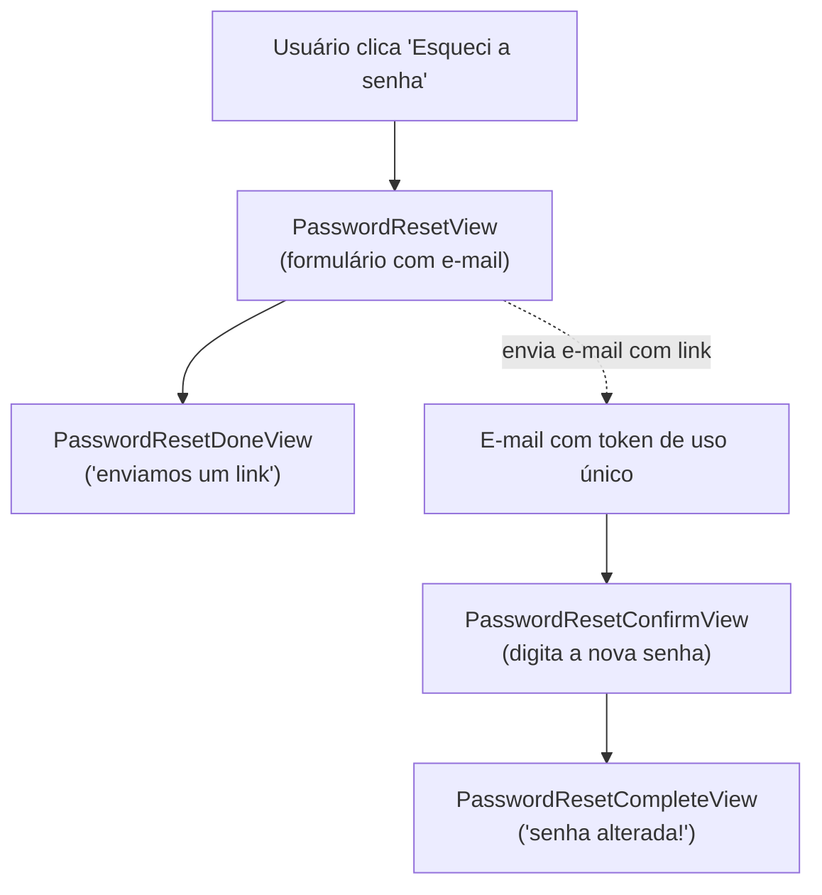

# E-mail e recuperacao de senha

!!! quote "Pensa como criança 🧒"
    Quando você quer avisar a vovó, você **escreve um bilhete** e coloca na
    **caixa do correio**. O carteiro leva. Em desenvolvimento, o "carteiro" só
    lê o bilhete em voz alta para você conferir (o console). Em produção, é um
    carteiro de verdade (servidor SMTP) que entrega na casa da vovó.

    E quando você **esquece a senha do cadeado**, o dono do prédio te manda uma
    chave temporária que só serve uma vez. É exatamente isso que o Django faz
    com "recuperar senha".

## Caso de uso

Seu blog precisa (1) mandar um e-mail quando um comentário novo chega e (2)
deixar o usuário resetar a senha quando esquecer. Nenhuma das duas coisas você
precisa escrever do zero — o Django já traz tudo.

Mandar um e-mail é uma linha:

```python
from django.core.mail import send_mail

send_mail(
    subject="Novo comentário no seu post",
    message="Alguém comentou em 'Django 6.0 na prática'.",
    from_email="blog@exemplo.com",
    recipient_list=["autor@exemplo.com"],
)
```

Em desenvolvimento você nem precisa de servidor de e-mail: coloca o backend de
console e o "e-mail" aparece no terminal.

```python
# settings.py
EMAIL_BACKEND = "django.core.mail.backends.console.EmailBackend"
DEFAULT_FROM_EMAIL = "blog@exemplo.com"
```

## Possibilidades

### Escolhendo o backend de e-mail

O `EMAIL_BACKEND` decide **quem entrega** o e-mail. Você troca uma string no
settings e o resto do código continua igual.

| Backend | Quando usar |
| --- | --- |
| `django.core.mail.backends.console.EmailBackend` | Dev: imprime o e-mail no terminal |
| `django.core.mail.backends.filebased.EmailBackend` | Dev: grava cada e-mail em um arquivo (`EMAIL_FILE_PATH`) |
| `django.core.mail.backends.locmem.EmailBackend` | Testes: guarda em `django.core.mail.outbox` |
| `django.core.mail.backends.smtp.EmailBackend` | Produção: entrega via um servidor SMTP real |
| `django.core.mail.backends.dummy.EmailBackend` | Descarta tudo (não faz nada) |

Em produção, o backend SMTP precisa das credenciais do provedor:

```python
# settings.py — produção
EMAIL_BACKEND = "django.core.mail.backends.smtp.EmailBackend"
EMAIL_HOST = "smtp.sendgrid.net"
EMAIL_PORT = 587
EMAIL_HOST_USER = "apikey"
EMAIL_HOST_PASSWORD = "SG.xxxxx"
EMAIL_USE_TLS = True
DEFAULT_FROM_EMAIL = "blog@exemplo.com"
```

!!! tip "Leia os segredos do ambiente, nunca do código"
    Nunca escreva `EMAIL_HOST_PASSWORD` direto no `settings.py`. Leia de uma
    variável de ambiente (por exemplo com `os.environ` ou `django-environ`).
    Veja a página de [settings](settings.md).

!!! warning "Use `EMAIL_USE_TLS` OU `EMAIL_USE_SSL`, nunca os dois"
    `EMAIL_USE_TLS = True` é para a porta 587 (STARTTLS); `EMAIL_USE_SSL = True`
    é para a porta 465. Ligar os dois ao mesmo tempo levanta erro.

### `send_mail` vs `EmailMessage`

`send_mail` é o atalho para o caso simples (texto puro, um assunto, uma lista de
destinatários). Quando você precisa de **anexos**, **CC/BCC**, cabeçalhos ou
corpo em HTML, use a classe `EmailMessage`.

```python
from django.core.mail import EmailMessage

email = EmailMessage(
    subject="Relatório do mês",
    body="Segue o relatório em anexo.",
    from_email="blog@exemplo.com",
    to=["autor@exemplo.com"],
    cc=["chefe@exemplo.com"],
    bcc=["arquivo@exemplo.com"],
    reply_to=["nao-responda@exemplo.com"],
)
email.attach_file("/caminho/relatorio.pdf")
email.send()
```

Para enviar **vários e-mails** reaproveitando uma única conexão SMTP (muito mais
rápido que abrir uma conexão por mensagem):

```python
from django.core.mail import send_mass_mail

message1 = (
    "Bem-vindo",
    "Obrigado por se cadastrar!",
    "blog@exemplo.com",
    ["ana@exemplo.com"],
)
message2 = (
    "Bem-vindo",
    "Obrigado por se cadastrar!",
    "blog@exemplo.com",
    ["bruno@exemplo.com"],
)
send_mass_mail((message1, message2), fail_silently=False)
```

### E-mail com HTML e texto (multipart)

Bons e-mails mandam **duas versões**: texto puro (para clientes antigos) e HTML
(bonito). Renderize os dois com templates e junte com `EmailMultiAlternatives`.

```python
from django.core.mail import EmailMultiAlternatives
from django.template.loader import render_to_string


def send_welcome_email(to_email: str, username: str) -> None:
    """Send a bilingual multipart welcome email.

    Args:
        to_email: Recipient address.
        username: Name shown inside the message body.
    """
    context = {"username": username}
    text_body = render_to_string("emails/welcome.txt", context)
    html_body = render_to_string("emails/welcome.html", context)

    email = EmailMultiAlternatives(
        subject="Bem-vindo ao blog!",
        body=text_body,
        from_email="blog@exemplo.com",
        to=[to_email],
    )
    email.attach_alternative(html_body, "text/html")
    email.send()
```

```html
<!-- templates/emails/welcome.html -->
<h1>Olá, {{ username }}! 👋</h1>
<p>Que bom ter você no nosso blog.</p>
```

!!! note "`render_to_string` renderiza qualquer template"
    O corpo do e-mail é só um template Django comum. Você usa as mesmas tags e
    filtros das páginas HTML. Veja [templates](templates.md).

### Testando e-mails

No backend de memória (`locmem`), cada e-mail enviado vai parar em
`django.core.mail.outbox`, uma lista que você inspeciona nos testes.

```python
from django.core import mail
from django.test import TestCase


class WelcomeEmailTests(TestCase):
    """Tests for the welcome email flow."""

    def test_welcome_email_is_sent(self) -> None:
        """One email lands in the outbox with the right subject."""
        send_welcome_email("ana@exemplo.com", "Ana")

        self.assertEqual(len(mail.outbox), 1)
        self.assertEqual(mail.outbox[0].subject, "Bem-vindo ao blog!")
        self.assertIn("ana@exemplo.com", mail.outbox[0].to)
```

`django.test.TestCase` já usa o backend `locmem` automaticamente e limpa a
`outbox` entre os testes. Veja [testes](testing.md).

### Fluxo de recuperação de senha

Aqui está a mágica: o Django já traz **quatro views** que, juntas, fazem o
"esqueci minha senha" inteiro. Você só liga as URLs e cria os templates.



As quatro views, na ordem em que o usuário passa por elas:

| View | Papel |
| --- | --- |
| `PasswordResetView` | Mostra o formulário de e-mail e dispara o e-mail com o link |
| `PasswordResetDoneView` | Página "enviamos um link para o seu e-mail" |
| `PasswordResetConfirmView` | Valida o token da URL e mostra o formulário de nova senha |
| `PasswordResetCompleteView` | Página "sua senha foi alterada, faça login" |

Ligue todas com apenas os defaults do Django:

```python
# urls.py
from django.contrib.auth import views as auth_views
from django.urls import path

urlpatterns = [
    path(
        "password-reset/",
        auth_views.PasswordResetView.as_view(),
        name="password_reset",
    ),
    path(
        "password-reset/done/",
        auth_views.PasswordResetDoneView.as_view(),
        name="password_reset_done",
    ),
    path(
        "reset/<uidb64>/<token>/",
        auth_views.PasswordResetConfirmView.as_view(),
        name="password_reset_confirm",
    ),
    path(
        "reset/done/",
        auth_views.PasswordResetCompleteView.as_view(),
        name="password_reset_complete",
    ),
]
```

!!! danger "Os `name=` são fixos — não invente outros"
    As views procuram umas às outras pelo nome (`password_reset_confirm`,
    `password_reset_complete`, etc.). Use **exatamente** esses nomes ou o
    redirecionamento quebra.

### O token de uso único

O link que vai no e-mail tem dois pedaços: `uidb64` (o ID do usuário
codificado) e `token`. O `token` é gerado pelo
`default_token_generator` (`django.contrib.auth.tokens`). Ele mistura o ID, a
data e o **hash da senha atual** — então:

- O link **expira** depois de `PASSWORD_RESET_TIMEOUT` segundos (padrão: 3 dias).
- O link **deixa de funcionar** assim que a senha muda (o hash muda, o token
  não bate mais). Isso o torna de **uso único** na prática.

```python
# settings.py
PASSWORD_RESET_TIMEOUT = 60 * 60 * 24  # 1 dia, em segundos
```

!!! info "Você não gera o token na mão"
    A `PasswordResetView` cria o token e monta o link sozinha, usando o
    `default_token_generator`. Você só precisa dos templates de e-mail (abaixo).

### Os templates do fluxo

Cada view procura um template com nome fixo. Crie-os em `templates/registration/`:

| View | Template |
| --- | --- |
| `PasswordResetView` (página) | `registration/password_reset_form.html` |
| `PasswordResetView` (assunto do e-mail) | `registration/password_reset_subject.txt` |
| `PasswordResetView` (corpo do e-mail) | `registration/password_reset_email.html` |
| `PasswordResetDoneView` | `registration/password_reset_done.html` |
| `PasswordResetConfirmView` | `registration/password_reset_confirm.html` |
| `PasswordResetCompleteView` | `registration/password_reset_complete.html` |

O corpo do e-mail recebe o contexto pronto para montar o link absoluto:

```html
<!-- templates/registration/password_reset_email.html -->

Olá,

Você (ou alguém) pediu para redefinir a senha no {{ site_name }}.
Clique no link abaixo para escolher uma nova senha:

{{ protocol }}://{{ domain }}

Se não foi você, pode ignorar este e-mail com segurança.

```

```text
{# templates/registration/password_reset_subject.txt #}
Redefinição de senha no {{ site_name }}
```

!!! warning "Assunto do e-mail é sempre uma linha só"
    O `password_reset_subject.txt` deve ter **uma única linha**. O Django junta
    tudo em uma linha de qualquer forma — mas mantenha o arquivo limpo.

### Trocar a senha (usuário logado)

Recuperar senha é para quem **esqueceu**. Para quem **lembra** e quer trocar,
existem duas views: `PasswordChangeView` e `PasswordChangeDoneView`.

```python
# urls.py
from django.contrib.auth import views as auth_views
from django.urls import path

urlpatterns = [
    path(
        "password-change/",
        auth_views.PasswordChangeView.as_view(),
        name="password_change",
    ),
    path(
        "password-change/done/",
        auth_views.PasswordChangeDoneView.as_view(),
        name="password_change_done",
    ),
]
```

Elas exigem login (o usuário confirma a senha antiga antes de escolher a nova).
Os templates são `registration/password_change_form.html` e
`registration/password_change_done.html`.

!!! tip "Personalizando qualquer uma dessas views"
    Todas aceitam `template_name`, `success_url`, `form_class` e
    `email_template_name` via `.as_view(...)` ou subclasse. Elas são CBVs
    comuns — veja [views baseadas em classe](views-cbv.md).

    ```python
    auth_views.PasswordResetView.as_view(
        template_name="conta/reset.html",
        email_template_name="conta/reset_email.html",
        success_url="/conta/reset/done/",
    )
    ```

### Enviando e-mail dentro de uma view (async)

Se sua view é assíncrona, o Django oferece a versão async do envio, para não
travar o event loop:

```python
from django.core.mail import send_mail
from django.http import HttpRequest, JsonResponse


async def notify(request: HttpRequest) -> JsonResponse:
    """Send a notification email without blocking the event loop."""
    await send_mail(
        subject="Ping",
        message="Você tem uma notificação.",
        from_email="blog@exemplo.com",
        recipient_list=["autor@exemplo.com"],
    )
    return JsonResponse({"sent": True})
```

!!! note "Chamando de dentro de código síncrono"
    Se você não está em uma view async, use o `send_mail` normal (síncrono).
    Não misture: chamar a versão async de dentro de código síncrono exige
    `async_to_sync`.

!!! quote "📖 Na documentação oficial"
    - [Sending email](https://docs.djangoproject.com/en/6.0/topics/email/)
    - [Using the authentication system](https://docs.djangoproject.com/en/6.0/topics/auth/default/)

## Recap

- Mandar e-mail é `send_mail(...)` para o caso simples; `EmailMessage` /
  `EmailMultiAlternatives` para anexos, CC/BCC e HTML.
- `EMAIL_BACKEND` decide o carteiro: **console** em dev, **SMTP** em produção,
  **locmem** nos testes (inspecione `mail.outbox`).
- Guarde credenciais SMTP no ambiente, nunca no `settings.py`; use TLS **ou**
  SSL, nunca os dois.
- Recuperação de senha = 4 views prontas (`PasswordResetView` → `Done` →
  `Confirm` → `Complete`); ligue as URLs com os `name=` **exatos**.
- O link usa o `default_token_generator`: expira por `PASSWORD_RESET_TIMEOUT`
  e deixa de valer quando a senha muda (uso único na prática).
- Cada view procura um template fixo em `registration/`; o e-mail é montado em
  `password_reset_email.html` + `password_reset_subject.txt`.
- Para quem está logado e lembra a senha: `PasswordChangeView` /
  `PasswordChangeDoneView`.

Tudo isso se apoia no sistema de autenticação — reveja a página de
[autenticação e permissões](auth.md).
