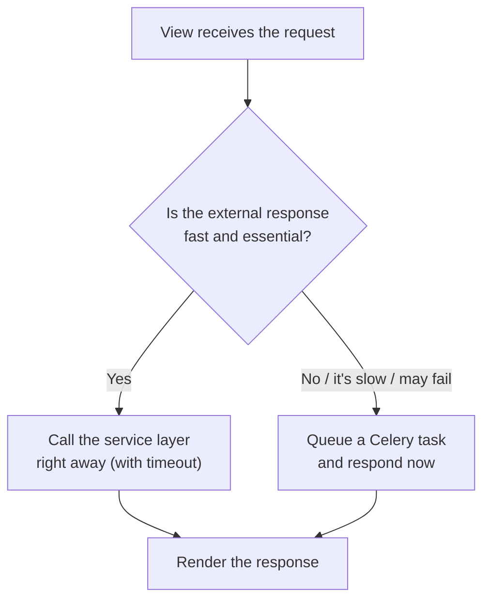

# Consuming external APIs (requests/httpx)

!!! quote "Think like a child 🧒"
    You mailed a little letter asking for tomorrow's weather and waited for the
    reply in the mailbox. If the reply takes too long, you don't stand there all
    day: you agree on a cutoff time to give up. Talking to an **external API** is
    just that — you send a request over the internet, wait for the reply, and
    always agree on how long it's worth waiting.

## Use case

Your blog wants to show, on a post's page, the current temperature of the
author's city, fetched from a weather service. Django doesn't store that data: it
needs to **ask another system** over HTTP.

The golden rule: that call lives in a **service layer** (a function or class),
never inside the template and never loose in the view. That way you can test,
swap, and reuse it without touching the page.

```python
import httpx


def get_temperature(city: str) -> float | None:
    """Fetch the current temperature for a city from a weather API.

    Args:
        city: The city name to look up.

    Returns:
        The current temperature in Celsius, or None when the service fails.
    """
    try:
        response = httpx.get(
            "https://api.example-weather.com/v1/current",
            params={"city": city},
            timeout=5.0,
        )
        response.raise_for_status()
    except httpx.HTTPError:
        return None
    return response.json()["temperature_c"]
```

And the view just calls the service:

```python
from django.shortcuts import render
from django.http import HttpRequest, HttpResponse

from .services import get_temperature


def author_weather(request: HttpRequest, city: str) -> HttpResponse:
    """Render the current temperature for an author's city."""
    return render(
        request,
        "blog/weather.html",
        {"city": city, "temperature": get_temperature(city)},
    )
```

!!! danger "Always set a `timeout`"
    Neither `requests` nor `httpx` sets a timeout by default. Without one, if the
    other server hangs, your Django thread stays **stuck forever** waiting — and a
    slow service takes yours down with it. Every network call gets a `timeout`.

## Possibilities

### `requests` vs `httpx`: which to pick?

| Aspect | `requests` | `httpx` |
| --- | --- | --- |
| Maturity | The classic, ubiquitous | Modern, near-identical API |
| Synchronous | ✅ | ✅ |
| Asynchronous (`async`/`await`) | ❌ | ✅ (`httpx.AsyncClient`) |
| HTTP/2 | ❌ | ✅ (with `httpx[http2]`) |
| Connection reuse | `requests.Session` | `httpx.Client` / `httpx.AsyncClient` |
| Install | `pip install requests` | `pip install httpx` |

!!! tip "Rule of thumb for 2026"
    If you have **async views** (`async def`) or want HTTP/2, use `httpx`. If your
    project is 100% synchronous and you already use `requests`, it's still great.
    Their APIs are so similar that the examples below swap almost 1-to-1.

### Timeouts with finer control

A single number covers every phase. `httpx` lets you separate connect, read,
write, and getting a connection from the pool:

```python
import httpx

timeout = httpx.Timeout(10.0, connect=5.0)
response = httpx.get("https://api.example.com/data", timeout=timeout)
```

In `requests`, you pass a `(connect, read)` tuple:

```python
import requests

response = requests.get(
    "https://api.example.com/data",
    timeout=(3.05, 10),
)
```

!!! note "Why `3.05` and not `3`?"
    The `requests` docs recommend a connect timeout slightly larger than a
    multiple of 3, because that's how TCP schedules packet retransmission
    attempts. It's a fine detail — the point is: **set the timeout**.

### Connection reuse: `Session` / `Client`

Opening a fresh TCP+TLS connection on every call is expensive. If you make
several calls to the same host, reuse the connection with a `Session` (requests)
or `Client` (httpx). It also keeps shared headers and a base URL:

```python
import httpx


class WeatherClient:
    """Client for the weather API with connection reuse."""

    def __init__(self, api_key: str) -> None:
        """Initialize the client with a shared connection pool.

        Args:
            api_key: The API key sent on every request.
        """
        self._client = httpx.Client(
            base_url="https://api.example-weather.com/v1",
            headers={"Authorization": f"Bearer {api_key}"},
            timeout=5.0,
        )

    def current(self, city: str) -> float:
        """Return the current temperature for a city in Celsius.

        Args:
            city: The city name to look up.

        Returns:
            The current temperature in Celsius.

        Raises:
            httpx.HTTPStatusError: If the API answers with a 4xx/5xx status.
        """
        response = self._client.get("/current", params={"city": city})
        response.raise_for_status()
        return response.json()["temperature_c"]

    def close(self) -> None:
        """Release the underlying connection pool."""
        self._client.close()
```

!!! warning "Close the client (or use `with`)"
    A `Client`/`Session` holds connections open. Close it with `.close()` when
    you're done, or use it as a context manager: `with httpx.Client() as client:
    ...`. Never create a new `Client` per Django HTTP request — that defeats the
    reuse.

### Error handling

Things fail in different ways; handle each one:

| Error (`httpx`) | Error (`requests`) | When it happens |
| --- | --- | --- |
| `httpx.TimeoutException` | `requests.Timeout` | Exceeded the `timeout` |
| `httpx.ConnectError` | `requests.ConnectionError` | Couldn't connect (DNS, network) |
| `httpx.HTTPStatusError` | `requests.HTTPError` | 4xx/5xx status (after `raise_for_status()`) |
| `httpx.HTTPError` | `requests.RequestException` | Parent class: catches any of them |

```python
import httpx


def safe_fetch(url: str) -> dict | None:
    """Fetch JSON from a URL, returning None on any HTTP failure.

    Args:
        url: The absolute URL to fetch.

    Returns:
        The decoded JSON body, or None when anything goes wrong.
    """
    try:
        response = httpx.get(url, timeout=5.0)
        response.raise_for_status()
    except httpx.TimeoutException:
        return None
    except httpx.HTTPStatusError:
        return None
    except httpx.HTTPError:
        return None
    return response.json()
```

!!! danger "`raise_for_status()` is not automatic"
    A `404` or `500` response does **not** raise an exception on its own — from
    the network's point of view, the request "succeeded" (the server answered).
    Call `response.raise_for_status()` to turn 4xx/5xx into an error, otherwise
    you'll try to read the JSON of an error page.

### Retries and backoff

Network failures are sometimes transient. Retrying the call — waiting a bit
longer each attempt (**exponential backoff**) — often fixes it, without hammering
the other server.

`httpx` ships a transport that retries **connection** errors only:

```python
import httpx

transport = httpx.HTTPTransport(retries=3)
client = httpx.Client(transport=transport, timeout=5.0)
```

To also retry on 5xx statuses with growing waits, use the `tenacity` library:

```python
import httpx
from tenacity import retry, stop_after_attempt, wait_exponential


@retry(
    stop=stop_after_attempt(3),
    wait=wait_exponential(multiplier=1, min=1, max=10),
)
def fetch_with_retry(url: str) -> dict:
    """Fetch JSON, retrying up to 3 times with exponential backoff.

    Args:
        url: The absolute URL to fetch.

    Returns:
        The decoded JSON body.

    Raises:
        httpx.HTTPStatusError: If every attempt returns a 4xx/5xx status.
    """
    response = httpx.get(url, timeout=5.0)
    response.raise_for_status()
    return response.json()
```

!!! warning "Don't retry what shouldn't be retried"
    Retrying a `POST` that already created an order can create **two**. Only retry
    idempotent operations (`GET`, or `POST` with an idempotency key), and avoid
    retrying on 4xx errors (the request is wrong — retrying won't fix it).

### Async with `httpx.AsyncClient`

In `async def` views, use the async client so you don't block the event loop:

```python
import httpx
from django.http import HttpRequest, JsonResponse


async def weather_api(request: HttpRequest, city: str) -> JsonResponse:
    """Return the current temperature as JSON, fetched asynchronously."""
    async with httpx.AsyncClient(timeout=5.0) as client:
        response = await client.get(
            "https://api.example-weather.com/v1/current",
            params={"city": city},
        )
        response.raise_for_status()
    return JsonResponse({"temperature_c": response.json()["temperature_c"]})
```

To fire several calls at once:

```python
import asyncio

import httpx


async def fetch_many(urls: list[str]) -> list[dict]:
    """Fetch several URLs concurrently and return their JSON bodies.

    Args:
        urls: The absolute URLs to fetch.

    Returns:
        The decoded JSON bodies, in the same order as ``urls``.
    """
    async with httpx.AsyncClient(timeout=5.0) as client:
        responses = await asyncio.gather(
            *(client.get(url) for url in urls)
        )
    return [response.json() for response in responses]
```

!!! danger "A sync call inside an `async` view blocks everything"
    Calling `requests.get()` (synchronous) inside an `async def` view freezes the
    event loop and throws away the async advantage. In async code use
    `httpx.AsyncClient`; if you truly need synchronous code there, isolate it with
    `asgiref.sync.sync_to_async`.

### Where to call: never in the template, almost never in the request



If the external API is slow, unstable, or the user doesn't need the result
**right now** (sending email, syncing a CRM, generating a report), don't make the
call in the middle of the request — it would hold the user up, and a latency
spike on the other service would become your latency. Push it to a **background
task**:

```python
from celery import shared_task

from .services import WeatherClient


@shared_task
def sync_weather(city: str) -> None:
    """Fetch and cache the weather for a city in the background.

    Args:
        city: The city name to refresh.
    """
    client = WeatherClient(api_key="...")
    try:
        temperature = client.current(city)
    finally:
        client.close()
    cache_temperature(city, temperature)
```

And the view just enqueues:

```python
from django.http import HttpRequest, HttpResponse

from .tasks import sync_weather


def request_weather_refresh(request: HttpRequest, city: str) -> HttpResponse:
    """Queue a background weather refresh and answer immediately."""
    sync_weather.delay(city)
    return HttpResponse(status=202)
```

!!! tip "Long task = Celery"
    Slow external calls are the classic use case for a task queue. See
    **[Celery](../libs/celery.md)** for the full setup (broker, worker, the task's
    own retries).

### Mocking external APIs in tests

Your tests **must not** hit the real API: it would be slow, flaky, and dependent
on the internet. You **fake** the response instead. For `requests`, use the
`responses` library; for `httpx`, use `respx`.

With `responses` (for code that uses `requests`):

```python
import responses
from django.test import TestCase

from blog.services import get_forecast


class ForecastServiceTests(TestCase):
    """Tests for the forecast service using mocked HTTP."""

    @responses.activate
    def test_returns_temperature(self) -> None:
        """It parses the temperature from the mocked API response."""
        responses.add(
            responses.GET,
            "https://api.example-weather.com/v1/current",
            json={"temperature_c": 21.5},
            status=200,
        )

        self.assertEqual(get_forecast("Recife"), 21.5)
```

With `respx` (for code that uses `httpx`):

```python
import httpx
import respx
from django.test import TestCase

from blog.services import get_temperature


class TemperatureServiceTests(TestCase):
    """Tests for the temperature service using mocked httpx calls."""

    @respx.mock
    def test_returns_temperature(self) -> None:
        """It parses the temperature from the mocked httpx response."""
        respx.get("https://api.example-weather.com/v1/current").mock(
            return_value=httpx.Response(200, json={"temperature_c": 21.5}),
        )

        self.assertEqual(get_temperature("Recife"), 21.5)

    @respx.mock
    def test_handles_server_error(self) -> None:
        """It returns None when the API answers with a 500."""
        respx.get("https://api.example-weather.com/v1/current").mock(
            return_value=httpx.Response(500),
        )

        self.assertIsNone(get_temperature("Recife"))
```

!!! tip "Test the sad paths"
    Mocking makes it easy to simulate a timeout, a 500, and malformed JSON —
    exactly the cases that break in production. Test them. See
    **[testing](../advanced/testing.md)** for the full picture.

!!! info "Secrets live in settings, not in code"
    API keys and tokens come from environment variables / settings, never written
    in the code. See **[settings](settings.md)** and
    **[per-environment configuration](config-ambientes.md)**.

!!! quote "📖 In the official docs"
    - [requests](https://requests.readthedocs.io/)
    - [httpx](https://www.python-httpx.org/)

## Recap

- Calling another system over HTTP lives in a **service layer** — never in the
  template, and the view only delegates.
- **Always** set a `timeout`; neither client sets one by default.
- `requests` is the synchronous classic; `httpx` does synchronous **and**
  asynchronous (`AsyncClient`) plus HTTP/2 — the API is near-identical.
- Reuse connections with `Session`/`Client` and close them (or use `with`).
- Handle errors by type (timeout, connection, status) and call
  `raise_for_status()` to turn 4xx/5xx into an exception.
- Retry transient failures with backoff (`tenacity`), but only idempotent
  operations.
- Slow or non-essential calls go to **[Celery](../libs/celery.md)** — answer fast
  and process in the background.
- In **[tests](../advanced/testing.md)**, mock with `responses` (requests) or
  `respx` (httpx); never hit the real API.
