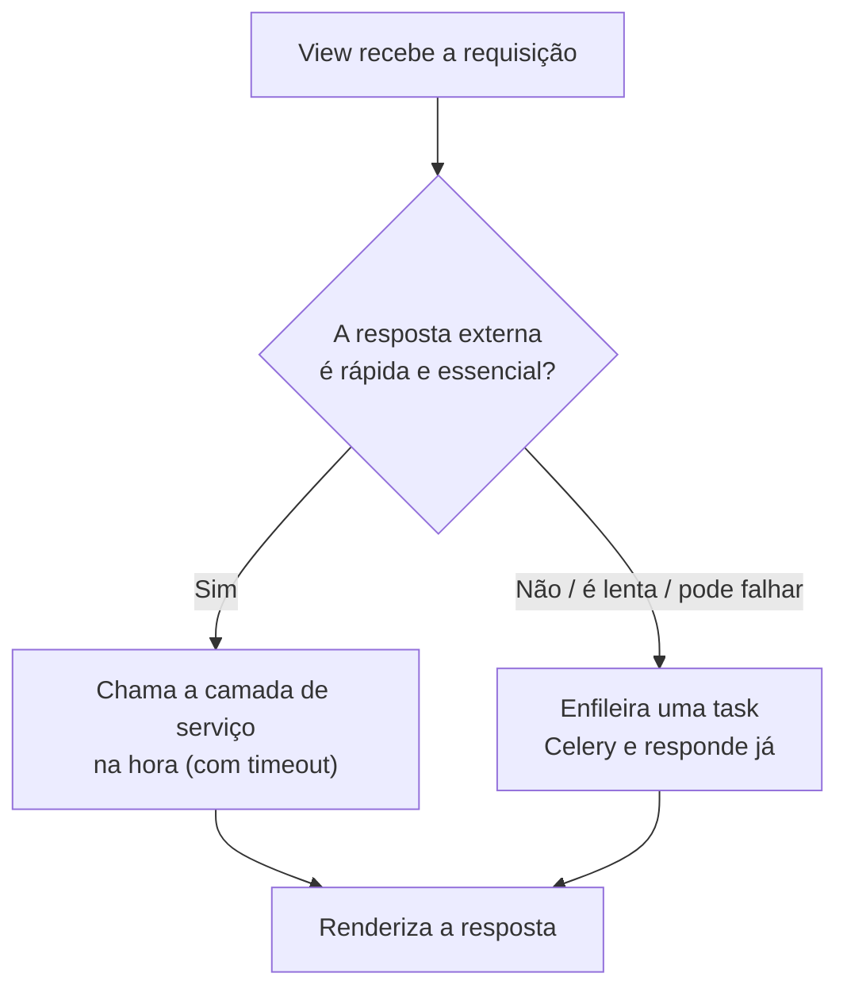

# Consumindo APIs externas (requests/httpx)

!!! quote "Pensa como criança 🧒"
    Você mandou uma cartinha pedindo o clima de amanhã e ficou esperando a
    resposta na caixa de correio. Se a resposta demora demais, você não fica
    parado o dia inteiro: você combina um horário-limite para desistir. Falar com
    uma **API externa** é isso — você manda um pedido pela internet, espera a
    resposta, e sempre combina até quando vale a pena esperar.

## Caso de uso

Seu blog quer mostrar, na página de um post, a temperatura atual da cidade do
autor, buscada de um serviço de clima. O Django não guarda esse dado: ele precisa
**pedir para outro sistema** por HTTP.

A regra de ouro: essa chamada vive numa **camada de serviço** (uma função ou
classe), nunca dentro do template e nunca solta na view. Assim você testa, troca
e reaproveita sem tocar na página.

```python
import httpx


def get_temperature(city: str) -> float | None:
    """Fetch the current temperature for a city from a weather API.

    Args:
        city: The city name to look up.

    Returns:
        The current temperature in Celsius, or None when the service fails.
    """
    try:
        response = httpx.get(
            "https://api.exemplo-clima.com/v1/current",
            params={"city": city},
            timeout=5.0,
        )
        response.raise_for_status()
    except httpx.HTTPError:
        return None
    return response.json()["temperature_c"]
```

E a view apenas chama o serviço:

```python
from django.shortcuts import render
from django.http import HttpRequest, HttpResponse

from .services import get_temperature


def author_weather(request: HttpRequest, city: str) -> HttpResponse:
    """Render the current temperature for an author's city."""
    return render(
        request,
        "blog/weather.html",
        {"city": city, "temperature": get_temperature(city)},
    )
```

!!! danger "Sempre defina um `timeout`"
    Nem `requests` nem `httpx` colocam timeout por padrão. Sem ele, se o outro
    servidor travar, a sua thread do Django fica **presa para sempre** esperando —
    e um serviço lento derruba o seu. Toda chamada de rede recebe um `timeout`.

## Possibilidades

### `requests` vs `httpx`: qual escolher?

| Aspecto | `requests` | `httpx` |
| --- | --- | --- |
| Maturidade | O clássico, onipresente | Moderno, API quase idêntica |
| Síncrono | ✅ | ✅ |
| Assíncrono (`async`/`await`) | ❌ | ✅ (`httpx.AsyncClient`) |
| HTTP/2 | ❌ | ✅ (com `httpx[http2]`) |
| Reuso de conexão | `requests.Session` | `httpx.Client` / `httpx.AsyncClient` |
| Instalação | `pip install requests` | `pip install httpx` |

!!! tip "Regra prática para 2026"
    Se você tem **views assíncronas** (`async def`) ou quer HTTP/2, use `httpx`.
    Se o projeto é 100% síncrono e você já usa `requests`, ele continua ótimo. A
    API dos dois é tão parecida que os exemplos abaixo trocam quase 1-para-1.

### Timeouts com mais controle

Um número simples cobre todas as fases. O `httpx` deixa você separar conectar,
ler, escrever e pegar conexão do pool:

```python
import httpx

timeout = httpx.Timeout(10.0, connect=5.0)
response = httpx.get("https://api.exemplo.com/dados", timeout=timeout)
```

No `requests`, você passa uma tupla `(connect, read)`:

```python
import requests

response = requests.get(
    "https://api.exemplo.com/dados",
    timeout=(3.05, 10),
)
```

!!! note "Por que `3.05` e não `3`?"
    A documentação do `requests` recomenda um número de conexão um tiquinho maior
    que um múltiplo de 3, porque é assim que o TCP agenda tentativas de reenvio de
    pacotes. É detalhe fino — o importante é: **defina o timeout**.

### Reuso de conexão: `Session` / `Client`

Abrir uma conexão TCP+TLS nova a cada chamada é caro. Se você faz várias chamadas
para o mesmo host, reutilize a conexão com um `Session` (requests) ou `Client`
(httpx). Ele também guarda cabeçalhos e base URL comuns:

```python
import httpx


class WeatherClient:
    """Client for the weather API with connection reuse."""

    def __init__(self, api_key: str) -> None:
        """Initialize the client with a shared connection pool.

        Args:
            api_key: The API key sent on every request.
        """
        self._client = httpx.Client(
            base_url="https://api.exemplo-clima.com/v1",
            headers={"Authorization": f"Bearer {api_key}"},
            timeout=5.0,
        )

    def current(self, city: str) -> float:
        """Return the current temperature for a city in Celsius.

        Args:
            city: The city name to look up.

        Returns:
            The current temperature in Celsius.

        Raises:
            httpx.HTTPStatusError: If the API answers with a 4xx/5xx status.
        """
        response = self._client.get("/current", params={"city": city})
        response.raise_for_status()
        return response.json()["temperature_c"]

    def close(self) -> None:
        """Release the underlying connection pool."""
        self._client.close()
```

!!! warning "Feche o cliente (ou use `with`)"
    Um `Client`/`Session` segura conexões abertas. Feche com `.close()` ao
    terminar, ou use como context manager: `with httpx.Client() as client: ...`.
    Nunca crie um `Client` novo por requisição HTTP do Django — isso anula o
    ganho de reuso.

### Tratamento de erros

Coisas dão errado de formas diferentes; trate cada uma:

| Erro (`httpx`) | Erro (`requests`) | Quando acontece |
| --- | --- | --- |
| `httpx.TimeoutException` | `requests.Timeout` | Passou do `timeout` |
| `httpx.ConnectError` | `requests.ConnectionError` | Não conectou (DNS, rede) |
| `httpx.HTTPStatusError` | `requests.HTTPError` | Status 4xx/5xx (após `raise_for_status()`) |
| `httpx.HTTPError` | `requests.RequestException` | Classe-mãe: pega qualquer um |

```python
import httpx


def safe_fetch(url: str) -> dict | None:
    """Fetch JSON from a URL, returning None on any HTTP failure.

    Args:
        url: The absolute URL to fetch.

    Returns:
        The decoded JSON body, or None when anything goes wrong.
    """
    try:
        response = httpx.get(url, timeout=5.0)
        response.raise_for_status()
    except httpx.TimeoutException:
        return None
    except httpx.HTTPStatusError:
        return None
    except httpx.HTTPError:
        return None
    return response.json()
```

!!! danger "`raise_for_status()` não é automático"
    Uma resposta `404` ou `500` **não** levanta exceção sozinha — do ponto de
    vista da rede, a requisição "deu certo" (o servidor respondeu). Chame
    `response.raise_for_status()` para transformar 4xx/5xx em erro, senão você vai
    tentar ler o JSON de uma página de erro.

### Retries e backoff

Falhas de rede às vezes são passageiras. Repetir a chamada — esperando um pouco
mais a cada tentativa (**backoff exponencial**) — costuma resolver, sem
martelar o outro servidor.

O `httpx` traz um transporte com retries só para erros de **conexão**:

```python
import httpx

transport = httpx.HTTPTransport(retries=3)
client = httpx.Client(transport=transport, timeout=5.0)
```

Para repetir também em status 5xx com espera crescente, use a biblioteca
`tenacity`:

```python
import httpx
from tenacity import retry, stop_after_attempt, wait_exponential


@retry(
    stop=stop_after_attempt(3),
    wait=wait_exponential(multiplier=1, min=1, max=10),
)
def fetch_with_retry(url: str) -> dict:
    """Fetch JSON, retrying up to 3 times with exponential backoff.

    Args:
        url: The absolute URL to fetch.

    Returns:
        The decoded JSON body.

    Raises:
        httpx.HTTPStatusError: If every attempt returns a 4xx/5xx status.
    """
    response = httpx.get(url, timeout=5.0)
    response.raise_for_status()
    return response.json()
```

!!! warning "Não repita o que não vale repetir"
    Repetir um `POST` que já criou um pedido pode criar **dois**. Só faça retry de
    operações idempotentes (`GET`, ou `POST` com chave de idempotência), e evite
    repetir em erros 4xx (o pedido está errado — repetir não conserta).

### Assíncrono com `httpx.AsyncClient`

Em views `async def`, use o cliente assíncrono para não bloquear o event loop:

```python
import httpx
from django.http import HttpRequest, JsonResponse


async def weather_api(request: HttpRequest, city: str) -> JsonResponse:
    """Return the current temperature as JSON, fetched asynchronously."""
    async with httpx.AsyncClient(timeout=5.0) as client:
        response = await client.get(
            "https://api.exemplo-clima.com/v1/current",
            params={"city": city},
        )
        response.raise_for_status()
    return JsonResponse({"temperature_c": response.json()["temperature_c"]})
```

Para disparar várias chamadas ao mesmo tempo:

```python
import asyncio

import httpx


async def fetch_many(urls: list[str]) -> list[dict]:
    """Fetch several URLs concurrently and return their JSON bodies.

    Args:
        urls: The absolute URLs to fetch.

    Returns:
        The decoded JSON bodies, in the same order as ``urls``.
    """
    async with httpx.AsyncClient(timeout=5.0) as client:
        responses = await asyncio.gather(
            *(client.get(url) for url in urls)
        )
    return [response.json() for response in responses]
```

!!! danger "Chamada síncrona dentro de view `async` bloqueia tudo"
    Chamar `requests.get()` (síncrono) dentro de uma view `async def` congela o
    event loop e derruba a vantagem do async. Em código assíncrono use
    `httpx.AsyncClient`; se precisar mesmo de código síncrono lá dentro, isole com
    `asgiref.sync.sync_to_async`.

### Onde chamar: nunca no template, quase nunca na requisição



Se a API externa é lenta, instável, ou o usuário não precisa do resultado
**agora** (enviar e-mail, sincronizar um CRM, gerar um relatório), não faça a
chamada no meio da requisição — ela seguraria o usuário e um pico de lentidão do
outro serviço viraria lentidão sua. Empurre para uma **task em background**:

```python
from celery import shared_task

from .services import WeatherClient


@shared_task
def sync_weather(city: str) -> None:
    """Fetch and cache the weather for a city in the background.

    Args:
        city: The city name to refresh.
    """
    client = WeatherClient(api_key="...")
    try:
        temperature = client.current(city)
    finally:
        client.close()
    cache_temperature(city, temperature)
```

E a view só enfileira:

```python
from django.http import HttpRequest, HttpResponse

from .tasks import sync_weather


def request_weather_refresh(request: HttpRequest, city: str) -> HttpResponse:
    """Queue a background weather refresh and answer immediately."""
    sync_weather.delay(city)
    return HttpResponse(status=202)
```

!!! tip "Task longa = Celery"
    Chamadas externas lentas são o caso de uso clássico de fila de tarefas. Veja
    **[Celery](../libs/celery.md)** para o setup completo (broker, worker,
    retries da própria task).

### Mockando APIs externas nos testes

Seus testes **não podem** bater na API de verdade: seria lento, instável e
dependeria da internet. Você **finge** a resposta. Para `requests`, use a
biblioteca `responses`; para `httpx`, use `respx`.

Com `responses` (para código que usa `requests`):

```python
import responses
from django.test import TestCase

from blog.services import get_forecast


class ForecastServiceTests(TestCase):
    """Tests for the forecast service using mocked HTTP."""

    @responses.activate
    def test_returns_temperature(self) -> None:
        """It parses the temperature from the mocked API response."""
        responses.add(
            responses.GET,
            "https://api.exemplo-clima.com/v1/current",
            json={"temperature_c": 21.5},
            status=200,
        )

        self.assertEqual(get_forecast("Recife"), 21.5)
```

Com `respx` (para código que usa `httpx`):

```python
import httpx
import respx
from django.test import TestCase

from blog.services import get_temperature


class TemperatureServiceTests(TestCase):
    """Tests for the temperature service using mocked httpx calls."""

    @respx.mock
    def test_returns_temperature(self) -> None:
        """It parses the temperature from the mocked httpx response."""
        respx.get("https://api.exemplo-clima.com/v1/current").mock(
            return_value=httpx.Response(200, json={"temperature_c": 21.5}),
        )

        self.assertEqual(get_temperature("Recife"), 21.5)

    @respx.mock
    def test_handles_server_error(self) -> None:
        """It returns None when the API answers with a 500."""
        respx.get("https://api.exemplo-clima.com/v1/current").mock(
            return_value=httpx.Response(500),
        )

        self.assertIsNone(get_temperature("Recife"))
```

!!! tip "Teste os caminhos tristes"
    Mockar deixa fácil simular timeout, 500 e JSON malformado — justamente os
    casos que quebram em produção. Teste-os. Veja **[testes](../advanced/testing.md)**
    para o panorama completo.

!!! info "Segredos ficam nas settings, não no código"
    Chaves de API e tokens vêm de variáveis de ambiente / settings, nunca
    escritas no código. Veja **[settings](settings.md)** e
    **[configuração por ambiente](config-ambientes.md)**.

!!! quote "📖 Na documentação oficial"
    - [requests](https://requests.readthedocs.io/)
    - [httpx](https://www.python-httpx.org/)

## Recap

- Chamar outro sistema por HTTP vive numa **camada de serviço** — nunca no
  template, e a view apenas delega.
- **Sempre** defina um `timeout`; nenhum dos dois clientes coloca um por padrão.
- `requests` é o clássico síncrono; `httpx` faz síncrono **e** assíncrono
  (`AsyncClient`) e HTTP/2 — a API é quase idêntica.
- Reutilize conexões com `Session`/`Client` e feche-os (ou use `with`).
- Trate erros por tipo (timeout, conexão, status) e chame `raise_for_status()`
  para transformar 4xx/5xx em exceção.
- Repita falhas passageiras com backoff (`tenacity`), mas só operações
  idempotentes.
- Chamadas lentas ou não essenciais vão para **[Celery](../libs/celery.md)** —
  responda rápido e processe em background.
- Nos **[testes](../advanced/testing.md)**, mocke com `responses` (requests) ou
  `respx` (httpx); nunca bata na API real.
